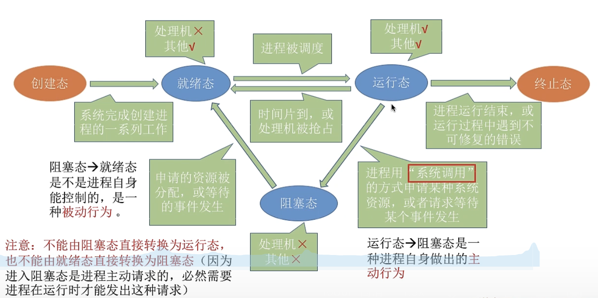

## 操作系统介绍
:::: tabs
::: tab label=作用
1. 操作系统作为`系统资源的管理者`，需要提供什么样的功能？
    *  提供的功能：`文件管理`、`设备管理`、`处理机(cpu)管理`、`存储器(运行内存)管理`
2. 操作系统作为`用户与计算机硬件之间的接口`需要提供什么功能？
    * 命令接口：`联机命令接口（命令行）`、`脱机命令接口（批处理命令接口）（sh/bat文件执行）`
    * 程序接口：允许用户通过程序间接使用(.dll)
    * GUI：图形用户接口(图像拖拽等操作图形操作界面)
3. 操作系统作为最接近系统硬件的层次，需要在纯硬件基础上实现什么功能？
    * 调度系统资源，提供给用户更方便的使用
>`进程`是程序执行的过程，执行前需要将该程序放到cpu当中，才会被cpu处理
:::
::: tab label=特征
* `并发`：两个或多个事件在`宏观上同时发生`，`微观上交替发生`。（`并行`是宏观和微观都同时发生）
* 共享：指系统资源供多个并发资源同时使用，分为`互斥共享`(摄像头的使用)、`同时共享`(同时读取文件)
* 虚拟：`空分复用技术`(虚拟存储器，4G运存运行程序远超4G)、`时分复用技术`(虚拟处理器，单核处理多任务)
* 异步：进程并不总是一次性执行完的，而是走走停停，**根据操作系统的调度，微观上异步的处理完所有的指令**
:::
::: tab label=分类
>发展顺序
* 手工操作系统:人机交互慢，浪费资源
* 批处理阶段：单道批处理系统、**多道批处理系统(操作系统开始出现，调度程序并发执行)**
* 分时操作系统：**轮询机制处理交互任务**，人感觉不出来的时间差。(缺点：不能处理紧急任务)
* 实时操作系统：
    * 硬实时系统：规定时间内必须执行完（航空导弹、自动驾驶系统）
    * 软实时系统：能接受偶尔实时性不强（订票系统）
* 网络操作系统
* 分布式操作系统
* 个人计算机操作系统
:::
::: tab label=运行机制
* 两种运行状态：`用户态`、`核心态`
* CPU区分运行态的方式：`PSW标志位关键字`，0/1
* 两种程序：核心程序(运行在核心态，能够执行`特权指令`)、应用程序(运行在用户态，只能执行`非特权指令`)
* `中断`使cpu进入`核心态`。发生了中断，就意味着操作系统的介入，cpu的核心态可以让操作系统要用特权指令切换系统的控制权，中断控制是并发执行的核心
* **用户态和核心态的切换**：
    * 用户态 -> 核心态：中断(唯一途径)
    * 核心态 -> 用户态：执行一条特权指令，将程序的状态字`PSW`改为用户态
:::
::: tab label=系统调用
* `系统调用`过程：
    1. 传递系统调用参数
    2. 执行陷入指令（中断指令的一种），产生内中断，系统进入核心态
    3. 执行系统调用相应的应用程序
    4. 返回用户程序
:::
::::
## 进程
:::: tabs
::: tab label=概念
* 程序段、数据段、PCB共同组成了`进程实体`(进程印象)
* 创建进程，实际上就是创建进程的PCB，`PCB是进程存在的唯一标识`
* **进程是进程实体的运行过程，是系统资源分配和调度的独立单位**
:::
::: tab label=PCB
>PCB包括的信息
* **进程描述信息**：进程标识符PID，用户标识符UID
* **进程控制和管理信息**：进程当前状态，进程优先级
* **资源分配清单**：程序段指针，数据段指针，键盘，鼠标
* **处理机相关信息**：各种寄存器处理的值进行临时保存
:::
::: tab label=进程组织方式
* `链接方式`：按照**进程状态**将PCB分为多个**队列**，操作系统持有指向各队列的**指针**。
* `索引方式`：根据进程状态不同，建立几张索引表，操作系统持有各索引表的指针。
>链接指针分为：`执行指针`、`就绪队列指针`、`阻塞队列指针`  
>索引指针分为：`执行指针`、`就绪索引表指针`、`阻塞索引表指针`  
:::
::: tab label=特征
* `动态性`：进程是程序一次执行的过程，是动态产生的、变化和消亡的。
* `并发性`：内存中有多个进程实体，各进程可并发执行。
* `独立性`：**进程是能独立运行、独立获得资源、独立接受调度的基本单位。**
* `异步性`：各进城推进的速度不可预知，操作系统提供`进程同步机制`来解决异步问题
* `结构性`：**每个进程都会配置PCB**。结构上看，进城由程序段、数据段、PCB组成。
:::
::: tab label=状态与转换
* 基本状态：`就绪态`、`阻塞态`、`运行态`（**硬件有几核就最多有几个同时处于运行态的进程**）
* 其他状态：
    * `创建态`（将程序的数据段和程序段放入对应的内存中，创建程序的PCB）
    * `终止态`（进程所占内存和设备正在回收，撤销PCB）

:::
::: tab label=进程控制
>进程控制过程PCB控制信息不能存储错乱，因此这个**过程不能被中断**
* 进程的控制是通过`原语`实现的，原语的特点是**不可中断**,原语需要运行在**核心态**，主要工作：
    * 更新PCB信息：修改当前PCB运行状态，准备下一个PCB需要的运行环境
    * 将PCB插入到合适的队列
    * 分配/回收资源
:::
::: tab label=进程通信
>前提原因：每个进程拥有**操作系统分配的内存地址空间，相互独立，其他进程无法直接访问。**  
* `共享存储`：操作系统为两个进程提供一个`共享空间`，但两个进程访问此空间权限是**互斥的**
    * 基于数据结构共享：（例）操作系统规定共享区只能放**固定**长度为100的数组，分次轮流读写（低级共享）
    * 基于存储区共享：给你们一块存储区自己玩（高级共享）
* `管道通信`：
    * 操作系统在内存中开辟一个缓冲区(pip)，**写满再读，读空再写**
    * 管道只能是`半双工通信`，要实现双向同时通信，则需要两个管道。
* `消息传递`：(用`原语`发送)`消息头`(**发射进程id，接收进程id，消息类型，消息长度**)、`消息体`
    * 直接通信方式：每个进程有一个消息缓冲队列，直接通信就是把消息挂在对应进程的这个队列上
    * 间接通信方式：系统会为各个进程提供一个信箱(类似邮箱)作为中间载体，大家根据`进程id`确定收发件人
>`半双工通信`：数据可以正向传输，也可以反向传输，但一个时间段内只能有一个方向传输
:::
::::
