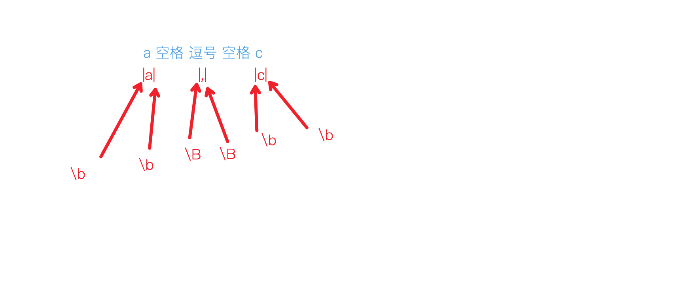
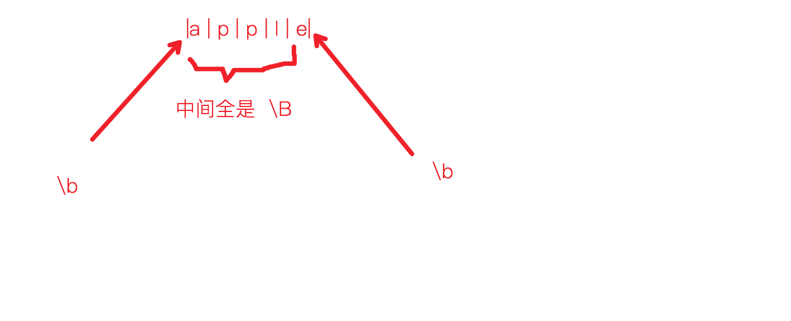
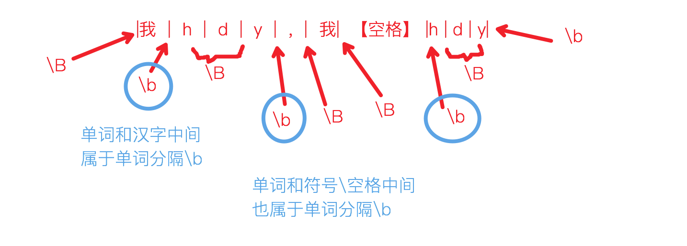

## 第一章 应用场景
::: tip 应用场景
* 正则的基本应用场景作用就是**搜索和替换**，精通以后遇到字符串搜索替换就可以首先想到正则的解决方案
* 同一个问题经常会有多种正则解决方案
* JavaScript正则引擎是perl，不支持POSIX字符类
:::

* 找car单词
```js{2}
var str = "car incar Car inmycar car";
var reg = /\bcar\b/ig;

console.log(str.match(reg)); // [ 'car', 'Car', 'car' ]
```
* 将字符串的超链接变成HTML可点形式
```js
var str = "this is my address:http://www.baidu.com/ car incar Car inmycar";
var reg = /\b(http|https):\/\/(?:www.)*?[\w]+?.(com|cn|org)\//ig;

console.log(str.replace(reg,(match) => `<a href='${match}'>${match}</a>`));
// this is my address:<a href='http://www.baidu.com/'>http://www.baidu.com/</a> car incar Car inmycar
```
## 第二章 单个字符
::: tip 
* 【.】表示任意字符，但要匹配换行符等需要加标识符s
* 匹配符号【.】：本身加斜杠【\ .】
* 【\b】**单词**间的间距。
* 【\B】**字母**间的间距。
:::
* 找到所有的c.t
```js
const str = 'cat cot ctt caat';
const reg = /c.t/g;

console.log(str.match(reg)); // ['cat', 'cot', 'ctt']
```
* 找到所有的张某
```js
const str = '张三 李四 张 王五 张志文 张靓颖';
const reg = /张.*?(?=\s|$)/g;

console.log(str.match(reg)); // [ '张三', '张', '张志文', '张靓颖' ]
```
* 找到所有的文件名：.a文件：na.txt、sa.txt..
```js
const str = `ana.txt
na.txt
nax.txt
sa.txt
`
const reg = /^.a\.\w+\b/gm;
console.log(str.match(reg)); // ['na.txt', 'sa.txt']
```
## 第三章 区间
::: tip 区间
* 【[]】中括号内可以写取值区间。如：[ sa ]
* **全局**不区分大小写可以用【i】，**局部**不区分大小写可以写[a-zA-Z]
* JS标识符【\w】代表区间[a-zA-Z0-9_]，【\W】取反
* 区间内【^】开头代表排除这个区间
* 区间内空格匹配一个空格
:::
* 只要sa.txt/na.txt
```js
const str = `ca.txt
nan.txt
sa.txt
ana.txt
na.txt
`;
const reg = /^[ns].\.txt/mg;
console.log(str.match(reg)); // [ 'sa.txt', 'na.txt' ]
```
* 匹配RegExp或regexp
```js
const str = '正则一般写作RegExp或者regexp';
const reg = /[Rr]eg[Ee]xp/g;
console.log(str.match(reg)); // ['RegExp', 'regexp']
```
* 匹配所有数字字母
```js
const str = 'Word汉字word汉字123_';
const reg1 = /\w+\b/g;
const reg2 = /[a-zA-Z0-9]+\b/g

console.log(str.match(reg1)); // [ 'Word', 'word', '123_' ]
console.log(str.match(reg2)); // [ 'Word', 'word' ]
```
* 查找所有RGB颜色值
```js
const str = `
.header {
    color: #969896;
}

#b {
    color: #c66;
}

div {
    color: #de935f;
}

.d {
    color: #F0C674;
}`;
const reg = /(?<=:\s)#[A-Fa-f0-9]{3,6}/g;

console.log(str.match(reg)); // [ '#969896', '#c66', '#de935f', '#F0C674' ]
```
* 找到所有的【sX.txt】，X不能是数字。例：sa.txt/sb.txt
```js
const str = `
sa.txt
s1.txt
sb.txt
`
const reg = /s[^1-9]\.txt/gim;
console.log(str.match(reg)); // [ 'sa.txt', 'sb.txt' ]
```
* 匹配空格
```js
const str = '我 中间    的空格    不固定       ！';
const reg = /[ ]+/g;
console.log(str.match(reg)); // [ ' ', '    ', '    ', '       ' ]
```
## 第四章 元字符
::: tip 常用元字符
* 匹配元字符本身需要**转义**【\ (\ )】

|元字符|含义|
|---|---|
|()|捕获组|
|[]|区间|
|.|任意字符|
|\ |转义字符|
|+ |一到多个匹配|
|* |0到多个匹配|
|? |1.非贪婪匹配 2.环视 3.位置关系匹配 4.0个或1个匹配|
|^ |1.文章/行/单词开头 2.范围取反|
|$ |文章/行/单词结尾|
:::
::: tip 类元字符
* 类元字符代表某一类字符，十分有用

|元字符|含义|
|---|---|
|\s|空格、非打印字符（换行、制表符类）[\f\n\r\t\v]|
|\S|【\s】取反，所有打印字符|
|\w|字母数字下划线[a-zA-Z0-9_]|
|\W|非字母数字下划线[^a-zA-Z0-9_]|
|\d|所有数字|
|\D|所有非数字|
|\b|所有单词分隔（不匹配出空格，只匹配出单词结束）|
|\B|所有字母分隔|
|\f|换页|
|\n|换行|
|\r|回车|
|\t|制表符|
|\v|垂直制表符|
:::
::: warning
* POSIX字符类JS不支持
:::
* 转义元字符：匹配出数组
```js
const str = `
const arr = [1, 2, 3, [4, 5]];
console.log(arr)`

const reg = /\[.*\](?=\s|;)/g;
console.log(str.match(reg)); // [ '[1, 2, 3, [4, 5]]' ]
```
* 【\s\S】：数据去空格/换行
```js
const str = `大家
好，
我是 hdy
！`
const reg = /\s/g;
console.log(str.replace(reg, '')); // 大家好，我是hdy！
```
* 【\d\D】：把数字分离出来
```js
const str = '我今年18岁';
const reg1 = /\d+/g;
const reg2 = /\D+/g;
console.log(str.match(reg1)); // [ '18' ]
console.log(str.match(reg2)); // [ '我今年', '岁' ]
```
* 【\b】和【\B】的区别：匹配出所有单词。
```js
const str = 'I love this world!';
const reg1 = /\w+\b/gi;
const reg2 = /\w+\B/gi;

console.log(str.match(reg1)); // [ 'I', 'love', 'this', 'world' ]
console.log(str.match(reg2)); // [ 'lov', 'thi', 'worl' ]
```
## 第五章 重复匹配
::: tip 重复匹配
|字符|含义|
|---|---|
|+|贪婪，1个以上|
|+?|非贪婪，1个以上|
|*|贪婪，0个以上|
|*?|非贪婪，0个以上|
|?|0个或1个|
|{2}|2次|
|{2,}|2次及以上|
|{2,4}|2-4次|
:::
::: warning 贪婪模式
* 有多个匹配成功情形时，是选择最多的匹配方式(贪婪)还是最少的匹配方式(非贪婪)
:::
* 【贪婪/非贪婪】匹配出对象
```js{3,4}
// 只要params后面的结果对象，但是有对象嵌套的情况
const str = 'baiduboxapp://setquery?params={"code":200, "data": {"name":"hdy", "pets":{"dog": "小黄", "cat": "小花"}}}';
const reg1 = /(?<=params=)\{.*\}/g;
const reg2 = /(?<=params=)\{.*?\}/g;

console.log(str.match(reg1)); // ['{"code":200, "data": {"name":"hdy", "pets":{"dog": "小黄", "cat": "小花"}}}']

// 匹配错误，少了花括号
console.log(str.match(reg2)); // ['{"code":200, "data": {"name":"hdy", "pets":{"dog": "小黄", "cat": "小花"}']
```
* 【贪婪 + \w + 转义.】匹配URL
```js{2}
const str = '我的网址是：www.hao123.com';
const reg = /[\w\.]+/gi;

console.log(str.match(reg)); // [ 'www.hao123.com' ]
```
* 【?】复杂一点的URL
```js{2,4}
const str = '我的网址是：https://www.baidu.com 或者http://www.baidu.com 或者www.baidu.com';
const reg = /(https?:\/\/)?[\w\.]+/gi;

console.log(str.match(reg)); // [ 'https://www.baidu.com', 'http://www.baidu.com', 'www.baidu.com' ]
```
* 尾部处理：匹配邮箱
```js{2}
const str = 'My Email is 986005715@qq.com ,do you remember?Another one is huangdeyu2020@163.com.Please call me!';
const reg1 = /\b[\w\.]+?@[\w\.]+\w+(?=[\.,!\b\s])/g;

// 错误尾部处理
const reg2 = /\b[\w\.]+?@[\w\.]+[\w\.]+/g;

console.log(str.match(reg1)); // [ '986005715@qq.com', 'huangdeyu2020@163.com' ]
console.log(str.match(reg2)); // [ '986005715@qq.com', 'huangdeyu2020@163.com.Please' ]
```
* 【{min, max}】匹配日期串
```js
// 第三个日期不符合规范
const str = `
2021/09/10
21/9/1
2/2/2
`;
const reg = /\d{2,4}\/\d{1,2}\/\d{1,2}/g;

console.log(str.match(reg)); // [ '2021/09/10', '21/9/1' ]
```
## 第六章 位置匹配
::: tip 位置符号
|符号|含义|
|---|---|
|\b|单词边界(位置符号不占实际的字符)|
|\B|非单词边界(位置符号不占实际的字符)|
|^|字符串开头/多行模式下行开头|
|$|字符串结尾/多行模式下行结尾|
:::
* 【\b\B】边界详解
:::: tabs
::: tab label=1

```js
const str = 'a , c';

// a、c属于单词，但逗号不是单词，所以【,】前后不是单词边界
const reg1 = /\B.+?\B/g;
console.log(str.match(reg1)); // [ ',' ]

// a、c属于单词，a前a后、c前c后都是单词边界
const reg2 = /\b.+?\b/g;
console.log(str.match(reg2)); // [ 'a', ' , ', 'c' ]
```
:::
::: tab label=2

```JS
const str = 'apple';
const reg1 = /\b.+?\b/g;
console.log(str.match(reg1)); // [ 'apple' ]

const reg2 = /\B.+?\B/g;
console.log(str.match(reg2)); // [ 'p', 'p', 'l' ]
```
:::
::: tab label=3
* 中文：

```js
const str = '我hdy,我 hdy'
const reg1 = /\b.+?\b/g;
console.log(str.match(reg1)); // [ 'hdy', ',我 ', 'hdy' ]

const reg2 = /\B.+?\B/g;
console.log(str.match(reg2)); // [ '我h', 'd', 'y,', '我', ' h', 'd' ]
```
:::
::::
* 单词边界使用：替换cat
```js{4,8}
const str = 'The cat scatter the food.But I love the cat.'

// 错误：不使用单词边界，会匹配到包含单词
const reg1 = /cat/g;
console.log(str.replace(reg1,'dog')); // The dog sdogter the food.But I love the dog.

// 使用单词边界
const reg2 = /\bcat\b/g;
console.log(str.replace(reg2,'dog')); // The dog scatter the food.But I love the dog.
```
* 【^】匹配开头：检测是否正确的html5文档
```js{11}
// 注：前面有空格、换行
const str = `
<!DOCTYPE html>
<html lang="en">
    <head>
    </head>
    <body>
    </body>
</html>
`
const reg = /^\s*<\!DOCTYPE html>/;
console.log(reg.test(str)); // true
```
* 标识符【m】：多行匹配
```js
const str = `
hdy
is
happy
!`
const reg1 = /^h.+?\b/g;
console.log(str.match(reg1)); // null

const reg2 = /^h.+?\b/gm;
console.log(str.match(reg2)); // [ 'hdy', 'happy' ]
```
## 第七章 子表达式
::: tip 子表达式
* 长度限制字符【+】【*】【{}】都限制了**紧挨着的一个字符**的次数，如果要限制多个字符，就需要用子表达式【()】
* 子表达式捕获的项也叫`捕获组`，要是不想存储捕获组用`非捕获性分组`【(?: )】
* 子表达式可以嵌套使用
* 在没有必要的时候不要存储捕获组，对正则的性能有影响
:::
* 删掉所有的空格字符【&nbsp;】
```js{4,8}
const str = 'I&nbsp;&nbsp;am&nbsp;&nbsp;hdy.';

// 直接用限位符只是限制了分号：【;】
const reg1 = /&nbsp;+/g;
console.log(str.match(reg1)); // [ '&nbsp;', '&nbsp;', '&nbsp;', '&nbsp;' ]

// 子表达式后面的限制符：限制子表达式的重复次数
const reg2 = /(&nbsp;)+/g;
console.log(str.match(reg2)); // [ '&nbsp;&nbsp;', '&nbsp;&nbsp;' ]
console.log(reg2.exec(str)); // [ '&nbsp;&nbsp;','&nbsp;',index: 1,input: 'I&nbsp;&nbsp;am&nbsp;&nbsp;hdy.', groups: undefined]
```
* 子表达式：匹配IP地址
```js
const str = 'I am hdy,my phone is 15542640501,my ip is 152.16.177.169.'
const reg = /(\d{1,3}\.){3}\d{0,3}/;
console.log(str.match(reg)[0]); // 152.16.177.169
```
* 子表达式：匹配年份
```js{4,7}
const str = 'I am birth in 1996,but many people birth after 2000.';

// 错误，优先级的原因，关系符会查看左右两边的内容，所以关系符或【|】变成了【19 或 20\d{2}】
const reg1 = /19|20\d{2}/g;
console.log(str.match(reg1)); // [ '19', '2000' ]

const reg2 = /(19|20)\d{2}/g;
console.log(str.match(reg2)); // [ '1996', '2000' ]
```
* 子表达式：筛选出qq邮箱或163邮箱
```js
const str = 'I have 3 email account.986005715@qq.com and huangdeyu2020@163.com and huangdeyu@baidu.com.';
const reg = /\w+@(qq|163)\.\w+/gi;
console.log(str.match(reg)); // [ '986005715@qq.com', 'huangdeyu2020@163.com' ]
```
* 非捕获性分组
```js
const str = '向后查看匹配内容向前查看';
const reg1 = /匹配内容(?=向前查看)/g;
const reg2 = /匹配内容(?:向前查看)/g;
const reg3 = /(?:向后查看)匹配内容/g;

console.log(reg1.exec(str)); // [ '匹配内容', index: 4, input: '向后查看匹配内容向前查看', groups: undefined ]
console.log(reg2.exec(str)); // [ '匹配内容向前查看', index: 4, input: '向后查看匹配内容向前查看', groups: undefined ]
console.log(reg3.exec(str)); // [ '向后查看匹配内容', index: 0, input: '向后查看匹配内容向前查看', groups: undefined ]
```
## 第八章 反向引用
::: tip 反向引用
* **反向引用支持正则引用之前匹配的结果**
* 下标从1开始，如【\1】代表第一个捕获组
* JS替换操作中用的是【$】加捕获组下标，**嵌套捕获组最外层下标最小**
:::
* 反向引用：匹配HTML标题
```js{4,8}
const str = `
<h1>我是标题</h1>
<div>盒子，懂不？</div>
<H2>错误标签，不匹配！</H4>
<h3>嵌套，会吗？</h3>
<image/>
`;
const reg = /<[Hh]([1-6])>.*?<\/[Hh]\1>/gi;
console.log(str.match(reg)); // [ '<h1>我是标题</h1>', '<h3>嵌套，会吗？</h3>' ]
```
* 反向引用做替换
::: warning
* 替换字符串中的【$\d】，\d是捕获组下标
:::
:::: tabs
::: tab label=网址变可点
```js{9,16}
const str = '<span>My website is www.baidu.com</span>';
const reg = /((\w+\.)+\w+)\b/g;

// 第一个捕获组是要替换的项 (结果数组第二项)
console.log(reg.exec(str));
/*
[
    'www.baidu.com',
    'www.baidu.com',
    'baidu.',
    index: 20,
    input: '<span>My website is www.baidu.com</span>',
    groups: undefined
] 
*/
console.log(str.replace(reg, '<a href="$1">$1</a>')); // <span>My website is <a href="www.baidu.com">www.baidu.com</a></span>
```
:::
::: tab label=电话号码换格式
* 把电话号码换成155-4264-0501格式方便记忆
```js
const str = '我故意设置了干扰数字12345 123 1234，真正的电话是15542640501.';
const reg = /(\d{3})(\d{4})(\d{4})/g;
console.log(str.match(reg)); // [ '15542640501']
console.log(str.replace(reg, '$1-$2-$3'));
// '我故意设置了干扰数字12345 123 1234，真正的电话是155-4264-0501.'
```
* 区号要换成括号形式(2233)3557-4369
```js
const str = '我故意设置了干扰数字12345 123 1234，真正的电话是15542640501和2233-35574369.'
const reg1 = /(\d{3})(\d{4})(\d{4})/g;
const reg2 = /(\d{4})-(\d{4})(\d{4})/g;
console.log(str.replace(reg1, '$1-$2-$3').replace(reg2, '($1)$2-$3'));
// 我故意设置了干扰数字12345 123 1234，真正的电话是155-4264-0501和(2233)3557-4369.
```
:::
::::
## 第九章 环视
::: tip 环视
* 匹配时能够观察上下文，在正确位置的内容，并且不用子表达式来存储多余的结果。

|模式|含义|
|---|---|
|(?=)|肯定向前查看|
|(?!)|否定向前查看|
|(?<=)|肯定向后查看|
|(?<!)|否定向后查看|
|(?: )|非捕获性分组|
* **注：向前指在匹配内容前面的（已经出现了的）字符，向后指在匹配内容后面的（还未出现的）内容**
```js
const str = '向后查看匹配内容向前查看';
const reg1 = /匹配内容(?=向前查看)/g;
const reg2 = /(?<=向后查看)匹配内容/g;

console.log(str.match(reg1)); // [ '匹配内容' ]
console.log(str.match(reg2)); // [ '匹配内容' ]
```
:::
::: warning ?
* 书上81页说JS不支持向后查看，但是经测试是可以的
* 两个环视放在一起后面的的生效
:::
:::: tabs
::: tab label=向前查看
* 向前查看：返回URL的协议：https
```js{2,6-7}
const str = 'https://www.baidu.com/wd=刘德华';
const reg1 = /\w+(?=:\/\/)/g;
console.log(reg1.exec(str));
// [ 'https', index: 0, input: 'https://www.baidu.com/wd=刘德华', groups: undefined ]

// 对比：非向前查看，括号里的内容会被视为匹配内容，并且作为子表达式
const reg2 = /\w+(:\/\/)/g;
console.log(reg2.exec(str));
// [ 'https://', '://', index: 0, input: 'https://www.baidu.com/wd=刘德华', groups: undefined ]
```
:::
::: tab label=向后查看
* 向后查看：要匹配内容前面出现的内容作为定位符
* 查看邮箱域名
```js
const str = '986005715@qq.com';
const reg = /(?<=@)[\w.]+\b/g;
console.log(str.match(reg)); // [ 'qq.com' ]
```
:::
::: tab label=混合做题
* 只要价格数组
```js
const str = `炒饭：20元
鸡汤：30元
芹菜：60元
火锅：98元
蛋炒饭：15元
`;
const reg = /(?<=：)\d+(?=元)/g;
console.log(str.match(reg)); // [ '20', '30', '60', '98', '15' ]
```
:::
::: tab label=标签内容
* 要到页面的< tittle></ tittle>标签内容
```js{12}
const str = `
<!DOCTYPE html>
<html lang="en">
<head>
    <meta charset="UTF-8">
    <title>我是标签</title>
</head>
<body>    
</body>
</html>`;

const reg = /(?<=<title>).*(?=<\/title>)/gi;
console.log(str.match(reg)); // [ '我是标签' ]
```
:::
::: tab label=否定向前
* 拿到除了老师的成绩
```js
const str = `
老师：100，
张三：80，
李四：90，
hdy：98`;
const reg = /(?<!老师：)\b\d+\b/g;
console.log(str.match(reg)); // [ '80', '90', '98' ]
```
:::
::: tab label=否定向后
* 及格学生名单
```js
const str = `{
    zhangsan: 20,
    lisi: 60,
    wangwu: 88,
    hdy: 98,
    zhaosi: 59,
}`

const reg = /\b[a-zA-Z]+\b(?!:\s+[0-5]\d)/g;
console.log(str.match(reg)); // [ 'lisi', 'wangwu', 'hdy' ]
```
:::
::: tab label=相邻环视
* 相邻环视本质是错误的写法，只有后面的会生效
* 匹配除老师的分数
```js
const str = `
老师：100，
张三：80，
李四：90，
hdy：98`;

// 本质想匹配向前不是老师、向前是冒号的，也就是学生。但只有冒号生效
const reg = /(?<!老师)(?<=：)\b\d+\b/g;
console.log(str.match(reg)); // [ '100', '80', '90', '98' ]
```
:::
::::
## 第十章 嵌入式条件
::: tip 嵌入式条件
* 嵌入式条件主要包括这两种情况：
    1. 根据反向引用来进行条件处理
    2. 根据环视来进行条件处理
:::
::: warning
* JS好像不支持嵌入式条件？
```js{8,9}
const str = `
1
<a>
    1
</a>
`;

// 第一个捕获组有的情况下再进行第二个捕获组的匹配，JS好像不支持
const reg = /(<a>\s*)?1(?(1)?\s*<\/a>)?/gi;
console.log(str.match(reg));
```
:::
## 十一章 常见问题
:::: tabs
::: tab label=北美号码
* 北美号码主要有三种表现形式
    1. 123-123-1234
    2. (123) 123-1234
    3. (123)123-1234
```js
const str = `
hdy: 123-123-1234;
zs:(123) 123-1234;
ls:(123)123-1234
错误:123 1234-1234`;

const reg = /(\()?\d{3}(\)\s*|-|\s)\d{3}-\d{3}/g;
console.log(str.match(reg)); // [ '123-123-123', '(123) 123-123', '(123)123-123' ]
```
:::
::: tab label=URL
* URL:协议://域名:端口号/xxx
```js
const str = 'https://developer.mozilla.org/zh-CN/docs/Web/JavaScript/Reference/Global_Objects/Promise/then';
const reg = /(https?:\/\/)?[\w\.]+(:\d)?([\/-\w+])*/gi;
console.log(str.match(reg));
// [ 'https://developer.mozilla.org/zh-CN/docs/Web/JavaScript/Reference/Global_Objects/Promise/then' ]
```
:::
::::