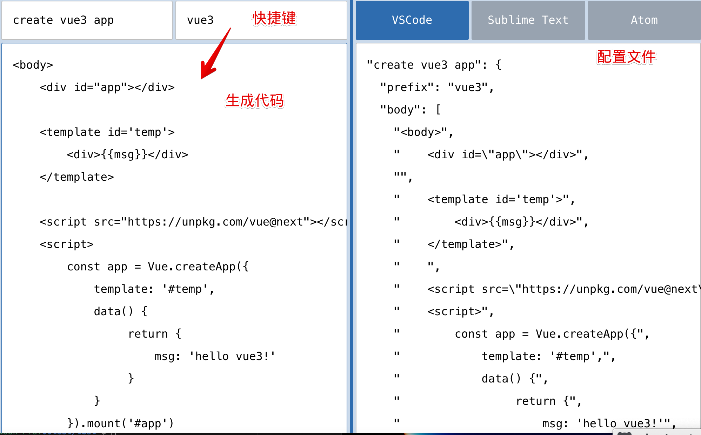
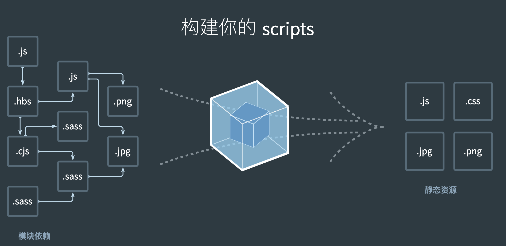
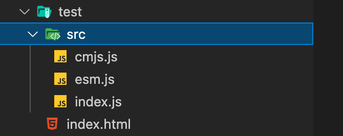

## 第一节 介绍
:::: tabs
::: tab label=vue2-vue3
* vue3使用monorepo形式来管理源代码。优势是多个包本身逻辑独立，可以拥有自己的单元测试等。
* 全部使用typescript重写，vue2使用flow类型检测
* vue3使用proxy来进行数据劫持：vue2的defineProperty新增数据是不能进行监听，要用 `Vue.$set(key, val)` 的形式
* 编译优化：生成`Block tree`，`slot`优化、`diff算法优化`
* 从`options API`到`Composition API`：options API在代码内配置的较分散，`methods`、`生命周期`等等，Composition API代码逻辑放到一处，易于管理和理解
* 多个组件共享逻辑：Vue2使用`mixin`，Vue3使用`hooks`，将代码抽离出去，可以共享，并且还是响应式的。
* 删除了一些不常用的方法`filter`...
:::
::: tab label=起步
* CDN引入
```html{3}
<body>
    <div id="app"></div>
    <script src="https://unpkg.com/vue@next"></script>
    <script>
        const app = Vue.createApp({
            template: `<div>hello vue3</div>`
        })
        app.mount('#app');
    </script>
</body>
```
:::
::: tab label=对比
* 原生实现计数器
```html
<body>
    <button class="reduce">-</button>
    <span class="num">0</span>
    <button class="add">+</button>

    <script>
        const reduce = document.querySelector('.reduce');
        const add = document.querySelector('.add');
        const proxy = new Proxy({ num: 0 }, {
            set(target, key, val) {
                if (key === 'num' && val >-1 && val < 100) {
                    target[key] = val;
                    const numEle = document.querySelector('.num');
                    numEle.innerText = val;
                }
            }
        })
        add.addEventListener('click', () => proxy.num++);
        reduce.addEventListener('click', () => proxy.num--);
    </script>
</body>
```
* VUE写法
```html
<body>
    <div id="app"></div>
    <script src="https://unpkg.com/vue@next"></script>
    <script>
        Vue.createApp({
            template: `
            <div>
                <button @click="decre">-</button>
                <span>{{count}}</span>
                <button @click="incre">+</button>
            </div>
                `,
            data() {
                return {
                    count: 0
                }
            },
            methods: {
                incre() {
                    this.count++;
                },
                decre() {
                    this.count--;
                },
            }
        }).mount('#app')
    </script>
</body>
```
:::
::: tab label=x-template
* template如果以#开头，会被`document.querySelector`处理
```html{4-7,12}
<body>
    <div id="app"></div>

    <script type="x-template" id='temp'>
        <h2>哈哈</h2>
        <span>{{msg}}</span>
    </script>
    
    <script src="https://unpkg.com/vue@next"></script>
    <script>
        Vue.createApp({
            template: '#temp',
            data() {
                 return {
                     msg: 'hello vue3!'
                 }
            }
        }).mount('#app')
    </script>
</body>
```
:::
::: tab label=template
* html原生`template`，不会被渲染的一类元素，提供给JS处理的html模板
```html{4-7,12}
<body>
    <div id="app"></div>
    
    <template id='temp'>
        <h2>呵呵</h2>
        <span>{{msg}}</span>
    </template>
    
    <script src="https://unpkg.com/vue@next"></script>
    <script>
        Vue.createApp({
            template: '#temp',
            data() {
                 return {
                     msg: 'hello vue3!'
                 }
            }
        }).mount('#app')
    </script>
</body>
```
:::
::: tab label=问题
* vue3中this是谁？
>本组件实例的proxy对象，`instance.proxy`。methods方法和生命周期函数用bind返回了一个绑定好this的函数，执行的时候实际上就是执行的绑定后的函数。
* vue3官方文档说methods不能使用箭头函数，那么用箭头函数this是谁？为什么？
>window。箭头函数不绑定this，直接使用`上层作用域`this，vue定义时上层this就是window
* 源码调试
    * 第一节，1:56:00
    * github：`vue-next`
* UI组件库：Element-plus、antdesign Vue
:::
::::
## 第二节 class/style绑定
:::: tabs
::: tab label=vscode自定义代码片段
* [生成网址](https://snippet-generator.app/)，填入名称、片段、快捷键。生成代码  


* vscode->首选项->用户片段->html，填入代码  


* html文件内输入快捷键即可拿到片段
:::
::: tab label=动态class
* 动态绑定`class名`和`展示判断`
```html{5,20-21}
<body>
    <div id="app"></div>

    <template id='temp'>
        <div :class="{ [title]: isActive}">你好哈哈哈</div>
    </template>

    <style>
        .active {
            color: red;
        }
    </style>

    <script src="https://unpkg.com/vue@next"></script>
    <script>
        Vue.createApp({
            template: '#temp',
            data() {
                 return {
                     title: 'active',
                     isActive: true
                 }
            }
        }).mount('#app')
    </script>
</body>
```
:::
::: tab label=对象class
```html{5,24-28}
<body>
    <div id="app"></div>

    <template id='temp'>
        <div :class="className">你好哈哈哈</div>
    </template>

    <style>
        .active {
            color: red;
        }
    </style>

    <script src="https://unpkg.com/vue@next"></script>
    <script>
        Vue.createApp({
            template: '#temp',
            data() {
                 return {
                     title: 'active',
                     isActive: true
                 }
            },
            computed: {
                className() {
                    return { [this.title]: this.isActive }
                }
            }
        }).mount('#app')
    </script>
</body>
```
:::
::: tab label=数组class
* 字符串就是类名
* 变量取`data`或`computed`数据
* 也可以`三元表达式`取结果
* 还可以嵌套写对象语法
```html{5}
<body>
    <div id="app"></div>

    <template id='temp'>
        <div :class="['abc', title, isActive ? 'active' : '', { active: isActive }]">你好哈哈哈</div>
    </template>

    <style>
        .active {
            color: red;
        }
    </style>

    <script src="https://unpkg.com/vue@next"></script>
    <script>
        Vue.createApp({
            template: '#temp',
            data() {
                 return {
                     title: 'hdy',
                     isActive: true
                 }
            },
        }).mount('#app')
    </script>
</body>
```
:::
::: tab label=动态style
* 支持对象写法和数组写法
```html{5-6,15,17-23}
<body>
    <div id="app"></div>

    <template id='temp'>
        <div :style="{color: 'red', backgroundColor: bgc}">你好哈哈哈</div>
        <div :style="[bgObj1, bgObj2]">你好哈哈哈</div>
    </template>

    <script src="https://unpkg.com/vue@next"></script>
    <script>
        Vue.createApp({
            template: '#temp',
            data() {
                 return {
                    bgc: 'blue',

                    bgObj1: {
                        backgroundColor: 'black',
                        color: 'white'
                    },
                    bgObj2: {
                        fontSize: '30px'
                    }
                 }
            },
        }).mount('#app')
    </script>
</body>
```
:::
::: tab label=多个属性
* 直接使用`v-bind=""`可以将整个对象的键值对作为属性的键值对绑定上去
```html{5-6,15-18}
<body>
    <div id="app"></div>

    <template id="temp">
        <div name="hdy" age="18">你好哈哈哈</div>
        <div v-bind="me">你好哈哈哈</div>
    </template>

    <script src="https://unpkg.com/vue@next"></script>
    <script>
        Vue.createApp({
            template: '#temp',
            data() {
                 return {
                     me: {
                         name: 'hdy',
                         age: "18"
                     }
                 }
            },
        }).mount('#app')
    </script>
</body>
```
:::
::: tab label=多个事件
* 多个事件的绑定用`v-on="{}"`语法
```html
<body>
    <div id="app"></div>

    <template id="temp">
        <div v-on="{ click: say, mousemove: go }">你好哈哈哈</div>
    </template>

    <style>
        div {
            width: 200px;
            height: 200px;
            border: solid 1px #333;
        }
    </style>
    <script src="https://unpkg.com/vue@next"></script>
    <script>
        Vue.createApp({
            template: '#temp',
            methods: {
                say() {
                    console.log('鼠标点击了');
                },
                go() {
                    console.log('鼠标移动了')
                }
            }
        }).mount('#app')
    </script>
</body>
```
:::
::::
## 第三节 条件渲染/diff算法
:::: tabs
::: tab label=v-if
* 输入分数判断及格
```html{7-9}
<body>
    <div id="app"></div>

    <template id="temp">
        <div>
            <input type="number" v-model="score">
            <div v-if="score > 89">优秀</div>
            <div v-else-if="score > 59">及格</div>
            <div v-else>不及格</div>
        </div>
    </template>

    <script src="https://unpkg.com/vue@next"></script>
    <script>
        Vue.createApp({
            template: '#temp',
            data() {
                return {
                    score: 100
                }
            }
        }).mount('#app')
    </script>
</body>
```
:::
::: tab label=遍历对象
* `v-for`遍历对象，一个参数是**value**，多个参数是(value, key, index)
* v-for遍历数字，**从1开始，到n**，多个参数是(num, index)
```html{5,14-17}
<body>
    <div id="app"></div>

    <template id="temp">
        <div v-for="(value, key) of obj">{{key}}:{{value}}</div>
    </template>

    <script src="https://unpkg.com/vue@next"></script>
    <script>
        Vue.createApp({
            template: '#temp',
            data() {
                return {
                    obj: {
                        name: 'hdy',
                        age: 18
                    }
                }
            }
        }).mount('#app')
    </script>
</body>
```
:::
::: tab label=diff算法
* diff算法：1:20:00
    * 新旧虚拟dom从头开始比较，到不同的地方跳出while循环
    * 从尾部开始比较，到不同跳出while循环
    * **拿到新旧dom不同的下标值**，做比较，多出来的`mount`，少了就`unmount`，更新就`update`
    * 如果遇到中间还有很多无序的下标，用一个数组记录key值，尽可能的复用原有节点，进行tagName比较，后进行对应节点的移动更新，最大程度的复用原节点
    * 结论：**唯一的key是十分必要的**
* 没有key，就尽可能的复用节点，更新内容，从头开始遍历、从尾开始遍历，相同元素深度比较，更新DOM
:::
::: tab label=问题
* 性能优化：
>条件渲染的空标签用`template`替代`div`，可以少渲染一个节点，性能优化。类似小程序的`block`。  
注：v-show不支持template
:::
::::
## 第四节 watch/基础案例
:::: tabs
::: tab label=computed
* 模板语法缺点：
    1. 大量复杂逻辑，不便维护
    2. 当有多次同样逻辑，存在重复代码
    3. 没有缓存，重复计算
* computed就能够解决这些问题。
    * 书写的`computed`属性是以`getter`、`setter`的形式挂载到`instance.proxy`上面的
    * 简写可以写做单个函数的形式，隐式转化为`getter`
:::
::: tab label=watch
* **监听某个数据改变，要做一系列操作**时用watch，如网络请求，就不适合用computed
* [key: string]: Function | Object | String【meghods里面定义的方法名】 | Array【多个函数或配置逐一被调用】
* **深度监听**：默认不是深度监听的，需要深度监听`deep:true`
* **立即执行**：默认只有监听到发生改变了才会执行，一开始并不会执行，可以设置`immediate: true`来立即执行一次
* 监听对象某个属性：`"info.name"`
```html{18-25}
<body>
    <div id="app">
        <input type="text" v-model="me.name">
    </div>

    <script src="https://cdn.jsdelivr.net/npm/vue@2/dist/vue.js"></script>
    <script>
        new Vue({
            el: '#app',
            data() {
                return {
                    me: {
                        name: 'hdy',
                        age: 18
                    }
                }
            },
            watch: {
                me: {
                    handler(newName, oldName) {
                        console.log('watch');
                    },
                    deep: true
                }
            }
        })
    </script>
</body>
```
:::
::: tab label=复杂监听
* data内一个对象中或数组中的某一个属性
```html{23-25}
<body>
    <div id="app"></div>

    <template id="temp">
        <button @click="changeName">深度修改</button>
    </template>

    <script src="https://unpkg.com/vue@next"></script>
    <script>
        Vue.createApp({
            template: '#temp',
            data() {
                return {
                    friends: [ {name: '张三'}, {name: '李四'} ]
                }
            },
            methods: {
                changeName() {
                    this.friends[0].name = '王五';
                }
            },
            watch: {
                ['friends.0.name']() {
                    console.log('---');
                }
            }
        }).mount('#app')
    </script>
</body>
```
:::
::: tab label=可取消的侦听器
* 生命周期中用$watch去侦听，返回值是一个本watch的取消器
>两秒失效的侦听器

<video src="./assets/unwatch.mp4" style="width:400px;" controls />

```html{5,15,24-29}
<body>
    <div id="app"></div>

    <template id="temp">
        <div>{{friends[0].name}}</div>
        <button @click="changeName">深度修改</button>
    </template>

    <script src="https://unpkg.com/vue@next"></script>
    <script>
        Vue.createApp({
            template: '#temp',
            data() {
                return {
                    friends: [ {name: '张三'}, {name: '李四'} ]
                }
            },
            methods: {
                changeName() {
                    this.friends[0].name += '哈';
                }
            },
            created() {
                const unwatch = this.$watch(
                    'friends',
                    () => console.log('侦听到了'),
                    { deep: true }
                )
                setTimeout(() => unwatch(), 2000);
            }
        }).mount('#app')
    </script>
</body>
```
:::
::: tab label=综合案例
<video src="./assets/demoshudian.mp4" style="width:500px;" controls />

* 注意v-for和v-if的`嵌套关系`
```html{65-77}
<body>
    <style>
        table {
            border-collapse: collapse;
            border-spacing: 0;
            border: 1px solid gray;
            margin: 0 auto;
        }

        tr {
            height: 50px;
            text-align: center;
            vertical-align: top;
        }

        td, th {
            padding: 0 10px;
            border: 1px solid gray;
            min-width: 100px;
            max-width: 200px;
        }
        th {
            background-color: rgb(238, 238, 238);
            color:rgb(88, 88, 88);
            line-height: 50px;
        }
        button {
            margin-right: 5px;
        }

        button:last-child {
            background-color: rgb(253, 197, 197);
        }

        input {
            margin: 5px 10px;
            line-height: 30px;
            max-width: 100px;
        }

        div {
            margin-left: 30px;
        }
    </style>

    <div id="app"></div>

    <template id="temp">
        <table>
            <thead>
                <th>编号</th>
                <th>书籍</th>
                <th>价格</th>
                <th>数量</th>
                <th>操作</th>
            </thead>
            <tbody>
                <tr>
                    <td><input type="text" v-model="id"></td>
                    <td><input type="text" v-model="name"></td>
                    <td><input type="text" v-model="price"></td>
                    <td><input type="text" v-model="num"></td>
                    <td><button @click="newGood">添加</button></td>
                </tr>
                <template v-for="(item, idx) of goods">
                    <tr v-if="+item.num > 0" :key="item.id">
                        <td>{{item.id}}</td>
                        <td>{{item.name}}</td>
                        <td>{{item.price}}</td>
                        <td>{{item.num}}</td>
                        <td>
                            <button @click="decre(idx)">-</button>
                            <button @click="incre(idx)">+</button>
                            <button @click="del(idx)">删</button>
                        </td>
                    </tr>
                </template>
            </tbody>
        </table>
        <div>总价：{{ total }}</div>
    </template>

    <script src="https://unpkg.com/vue@next"></script>
    <script>
        Vue.createApp({
            template: '#temp',
            data() {
                return {
                    id: '',
                    name: '',
                    price: '',
                    num: '',
                    goods: [{
                            id: 0,
                            name: '《你不知道的JS》',
                            price: 100,
                            num: 1
                        },
                        {
                            id: 1,
                            name: '《JS语言精粹》',
                            price: 200,
                            num: 2
                        },
                    ]
                }
            },
            computed: {
                total() {
                    return this.goods.reduce((pre, item) => pre + (+item.price * +item.num), 0);
                }
            },
            methods: {
                decre(idx) {
                    const goods = this.goods;
                    this.goods[idx].num = goods[idx].num > 0 ? goods[idx].num - 1 : goods[idx].num;
                },
                incre(idx) {
                    const goods = this.goods;
                    this.goods[idx].num = goods[idx].num < 99 ? goods[idx].num + 1 : goods[idx].num;
                },
                del(idx) {
                    const goods = this.goods;
                    this.goods.splice(idx, 1);
                },
                newGood() {
                    const newGood = {
                        id: this.id,
                        name: `《${this.name}》`,
                        price: +this.price,
                        num: +this.num,
                    }
                    this.goods.push(newGood);
                }
            }
        }).mount('#app')
    </script>
</body>
```
:::
::::
## 第五节 v-model
:::: tabs
::: tab label=解析
* `v-model`只是`v-bind`和`v-on`的语法糖
```html{5-6}
<body>
    <div id="app"></div>

    <template id="temp">
        <input type="text" v-model="msg">
        <input type="text" :value="msg" @input="msg = $event.target.value">
        <div>{{ msg }}</div>
    </template>

    <script src="https://unpkg.com/vue@next"></script>
    <script>
        Vue.createApp({
            template: '#temp',
            data() {
                return {
                    msg: ''
                }
            }
        }).mount('#app')
    </script>
</body>
```
:::
::: tab label=源码
* 加`lazy`只是改变了监听的事件，改为change
```ts{8}
export const vModelText: ModelDirective<
  HTMLInputElement | HTMLTextAreaElement
> = {
  created(el, { modifiers: { lazy, trim, number } }, vnode) {
    el._assign = getModelAssigner(vnode)
    const castToNumber =
      number || (vnode.props && vnode.props.type === 'number')
    addEventListener(el, lazy ? 'change' : 'input', e => {
      if ((e.target as any).composing) return
      let domValue: string | number = el.value
      if (trim) {
        domValue = domValue.trim()
      } else if (castToNumber) {
        domValue = toNumber(domValue)
      }
      el._assign(domValue)
    })
    if (trim) {
      addEventListener(el, 'change', () => {
        el.value = el.value.trim()
      })
    }
    if (!lazy) {
      addEventListener(el, 'compositionstart', onCompositionStart)
      addEventListener(el, 'compositionend', onCompositionEnd)
      // Safari < 10.2 & UIWebView doesn't fire compositionend when
      // switching focus before confirming composition choice
      // this also fixes the issue where some browsers e.g. iOS Chrome
      // fires "change" instead of "input" on autocomplete.
      addEventListener(el, 'change', onCompositionEnd)
    }
  },
  // set value on mounted so it's after min/max for type="range"
  mounted(el, { value }) {
    el.value = value == null ? '' : value
  },
  beforeUpdate(el, { value, modifiers: { lazy, trim, number } }, vnode) {
    el._assign = getModelAssigner(vnode)
    // avoid clearing unresolved text. #2302
    if ((el as any).composing) return
    if (document.activeElement === el) {
      if (lazy) {
        return
      }
      if (trim && el.value.trim() === value) {
        return
      }
      if ((number || el.type === 'number') && toNumber(el.value) === value) {
        return
      }
    }
    const newValue = value == null ? '' : value
    if (el.value !== newValue) {
      el.value = newValue
    }
  }
}
```
:::
::: tab label=checkbox
<video src="./assets/checkbox.mp4" style="width:300px;" controls />

* **必须要有value**，`$event.target.value`才能正确的跟踪值
* `label`里的for对应input里的id
```html{5-20,29}
<body>
    <div id="app"></div>

    <template id="temp">
        <div>
            <label for="红宝书">红宝书
                <input type="checkbox" v-model="books" value="红宝书" id="红宝书">
            </label>
        </div>
        <div>
            <label for="绿宝书">绿宝书
                <input type="checkbox" v-model="books" value="绿宝书" id="绿宝书">
            </label>
        </div>
        <div>
            <label for="蓝宝书">蓝宝书
                <input type="checkbox" v-model="books" value="蓝宝书" id="蓝宝书">
            </label>
        </div>
        <div>{{ books }}</div>
    </template>

    <script src="https://unpkg.com/vue@next"></script>
    <script>
        Vue.createApp({
            template: '#temp',
            data() {
                return {
                    books: [],
                }
            }
        }).mount('#app')
    </script>
</body>
```
:::
::: tab label=radio
<video src="./assets/radio.mp4" style="width:300px;" controls />

* 单选框，值唯一
```html
<body>
    <div id="app"></div>

    <template id="temp">
        <div>
            <label for="male">male
                <input type="radio" v-model="sex" value="male" id="male">
            </label>
        </div>
        <div>
            <label for="female">female
                <input type="radio" v-model="sex" value="female" id="female">
            </label>
        </div>
        <div>性别是：{{ sex }}</div>
    </template>

    <script src="https://unpkg.com/vue@next"></script>
    <script>
        Vue.createApp({
            template: '#temp',
            data() {
                return {
                    sex: '',
                }
            }
        }).mount('#app')
    </script>
</body>
```
:::
::: tab label=select
```html{5-8,17-18}
<body>
    <div id="app"></div>

    <template id="temp">
        <select v-model="current">
            <option v-for="city of cities" :value="city">{{ city }}</option>
        </select>
        <div>当前在：{{ current }}</div>
    </template>

    <script src="https://unpkg.com/vue@next"></script>
    <script>
        Vue.createApp({
            template: '#temp',
            data() {
                return {
                    cities: [ '北京', '上海', '深圳'],
                    current: '上海',
                }
            }
        }).mount('#app')
    </script>
</body>
```
* 如果要展示多个，数值变成数组。按住command多选。
    * mutiple：多选
    * size：展示个数
```html
<body>
    <div id="app"></div>

    <template id="temp">
        <select v-model="current" multiple size="4">
            <option v-for="city of cities" :value="city">{{ city }}</option>
        </select>
        <div>当前在：{{ current }}</div>
    </template>

    <script src="https://unpkg.com/vue@next"></script>
    <script>
        Vue.createApp({
            template: '#temp',
            data() {
                return {
                    cities: [ '北京', '上海', '深圳'],
                    current: ['上海', '深圳'],
                }
            }
        }).mount('#app')
    </script>
</body>
```
:::
::: tab label=问题
* lodash库：封装一些好用的方法
:::
::::
## 第六节 组件化
:::: tabs
::: tab label=全局组件
* 一般组件取名方式：
    * 短横线分割符 **( 推荐 )** ：`'my-comp'`
    * 驼峰(只有在脚手架有效)：`'MyComp'`
```html{5-6,15-17,19}
<body>
    <div id="app"></div>

    <template id="temp">
        <div>我是爸爸</div>
        <com-a></com-a>
    </template>

    <script src="https://unpkg.com/vue@next"></script>
    <script>
        const app = Vue.createApp({
            template: '#temp',
        })

        const child ={
            template: '<div>我是子组件</div>'
        }

        app.component('com-a', child);
        app.mount('#app');
    </script>
</body>
```
:::
::: tab label=局部组件
```html{18-20}
<body>
    <div id="app"></div>

    <template id="temp">
        <div>我是爸爸</div>
        <com-a></com-a>
        <com-a></com-a>
    </template>

    <script src="https://unpkg.com/vue@next"></script>
    <script>
        const child ={
            template: '<div>我是子组件</div>'
        };

        const app = Vue.createApp({
            template: '#temp',
            components: {
                'com-a': child,
            }
        });

        app.mount('#app');
    </script>
</body>
```
:::
::::
## 第七节 webpack
:::: tabs
::: tab label=介绍
* webpack is a **static module bundler** for modern jsvascript application.
* webpack是一个服务于现代javascript应用程序的`静态的模块化打包工具`。
* 将各种资源的语法打包成 **浏览器认识的** html/css/图片/视频等格式。



:::
::: tab label=起步
* 安装
```shell
npm i webpack webpack-cli -g

webpack --version
```
* 打包体验
```js
// test/src/esm.js
let a = 1;
let b = 2;
export { a, b }
```
```js
// test/src/cmjs.js
function add(a, b) {
    return a + b;
}
module.exports = {
    add
}
```
```js
// test/src/index.js
import { a, b } from './esm';
const { add } = require('./cmjs');

console.log(add( a, b ));
```
>test/index.html
```html
<body>
    <script src="./dist/main.js"></script>
</body>
```
* test目录下执行命令，后就能看结果
```shell
webpack
```



:::
::: tab label=依赖
* 依赖管理：`package.json`
* 开发依赖：直接`install`
* 生产依赖：`install --save--dev`，简写`install -D`
* 默认入口：当前文件夹下的src下的`index`文件，根据这个文件去寻找其他依赖，生成`依赖关系图`，进行打包
>npm初始化：
```shell
npm init -y
```
* 使用本地webpack两种方法：
    1. npx
    ```shell{1}
    npm install webpack webpack-cli -D

    npx webpack
    ```
    2. 或者直接在package.json创建脚本
    ```json
    "scripts": {
        "build": "webpack"
    }
    ```
>自定义入口/出口
```shell
npx webpack --entry ./src/index.js --output-path ./build
```
:::
::: tab label=配置文件
* 默认的配置文件是当前项目根目录的`webpack.config.js`
```js
const path = require("path");
module.exports = {
    entry: "./src/index.js",
    output: {
        path: path.resolve(__dirname, "build"),
        filename: "bundle.js",
    }
}
```
* 输出路径必须是绝对路径，`__dirname`是当前文件所在路径
:::
::: tab label=loader
* loader可以对不同的源代码进行解析，打包对应的文件，如：css-loader、ts-loader
```shell
npm i css-loader -D
npm i style-loader -D
```
* 使用方式（2种）：
    1. 内联
    ```js
    import 'css-loader!./src/css/style.css'
    ```
    2. 配置(常用)
    >有多个loader就用use配置数组。  
    >注：use的执行顺序是 **倒序** 的，最下面的loader先执行。css文件需要先css-loader解析，再style-loader插入到文件内去
    ```js{5-15}
    //webpack.comfig.js
    module.exports = {
        // ...
        module: {
            rules: [
                {
                    test: /\.css$/,
                    // loader: "css-loader",
                    // use: [ {loader: "css-loader", options: xxx} ]
                    use: [
                        "style-loader",
                        "css-loader"
                    ]
                }
            ]
        }
    }
    ```
:::
::::