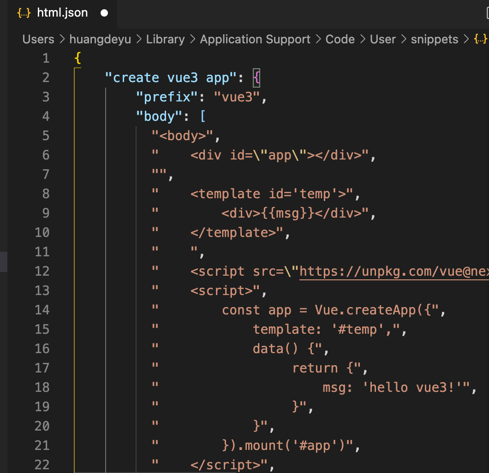

## 第1节 介绍
:::: tabs
::: tab label=vue2-vue3
* vue3使用monorepo形式来管理源代码。优势是多个包本身逻辑独立，可以拥有自己的单元测试等。
* 全部使用typescript重写，vue2使用flow类型检测
* vue3使用proxy来进行数据劫持：vue2的defineProperty新增数据是不能进行监听，要用 `Vue.$set(key, val)` 的形式
* 编译优化：生成`Block tree`，`slot`优化、`diff算法优化`
* 从`options API`到`Composition API`：options API在代码内配置的较分散，`methods`、`生命周期`等等，Composition API代码逻辑放到一处，易于管理和理解
* 多个组件共享逻辑：Vue2使用`mixin`，Vue3使用`hooks`，将代码抽离出去，可以共享，并且还是响应式的。
* 删除了一些不常用的方法`filter`...
:::
::: tab label=起步
* CDN引入
```html{3}
<body>
    <div id="app"></div>
    <script src="https://unpkg.com/vue@next"></script>
    <script>
        const app = Vue.createApp({
            template: `<div>hello vue3</div>`
        })
        app.mount('#app');
    </script>
</body>
```
:::
::: tab label=对比
* 原生实现计数器
```html
<body>
    <button class="reduce">-</button>
    <span class="num">0</span>
    <button class="add">+</button>

    <script>
        const reduce = document.querySelector('.reduce');
        const add = document.querySelector('.add');
        const proxy = new Proxy({ num: 0 }, {
            set(target, key, val) {
                if (key === 'num' && val >-1 && val < 100) {
                    target[key] = val;
                    const numEle = document.querySelector('.num');
                    numEle.innerText = val;
                }
            }
        })
        add.addEventListener('click', () => proxy.num++);
        reduce.addEventListener('click', () => proxy.num--);
    </script>
</body>
```
* VUE写法
```html
<body>
    <div id="app"></div>
    <script src="https://unpkg.com/vue@next"></script>
    <script>
        Vue.createApp({
            template: `
            <div>
                <button @click="decre">-</button>
                <span>{{count}}</span>
                <button @click="incre">+</button>
            </div>
                `,
            data() {
                return {
                    count: 0
                }
            },
            methods: {
                incre() {
                    this.count++;
                },
                decre() {
                    this.count--;
                },
            }
        }).mount('#app')
    </script>
</body>
```
:::
::: tab label=x-template
* template如果以#开头，会被`document.querySelector`处理
```html{4-7,12}
<body>
    <div id="app"></div>

    <script type="x-template" id='temp'>
        <h2>哈哈</h2>
        <span>{{msg}}</span>
    </script>
    
    <script src="https://unpkg.com/vue@next"></script>
    <script>
        Vue.createApp({
            template: '#temp',
            data() {
                 return {
                     msg: 'hello vue3!'
                 }
            }
        }).mount('#app')
    </script>
</body>
```
:::
::: tab label=template
* html原生`template`，不会被渲染的一类元素，提供给JS处理的html模板
```html{4-7,12}
<body>
    <div id="app"></div>
    
    <template id='temp'>
        <h2>呵呵</h2>
        <span>{{msg}}</span>
    </template>
    
    <script src="https://unpkg.com/vue@next"></script>
    <script>
        Vue.createApp({
            template: '#temp',
            data() {
                 return {
                     msg: 'hello vue3!'
                 }
            }
        }).mount('#app')
    </script>
</body>
```
:::
::: tab label=问题
* vue3中this是谁？
>本组件实例的proxy对象，`instance.proxy`。methods方法和生命周期函数用bind返回了一个绑定好this的函数，执行的时候实际上就是执行的绑定后的函数。
* vue3官方文档说methods不能使用箭头函数，那么用箭头函数this是谁？为什么？
>window。箭头函数不绑定this，直接使用`上层作用域`this，vue定义时上层this就是window
* 源码调试
    * 第一节，1:56:00
    * github：`vue-next`
* UI组件库：Element-plus、antdesign Vue
:::
::::
## 第2节 class/style绑定
:::: tabs
::: tab label=vscode自定义代码片段
* [生成网址](https://snippet-generator.app/)，填入名称、片段、快捷键。生成代码  


* vscode->首选项->用户片段->html，填入代码  


* html文件内输入快捷键即可拿到片段
:::
::: tab label=动态class
* 动态绑定`class名`和`展示判断`
```html{5,20-21}
<body>
    <div id="app"></div>

    <template id='temp'>
        <div :class="{ [title]: isActive}">你好哈哈哈</div>
    </template>

    <style>
        .active {
            color: red;
        }
    </style>

    <script src="https://unpkg.com/vue@next"></script>
    <script>
        Vue.createApp({
            template: '#temp',
            data() {
                 return {
                     title: 'active',
                     isActive: true
                 }
            }
        }).mount('#app')
    </script>
</body>
```
:::
::: tab label=对象class
```html{5,24-28}
<body>
    <div id="app"></div>

    <template id='temp'>
        <div :class="className">你好哈哈哈</div>
    </template>

    <style>
        .active {
            color: red;
        }
    </style>

    <script src="https://unpkg.com/vue@next"></script>
    <script>
        Vue.createApp({
            template: '#temp',
            data() {
                 return {
                     title: 'active',
                     isActive: true
                 }
            },
            computed: {
                className() {
                    return { [this.title]: this.isActive }
                }
            }
        }).mount('#app')
    </script>
</body>
```
:::
::: tab label=数组class
* 字符串就是类名
* 变量取`data`或`computed`数据
* 也可以`三元表达式`取结果
* 还可以嵌套写对象语法
```html{5}
<body>
    <div id="app"></div>

    <template id='temp'>
        <div :class="['abc', title, isActive ? 'active' : '', { active: isActive }]">你好哈哈哈</div>
    </template>

    <style>
        .active {
            color: red;
        }
    </style>

    <script src="https://unpkg.com/vue@next"></script>
    <script>
        Vue.createApp({
            template: '#temp',
            data() {
                 return {
                     title: 'hdy',
                     isActive: true
                 }
            },
        }).mount('#app')
    </script>
</body>
```
:::
::: tab label=动态style
* 支持对象写法和数组写法
```html{5-6,15,17-23}
<body>
    <div id="app"></div>

    <template id='temp'>
        <div :style="{color: 'red', backgroundColor: bgc}">你好哈哈哈</div>
        <div :style="[bgObj1, bgObj2]">你好哈哈哈</div>
    </template>

    <script src="https://unpkg.com/vue@next"></script>
    <script>
        Vue.createApp({
            template: '#temp',
            data() {
                 return {
                    bgc: 'blue',

                    bgObj1: {
                        backgroundColor: 'black',
                        color: 'white'
                    },
                    bgObj2: {
                        fontSize: '30px'
                    }
                 }
            },
        }).mount('#app')
    </script>
</body>
```
:::
::: tab label=多个属性
* 直接使用`v-bind=""`可以将整个对象的键值对作为属性的键值对绑定上去
```html{5-6,15-18}
<body>
    <div id="app"></div>

    <template id="temp">
        <div name="hdy" age="18">你好哈哈哈</div>
        <div v-bind="me">你好哈哈哈</div>
    </template>

    <script src="https://unpkg.com/vue@next"></script>
    <script>
        Vue.createApp({
            template: '#temp',
            data() {
                 return {
                     me: {
                         name: 'hdy',
                         age: "18"
                     }
                 }
            },
        }).mount('#app')
    </script>
</body>
```
:::
::: tab label=多个事件
* 多个事件的绑定用`v-on="{}"`语法
```html
<body>
    <div id="app"></div>

    <template id="temp">
        <div v-on="{ click: say, mousemove: go }">你好哈哈哈</div>
    </template>

    <style>
        div {
            width: 200px;
            height: 200px;
            border: solid 1px #333;
        }
    </style>
    <script src="https://unpkg.com/vue@next"></script>
    <script>
        Vue.createApp({
            template: '#temp',
            methods: {
                say() {
                    console.log('鼠标点击了');
                },
                go() {
                    console.log('鼠标移动了')
                }
            }
        }).mount('#app')
    </script>
</body>
```
:::
::::
## 第3节 条件渲染/diff算法
:::: tabs
::: tab label=v-if
* 输入分数判断及格
```html{7-9}
<body>
    <div id="app"></div>

    <template id="temp">
        <div>
            <input type="number" v-model="score">
            <div v-if="score > 89">优秀</div>
            <div v-else-if="score > 59">及格</div>
            <div v-else>不及格</div>
        </div>
    </template>

    <script src="https://unpkg.com/vue@next"></script>
    <script>
        Vue.createApp({
            template: '#temp',
            data() {
                return {
                    score: 100
                }
            }
        }).mount('#app')
    </script>
</body>
```
:::
::: tab label=遍历对象
* `v-for`遍历对象，一个参数是**value**，多个参数是(value, key, index)
* v-for遍历数字，**从1开始，到n**，多个参数是(num, index)
```html{5,14-17}
<body>
    <div id="app"></div>

    <template id="temp">
        <div v-for="(value, key) of obj">{{key}}:{{value}}</div>
    </template>

    <script src="https://unpkg.com/vue@next"></script>
    <script>
        Vue.createApp({
            template: '#temp',
            data() {
                return {
                    obj: {
                        name: 'hdy',
                        age: 18
                    }
                }
            }
        }).mount('#app')
    </script>
</body>
```
:::
::: tab label=diff算法
* diff算法：1:20:00
    * 新旧虚拟dom从头开始比较，到不同的地方跳出while循环
    * 从尾部开始比较，到不同跳出while循环
    * **拿到新旧dom不同的下标值**，做比较，多出来的`mount`，少了就`unmount`，更新就`update`
    * 如果遇到中间还有很多无序的下标，用一个数组记录key值，尽可能的复用原有节点，进行tagName比较，后进行对应节点的移动更新，最大程度的复用原节点
    * 结论：**唯一的key是十分必要的**
* 没有key，就尽可能的复用节点，更新内容，从头开始遍历、从尾开始遍历，相同元素深度比较，更新DOM
:::
::: tab label=问题
* 性能优化：
>条件渲染的空标签用`template`替代`div`，可以少渲染一个节点，性能优化。类似小程序的`block`。  
注：v-show不支持template
:::
::::
## 第4节 watch/基础案例
:::: tabs
::: tab label=computed
* 模板语法缺点：
    1. 大量复杂逻辑，不便维护
    2. 当有多次同样逻辑，存在重复代码
    3. 没有缓存，重复计算
* computed就能够解决这些问题。
    * 书写的`computed`属性是以`getter`、`setter`的形式挂载到`instance.proxy`上面的
    * 简写可以写做单个函数的形式，隐式转化为`getter`
:::
::: tab label=watch
* **监听某个数据改变，要做一系列操作**时用watch，如网络请求，就不适合用computed
* [key: string]: Function | Object | String【meghods里面定义的方法名】 | Array【多个函数或配置逐一被调用】
* **深度监听**：默认不是深度监听的，需要深度监听`deep:true`
* **立即执行**：默认只有监听到发生改变了才会执行，一开始并不会执行，可以设置`immediate: true`来立即执行一次
* 监听对象某个属性：`"info.name"`
```html{18-25}
<body>
    <div id="app">
        <input type="text" v-model="me.name">
    </div>

    <script src="https://cdn.jsdelivr.net/npm/vue@2/dist/vue.js"></script>
    <script>
        new Vue({
            el: '#app',
            data() {
                return {
                    me: {
                        name: 'hdy',
                        age: 18
                    }
                }
            },
            watch: {
                me: {
                    handler(newName, oldName) {
                        console.log('watch');
                    },
                    deep: true
                }
            }
        })
    </script>
</body>
```
:::
::: tab label=复杂监听
* data内一个对象中或数组中的某一个属性
```html{23-25}
<body>
    <div id="app"></div>

    <template id="temp">
        <button @click="changeName">深度修改</button>
    </template>

    <script src="https://unpkg.com/vue@next"></script>
    <script>
        Vue.createApp({
            template: '#temp',
            data() {
                return {
                    friends: [ {name: '张三'}, {name: '李四'} ]
                }
            },
            methods: {
                changeName() {
                    this.friends[0].name = '王五';
                }
            },
            watch: {
                ['friends.0.name']() {
                    console.log('---');
                }
            }
        }).mount('#app')
    </script>
</body>
```
:::
::: tab label=可取消的侦听器
* 生命周期中用$watch去侦听，返回值是一个本watch的取消器
>两秒失效的侦听器

<video src="./assets/unwatch.mp4" style="width:400px;" controls />

```html{5,15,24-29}
<body>
    <div id="app"></div>

    <template id="temp">
        <div>{{friends[0].name}}</div>
        <button @click="changeName">深度修改</button>
    </template>

    <script src="https://unpkg.com/vue@next"></script>
    <script>
        Vue.createApp({
            template: '#temp',
            data() {
                return {
                    friends: [ {name: '张三'}, {name: '李四'} ]
                }
            },
            methods: {
                changeName() {
                    this.friends[0].name += '哈';
                }
            },
            created() {
                const unwatch = this.$watch(
                    'friends',
                    () => console.log('侦听到了'),
                    { deep: true }
                )
                setTimeout(() => unwatch(), 2000);
            }
        }).mount('#app')
    </script>
</body>
```
:::
::: tab label=综合案例
<video src="./assets/demoshudian.mp4" style="width:500px;" controls />

* 注意v-for和v-if的`嵌套关系`
```html{65-77}
<body>
    <style>
        table {
            border-collapse: collapse;
            border-spacing: 0;
            border: 1px solid gray;
            margin: 0 auto;
        }

        tr {
            height: 50px;
            text-align: center;
            vertical-align: top;
        }

        td, th {
            padding: 0 10px;
            border: 1px solid gray;
            min-width: 100px;
            max-width: 200px;
        }
        th {
            background-color: rgb(238, 238, 238);
            color:rgb(88, 88, 88);
            line-height: 50px;
        }
        button {
            margin-right: 5px;
        }

        button:last-child {
            background-color: rgb(253, 197, 197);
        }

        input {
            margin: 5px 10px;
            line-height: 30px;
            max-width: 100px;
        }

        div {
            margin-left: 30px;
        }
    </style>

    <div id="app"></div>

    <template id="temp">
        <table>
            <thead>
                <th>编号</th>
                <th>书籍</th>
                <th>价格</th>
                <th>数量</th>
                <th>操作</th>
            </thead>
            <tbody>
                <tr>
                    <td><input type="text" v-model="id"></td>
                    <td><input type="text" v-model="name"></td>
                    <td><input type="text" v-model="price"></td>
                    <td><input type="text" v-model="num"></td>
                    <td><button @click="newGood">添加</button></td>
                </tr>
                <template v-for="(item, idx) of goods">
                    <tr v-if="+item.num > 0" :key="item.id">
                        <td>{{item.id}}</td>
                        <td>{{item.name}}</td>
                        <td>{{item.price}}</td>
                        <td>{{item.num}}</td>
                        <td>
                            <button @click="decre(idx)">-</button>
                            <button @click="incre(idx)">+</button>
                            <button @click="del(idx)">删</button>
                        </td>
                    </tr>
                </template>
            </tbody>
        </table>
        <div>总价：{{ total }}</div>
    </template>

    <script src="https://unpkg.com/vue@next"></script>
    <script>
        Vue.createApp({
            template: '#temp',
            data() {
                return {
                    id: '',
                    name: '',
                    price: '',
                    num: '',
                    goods: [{
                            id: 0,
                            name: '《你不知道的JS》',
                            price: 100,
                            num: 1
                        },
                        {
                            id: 1,
                            name: '《JS语言精粹》',
                            price: 200,
                            num: 2
                        },
                    ]
                }
            },
            computed: {
                total() {
                    return this.goods.reduce((pre, item) => pre + (+item.price * +item.num), 0);
                }
            },
            methods: {
                decre(idx) {
                    const goods = this.goods;
                    this.goods[idx].num = goods[idx].num > 0 ? goods[idx].num - 1 : goods[idx].num;
                },
                incre(idx) {
                    const goods = this.goods;
                    this.goods[idx].num = goods[idx].num < 99 ? goods[idx].num + 1 : goods[idx].num;
                },
                del(idx) {
                    const goods = this.goods;
                    this.goods.splice(idx, 1);
                },
                newGood() {
                    const newGood = {
                        id: this.id,
                        name: `《${this.name}》`,
                        price: +this.price,
                        num: +this.num,
                    }
                    this.goods.push(newGood);
                }
            }
        }).mount('#app')
    </script>
</body>
```
:::
::::
## 第5节 v-model
:::: tabs
::: tab label=解析
* `v-model`只是`v-bind`和`v-on`的语法糖
```html{5-6}
<body>
    <div id="app"></div>

    <template id="temp">
        <input type="text" v-model="msg">
        <input type="text" :value="msg" @input="msg = $event.target.value">
        <div>{{ msg }}</div>
    </template>

    <script src="https://unpkg.com/vue@next"></script>
    <script>
        Vue.createApp({
            template: '#temp',
            data() {
                return {
                    msg: ''
                }
            }
        }).mount('#app')
    </script>
</body>
```
:::
::: tab label=源码
* 加`lazy`只是改变了监听的事件，改为change
```ts{8}
export const vModelText: ModelDirective<
  HTMLInputElement | HTMLTextAreaElement
> = {
  created(el, { modifiers: { lazy, trim, number } }, vnode) {
    el._assign = getModelAssigner(vnode)
    const castToNumber =
      number || (vnode.props && vnode.props.type === 'number')
    addEventListener(el, lazy ? 'change' : 'input', e => {
      if ((e.target as any).composing) return
      let domValue: string | number = el.value
      if (trim) {
        domValue = domValue.trim()
      } else if (castToNumber) {
        domValue = toNumber(domValue)
      }
      el._assign(domValue)
    })
    if (trim) {
      addEventListener(el, 'change', () => {
        el.value = el.value.trim()
      })
    }
    if (!lazy) {
      addEventListener(el, 'compositionstart', onCompositionStart)
      addEventListener(el, 'compositionend', onCompositionEnd)
      // Safari < 10.2 & UIWebView doesn't fire compositionend when
      // switching focus before confirming composition choice
      // this also fixes the issue where some browsers e.g. iOS Chrome
      // fires "change" instead of "input" on autocomplete.
      addEventListener(el, 'change', onCompositionEnd)
    }
  },
  // set value on mounted so it's after min/max for type="range"
  mounted(el, { value }) {
    el.value = value == null ? '' : value
  },
  beforeUpdate(el, { value, modifiers: { lazy, trim, number } }, vnode) {
    el._assign = getModelAssigner(vnode)
    // avoid clearing unresolved text. #2302
    if ((el as any).composing) return
    if (document.activeElement === el) {
      if (lazy) {
        return
      }
      if (trim && el.value.trim() === value) {
        return
      }
      if ((number || el.type === 'number') && toNumber(el.value) === value) {
        return
      }
    }
    const newValue = value == null ? '' : value
    if (el.value !== newValue) {
      el.value = newValue
    }
  }
}
```
:::
::: tab label=checkbox
<video src="./assets/checkbox.mp4" style="width:300px;" controls />

* **必须要有value**，`$event.target.value`才能正确的跟踪值
* `label`里的for对应input里的id
```html{5-20,29}
<body>
    <div id="app"></div>

    <template id="temp">
        <div>
            <label for="红宝书">红宝书
                <input type="checkbox" v-model="books" value="红宝书" id="红宝书">
            </label>
        </div>
        <div>
            <label for="绿宝书">绿宝书
                <input type="checkbox" v-model="books" value="绿宝书" id="绿宝书">
            </label>
        </div>
        <div>
            <label for="蓝宝书">蓝宝书
                <input type="checkbox" v-model="books" value="蓝宝书" id="蓝宝书">
            </label>
        </div>
        <div>{{ books }}</div>
    </template>

    <script src="https://unpkg.com/vue@next"></script>
    <script>
        Vue.createApp({
            template: '#temp',
            data() {
                return {
                    books: [],
                }
            }
        }).mount('#app')
    </script>
</body>
```
:::
::: tab label=radio
<video src="./assets/radio.mp4" style="width:300px;" controls />

* 单选框，值唯一
```html
<body>
    <div id="app"></div>

    <template id="temp">
        <div>
            <label for="male">male
                <input type="radio" v-model="sex" value="male" id="male">
            </label>
        </div>
        <div>
            <label for="female">female
                <input type="radio" v-model="sex" value="female" id="female">
            </label>
        </div>
        <div>性别是：{{ sex }}</div>
    </template>

    <script src="https://unpkg.com/vue@next"></script>
    <script>
        Vue.createApp({
            template: '#temp',
            data() {
                return {
                    sex: '',
                }
            }
        }).mount('#app')
    </script>
</body>
```
:::
::: tab label=select
```html{5-8,17-18}
<body>
    <div id="app"></div>

    <template id="temp">
        <select v-model="current">
            <option v-for="city of cities" :value="city">{{ city }}</option>
        </select>
        <div>当前在：{{ current }}</div>
    </template>

    <script src="https://unpkg.com/vue@next"></script>
    <script>
        Vue.createApp({
            template: '#temp',
            data() {
                return {
                    cities: [ '北京', '上海', '深圳'],
                    current: '上海',
                }
            }
        }).mount('#app')
    </script>
</body>
```
* 如果要展示多个，数值变成数组。按住command多选。
    * mutiple：多选
    * size：展示个数
```html
<body>
    <div id="app"></div>

    <template id="temp">
        <select v-model="current" multiple size="4">
            <option v-for="city of cities" :value="city">{{ city }}</option>
        </select>
        <div>当前在：{{ current }}</div>
    </template>

    <script src="https://unpkg.com/vue@next"></script>
    <script>
        Vue.createApp({
            template: '#temp',
            data() {
                return {
                    cities: [ '北京', '上海', '深圳'],
                    current: ['上海', '深圳'],
                }
            }
        }).mount('#app')
    </script>
</body>
```
:::
::: tab label=问题
* lodash库：封装一些好用的方法
:::
::::
## 第6节 组件化
:::: tabs
::: tab label=全局组件
* 一般组件取名方式：
    * 短横线分割符 **( 推荐 )** ：`'my-comp'`
    * 驼峰(只有在脚手架有效)：`'MyComp'`
```html{5-6,15-17,19}
<body>
    <div id="app"></div>

    <template id="temp">
        <div>我是爸爸</div>
        <com-a></com-a>
    </template>

    <script src="https://unpkg.com/vue@next"></script>
    <script>
        const app = Vue.createApp({
            template: '#temp',
        })

        const child ={
            template: '<div>我是子组件</div>'
        }

        app.component('com-a', child);
        app.mount('#app');
    </script>
</body>
```
:::
::: tab label=局部组件
```html{18-20}
<body>
    <div id="app"></div>

    <template id="temp">
        <div>我是爸爸</div>
        <com-a></com-a>
        <com-a></com-a>
    </template>

    <script src="https://unpkg.com/vue@next"></script>
    <script>
        const child ={
            template: '<div>我是子组件</div>'
        };

        const app = Vue.createApp({
            template: '#temp',
            components: {
                'com-a': child,
            }
        });

        app.mount('#app');
    </script>
</body>
```
:::
::::
## 第7节 webpack-loader
:::: tabs
::: tab label=介绍
* webpack is a **static module bundler** for modern jsvascript application.
* webpack是一个服务于现代javascript应用程序的`静态的模块化打包工具`。
* 将各种资源的语法打包成 **浏览器认识的** html/css/图片/视频等格式。


:::
::: tab label=起步
* 安装
```shell
npm i webpack webpack-cli -g

webpack --version
```
* 打包体验
```js
// test/src/esm.js
let a = 1;
let b = 2;
export { a, b }
```
```js
// test/src/cmjs.js
function add(a, b) {
    return a + b;
}
module.exports = {
    add
}
```
```js
// test/src/index.js
import { a, b } from './esm';
const { add } = require('./cmjs');

console.log(add( a, b ));
```
>test/index.html
```html
<body>
    <script src="./dist/main.js"></script>
</body>
```
* test目录下执行命令，后就能看结果
```shell
webpack
```


:::
::: tab label=依赖
* 依赖管理：`package.json`
* 开发依赖：直接`install`
* 生产依赖：`install --save--dev`，简写`install -D`
* 默认入口：当前文件夹下的src下的`index`文件，根据这个文件去寻找其他依赖，生成`依赖关系图`，进行打包
>npm初始化：
```shell
npm init -y
```
* 使用本地webpack两种方法：
    1. npx
    ```shell{1}
    npm install webpack webpack-cli -D

    npx webpack
    ```
    2. 或者直接在package.json创建脚本
    ```json
    "scripts": {
        "build": "webpack"
    }
    ```
>自定义入口/出口
```shell
npx webpack --entry ./src/index.js --output-path ./build
```
:::
::: tab label=配置文件
* 默认的配置文件是当前项目根目录的`webpack.config.js`
```js
const path = require("path");
module.exports = {
    entry: "./src/index.js",
    output: {
        path: path.resolve(__dirname, "build"),
        filename: "bundle.js",
    }
}
```
* 输出路径必须是绝对路径，`__dirname`是当前文件所在路径
:::
::: tab label=loader
* loader可以对不同的源代码进行解析，打包对应的文件，如：css-loader、ts-loader
```shell
npm i css-loader -D
npm i style-loader -D
```
* 使用方式（2种）：
    1. 内联
    ```js
    import 'css-loader!./src/css/style.css'
    ```
    2. 配置(常用)
    >有多个loader就用use配置数组。  
    >注：use的执行顺序是 **倒序** 的，最下面的loader先执行。css文件需要先css-loader解析，再style-loader插入到文件内去
    ```js{5-15}
    //webpack.comfig.js
    module.exports = {
        // ...
        module: {
            rules: [
                {
                    test: /\.css$/,
                    // loader: "css-loader",
                    // use: [ {loader: "css-loader", options: xxx} ]
                    use: [
                        "style-loader",
                        "css-loader"
                    ]
                }
            ]
        }
    }
    ```
:::
::: tab label=PostCSS
* 进行一些CSS适配，将CSS转换成各浏览器都能识别的状态。如：加前缀、#12345678透明度等。
```shell
npm i postcss-loader -D
npm i autoprefixer -D
```
```js{7-16}
rules: [
    {
        test: /\.(css|less)$/,
        use: [
            "style-loader",
            "css-loader",
            {
                loader: "postcss-loader",
                options: {
                    postcssOptions: {
                        plugins: [
                            require("autoprefixer"),
                        ]
                    }
                }
            },
            "less-loader",
        ]
    }
]
```
* 或者直接使用已经配置好的`postcss-preset-env`插件配置，会将大多数样式转化成各浏览器适配的版本。
```js{12}
rules: [
    {
        test: /\.(css|less)$/,
        use: [
            "style-loader",
            "css-loader",
            {
                loader: "postcss-loader",
                options: {
                    postcssOptions: {
                        plugins: [
                            require("postcss-preset-env"),
                        ]
                    }
                }
            },
            "less-loader",
        ]
    }
]
```
:::
::: tab label=图片
* 对应`file-loader`
```shell
npm i file-loader -D
```
```js
rules: [
    {
        test: /\.(jpe?g|gif|svg|png)$/,
        loader: "file-loader"
    }
]
```
* 使用`url-loader`，与`file-loader`相似，但是可以将较小的图片转化成`base64`格式，性能优化
:::
::: tab label=文件命名
* placeholder:
    * [ext] :处理文件的扩展名
    * [name] : 处理文件的原名称
    * [hash] :哈希值，文件内容
    * [path] :文件相对于webpack.config.js文件的相对路径
    * [hash:【length】] :哈希截取长度
    * [contentHash]: 
```js{5-8}
{
    test: /\.(png|gif|svg)$/,
    use: {
        loader: "file-loader",
        options: {
            outputPath: "img",
            name: "[name]_[hash:6][ext]"
        }
    },
}
```
:::
::: tab label=asset
* `asset module type`：`webpack5`推出的统一静态资源打包方法
* 配置项：
    * asset/resource：类似file-loader
    * asset/inline：类似url-loader
    * asset/source：类似原row-loader
    * asset：选择导出配置项
```js
{
    test: /\.(png|gif|svg)$/,
    type: "asset/resource",
}
```
```js{3}
{
    test: /\.(jpe?g|png|gif|svg)$/,
    type: "asset",
    parser: {
        dataUrlCondition: {
            maxSize: 100 * 1024,
        }
    },
    generator: {
        filename: "img/[name]_[hash][ext]"
    }
}
```
:::
::: tab label=问题
* 字体、icon、font打包：`file-loader`/`asset/resource`
* plugin和loader区别：
    * 添加功能：plugin
    * 模块打包：loader
:::
::::
## 第8节 webpack-plugin
:::: tabs
::: tab label=常用
* `CleanWebpackPlugin`：自动清理原打包文件
```shell
npm i clean-webpack-plugin -D
```
```js
const { cleanWebpackPlugin } = require('clean-webpack-plugin');
module.exports = {
    plugins: [
        new CleanWebpackPlugin()
    ]
}
```
* `HtmlWebpackPlugin`：自动生成html入口文件
>注意，导入没有解构！
```shell
npm i html-webpack-plugin -D
```
```js{1}
const HtmlWebpackPlugin = require('html-webpack-plugin');
module.exports = {
    plugins: [
        new HtmlWebpackPlugin({
            template: "./public/index.html" // 可以指定模板
        })
    ]
}
```
* `DefinePlugin`：注入全局变量
```js
const { DefinePlugin } = require('webpack');
module.exports = {
    plugins: [
        new DefinePlugin({
            BASE_URL: "'./public/'"
        })
    ]
}
```
```html
<link rel="icon" href="<%= BASE_URL %>favicon.ico">
```
:::
::: tab label=public
* public文件夹下的东西会被直接复制到打包后的文件夹内，是因为有`CopyWebpackPlugin`这个插件
```shell
npm i copy-webpack-plugin -D
```
```js
const CopyWebpackPlugin = require('copy-webpack-plugin');
module.exports = {
    plugins: [
        new CopyWebpackPlugin({
            patterns: [
                {
                    from: 'public',
                    to: '',
                    globOptions: {
                        ignore: [
                            "**/index.html"
                        ]
                    }
                }
            ]
        })
    ]
}
```
:::
::: tab label=babel
>babel本质上是一个编译器，将我们的源代码转换成另一份源代码

* 安装
```shell
npm i @babel/core @babel/cli -D
npm i @babel/preset-env -D
```
* 常用ES6转ES5
```shell
npx babel src/test.js --out-dir ./ --presets=@babel/preset-env
```
* webpack内使用
```shell
npm i babel-loader @babel/core -D
```
```js{5-7}
{
    test: /\.js$/,
    use: {
        loader: "babel-loader",
        options: {
            presets: [ "@babel/preset-env" ],
        }
    }                
}
```
* 配置抽离：
    * (荐)babel.config.js/json...
    * babelrc.js/json
    ```js
    // webpack.config.js module.rules
    {
        test: /\.js$/,
        loader: "babel-loader",   
    }
    ```
    ```js
    // babel.config.js
    module.exports = {
        plugins: [],
        presets: [ '@babel/preset-env' ]
    }
    ```
:::
::: tab label=vue
```shell
npm i vue@next
npm i vue-loader@next -D
npm i @vue/compiler-sfc -D
```
```js{10-11}
// weboack.config.js
const { DefinePlugin } = require('webpack');
const { VueLoaderPlugin } = require('vue-loader/dist/index');

// plugins
plugins: [
    // ..
    new DefinePlugin({
        BASE_URL: "'./public/'",
        __VUE_OPTIONS_API__: true,
        __VUE_PROD_DEVTOOLS__: true
    }),
    new VueLoaderPlugin()
]

// rules
{
    test: /\.vue$/,
    loader: 'vue-loader'
}
```
* vue/home.vue
```vue
<template>
    <div>
        <h2>{{ msg }}</h2>
    </div>
</template>

<script>
    export default {
        data() {
            return {
                msg: 'Hello Vue!'
            }
        }
    }
</script>

<style>
    h2 {
        color: red;
    }
</style>
```
```js{3}
// index.js
const { createApp } = require('vue');
import home from'./vue/Home.vue';

const app = createApp(home);
app.mount("#app");
```
* index.html(模板)
```html
<body>
    <div id="app"></div>
</body>
```
* 效果  


:::
::: tab label=调试
* mode:`development`开发模式，打包就不会压缩。打包上线设置`production`
* devtool:`source-map`，出现问题能够定位到源文件位置
* vscode调试插件：`vetur`、`volar`(vue3支持较好)
```js
module.exports = {
    mode: 'development',
    devtool: "source-map",
}
```
* 编译器原理学习：[简单的源码](https://github.com/jamiebuilds/the-super-tiny-compiler)
:::
::::
## 第9节 webpack-devServer
:::: tabs
::: tab label=自动编译
* 三种可选方式：
    * webpack watch mode
    ```js{3}
    //package.json
    "scripts": {
        "build": "webpack --watch"
    }
    ```
    >或者直接配置里面添加watc:true
    ```js{4}
    // webpack.config.js
    module.exports = {
        // ...
        watch: true
    }
    ```
    * webpack-dev-server(常)
    >实际上是webpack用express搭建的一个本地服务器，配上监听变化和自动编译操作。  
    >且打包后并不写入文件，而是使用`memfs`库写入内存，在内存中进行调用，减少了写文件阶段，访问更为快速。
    ```shell
    npm i webpack-dev-server -D
    ```
    ```js
    //package.json
    "scripts": {
        "server": "webpack server"
    }
    ```
    >如果服务器没找到的资源，会从这里进行查找。  
    >**开发阶段用`static`，生产阶段用`CopyWebpackPlugin`将静态资源一起打包。**
    ```js{5}
    // webpack.config.js
    module.exports = {
        // ...
        devServer: {
            static: "./public",
        }
    }
    ```
    * webpack-dev-middleware
:::
::: tab label=模块热替换
>当前webpack-dev-server属于热加载`live-reloade`，更改一个位置全部浏览器刷新HMR(hot module replace)  
>模块热替换是修改了哪个模块只热加载哪个模块，其他模块状态不变，就不会丢失掉当前测试的整个前端保存的状态。 
<video src="./assets/webpackmokuairejiazai.mp4" style="width:600px" controls />

```js
// webpack.config.js
module.exports = {
    target: "web",
    devServer: {
        static: "./abc",
        hot: true,
    },
}
```
```js
// aa.js
console.log('cdc');
let a = 110;
export default {
    a
}
```
```js{4-7}
// index.js
import "./aa";

// 需要热加载模块
if (module.hot) {
    module.hot.accept('./aa.js', () => console.log("aa.js模块更新了！"));
}
```
:::
::: tab label=热替换原理
>Vue-loader已自动支持模块热替换 
* 模块热加载原理：webpack起了一个express静态资源服务器，起了一个socket长连接服务实时推送信息。
* 服务器监听到模块发生变化后，向客户端推送变化模块：（manifist.json 和 updata chunk），浏览器就能进行实时更新。


:::
::: tab label=其他配置
```js
// webpack.config.js
const path = require('path');
module.exports = {
    // ...
    devServer: {
        static: "./public",
        hot: true,
        host: "0.0.0.0", // 可以开启ipv4访问
        port: 8888,
        open: true,  // 是否自动打开浏览器
        compress: true, // 是否开启gzip压缩
        proxy: {  // 是否开代理，开发阶段有效
            "/api": {
                target: "http://localhost:8070",
                pathRewrite: { "^/api": "" },
                secure: false, // 是否阻止非https请求转发
                changeOrigin: true, // 修改源，防数据服务器校验header
            }
        }
    },
    resolve: {
        extensions: [ '.js', '.json', '.vue', '.ts' ], // 默认后缀名
        alias: {
            "@": path.resolve(__dirname, "./src"), // 设置路径别名
            "js": path.resolve(__dirname, "./src/js"),
        }
    }
}

```
:::
::: tab label=区分环境
* 目录：将生产环境和开发环境做一个自定义配置，公公配置使用`webpack-merge`来合并
```txt
config
  |-webpack.comm.config.js
  |-webpack.dev.config.js
  |-webpack.prod.config.js
package.json
```
>package.json
```js
"scripts": {
    "build": "webpack --config ./config/webpack.prod.config.js",
    "serve": "webpack serve --config ./config/webpack.dev.config.js"
}
```
>webpack.comm.config.js
```js
const path = require("path");
const HtmlWebpackPlugin = require("html-webpack-plugin");
const { DefinePlugin } = require("webpack");
const { VueLoaderPlugin } = require('vue-loader/dist/index');

module.exports = {
  target: "web",
  entry: "./src/index.js",
  output: {
    path: path.resolve(__dirname, "../build"),
    filename: "js/bundle.js",
  },
  resolve: {
    extensions: [".js", ".json", ".mjs", ".vue", ".ts", ".jsx", ".tsx"],
    alias: {
      "@": path.resolve(__dirname, "../src"),
      "js": path.resolve(__dirname, "../src/js")
    }
  },
  module: {
    rules: [
      {
        test: /\.css$/,
        use: ["style-loader", "css-loader", "postcss-loader"],
      },
      {
        test: /\.less$/,
        use: ["style-loader", "css-loader", "less-loader"],
      },
      // },
      {
        test: /\.(jpe?g|png|gif|svg)$/,
        type: "asset",
        generator: {
          filename: "img/[name]_[hash:6][ext]",
        },
        parser: {
          dataUrlCondition: {
            maxSize: 10 * 1024,
          },
        },
      },
      {
        test: /\.(eot|ttf|woff2?)$/,
        type: "asset/resource",
        generator: {
          filename: "font/[name]_[hash:6][ext]",
        },
      },
      {
        test: /\.js$/,
        loader: "babel-loader"
      },
      {
        test: /\.vue$/,
        loader: "vue-loader"
      }
    ],
  },
  plugins: [
    new HtmlWebpackPlugin({
      template: "./public/index.html",
      title: "哈哈哈哈"
    }),
    new DefinePlugin({
      BASE_URL: "'./'",
      __VUE_OPTIONS_API__: true,
      __VUE_PROD_DEVTOOLS__: false
    }),
    new VueLoaderPlugin()
  ],
};

```
>webpack.dev.config.js
```js{1,5}
const { merge } = require('webpack-merge');

const commonConfig = require('./webpack.comm.config');

module.exports = merge(commonConfig, {
  mode: "development",
  devtool: "source-map",
  devServer: {
    static: "./public",
    hot: true,
    // host: "0.0.0.0",
    port: 7777,
    open: true,
    // compress: true,
    proxy: {
      "/api": {
        target: "http://localhost:8888",
        pathRewrite: {
          "^/api": ""
        },
        secure: false,
        changeOrigin: true
      }
    }
  },
})
```
>webpack.prod.config.js
```js
const { CleanWebpackPlugin } = require("clean-webpack-plugin");
const CopyWebpackPlugin = require('copy-webpack-plugin');
const {merge} = require('webpack-merge');

const commonConfig = require('./webpack.comm.config');

module.exports = merge(commonConfig, {
  mode: "production",
  plugins: [
    new CleanWebpackPlugin(),
    new CopyWebpackPlugin({
      patterns: [
        {
          from: "./public",
          globOptions: {
            ignore: [
              "**/index.html"
            ]
          }
        }
      ]
    }),
  ]
})
```
:::
::::
## 第10节 Vue-cli/vite
:::: tabs
::: tab label=起步
```shell
npm i @vue/cli -g
vue --version

# 升级
npm update @vue/cli -g
```
```shell
vue create myName
```
:::
::: tab label=vite
* 主要构成：
    * 一个开发服务器(connect库)，它基于 原生 ES 模块 提供了 丰富的内建功能，如速度快到惊人的 模块热更新（HMR）。
    * 一套构建指令，它使用 Rollup 打包你的代码，并且它是预配置的，可输出用于生产环境的高度优化过的静态资源。
>vite原理：构建自己的本地服务器，在服务器端将代码构建成浏览器能解析的es6代码，然后接受到请求时进行请求转发。
```shell
npm i vite -D

npx vite
```
* 直接就开启了本地服务，一般的打包功能都支持，已支持ts
>使用第三方解析工具，如less、sass等，需要安装解析工具，不用配置  
>如：解析less
```shell
npm i less -D

npx vite
```
* 使用postcss对应插件
```shell
npm i postcss -D
npm i postcss-preset-env -D
```
>postcss.config.js
```js
module.exports = {
    plugins: [
        require('postcss-preset-env'),
    ]
}
```
```shell
npx vite
```
> vite有`预打包`能力，所以会快， 预打包文件放在node_modules/.vite文件夹下
:::
::: tab label=vite-vue3
* 需要做对应的配置（vite.config.js）
```shell
npm i vue@next -D # vue
npm i @vitejs/plugin-vue -D # vite 解析vue语法
npm i @vue/compiler-sfc -D # .vue文件解析
```
```js
// vite.config.js
const vue = require('@vitejs/plugin-vue');
module.exports = {
    plugins: [
        vue()
    ]
}
```
:::
::: tab label=构建
```shell
npx vite build
```
* 预览
```shell
npx vite preview --host
```
:::
::: tab label=脚手架
```shell
npm i @vitejs/create-app -g

create-app myName
cd myName
npm i
npm run dev
```
:::
::::
## 第11节 emit
:::: tabs
::: tab label=与Vue2不同点
* vue3定义组件可以有一个`emits`属性，提前说好这个组件可以发射哪些事件
```js{3}
// .vue文件
export default {
    emits: [ 'incre', 'decre' ],
    methods: {
        incre() {
            this.$emit("incre");
        },
        decre() {
            this.$emit("decre");
        }
    }
}
```
* 参数验证：emits可以写成对象的形式，给每个发射的事件进行参数验证
```js{2-9}
export default {
    emits: {
       incre(num) {
           return num > 0;
       }, 
       decre(num) {
           return num > 0;
       }
    },
    methods: {
        incre() {
            this.$emit("incre", 1);
        },
        decre() {
            this.$emit("decre", 1);
        }
    }
}
```
:::
::: tab label=综合案例
* 自己造轮子：tab-control  
<video src="./assets/tabcontrol.mp4" style="width:250px" controls />

>目录
```txt
components
|-TabControl.vue
App.vue
```

>App.vue
```vue{3-9}
<template>
  <div>
      <TabControl
        :tabs="tabs"
        @change-tab="changeTab"
        :c-index="cIndex"
      >
        {{ contains[tabs[cIndex]] }}
      </TabControl>
  </div>
</template>
<script>
import TabControl from "./components/TabControl.vue"
export default {
  data() {
    return {
      tabs:[ '衣服', '鞋子', '裤子' ],
      contains: {
        '衣服': "啦啦啦衣服",
        '鞋子': "啦啦啦鞋子",
        '裤子': "啦啦啦裤子",
      },
      cIndex: 0
    }
  },
  components: {
    TabControl
  },
  methods: {
    changeTab(idx) {
      this.cIndex = idx;
    }
  }
}
</script>
```
:::
::: tab label=TabControl.vue
```vue{8,13,20}
<template>
  <div>
    <div class="tabs">
      <div v-for="(tab, idx) of tabs" 
        :key="tab" 
        @click="changeTab(idx)"
        class="tab"
        :class="{ 'active': +cIndex === idx }"
      >{{ tab }}
      </div>
    </div>
    <div class="container">
      <slot></slot>
    </div>
  </div>
</template>
<script>

export default {
  emits: [ 'changeTab' ],
  props: {
    tabs: {
      type: Array,
      default: []
    },
    cIndex: {
      type: Number,
      default: 0
    }
  },
  methods: {
    changeTab(idx) {
      if (idx !== this.cIndex) {
        this.$emit('changeTab', idx);
      }
    }
  },
}
</script>
<style scoped>
.tabs {
  height: 30px;
  line-height: 30px;
  display: flex;
}
.tab {
  flex: 1;
  text-align: center;
}
.tab.active {
  color: rgb(250, 191, 191);
  background-color: rgb(137, 182, 250);
}
.container {
  margin-top: 10px;
  box-shadow: 0 -3px 3px #333;
  padding: 10px 5px;
  height: calc(100vh - 50px);
  box-sizing: border-box;
}
</style>
```
:::
::::
## 第12节 组件通信
:::: tabs
::: tab label=provide/inject
* provide：父组件向所有的子孙组件提供参数
* inject：子孙组件需要使用祖先提供的参数时进行引入

<video src="./assets/inject0.mp4" style="width:300px;" controls />

>注：要让inject参数变成响应式的，需要配置`app.config`和注入`computed`
```js{6-7}
// main.js
import { createApp } from 'vue'
import App from './App.vue'
const app = createApp(App);

// 注入响应式参数配置，后续拿数据不用.value
app.config.unwrapInjectedRef = true;

app.mount('#app')
```
>App.vue
```vue{3-4,19-24}
<template>
  <div>
    <div>爷爷的name: {{ name }}</div>
    <child></child>
  </div>
</template>
<script>
import child from "./components/Child";
import { computed } from 'vue';
export default {
  data() {
    return {
      name: '爷爷'
    }
  },
  components: {
    child
  },
  provide() {
    return {
      name: computed(() => this.name),
      changeName: this.changeName
    }
  },
  methods: {
    changeName(name) {
      this.name = name;
    }
  }
}
</script>
```
>child.vue
```vue{3-4,13}
<template>
  <div>
      <div>爸爸：<button @click="changeName('爸爸')">我要修改name</button></div>
      <grandchild></grandchild>
  </div>
</template>
<script>
import grandchild from './GrandChid.vue'
export default {
  components: {
      grandchild
  },
  inject: [ "changeName" ],
}
</script>
```
>grandchild.vue
```vue{9}
<template>
  <div>
      孙子：我拿到了name：{{ name }}
  </div>
</template>
<script>

export default {
  inject: [ 'name' ]
}
</script>
```
:::
::: tab label=Mitt
* [github](https://github.com/developit/mitt)
* 取代vue2的全局事件总线
>起步
```shell
npm i mitt
```
>初始化
```js
// utils/event_bus.js
import mitt from 'mitt';
const emitter = mitt();
export default emitter;
```
>注册事件监听
```vue{9,19-21}
<template>
  <div>
    <div>父组件的name: {{ name }}</div>
    <child></child>
  </div>
</template>
<script>
import child from "./components/Child";
import emitter from "./utils/event_bus";
export default {
  data() {
    return {
      name: '爷爷'
    }
  },
  components: {
    child
  },
  created() {
    emitter.on('changeName', (name) => this.changeName(name));
  },

  methods: {
    changeName(name) {
      this.name = name;
    }
  }
}
</script>
```
>触发事件
```vue{7,11}
<template>
  <div>
      <div>子组件的按钮：<button @click="changeName('爸爸')">我要修改name</button></div>
  </div>
</template>
<script>
import emitter from '../utils/event_bus';
export default {
    methods: {
        changeName(name) {
            emitter.emit("changeName", name);
        }
    }
}
</script>
```
* 监听所有事件：
```js
emitter.on("*", (type, ...args) => {})
```
* 取消
```js
emitter.on('change', fn);
emitter.off('change', fn);

// 取消所有
emitter.all.clear();
```
:::
::: tab label=v-model
>父组件
```vue{3}
<template>
  <div>
    <my-input v-model="msg"></my-input>
    {{msg}}
  </div>
</template>
<script>
import MyInput from './components/myInput.vue'
export default {
  data() {
    return {
      msg: 'hello',
    }
  },
  components: {
    MyInput
  },
}
</script>
```
>子组件
```vue{3,9-14}
<template>
  <div>
    <input type="text" :value="modelValue" @input="change">
  </div>
</template>
<script>

export default {
    props: [ 'modelValue' ],
    methods: {
        change(e) {
            this.$emit('update:modelValue', e.target.value);
        }
    }
}
</script>
```
* 子组件简写
```vue{3,10-20}
<template>
  <div>
    <input type="text" v-model="myValue">
  </div>
</template>
<script>

export default {
    props: [ 'modelValue' ],
    emit: [ 'update:modelValue' ],
    computed: {
        myValue: {
            get() {
                return this.modelValue;
            },
            set(newVal) {
                this.$emit('update:modelValue', newVal)
            }
        }
    }
}
</script>
```
:::
::: tab label=v-model高级
* 绑定多个，需要给每个`v-model`命名
>父组件
```vue{3}
<template>
  <div>
    <my-input v-model:msg="msg" v-model:title="title"></my-input>
    <div>{{ title }}</div>
    <div>{{ msg }}</div>
  </div>
</template>
<script>
import MyInput from './components/myInput.vue'
export default {
  data() {
    return {
      msg: 'hello',
      title: '这是title'
    }
  },
  components: {
    MyInput
  },
}
</script>
```
>子组件
```vue{3-4,10-11,13-28}
<template>
  <div>
    <input type="text" v-model="myMsg">
    <input type="text" v-model="myTitle">
  </div>
</template>
<script>

export default {
    props: [ 'msg', 'title' ],
    emit: [ 'changeMsg', 'changeTitle' ],
    computed: {
        myMsg: {
            get() {
                return this.msg;
            },
            set(newVal) {
                this.$emit('update:msg', newVal)
            }
        },
        myTitle: {
            get() {
                return this.title;
            },
            set(newVal) {
                this.$emit('update:title', newVal)
            }
        },
    }
}
</script>
```
:::
::::
## 第13节 keep-alive/生命周期
:::: tabs
::: tab label=介绍
* 动态组件的缓存，内部包裹的组件即使离开也不会销毁，会在后台运行
```vue
<keep-alive></keep-alive>
```
* include：String|Array|RegExp
* exclude：String|Array|RegExp
* max：Number|String
>注：include是组件的`name`属性
```html
<keep-alive exclude = "SongsList,Home">
    <router-view/>
</keep-alive>
```
:::
::: tab label=异步组件
* 异步加载的核心是Promise
```js
import("../utils/math.js").then(({sum}) => sum(1, 2));
```
>webpack通过JSONP的方式进行引入的

* 优势：打包时可以分包，首屏包更小，减少白屏时间
* Vue3中引入异步组件是通过`defineAsyncComponent`来定义
```js
const { defineAsyncComponent } from "vue";
const Home = defineAsyncComponent(() => import("../components/Home.vue"))

// 有参数
const Home = defineAsyncComponent({
    loader: () => import("../components/Home.vue"),
    loadingComponent: Loading,
    delay: 1000, // 多久还没加载出来就展示loadingComponent组件
})
```
* 大部分业务都是用路由懒加载。特殊页面内异步组件可以这样定义。
:::
::: tab label=异步组件示例


>App.vue
```vue{8-10,16-19,24,29-32}
<template>
  <div>
      <TabControl
        :tabs="tabs"
        @change-tab="changeTab"
        :c-index="cIndex"
      >
        <keep-alive>
          <component :is="tabs[cIndex]"></component>
        </keep-alive>
      </TabControl>
  </div>
</template>
<script>
import TabControl from "./components/TabControl.vue";
import { defineAsyncComponent } from 'vue';
const Home = defineAsyncComponent(() => import('./components/Home.vue'));
const Categories = defineAsyncComponent(() => import('./components/Categories.vue'));
const Me = defineAsyncComponent(() => import('./components/Me.vue'));

export default {
  data() {
    return {
      tabs:[ 'home', 'categories', 'me' ],
      cIndex: 0
    }
  },
  components: {
    TabControl,
    Home,
    Categories,
    Me,
  },
  methods: {
    changeTab(idx) {
      this.cIndex = idx;
    }
  }
}
</script>
```
>Home.vue
```vue
<template>
  <div>
    {{ msg }}
  </div>
</template>

<script>
export default {
  data() {
    return {
      msg: "主页"
    }
  }
}
</script>
```
>Categories.vue
```vue
<template>
  <div>
    {{ msg }}
  </div>
</template>

<script>
export default {
  data() {
    return {
      msg: "商品分类"
    }
  }
}
</script>
```
>Me.vue
```vue
<template>
  <div>
    {{ msg }}
  </div>
</template>

<script>
export default {
  data() {
    return {
      msg: "我的个人信息"
    }
  }
}
</script>
```
>TabControl.vue（复用前面的分页Tab组件）
```vue
<template>
  <div>
    <div class="tabs">
      <div v-for="(tab, idx) of tabs" 
        :key="tab" 
        @click="changeTab(idx)"
        class="tab"
        :class="{ 'active': +cIndex === idx }"
      >{{ tab }}
      </div>
    </div>
    <div class="container">
      <slot></slot>
    </div>
  </div>
</template>
<script>
export default {
  emits: [ 'changeTab' ],
  props: {
    tabs: {
      type: Array,
      default: []
    },
    cIndex: {
      type: Number,
      default: 0
    }
  },
  methods: {
    changeTab(idx) {
      if (idx !== this.cIndex) {
        this.$emit('changeTab', idx);
      }
    }
  },
}
</script>
<style scoped>
.tabs {
  height: 30px;
  line-height: 30px;
  display: flex;
}
.tab {
  flex: 1;
  text-align: center;
}
.tab.active {
  color: rgb(250, 191, 191);
  background-color: rgb(137, 182, 250);
}
.container {
  margin-top: 10px;
  box-shadow: 0 -3px 3px #333;
  padding: 10px 5px;
  height: calc(100vh - 50px);
  box-sizing: border-box;
}
</style>
```
:::
::: tab label=suspense
* 异步组件未展示的时候的应急方案，类似loading组件
    * 默认展示default插槽
    * 如果插槽组件加载中或未加载成功，就展示fallback插槽
```vue
<suspense>
    <template #default>
        <home />
    </template>
    <template #fallback>
        <loading />
    </template>
</suspense>
```
:::
::: tab label=生命周期
* keep-alive包裹的组件有`actived`和`deactived`两个生命周期
* Vue3生命周期与Vue2相比，移除了`beforeDestroy`、`destroyed`
    * 组件调用app.unmount()的时候，会触发`beforeUnmount`、`unmounted`
    * 通过`emitter.on('name',fn)`注册的事件可以在`unmounted`生命周期去`emitter.off('name', fn)`卸载
```vue{14-24,26-27}
<template>
  <div>
    {{ msg }}
  </div>
</template>
<script>

export default {
  data() {
    return {
      msg: "商品分类"
    }
  },
  beforeCreate() { console.log('beforeCreate') },
  created() { console.log('created') },
  beforeUpdate() { console.log('beforeUpdate') },
  updated() { console.log('updated') },
  beforeMount() { console.log('beforeMount') },
  mounted() { 
    console.log('mounted');
    setTimeout(() => this.msg = '修改分类', 100);
  },
  beforeUnmount() { console.log('beforeUnmount') },
  unmounted() { console.log('unmounted') },

  activated() { console.log('activated') },
  deactivated() { console.log('deactivated') }
}
</script>
```
:::
::: tab label=问题
* Vue3移除了`$children`属性。以下属性还可以用
    * `$refs`
    * `$parent`
    * `$root`
:::
::::
## 第14节 动画
:::: tabs
::: tab label=介绍
* 原理：transition检测有没有相关的类名，然后在恰当的时机把对应的类名添加到元素上
* 给单个组件/元素设置动画，可以使用transition API设置动画
* 六个类常用管理类
    * `name-enter-from`：进入前一帧初始化状态
    * `name-enter-to`：进入后一帧目标状态
    * `name-leave-from`：离开前一帧初始化状态
    * `name-leave=to`：离开后一帧目标状态
    * `name-enter-active`：进入的状态转变**过程**动画效果
    * `name-leave-active`：离开的状态转变**过程**动画效果
```vue{4-6,20-31}
<template>
  <div>
    <button @click="isShow = !isShow">切换</button>
    <transition name="hdy">
      <div v-if="isShow">{{ msg }}</div>
    </transition>
  </div>
</template>
<script>
export default {
  data() {
    return {
      msg: 'hello',
      isShow: true,
    }
  },
}
</script>
<style scoped>
.hdy-enter-from,
.hdy-leave-to {
  opacity: 0;
}
.hdy-enter-to,
.hdy-leave-from {
  opacity: 1;
}
.hdy-enter-active,
.hdy-leave-active {
  transition: all 1s 200ms ease;
}
</style>
```
:::
::: tab label=animation
<video src="./assets/animation.mp4" style="width:250px" controls />

```vue{5-7,29-47}
<template>
  <div>
    <button @click="isShow = !isShow">切换</button>
    <div class="box">
      <transition name="hdy">
        <div v-if="isShow">{{ msg }}</div>
      </transition>
    </div>
  </div>
</template>
<script>
export default {
  data() {
    return {
      msg: "hello",
      isShow: true,
    };
  },
};
</script>
<style scoped>
.box {
  width: 100vw;
  text-align: center;
}
.box > div {
  margin: 0 auto;
}
.hdy-enter-active {
  animation: bounce 1s ease;
}
.hdy-leave-active {
  animation: bounce 1s ease reverse;
}

@keyframes bounce {
  0% {
    transform: scale(0);
  }

  50% {
    transform: scale(1.2);
  }
  100% {
    transform: scale(1);
  }
}
</style>
```
:::
::: tab label=其他设置
* 首屏渲染是否需要动画：`:appear="true"`
* 如果要用生命周期调用js函数写动画，可以设置`css:false`来关闭css动画检测，以及避免css动画影响效果
* 多个动画，animation和transion都有，那么都会生效。
    * 可是如果多个动画时间不一样，以谁的时长为准？设置`type`来告诉vue
```vue
<transtion name="myName" type="animation"></transtion>
```
* 设置`mode`告诉vue多个动画的切换模式，如：两个元素切换展示，先进还是先出？
    * 默认同时动画
    * in-out：先进后出
    * out-in：先出后进
    
<video src="./assets/transitionmode.mp4" style="width:250px" controls />

```vue{5,12}
<template>
  <div>
    <button @click="isShow = !isShow">切换</button>
    <div class="box">
      <transition name="hdy">
          <div v-if="isShow">{{ msg }}</div>
          <div v-else>{{ msg2 }}</div>
      </transition>
    </div>
    <hr>
    <div class="box2">
      <transition name="hdy" mode="out-in" appear>
          <div v-if="isShow">{{ msg }}</div>
          <div v-else>{{ msg2 }}</div>
      </transition>
    </div>
  </div>
</template>
<script>
export default {
  data() {
    return {
      msg: "hello!",
      msg2: "你好~",
      isShow: true,
    };
  },
};
</script>
<style scoped>
.box {
  width: 100vw;
  text-align: center;
}
.box2 {
  position: fixed;
  text-align: center;
  width: 100vw;
  top: 50%;
}
.box>div,.box2>div {
  margin: 0 auto;
}
.hdy-enter-active {
  animation: bounce 1s ease;
}
.hdy-leave-active {
  animation: bounce 1s ease reverse;
}

@keyframes bounce {
  0% {
    transform: scale(0);
  }
  50% {
    transform: scale(1.2);
  }
  100% {
    transform: scale(1);
  }
}
</style>
```
:::
::: tab label=animate.css
* 一个第三方动画库，[动画类名查找](https://animate.style/)
* 查找到对应的keyframes名，写进动画调用就行
```shell
npm i animate.css
```
```js
// main.js
import "animation.css";
```
```vue{28-33}
<template>
  <div>
    <button @click="isShow = !isShow">切换</button>
    <div class="box">
      <transition name="hdy" mode="out-in">
          <div v-if="isShow">{{ msg }}</div>
          <div v-else>{{ msg2 }}</div>
      </transition>
    </div>
  </div>
</template>
<script>
export default {
  data() {
    return {
      msg: "hello!",
      msg2: "你好~",
      isShow: true,
    };
  },
};
</script>
<style scoped>
.box {
  width: 100vw;
  text-align: center;
}
.hdy-enter-active {
  animation: fadeInDown 500ms ease;
}
.hdy-leave-active {
  animation: fadeInDown 500ms ease reverse;
}
</style>
```
* 或者可以直接传入类名
```js
<transition
    mode="out-in"
    enter-active-class="animate__animated animate__rotateIn"
    leave-active-class="animate__animated animate__rotateOut"
>
    <div v-if="isShow">{{ msg }}</div>
    <div v-else>{{ msg2 }}</div>
</transition>
```
:::
::: tab label=生命周期
* transform动画也有生命周期钩子给我们使用
    * 默认入参：enter(el, done) {}
```html{6-14}
<transition
    mode="out-in"
    enter-active-class="animate__animated animate__rotateIn"
    leave-active-class="animate__animated animate__rotateOut"

    @before-enter="beforeEnter"
    @enter="enter"
    @after-enter="afterEnter"
    @enter-cancelled="enterCanceled"
    @before-leave="beforeLeave"
    @leave="leave"
    @after-leave="afterLeave"
    @leave-cancelled="leaveCancelled"
    :css="false"
>
    <div v-if="isShow">{{ msg }}</div>
</transition>
```

:::
::: tab label=gsap
* [官网](https://github.com/greensock/GSAP)
* the greensock animation platform，通过js设置css、svg、canvas等来控制动画
```shell
npm i gsap
```
```vue{7-8,26-39}
<template>
  <div>
    <button @click="isShow = !isShow">切换</button>
    <div class="box">
      <transition
        mode="out-in"
        @enter="enter"
        @leave="leave"
        :css="false"
      >
          <div v-if="isShow">{{ msg }}</div>
      </transition>
    </div>
  </div>
</template>
<script>
import gsap from 'gsap';
export default {
  data() {
    return {
      msg: "hello!",
      isShow: true,
    };
  },
  methods: {
    enter(el, done) {
      gsap.from(el, {
        scale: 0,
        y: 200,
        onComplete: done
      })
    },
    leave(el, done) {
      gsap.to(el, {
        scale: 0,
        x: 200,
        onComplete: done
      })
    },
  }
};
</script>
<style scoped>
.box {
  width: 100vw;
  text-align: center;
}
.hdy-enter-active {
  animation: fadeInDown 500ms ease;
}
.hdy-leave-active {
  animation: fadeInDown 500ms ease reverse;
}
</style>
```
:::
::: tab label=原生动态数字
<video src="./assets/yuanshengshuzidongtai.mp4" style="width:250px;" controls />

```vue{21-33}
<template>
  <div>
    <button @click="add">切换</button>
    <div>{{ showCount }}</div>
  </div>
</template>
<script>
export default {
  data() {
    return {
      count: 0,
      showNum: 0
    };
  },
  methods: {
    add() {
      this.count += 100;
    }
  },
  computed: {
    showCount() {
      if (this.showNum === this.count) {
        return this.showNum;
      }
      if(this.showNum < this.count) {
        setTimeout(() => this.showNum++);
        return this.showNum;
      }
      if(this.showNum > this.count) {
        setTimeout(() => this.showNum--);
        return this.showNum;
      }
    }
  }
};
</script>
```
:::
::: tab label=利用gsap实现
```vue{19-22}
<template>
  <div>
    <button @click="add">切换</button>
    <div>{{ showNum.toFixed(0) }}</div>
  </div>
</template>
<script>
import gsap from 'gsap';
export default {
  data() {
    return {
      count: 0,
      showNum: 0
    };
  },
  methods: {
    add() {
      this.count += 100;
      gsap.to(this, {
        duration: 1,
        showNum: this.count
      })
    }
  },
};
</script>
```
:::
::: tab label=动画组
* transition-group来包裹一个动画组，里面的元素都可以实现相关的动画

<video src="./assets/transitiongroup.mp4" style="width:300px;" controls/>

```vue{11-17,43-58}
<template>
  <div>
    <button @click="add">添加</button>
    <button @click="del">删除</button>
    <table>
      <thead>
        <th>id</th>
        <th>姓名</th>
        <th>年龄</th>
      </thead>
      <transition-group tag="tbody" name="hdy">
        <tr v-for="id of nums" :key="id">
          <td>{{ id }}</td>
          <td>张三</td>
          <td>{{ id + Math.floor(Math.random() * 10) }}</td>
        </tr>
      </transition-group>
    </table>
  </div>
</template>
<script>
export default {
  data() {
    return {
      nums: [0, 1, 2, 20, 30, 11]
    };
  },
  methods: {
    add() {
      const index = Math.floor(Math.random() * this.nums.length);
      const num = Math.floor(Math.random() * 30);
      this.nums.splice(index, 0, num);
    },
    del() {
      const index = Math.floor(Math.random() * this.nums.length);
      this.nums.splice(index, 1);
    },
  },
};
</script>

<style scoped>
.hdy-enter-from,
.hdy-leave-to {
  opacity: 0;
  transform: translateX(50px);
}
.hdy-leave-to {
  position: absolute;
}
.hdy-enter-active,
.hdy-leave-active {
  transition: all 1s ease;
}

.hdy-move {
  transition: all 500ms ease;
}

table {
    border-collapse: collapse;
    border-spacing: 0;
    margin: 0 auto;
}

tr {
    height: 20px;
    text-align: center;
    vertical-align: top;
}

td, th {
    padding: 0 10px;
    /* border: 1px solid gray; */
    min-width: 50px;
}
th {
    background-color: rgb(238, 238, 238);
    color:rgb(88, 88, 88);
    line-height: 50px;
}
</style>
```
:::
::::
## 第15节 mixin/ConpositionAPI
:::: tabs
::: tab label=mixin
* 定义：
```js
export const mixinObj = {
    create() {},
    mounted() {},
    data() {
        return {
            msg: ''
        }
    }
}
```
* 组件内混入：
```js
mixin: [mixinObj]
```
* 全局混入：
```js
const app = createApp(App);
app.mixin(mixinObj);
app.mount('#app');
```
:::
::: tab label=setup
* Vue3最大的写法转变就是`optionsAPI`转化为`compositionAPI`
* optionsAPI：同一个数据，逻辑分离，代码可读性还不够强
* CpmpositionAPI：setup函数，将同一`逻辑关注点合并`，代码的变量函数名起的更见名知义，代码的可读性会很强。
>**setup里不能使用this，因为在`setup`调用时，实例已经被创建，但是data/methods/等都还没有被解析**  
>setup返回值：对象，可以在template中使用，替代原data的使用。如果data和setup中数据重了，用setup里面的。  
>入参context: { emit, slots, attrs }  
>数据需要用`reactive`函数将数组和对象包装成响应式数据。
```vue{9,11-22}
<template>
  <div>
    <div>{{ state.count }}</div>
    <button @click="decre">-</button>
    <button @click="incre">+</button>
  </div>
</template>
<script>
import { reactive } from 'vue';
export default {
  setup() {
    const state = reactive({
      count: 0
    });
    const incre = () => state.count++;
    const decre = () => state.count--;
    return {
      state,
      incre,
      decre,
    }
  }
}
</script>
```
:::
::: tab label=ref
* `reactive`API只能包裹对象、数组解析成响应式数据，写起来比较麻烦
* `ref`API可以处理值数据类型【String|Boolean|Number】，生成一个响应式对象，**值存在对象.value里面**。**在模板里面使用时模板会自动解析ref.value**
```vue{3,9,12-14}
<template>
  <div>
    <div>{{ count }}</div>
    <button @click="decre">-</button>
    <button @click="incre">+</button>
  </div>
</template>
<script>
import { ref } from 'vue';
export default {
  setup() {
    let count = ref(0);
    const incre = () => count.value++;
    const decre = () => count.value--;
    return {
      count,
      incre,
      decre,
    }
  }
}
</script>
```
* ref模板内是`浅层解包`，如果把ref对象放到reactive对象内也可以解包，但放到一个普通对象内就不能解包，需要手动.value(一般也不这么用)。
:::
::: tab label=readonly
* 值和对象的常量可以使用const修饰，但是const无法保证对象内部属性也不可变。
```js
const obj = { name: '张三' };
// obj = {} // error
obj.name = '李四'; // 可以
```
* readonly可以设置对象内部的值也不可变。
>原理是通过数据劫持，set的时候不修改值。


```vue{8,11-13}
<template>
  <div>
    <div>{{ readonlyState.name }}</div>
    <button @click="changeName">试图修改名字</button>
  </div>
</template>
<script>
import { readonly } from 'vue';
export default {
  setup() {
    const readonlyState = readonly({
      name: 'hdy'
    });
    const changeName = () => readonlyState.name = '张三';
    return {
      readonlyState,
      changeName
    }
  }
}
</script>
```
:::
::: tab label=readonly结合
* readonly可以让后面的值无法修改这个数据
* 本组件内部想要修改是可以的，就需要设置一个`reactive`响应式的数据作为`readonly`的入参.  


>父组件
```vue{12-13,15-16}
<template>
  <div>
    <home :readonlyMe="readonlyMe"></home>
    <button @click="changeName">父组件改reactive数据</button>
  </div>
</template>
<script>
import { reactive, readonly } from 'vue';
import Home from './components/Home.vue';
export default {
  setup() {
    const me = reactive({ name: '父组件' });
    const changeName = () => me.name = '爹改的';

    // 给子组件的是不能改的数据，但是会接受到改变
    const readonlyMe = readonly(me);
    return {
      me,
      changeName,
      readonlyMe
    }
  },
  components: {
    Home
  }
};
</script>
```
>子组件
```vue{13-14}
<template>
  <div>
    <div>{{ readonlyMe.name }}</div>
    <button @click="changeName">子组件试图修改名字</button>
  </div>
</template>
<script>
export default {
  props: [ 'readonlyMe' ],
  setup(props) {
    let { readonlyMe } = props;

    // 无效，因为爹给你的就是不能改的
    const changeName = () => readonlyMe.name = '张三';
    return {
      readonlyMe,
      changeName
    }
  }
}
</script>
```
* readonly的ref定义相同，但是改值需要注意.value
```js
const refName = ref("hdy");
const myChange = () => refName.value = '张三';

const readonlyName = readonly(refName);
// 无效
const change = () => readonlyName.value = '李四';
```
:::
::::
## 第16节 ConpositionAPI2
:::: tabs
::: tab label=reactive相关
* `isProxy`：是否为reactive或ref或readonly创建的proxy
* `isReactive`：是否为reactive创建的响应式代理
* `isReadonly`：是否是readonly创建的代理
* `toRaw`：返回响应式对象的原始对象
* `shallowReactive`：浅层响应式代理，只有本身一层是响应式的代理
* `shallowReadonly`：浅层的readonly对象，深层可以修改
:::
::: tab label=ref相关
* `isRef`：判断当前数据是不是ref生成的响应式数据
* `toRefs`：将**reactive对象**进行结构，建立连接，解构后也是响应式的
* `toRef`：将**reactive对象**解构出某一个值，而并不是整个对象
* `unref`：将**可能是ref对象的值**解包，拿出.value
* `shallowRef`：ref()也可能接收对象，并且也是深层响应式的，例如修改对象属性。如果只需要浅层响应式，只有修改value本身才响应式，就可以用shallowRef，性能会高一些
* `triggerRef`：shallowRef修改不会是响应式的，可以在修改后再用triggerRef强制响应式更新对应的相关数据
* `customRef`：自定义ref实现，例如防抖/节流
>toRefs
```vue{12-13,15-17}
<template>
  <div>
    <div>{{ name }}</div>
    <button @click="changeName">修改name</button>
    <button @click="changeName2">修改name2</button>
  </div>
</template>
<script>
import { reactive, toRefs } from 'vue';
export default {
  setup() {
    const me = reactive({ name: 'hdy' });
    const { name } = toRefs(me);

    // 作用相同
    const changeName = () => name.value += 'y';
    const changeName2 = () => me.name += 'y';
    return {
      name,
      changeName,
      changeName2
    }
  },
};
</script>
```
>toRef
```vue
<template>
  <div>
    <div>{{ name }}</div>
    <button @click="changeName">修改name</button>
  </div>
</template>
<script>
import { reactive, toRef } from 'vue';
export default {
  setup() {
    const me = reactive({ name: 'hdy' });
    const name = toRef(me, 'name');

    const changeName = () => name.value += 'y';
    return {
      name,
      changeName,
    }
  },
};
</script>
```
>unref
```vue{8-9}
<template>
  <div></div>
</template>
<script>
import { ref, unref, toRef } from 'vue';
export default {
  setup() {
    const name = ref('hdy');
    console.log(unref(name) === unref('hdy'));  // true
  },
};
</script>
```
:::
::: tab label=customRef
* 自定义防抖ref

<video src="./assets/customref.mp4" style="width:300px;" controls />

```vue{8,10-27,31}
<template>
  <div>
    <input type="text" v-model="msg">
    {{ msg }}
  </div>
</template>
<script>
import { customRef } from 'vue';

function debounceRef(value, delay) {
  let timer = null;
  return customRef((track, trigger) => (
    {
      get() {
        track();
        return value;
      },
      set(newVal) {
        clearTimeout(timer);
        timer = setTimeout(() => {
          value = newVal;
          trigger();
        }, delay)
      }
    }
  ))
}

export default {
  setup() {
    let msg  = debounceRef('', 500);
    return {
      msg
    }
  },
};
</script>
```
:::
::: tab label=computed
>原理和vue2原理一样，只是写法不同。**返回值本质是ref对象，修改也要用.value**
* 写法一：传入getter函数
```vue{14}
<template>
  <div>
    {{ dollor }}
    <button @click="addOne">修改价格</button>
  </div>
</template>
<script>
import { ref, computed } from 'vue';

export default {
  setup() {
    let price = ref(100);
    const addOne = () => price.value++;
    const dollor = computed(() => `$${ price.value }`)
    return {
      dollor,
      addOne
    }
  },
};
</script>
```
* 写法二：传入对象包含getter/setter
```vue{16-19}
<template>
  <div>
    {{ dollor }}
    <button @click="addOne">修改价格</button>
    <button @click="addDollor">修改computed</button>
  </div>
</template>
<script>
import { ref, computed } from 'vue';

export default {
  setup() {
    let price = ref(100);
    const addOne = () => price.value++;

    const dollor = computed({
      get() { return `$${ price.value }`},
      set() { addOne() }
    })
    const addDollor = () => dollor.value++;

    return {
      dollor,
      addOne,
      addDollor
    }
  },
};
</script>
```
:::
::: tab label=watchEffect
* 监听数据变化
    * `watchEffect`：自动收集响应式依赖，默认刚开始一定会调用一次，来收集依赖
        * 入参1：(inValidate) => {}，需要执行的函数
        * 入参2：{ flush: 'post' }，配置项。这个配置会在DOM挂载完再执行初始化
    * `watch`：需要手动收集依赖
>watchEffect，不用告诉我监听谁，我自己知道。返回stop函数，调用就停止监听
```vue{13-15,19-21}
<template>
  <div>
    {{ num }}
    <button @click="changeNum">加一</button>
  </div>
</template>
<script>
import { ref, watchEffect } from 'vue';

export default {
  setup() {
    let num = ref(0);
    const stop = watchEffect(() => {
      console.log(num.value)
    });

    const changeNum = () => {
      num.value++
      if (num.value > 9) {
        stop();
      }
    };

  return {
      num,
      changeNum
    }
  },
};
</script>
```
>入参fn的入参可以是一个清理函数，连续监听到变化，下一次变化可以**清除上一次的侦听发起的无效操作**，例如网络请求

```vue{13-20}
<template>
  <div>
    {{ num }}
    <button @click="changeNum">加一</button>
  </div>
</template>
<script>
import { ref, watchEffect } from 'vue';

export default {
  setup() {
    let num = ref(0);
    watchEffect((onInvalidate) => {
      console.log(num.value);
      const timer = setTimeout(() => console.log(`网络请求成功`), 1000);
      onInvalidate(() => {
        clearTimeout(timer);
        console.log('取消上个网络请求');
      });
    });

    const changeNum = () => num.value++;
    return {
      num,
      changeNum
    }
  },
};
</script>
```
:::
::: tab label=ref
* 用ref取元素/子组件
```vue{13}
<template>
  <div>
    <h2 ref="title">hdy在学习Vue3</h2>
    <button @click="show">查看value</button>
  </div>
</template>
<script>
import { ref } from 'vue';

export default {
  setup() {
    const title = ref(null);
    const show = () => console.log(title.value); // h2元素
    return {
      title,
      show
    }
  },
};
</script>
```
:::
::: tab label=watch
* watch：
    1. 可以拿到变化前后的值
    2. 惰性，不会默认执行一次
    3. 需要告诉侦听的是谁
* 总结：
    * 监听reactive/ref对象
    ```js
    watch(me, (newVal, oldVal) => {})
    ```
    * 监听reactive对象的一个值
    ```js
    watch(() => me.name, (newVal, oldVal) => {})
    ```
    * 侦听多个数据源，每个数据源改变都会触发
    ```js
    watch([() => me.name, age], (newVal, oldVal) => {
      console.log('侦听到了变化');
      console.log(newVal); // ['hdyyyy', 21]
    })
    ```
    * oldValue/newValue不想拿响应式对象：解构
    ```js
    watch(() => ({...me}), (newVal, oldVal) => {})
    ```
    * 第三个参数，**深度侦听、立即执行**，`reactive`对象默认deep为true
    ```js
    watch(me, (newVal, oldVal) => {}, {
      immediate: true,
      deep: true
    })
    ```
>侦听一个`ref值`
```vue{16-19}
<template>
  <div>
    <div>{{ name }}</div>
    <button @click="changeName">改名</button>
  </div>
</template>
<script>
import { reactive, toRef, watch } from 'vue';

export default {
  setup() {
    const me = reactive({ name: 'hdy', age: 18 });
    let name = toRef(me, 'name');
    const changeName = () => name.value += 'y';

    watch(name, (newVal, oldVal) => {
      console.log('侦听到了变化');
      console.log(oldVal + '->' + newVal);
    })

    return {
      name,
      changeName
    }
  }    
};
</script>
```
>侦听一个`reactive对象的一个值`
```vue{15-18}
<template>
  <div>
    <div>{{ me.name }}</div>
    <button @click="changeName">改名</button>
  </div>
</template>
<script>
import { reactive, toRef, watch } from 'vue';

export default {
  setup() {
    const me = reactive({ name: 'hdy', age: 18 });
    const changeName = () => me.name += 'y';

    watch(() => me.name, (newVal, oldVal) => {
      console.log('侦听到了变化');
      console.log(oldVal + '->' + newVal);
    })

    return {
      me,
      changeName
    }
  }    
};
</script>
```
:::
::: tab label=watchEffect参数
* 基于watchEffect实现百度搜索的实时请求/取消请求
* 假如服务器响应时间是1s，那么在请求过程中用户继续输入关键字，就取消原先请求

<video src="./assets/watcheffectanli.mp4" style="width:400px;" controls />

>server.js
```js
const express = require('express');
const fs = require('fs');
const path = require('path');
const app = express();
app.listen('8888', () => console.log('listen 8888'));

app.get('/', (req, res) => {
    res.setHeader('Content-Type', 'text/html')
    const url = path.join(__dirname, './test.html');
    const code = fs.readFileSync(url);
    return res.send(code);
})

app.get('/search', (req, res) => {
    const query = req.query.s;
    console.log(query);
    setTimeout(() => res.send({data: query}), 1000);
})
```
>test.html  
>不用v-model的原因是v-model监听的是input事件，中文输入法拼音时并不会触发，监听事件keyup就能很好的实时触发。
```html{3,17-27,29-31}
<body>
    <div id="app">
        <div><input type="text" @keyup="change"></div>
        <h2>{{ search }}</h2>
        <div>
            <div v-for="ans of res" :key="ans">{{ans}}</div>
        </div>
    </div>

    <script src="https://unpkg.com/vue@next"></script>
    <script>
        const { createApp, reactive, ref, watchEffect } = Vue;
        const app = createApp({
            setup() {
                let search = ref('');
                let res = ref([]);
                watchEffect((onInvalidate) => {
                    let controller = new AbortController();
                    const { signal } = controller;
                    fetch(`http://localhost:8888/search?s=${search.value}`, { signal })
                    .then(res => res.json())
                    .then(response => {
                        console.log()
                        res.value.push(response.data)
                    });
                    onInvalidate(() => controller.abort());
                })

                const change = (e) => {
                    search.value = e.target.value;
                }
                return {
                    search,
                    res,
                    change
                }
            }
        })
        app.mount("#app");
    </script>
</body>
```
:::
::::
## 第17节 CompositionAPI3
:::: tabs
::: tab label=生命周期
* setup直接取代了`beforeCreate`和`created`。`beforeDestory`和`destroyed`改为`beforeUnmount`和`unmounted`其他加一个on在setup中定义
    * ~~beforeCreate~~ -> 使用 setup()
    * ~~created~~ -> 使用 setup()
    * beforeMount -> onBeforeMount
    * mounted -> onMounted
    * beforeUpdate -> onBeforeUpdate
    * updated -> onUpdated
    * beforeUnmount -> onBeforeUnmount
    * unmounted -> onUnmounted
    * errorCaptured -> onErrorCaptured
    * renderTracked -> onRenderTracked
    * renderTriggered -> onRenderTriggered
    * activated -> onActivated
    * deactivated -> onDeactivated
* 并且可以同时定义多个同样的生命周期，都会按序执行
* 可以将生命周期函数抽出到一个hook里面，setup里面调用就行
```vue
<template>
  <div>
    <div>{{ msg }}</div>
  </div>
</template>
<script>
import {
  ref,
  onBeforeMount,
  onMounted,
  onActivated,
  onBeforeUpdate,
  onUpdated,
  onBeforeUnmount,
  onUnmounted,
} from 'vue';

export default {
  setup() {
    const msg = ref('你好');
    onBeforeMount(() => console.log('onBeforeMount'));
    onMounted(() => console.log('onMounted'));
    onActivated(() => console.log('onActivated'));
    onBeforeUpdate(() => console.log('onBeforeUpdate'));
    onUpdated(() => console.log('onUpdated'));
    onBeforeUnmount(() => console.log('onBeforeUnmount'));
    onUnmounted(() => console.log('onUnmounted'));
    return {
      msg,
    }
  }    
};
</script>
```
:::
::: tab label=provide/inject
* 父组件
>注意：provide数据尽量是**单向数据流**，不让子组件进行修改。
```vue{10,16-17}
<template>
  <div>
    <div>{{ msg }}</div>
    <button @click="change">父组件：哈</button>
    <home></home>
  </div>
</template>
<script>
import Home from './components/Home.vue';
import { provide, ref, readonly } from 'vue';
export default {
  components: {
    Home,
  },
  setup() {
    const msg = ref('哈哈哈');
    provide('msg', readonly(msg));
    const change = () => msg.value += '哈';
    return {
      msg,
      change,
    }
  }    
};
</script>
```
* 子组件
```vue{8,11-12}
<template>
  <div>
    <div>{{ msg }}</div>
    <button @click="change">子组件：哈</button>
  </div>
</template>
<script>
import { inject } from 'vue';
export default {
  setup() {
    let msg = inject('msg');
    const change = () => msg.value += '呵'; // 无效，警告
    return {
      msg,
      change,
    }
  }
}
</script>
```
:::
::: tab label=hook
* 将同一代码逻辑进行抽离，一般hook名字都是`use`开头，如：useCounter
```vue{11-22,26-31}
<template>
  <div>
    <div>计数：{{ counter }}</div>
    <div>双倍计数：{{ double }}</div>
    <button @click="decre">-1</button>
    <button @click="incre">+1</button>
  </div>
</template>
<script>
import { ref, computed } from 'vue';
function useCount() {
    let counter = ref(0);
    let double = computed(() => counter.value * 2);
    const incre = () => counter.value++;
    const decre = () => counter.value--;
    return {
      counter,
      double,
      incre,
      decre,
    }
}

export default {
  setup() {
    const {
      counter,
      double,
      incre,
      decre,
    } = useCount();

    return {
      counter,
      double,
      incre,
      decre,
    }
  }
};
</script> 
```
* 动态改变title：useTitle
```vue
<template>
  <div>
    <div>哈哈哈</div>
  </div>
</template>
<script>
import { ref, watchEffect } from 'vue';

function useTitle(text = '呵呵') {
  let title = ref(text);
  watchEffect(() => document.title = title.value);
  return {
    title
  }
}

export default {
  setup() {
    let { title } = useTitle('啦啦啦');
    setTimeout(() => title.value = "略略略", 1000);
  }
};
</script> 
```
:::
::: tab label=鼠标方位
>定义计算鼠标方位的hook
```js
import { ref } from 'vue';
export default function() {
    let x = ref(0);
    let y = ref(0);
    const events = [
        'mousemove',
        'touchmove'
    ]
    events.forEach(event => {
        document.body.addEventListener(event, e => {
            x.value = e.x || e.touches[0]?.clientX || 0;
            y.value = e.y || e.touches[0]?.clientY || 0;
        })
    })
    return { x, y }
}
```
>使用hook
```vue
<template>
  <div class="box">
    <div class="position">
      <div>x:{{ x }}</div>
      <div>y:{{ y }}</div>
    </div>

  </div>
</template>
<script>
import usePosition from './utils/usePosition'
export default {
  setup() {
    let { x, y } = usePosition();
    return {
      x,
      y
    }
  }
};
</script> 
<style scoped>
.box {
  width: 100vw;
  height: 100vh;
}
.position {
  position: fixed;
  bottom: 10px;
  right: 10px
}
</style>
```
:::
::: tab label=setup标签
* 使用`script setup`来直接编写setup函数，外部定义的`props`、`components`、`emits`可以用函数定义
    * defineProps
    * defineEmits
>父组件
```vue{12-13}
<template>
  <div>
    {{ msg }}
    <home :msg="readonlyMsg" @decre="decre"></home>
    <button @click="change">改变</button>
  </div>
</template>

<script setup>
  import Home from './components/Home.vue';
  import { defineComponent, ref, readonly } from 'vue';
  let msg = ref('哈哈');
  let readonlyMsg = readonly(msg);
  const change = () => msg.value += '哈';
  const decre = () => msg.value = msg.value.slice(0, -1)
</script>
```
>子组件
```vue{9-12}
<template>
  <div>
    <div>{{ msg }}</div>
    <button @click="decre">发射-</button>
  </div>
</template>

<script setup>
import { defineProps, defineEmits } from 'vue';
let { msg } = defineProps([ 'msg' ]);
const emit = defineEmits(['decre']);
const decre = () => emit('decre')
</script>
```
:::
::: tab label=render函数
* 编译流程：template -> render函数 -> vNode -> DOM节点
* h函数创建vNode
* 组件内可以边写render函数，render函数返回**h函数的执行**，得到vNode
* h函数：
    * 入参1：tagName(String|Object|function)
    * 入参2：attributes(Object|null)
    * 入参3：content(String|Array|Object)
```js
// 单个vue文件
<script>
import { h } from 'vue';
export default {
  data() {
    return {
      counter: 0
    }
  },
  render() {
    return h(
      'div',
      null,
      [
        h('div', null, this.counter),
        h('button', { onClick: () =>  this.counter++ }, '+1'),
        h('button', { onClick: () =>  this.counter-- }, '-1'),
      ]
    )
  }
}
</script>
```
* 用setup替代
```vue{7-16}
<script>
import { ref, h } from 'vue';
export default {
  setup() {
    let counter = ref(1);

    return () =>  
    h(
      'div',
      null,
      [
        h('div', null, counter.value),
        h('button', { onClick: () =>  counter.value++ }, '+1'),
        h('button', { onClick: () =>  counter.value-- }, '-1'),
      ]
    )
  }
}
</script>
```
:::
::: tab label=jsx
* vue3支持模板里面直接写jsx语法
```vue{8-14}
<script>
import { ref } from 'vue';
export default {
  setup() {
    let counter = ref(0);
    const incre = () => counter.value++;
    const decre = () => counter.value--;
    return () => (
      <div>
        <div>{ counter.value }</div>
        <button onClick={ decre }>-1</button>
        <button onClick={ incre }>+1</button>
      </div>
    )
  }
}
</script>
```
* 使用插槽
```vue{7-8}
<script>
import home from './components/Home.vue';
export default {
  setup() {
    return () => (
      <div>
        <div>父组件</div>
        <home>{{ default: props => <div>呵呵</div>}}</home>
      </div>
    )
  }
}
</script>
```
```vue{5,8-9}
<script>
import { useSlots } from 'vue';
export default {
  setup() {
    const slots = useSlots();
    return () => (
      <div>
        <div>home组件</div>
        { slots.default ? slots.default() : <span>默认插槽</span> }
      </div>
    )
  }
}
</script>
```
:::
::::
## 第18节 Vue高级
:::: tabs
::: tab label=自定义指令
>对DOM进行操作时使用自定义指令
* 局部通过组件内directives定义，setup内通过resolveDirective定义
* 全局通过app.directive定义
* **回调函数名称和VUE2有改变**
```vue{11-14,33}
<template>
  <div>
    <input type="text" v-model="msg" v-focus.aaa.bbb:hehe="'略略略'">
  </div>
</template>
<script>
import { ref } from 'vue';

const directives = {
  focus: {
    mounted(el, binding) {
      console.log(binding);
      el.focus();
    },
    // 在绑定元素的 attribute 或事件监听器被应用之前调用
    created() {},
    // 在绑定元素的父组件挂载之前调用
    beforeMount() {},
    // 在绑定元素的父组件挂载之后调用
    // mounted() {},
    // 在包含组件的 VNode 更新之前调用
    beforeUpdate() {},
    // 在包含组件的 VNode 及其子组件的 VNode 更新之后调用
    updated() {},
    // 在绑定元素的父组件卸载之前调用
    beforeUnmount() {},
    // 在绑定元素的父组件卸载之后调用
    unmounted() {}
  }
}

export default {
  directives,
  setup() {
    let msg = ref('哈哈');
    return {
      msg
    }
  }
}
</script>
```
:::
::: tab label=时间戳案例
* 自定义`v-time`指令，解析模板中的时间字母，替换成给定时间戳的时间。
* 也可以用相应的日期格式化库`dayjs`
>utils/fmtTime.js
```js{34-40}
const fmtFn = function(timeStamp, fmt) {
    fmt = fmt ? fmt : 'yyyy-MM-dd hh:mm:ss';

    const fnMap = new Map([
        ['y', { fnName: 'getFullYear', reg: /\b[y]{2,4}\b/g }],
        ['M', { fnName: 'getMonth', reg: /\b[M]{2}\b/g }],
        ['d', { fnName: 'getDate', reg: /\b[d]{2}\b/g }],
        ['h', { fnName: 'getHours', reg: /\b[h]{2}\b/g }],
        ['m', { fnName: 'getMinutes', reg: /\b[m]{2}\b/g }],
        ['s', { fnName: 'getSeconds', reg: /\b[s]{2}\b/g }]
    ])
    const date = new Date(+timeStamp);
    if (Number.isNaN(date.getTime())) {
        return Error('传入的非时间戳');
    }

    let isTrans = false;
    fnMap.forEach(({fnName, reg}, key) => {
        fmt = fmt.replace(reg, (match) => {
            isTrans = true;
            let len = match.length;
            let time = key === 'M' ? date[fnName]() + 1 : date[fnName]();
            let timeStr = time.toString();
            return timeStr.slice(0 - len).padStart(len, '0');
        })
    })
    if (!isTrans) {
        console.error('格式化参数有误！');
    }

    return fmt;
}

const fmtTimeDir = {
    mounted(el, binding) {
        const timeStamp = +binding.value;
        const fmt = el.innerText;
        el.innerText =  fmtFn(timeStamp, fmt);
    }
}
export { fmtTimeDir }
```
>main.js，全局注册
```js{6}
import { createApp } from 'vue'
import App from './App.vue'
import { fmtTimeDir } from './utils/formatTime'
const app = createApp(App);

app.directive('time', fmtTimeDir);

app.mount('#app')
```
>vue组件中使用
```vue{3}
<template>
  <div>
    <div v-time="stamp">{{ msg }}</div>
  </div>
</template>

<script>
import { ref } from 'vue';

export default {
  setup() {
    let msg = ref('今年是yyyy，我很开心在MM月能够看到你，yyds，期望明年的MM月还能再看到你！');
    const stamp = ref(+new Date());
    return {
      stamp,
      msg
    }
  }
}
</script>
```
>效果  


:::
::: tab label=teleport
* 定义挂载到app元素之外的模板里面
>组件内部定义的`teleport`标签，内容会被放到app挂载元素的外面，做一些特殊元素的展示。


```vue{5-7}
<template>
  <div>
    <div>{{ msg }}</div>

    <teleport to="#hdy">
      <div>哈哈哈，app外部</div>
    </teleport>

  </div>
</template>

<script>
import { ref } from 'vue';

export default {
  setup() {
    let msg = ref('yyds');
    return {
      msg
    }
  }
}
</script>
```
:::
::: tab label=Vue插件
* 两种编写模式
    * 对象：必须要有install方法，安装时执行
    * 函数：安装插件时自动执行
* 可以完成的功能
    1. 全局添加properties、配置等
    2. 全局资源：过滤器、指令、filter等
    3. 全局mixin，合入一些组件选项
    4. 注入自己编写的一个库，提供一些自定义的API
```js
export default {
    install(app) {
        app.config.globalProperties.$name = 'hdy';
    }
}
``` 
```js
app.use(myPlugin);
```
```js
// options组件内使用，可以拿this
mounted() {
    console.log(this.$name); // hdy
}

// setup组件内使用，不可以拿this
onMounted(() => {
    const app = getCurrentInstance();
    console.log(app.appContext.config.globalProperties.$name);
})
```
:::
::::
## 第19节 Vue原理
:::: tabs
::: tab label=架构
* 虚拟DOM的优势：  
    1. 对真实DOM操作性能开销很大，diff算法也麻烦。
    2. 而用虚拟DOM，也就是JS对象进行操作性能会更高。
    3. 虚拟DOM有跨平台能力，将虚拟DOM转化成原生的控件。canvas/ssr/native(ios、android)
* Vue三大核心：
    1. compiler模块：模板语法编译系统
    2. runtime模块：renderer渲染系统
    3. reactivity模块：响应式系统

:::
::::
## 第20节 手写runtime模块
:::: tabs
::: tab label=期望
* 经过compiler模块，可以拿到ast语法树
* 然后就可以调用render函数，render函数调用h函数，h函数入参就是ast语法树生成的token和对应的语法
* h函数生成虚拟DOM，也就是一个JS对象，然后调用patch变成真实DOM。就会有两种情况
    * 首次渲染，直接转换成真实DOM并挂载到对应的$el上
    * 非首次渲染，会有过往的旧虚拟DOM，和旧的虚拟DOM进行diff算法，对比出更改的节点，只替换掉对应的节点。
```html
<body>
    <div id="app"></div>

    <script type='module' >
        import h from './h.js';
        import mount from './mount.js'
        const VNode = h('div', { class: 'box' }, [
            h('span', null, '你好，h函数'),
            h('span', null, '你好，h函数'),
            h('span', null, '你好，h函数'),
        ])

        const app = document.querySelector('#app');
        mount(app, VNode);
    </script>
</body>
```
:::
::: tab label=h
* 作用：生成VNode
```js
function h(tagName, props, children) {
    return {
        tagName,
        props,
        children
    }
}

export default h;
```
:::
::: tab label=mount
* 作用：VNode首次生成真实DOM挂载到对应节点上
```js
function mount($el, VNode) {

    // 后续diff算法patch上树需要用到真实DOM节点，先保存
    const ele = VNode.$el = document.createElement(VNode.tagName);
    if (VNode.props) {
        Object.entries(VNode.props).forEach(([key, val]) => {
            ele.setAttribute(key, val);
        })
    }

    const { children } = VNode;
    if (children) {
        if (Array.isArray(children)) {
            children.forEach(item => {
                if (typeof item === 'object' && item != null && item.tagName != null) {
                    mount(ele, item);
                } else {
                    ele.append(item);
                }
            })
        } else {
            ele.append(children);
        }
    }
 
    $el.append(ele);
}

export default mount;
```
:::
::: tab label=patch
* 数据更新，生成新的VNode，做diff算法，再替换指定的节点
    * tagName不同，直接替换原节点
```js
import mount from "./mount";

function patch(n1, n2) {

    // diff tagName
    if (n1.tagName !== n2.tagName) {
        const n1Parent = n1.$el.parentElement;
        n1Parent.removeChild(n1.$el);
        mount(n1Parent, n2);
    } else {

        // diff props，新旧不同，新的为准；旧有新无，删除属性
        const el = n2.$el = n1.$el;
        const oldProps = n1.props || {};
        const newProps = n2.props || {};
        Object.entries(newProps).forEach(([key, val]) => {
            if (oldProps[key] !== val) {
                el.setAttribute(key, val);
            }
        })
        Object.entries(oldProps).forEach(([key, val]) => {
            if (!newProps[key]) {
                el.removeAttribute(key);
            }
        })

        // diff children
        const oldChildren = n1.children || [];
        const newChildren = n2.children || [];
        if (typeof newChildren === 'string') {

            // 子节点类型不同直接替换
            if (oldChildren !== newChildren) {
                el.innerHTML = '';
                el.contentText = newChildren;
            }
        } else if (!Array.isArray(oldChildren)) {
            
            // 旧节点不是数组，新节点是数组，直接挂新子节点
            el.innerHTML = '';
            newChildren.forEach(item => mount(el, item));
        } else {

            /**
             *  新旧都是数组，diff算法。
             *  * 没有key，顺序遍历，逆序遍历，拿到不同，最大程度复用DOM就行。
             *  * 有key，用key去做新旧节点对比就行。
             *  >拿长度较短的进行遍历，防止指针溢出。
             */
            const commonLength = Math.min(oldChildren.length, newChildren.length);
            if (newChildren[0]?.props?.key == null) {

                // 无key：顺序比较，性能较低
                for (let i = 0; i < commonLength; i++) {
                    patch(oldChildren[i], newChildren[i]);
                }
                if (newChildren.length > oldChildren.length) {
                    const appendList = newChildren.slice(commonLength);
                    appendList.forEach(item => mount(el, item));
                } else if (newChildren.length < oldChildren.length) {
                    const delList = oldChildren.slice(commonLength);
                    delList.forEach(item => el.removeChild(item.$el));
                }
            } else {
                console.log('有key的diff');
            }
        }
    }
}

export default patch;
```
:::
::::
## 第21节 手写响应式模块
:::: tabs
::: tab label=理论
* 有一个Dep类，
    * `subscribers`副作用收集器，也就是**依赖们**，存的是**函数**，收集方式用`Set`，防止重复
    * `depend`，收集副作用，也就是收集修改时对应的操作
    * `notify`，数据发生改变的时候执行，通知`subscribers`里面所有的依赖的函数进行调用执行
* 全局一个`activeEffect`变量，一个`watchEffect`收集effect
* `targetMap`用WeakMap为target所有的key收集deps，内部用Map进行绑定。
* 一个`reactive`函数，将原始对象转化成响应式对象返回出去。
    * 监听操作：`proxy`或`Object.defineProperty`进行劫持，get收集依赖，set通知依赖
:::
::: tab label=Dep/watchEffect
* Dep就是一个副作用收集器和触发器，watchEffect注册订阅者（副作用）的过程，就执行了一遍，也就是去取了依赖的变量，**访问了getter**
* 同时全局的activeEffect变量记录了当前在注册的订阅者是谁，所以在dep.depend()执行的时候能够拿到正确的订阅者。
```js
class Dep {
    subscribers = new Set();
    depend() {
        if (activeEffect) {
            this.subscribers.add(activeEffect);
        }
    }
    notify() {
        this.subscribers.forEach(effect => effect());
    }
}

let activeEffect = null;

function watchEffect(effect) {
    activeEffect = effect;
    effect();
    activeEffect = null;
}
```
```js
/**
 * watchEffect传入函数，默认会执行一遍。访问所有执行期间会访问的变量，让他收集依赖。
 * 此时全局activeEffect是函数自身，收集器就能够正确的收集。
 * 告诉他如果变量有改变通知我执行。
 */
watchEffect(() => console.log(info.name + '哈哈哈'));
```
:::
::: tab label=targetMap
* WeakMap存储所有的对象响应式对象，对应它们的deps
* 每个deps是一个Map，也就是响应式对象每个值对应的dep  


```js
// 根据对象，键，获取对应的Dep实例
const targetMap = new WeakMap();
function getDep(target, key) {
    let depsMap = targetMap.get(target);
    if (!depsMap) {
        depsMap = new Map();
        targetMap.set(target, depsMap);
    }
    let dep = depsMap.get(key);
    if (!dep) {
        dep = new Dep();
        depsMap.set(key, dep);
    }
    return dep;
}
```
:::
::: tab label=defineProperty
* 注：defineProperty是一次性注册，也就是如果对象新增属性是没有响应式的。
>所以Vue2新增属性要用`Vue.$set(obj, key, val)`
```js
// 将原生数据对象的所有数据做成响应式的
function reactive(raw) {
    for (let key in raw) {
        const dep = getDep(raw, key);
        let val = raw[key];
        Object.defineProperty(raw, key, {
            get() {
                dep.depend();
                return val;
            },
            set(newVal) {
                if (newVal != val) {
                    val = newVal;
                    dep.notify();
                }
            }
        })
    }
    return raw;
}
```
:::
::: tab label=集合测试
```js
// 生成响应式对象
let info = reactive({name: 'hdy', age: 18});

// 注册订阅者
watchEffect(() => console.log(info.name + '哈哈哈')); // hdy哈哈哈
watchEffect(() => console.log(info.name + '略略略')); // hdy略略略
watchEffect(() => console.log(info.name + '好多依赖啊')); // hdy好多依赖啊
watchEffect(() => console.log(info.age * 100)); // 1800

// 响应式测试
info.name = '张三会响应式了';
/**
 * 张三会响应式了哈哈哈
 * 张三会响应式了略略略
 * 张三会响应式了好多依赖啊
 */
```
:::
::: tab label=proxy
* 原理相同，只不过原生对象新增属性时，proxy也能做到响应式，而defineProperty不行。
    * 因为proxy本质上是设置代理
    * defineProperty本质上是给每个属性配置一遍dep
```js
function reactive(raw) {
    const proxy = new Proxy(raw, {
        get(target,key) {

            // 深度监听
            if (typeof target[key] === 'object' && target[key] != null) {
                target[key] = reactive(target[key]);
            }

            const dep = getDep(raw, key);
            dep.depend();
            return target[key];
        },
        set(target, key, val) {
            if (target[key] !== val) {
                target[key] = val;
                const dep = getDep(raw, key);
                dep.notify();
            }

            // MDN上说proxy的setter必须返回一个布尔值代表赋值成功或失败
            return true;
        }
    });
    return proxy;
}
```
:::
::: tab label=新增属性测试
* proxy优势：新增属性也能响应式
```js
let info = reactive({name: 'hdy', age: 18});

// 新增属性，以及依赖
info.book = '张三会响应式了';
watchEffect(() => console.log(info.book + '啦啦啦')); // 张三会响应式了啦啦啦

info.book = '你能监听？'; // 你能监听？啦啦啦
```
:::
::: tab label=数组测试
```js
// 监听数组
let info = reactive([0, 1, 10, 20]);

// 新增
info.push(3);
watchEffect(() => console.log(info[4])); // 3

info[4] = '深度友谊iii~'; // 深度友谊iii~
```
:::
::::
