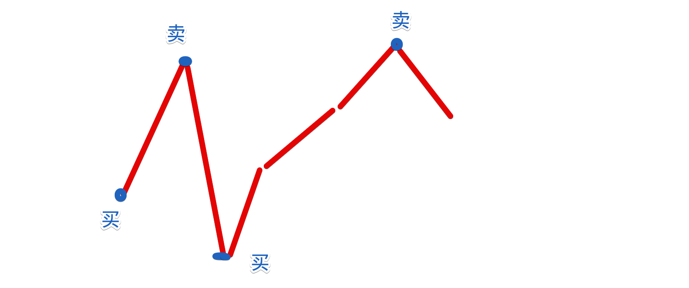

## 使用条件
::: tip
1. 最优子结构：每个问题都由较小的子问题组成，每个子问题都有一个最优解
2. 局部最优解产生全局最优解
3. 贪心算法重点步骤：搜索前先排序，排序后尽量减少无效搜索
4. 贪心算法核心：**当前最优解**

>js的sort的排序时间：O(mlogm)
:::
## 题目
### 发饼干
::: tip
* 每个孩子 i，想吃饼干大小 g[i]
* 并且每块饼干 j，都有一个尺寸 s[j]
* 如果 s[j] >= g[i]，我们可以将这个饼干 j 分配给孩子 i ，这个孩子会得到满足。求最大满足数。
```js
const g = [1,2];
const s = [1,2,3];

console.log(findContentChildren(g, s)); // 2
```

* [力扣455](https://leetcode-cn.com/problems/assign-cookies/)
:::
:::: tabs
::: tab label=暴力遍历
* 思路：分配出去一个减一个
>时间O(n^2)：6%  
>空间：5%
```js
function findContentChildren(needs, have) {
    needs.sort((a, b) => a - b);
    have.sort((a, b) => a - b);

    return needs.reduce((pre, needItem) => {
        const index = have.findIndex(haveItem => haveItem >= needItem);
        if (index !== -1) {
            have.splice(index, 1);
            pre++;
        }
        return pre;
    }, 0)
}
```
* 问题：排序以后，前面的have不满足（已经小了），那么后面的have也不会满足（因为needItem会越来越大），就是多余的判断。
:::
::: tab label=贪心优化
* 思路：排序后不满足的项就不再考虑。拿一个变量记录have的搜索位置。
>时间O(mlogm + nlogn)：90%  
>空间O(logm + logn)【主要是排序开销】：90%
```js
function findContentChildren(needs, have) {
    needs.sort((a, b) => a - b);
    have.sort((a, b) => a - b);
    let count = 0;

    // j也进行判断，并且用while最大程度加速无效搜索
    for (let i = 0, j = 0; i < needs.length && j < have.length; i++, j++) {
        while (needs[i] > have[j]) {
            j++;
        }
        if (needs[i] <= have[j]) {
            count++;
        }
    }
    return count;
}
```
:::
::::
### 找零
::: tip
* 我卖柠檬水，一杯五元，我最开始没钱
* 别人来买柠檬水，给我的钱我能否交易（钱够不够？零钱能不能找？）
* 收的钱是5，10，20
```js
const custom = [5, 5, 5, 10];
console.log(lemonadeChange(custom)); // true
```
* [力扣860](https://leetcode-cn.com/problems/lemonade-change/)
:::
:::: tabs
::: tab label=贪心思路
* 五块钱就收
* 十块找五块
* 20先找 10 + 5，再考虑 555
>时间：5.16%  
>空间：5.02%
```js
function lemonadeChange(custom) {
    let money = {
        five: 0,
        ten: 0,
        twenty: 0
    };
    return custom.every(function (item) {
        console.log(item);
        if (item === 5) {
            this.five++;
            return true;
        } else if (item === 10) {
            if (this.five) {
                this.five--;
                this.ten++;
                return true;
            }
        } else if (item === 20) {
            if (this.ten >= 1 && this.five >= 1) {
                this.ten--;
                this.five--;
                this.twenty++;
                return true;
            } else if (this.five >= 3) {
                this.five -= 3;
                this.twenty++;
                return true;
            } else {
                return false;
            }
        }
    }, money);
}
```
:::
::: tab label=贪心优化
* 这个算法不可能找20，所以不用存
>时间：97.83%  
>空间：67.57%
```js
function lemonadeChange(custom) {
    let money = [0, 0];
    return custom.every(function (item) {
        if (item === 5) {
            this[0]++;
            return true;
        } else if (item === 10) {
            if (!this[0]) {
                return false;
            }
            this[0]--;
            this[1]++;
            return true;
        } else if (item === 20) {
            if (this[1] >= 1 && this[0] >= 1) {
                this[0]--;
                this[1]--;
                return true;
            } else if (this[0] >= 3) {
                this[0] -= 3;
                return true;
            } else {
                return false;
            }
        }
    }, money);
}
```
::::
### 不重叠区间
::: tip
* 给二维数组，内部每个数组代表一个区间
* 求让所有区间不重叠的最小移除数量

```js
const intervals = [ [1,2], [2,3], [3,4], [1,3] ];

// 需要移除[1, 3]
console.log(eraseOverlapIntervals(intervals)); // 1
```
* [力扣435](https://leetcode-cn.com/problems/non-overlapping-intervals/)
:::
:::: tabs
::: tab label=贪心思路
* 【核心】用右边界进行排序，因为左边界一定小于右边界，那么右边界就能代表【左边界小 + 自身长度短】
* 排序后再按序比较左右边界看有没有重叠
>时间：95.04%  
>空间：76.80%
```js
function eraseOverlapIntervals(intervals) {
    intervals.sort((a, b) => a[1] - b[1]);
    let len = intervals.length;
    let del = 0;
    let cLeft = intervals[0];
    for (let i = 1; i < len; i++) {
        if (cLeft[1] > intervals[i][0]) {
            del++;
        } else {
            cLeft = intervals[i];
        }
    }
    return del;
}
```
:::
::::
### 引爆气球最少箭
::: tip
* 我要射穿一排气球，他的坐标以二维数组给我
* 我要射最少的箭让他们全部爆炸

```js
const points = [[1,2],[3,4],[5,6],[7,8]];

// 没有重叠区间，要射四箭
console.log(findMinArrowShots(points)); // 4
```
:::
:::: tabs
::: tab label=贪心思路
* 排序：拿右边界排序
* 算法：按序射每个气球的右边界，本气球刚好引爆，能射爆几个就射几个
```js
function findMinArrowShots(points) {

    // 用右边界排序
    points.sort((a, b) => a[1] - b[1]);

    let pointRight = -Number.MAX_VALUE;
    let ans = 0;


    for (let i = 0; i < points.length; i++) {

        // 射中了就不管，没射中就加一箭射新的右边界
        if (points[i][0] > pointRight) {
            pointRight = points[i][1];
            ans++;
        }
    }
    return ans;
}
```
:::

::::
### 合并区间
::: tip
* 给定一个二维数组区间，把所有重叠的区间进行合并
```js
const intervals = [[1,3],[2,6],[8,10],[15,18]];
console.log(merge(intervals)); //[[1,6],[8,10],[15,18]]
```
* * [力扣56](https://leetcode-cn.com/problems/merge-intervals/)
:::

:::: tabs
::: tab label=贪心思路
* 排序：左边界排序
* 思路：n的右边距 > n+1的左边距就合并
>时间：21.17%  
>空间：9.69%
```js
function merge(intervals) {
    intervals.sort((a, b) => a[0] - b[0]);
    let ans = [];
    let current = intervals[0];
    intervals.forEach(item => {
        if (current[1] >= item[0]) {
            current[1] = Math.max(current[1], item[1]);
        } else {
            ans.push(current);
            current = item;
        }
    })

    if (!ans.length || ans[ans.length - 1][1] < current[1]) {
        ans.push(current);
    }
    return ans;
}
```
:::
::::
### 跳跃问题
::: tip
* 一个正整数数组
* 每个数字代表能跳跃的步数
* 判断能否跳到最后一个位置

```js
const arr1 = [2, 3, 1, 1, 4];
console.log(canJump(arr1)); // true

const arr2 = [3, 2, 1, 0, 4];
console.log(canJump(arr2)); // false
```
* [力扣55](https://leetcode-cn.com/problems/jump-game/)
:::
:::: tabs
::: tab label=贪心思路
* 存一个jumpSize，走一步减一个，如果遇到更大的数就替换
>时间O(n)：82.97%  
>空间O(1)：82.07%
```js{9-15}
function canJump(arr) {
    let jumpSize = arr[0];
    if (jumpSize === 0 && arr.length > 1) {
        return false;
    }

    // 边界是length - 1，因为最后一位不用判断
    for (let i = 1; i < arr.length - 1; i++) {
        jumpSize--;
        if (arr[i] > jumpSize) {
            jumpSize = arr[i];
        }
        if (jumpSize <= 0) {
            return false;
        }
    }
    return true;
}

```
:::
::: tab label=贪心优化
* 可以再加一个len判断，如果本身就能达到最后，就不用遍历完了
>时间：97.26%  
>空间：77.06%
```js{16-18}
function canJump(arr) {
    let jumpSize = arr[0];
    if (jumpSize === 0 && arr.length > 1) {
        return false;
    }

    // 边界是length - 1，因为最后一位不用判断
    for (let i = 1; i < arr.length - 1; i++) {
        jumpSize--;
        if (arr[i] > jumpSize) {
            jumpSize = arr[i];
        }
        if (jumpSize <= 0) {
            return false;
        }
        if (jumpSize > arr.length - i - 1) {
            return true;
        }
    }
    return true;
}
```
:::
::::
### 跳跃游戏2
::: tip
* 正整数数组
* 最少跳跃次数到最后
* 假设一定能到最后的位置
```js
const arr = [2, 3, 1, 1, 4];
console.log(jump(arr)); // 2
```
* [力扣45](https://leetcode-cn.com/problems/jump-game-ii/)
:::
:::: tabs
::: tab label=贪心思路
* 拿一个end记录当前步数的结束位置
* 总是拿到当前可跳跃的最远位置，作为下一步的结束位置（贪）
* 每触碰到当前步数结束位置步数就+1，并更新结束位置
>时间O(n)：66.77%  
>空间O(1)：98.02%
```js
function jump(arr) {
    let maxPosition = 0;
    let end = 0;
    let step = 0;
    for (let i = 0; i < arr.length - 1; i++) {
        maxPosition = Math.max(maxPosition, i + arr[i]);
        if (i === end) {
            step++;
            end = maxPosition;
        }
    }
    return step;
}
```
:::
::: tab label=优化
* end已经超过length了就不计算了，直接返回
>时间：92.86%  
>空间：72.14%
```js{10-12}
function jump(arr) {
    let maxPosition = 0;
    let end = 0;
    let step = 0;
    for (let i = 0; i < arr.length - 1; i++) {
        maxPosition = Math.max(maxPosition, i + arr[i]);
        if (i === end) {
            step++;
            end = maxPosition;
            if (end > arr.length) {
                return step;
            }
        }
    }
    return step;
}
```
:::
::::
### 判断子序列
::: tip
* 给两个字符串
* 一个字符串是另一个字符串的子集，且出现的顺序是正确的
```js
const s = "abc";
const t = "ahbgdc";
console.log(isSubsequence(s, t)); // true
```
* [力扣392](https://leetcode-cn.com/problems/is-subsequence/)
:::
:::: tabs
::: tab label=贪心思路
* 拿一个指针记录已经到的位置，接着搜下一个。
>时间：100.00%  
>空间：92.94%
```js
function isSubsequence(child, father) {
    let cIndex = -2;
    for (let char of child) {
        let index = father.indexOf(char, cIndex + 1);
        if (index === -1) {
            return false;
        } else {
            cIndex = index;
        }
    }
    return true;
}
```
:::
::::
### 买卖股票
::: tip
* 一个数组是股票一个时间段的涨跌
* 求能获取最大的利润

```js
const prices = [7,1,5,3,6,4]
console.log(maxProfit(prices)); // 7
```
* [力扣122](https://leetcode-cn.com/problems/best-time-to-buy-and-sell-stock-ii/)
:::
:::: tabs
::: tab label=思路
* 【低点买入，高点卖出】下一个时间段涨了我就买，下一个时间段跌了我就卖


>时间：99.15%  
>空间：56.41%
```js{6-12}
function maxProfit(prices) {
    let isIn = false;
    let profits = 0;
    let cPrice = 0;
    for (let i = 0; i < prices.length; i++) {
        if (!isIn && prices[i + 1] && prices[i] < prices[i + 1]) {
            isIn = true;
            cPrice = prices[i];
        } else if (isIn &&  (!prices[i + 1] || prices[i] > prices[i + 1])) {
            isIn = false;
            profits += prices[i] - cPrice;
        }
    }
    return profits;
}
```
:::
::: tab label=思路二
* 【我是股神，所有利益我都要】差值是正值就是利润，其他不管
>时间：96.55%  
>空间：62.06%
```js{4-6}
function maxProfit(prices) {
    let profits = 0;
    for (let i = 0; i < prices.length - 1; i++) {
        if (prices[i] < prices[i + 1]) {
            profits += prices[i + 1] - prices[i];
        }
    }
    return profits;
}
```
:::
::::