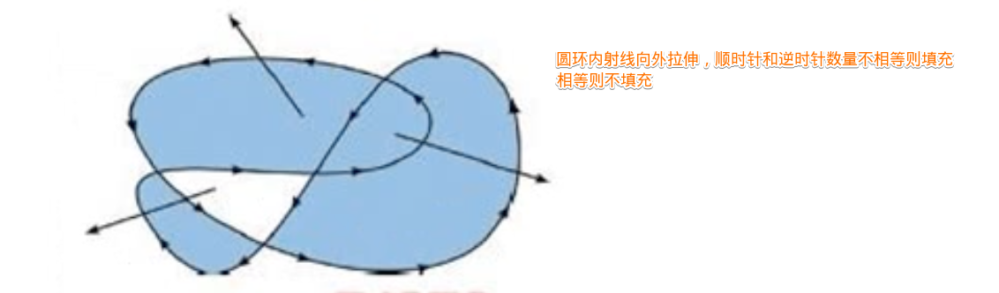
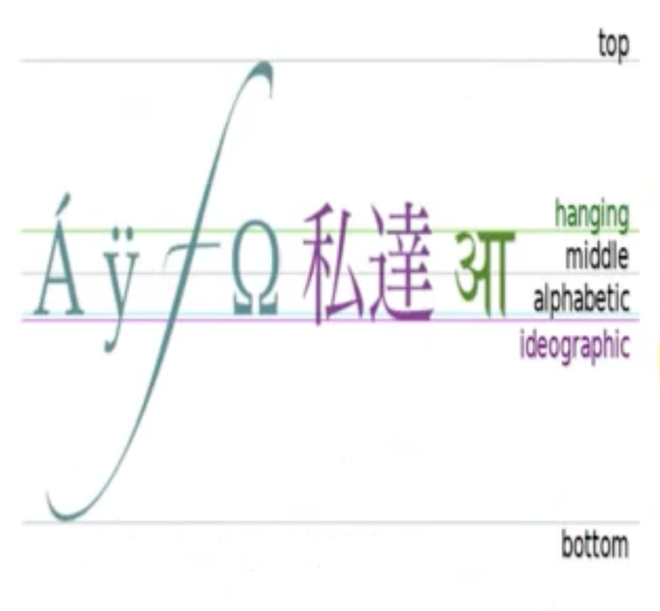

## 基础使用
:::: tabs
::: tab label=起步
* [官网](https://developer.mozilla.org/zh-CN/docs/Web/API/CanvasRenderingContext2D)
* [canvas对象](https://developer.mozilla.org/zh-CN/docs/Web/API/HTMLCanvasElement/toDataURL)
* [konva库](https://github.com/konvajs/konva)
* canvas是一块`画布`，可以用js进行绘图
* 画布要用`属性设置宽高`
```html
<canvas width="600" height="600"></canvas>
```
* 操作画图用`context`上下文
```js
// 2d
context = canvas.getContext("2d");

// 3d
context = canvas.getContext("webgl");
```
* canvas坐标系：与css盒子坐标系相同，**左上为起点**
:::
::: tab label=基础使用
```html
<body>
    <canvas id="canvas" height="1000" width="1000"></canvas>
    <script>
        const ctx = canvas.getContext('2d');

        // 定义初始位置
        ctx.moveTo(100, 100);

        // 描述绘图路径
        ctx.lineTo(200, 100);
        ctx.lineTo(100, 200);

        // 自动闭合路径
        ctx.closePath();

        // 线宽，单位:px
        // 从中间向两边平均扩散，和css盒子《不一样》
        ctx.lineWidth = 10;

        // 绘制颜色描述:css所有颜色描述都支持
        ctx.strokeStyle = 'rgba(100, 100, 100, .5)';

        // 画上页面
        ctx.stroke();

        // 设置填充颜色，填充
        ctx.fillStyle = '#3eaf7c';
        ctx.fill();
    </script>
</body>
```
:::
::: tab label=绘制表格
```html
<body>
    <canvas id="canvas" height="1000" width="1000"></canvas>
    <script>
        const ctx = canvas.getContext('2d');
        canvas.style.border = '2px solid #333';
        const rowNum = 100;
        const colNum = 100;

        // 绘制横线
        for (let i = 0; i < rowNum; i++) {
            ctx.moveTo(0, canvas.height / rowNum * i);
            ctx.lineTo(canvas.width, canvas.height / rowNum * i);
        }

        // 绘制竖线
        for (let i = 0; i < colNum; i++) {
            ctx.moveTo(canvas.width / colNum * i, 0);
            ctx.lineTo(canvas.width / colNum * i, canvas.height);
        }

        // 画上页面
        ctx.stroke();
    </script>
</body>
```
:::
::: tab label=直角坐标系
```html{30-31}
<body>
    <canvas id="canvas" height="1000" width="1000"></canvas>
    <script>
        (function () {
            const ctx = canvas.getContext('2d');
            canvas.style.border = '2px solid #333';

            // 制作直角坐标系
            // 起点：(100, 800)
            // 终点：(800, 300)
            ctx.moveTo(100, 800);
            ctx.lineTo(100, 300);
            ctx.lineTo(90, 310);
            ctx.moveTo(100, 300);
            ctx.lineTo(110, 310);

            ctx.moveTo(100, 800);
            ctx.lineTo(800, 800);
            ctx.lineTo(790, 790);
            ctx.moveTo(800, 800);
            ctx.lineTo(790, 810);

            ctx.strokeStyle = 'black';
            ctx.stroke();
        })();

        function draw(arr) {
            const ctx = canvas.getContext('2d');

            // 声明新状态，后续可以覆盖原状态
            ctx.beginPath();

            const len = arr.length;
            const max = Math.max(...arr);

            // 坐标x/y轴单位长度
            const yStep = (500 / max) * 0.8;
            const xStep = Math.floor((700 / len) * 0.8);

            ctx.moveTo(100 + xStep, 800 - arr[0] * yStep);
            for (let i = 1; i < arr.length; i++) {
                ctx.lineTo(100 + xStep * (i + 1), 800 - arr[i] * yStep);
            }
            ctx.strokeStyle = 'red';
            ctx.stroke();
        }

        const data = [1, 20, 3, 12, 5, 9, 7, 26, 53, 110, 70, 33];
        draw(data);
    </script>
</body>
```
:::
::: tab label=矩形
```html
<body>
    <canvas id="canvas" height="1000" width="1000"></canvas>
    <script>
        const ctx = canvas.getContext('2d');

        // (左上角坐标 x, 左上角坐标 y, 宽， 高)
        ctx.strokeRect(10, 100, 300, 100);

        // ctx.rect(10, 100, 300, 100);
        // ctx.stroke();
    </script>
</body>
```
```js
// 填充矩形
ctx.fillStyle = 'red';
ctx.fillRect(10, 100, 300, 100);
```
```js
// 矩形橡皮擦
ctx.clearRect(10, 100, 20, 100);
```
:::
::: tab label=fill规则

:::
::: tab label=文字
```js
ctx.fillStyle = 'blue';
ctx.font = '15px "微软雅黑"';
ctx.textBaseLine = 'bottom';
ctx.textAlign = 'center';

// 空心文字
ctx.strokeText('你好啊啊啊啊', 100, 100);

// 实体文字
ctx.fillText('你好', 100, 200);
```
* baseline设置  


:::
::: tab label=渐变
* 矩形渐变
    ```html
    <body>
        <canvas id="canvas" height="1000" width="1000"></canvas>
        <script>
            const ctx = canvas.getContext('2d');
            const grd = ctx.createLinearGradient(0, 0, 300, 0);
            grd.addColorStop(0, 'red');
            grd.addColorStop(.5, 'green');
            grd.addColorStop(1, 'blue');
            ctx.fillStyle = grd;
            ctx.fillRect(0, 0, 300, 300);
        </script>
    </body>
    ```
* 圆形渐变
    ```html
    <body>
        <canvas id="canvas" height="1000" width="1000"></canvas>
        <script>
            const ctx = canvas.getContext('2d');
            const grd = ctx.createRadialGradient(300, 300, 10, 300, 300, 200);
            grd.addColorStop(0, 'red');
            grd.addColorStop(.5, 'green');
            grd.addColorStop(1, 'blue');
            ctx.fillStyle = grd;
            ctx.fillRect(0, 0, 700, 700);
        </script>
    </body>
    ```
:::
::::
## 弧形
:::: tabs
::: tab label=基本公式
* 绘制弧形总是和圆心、弧度打交道
```js
// x轴方向开始计算，单位以弧度表示。
// 圆心x，圆心y，圆弧的半径，圆弧的起始点，圆弧的终点，是否逆时针
ctx.arc(x, y, radius, startAngle, endAngle, anticlockwise);
```
```js{3}
// 已知角度30度，求弧度
30 / radius === 180 / Math.PI
radius = 30 * Math.PI / 180;
```
```js
// 已知圆心，求圆外写文字的位置公式
// 圆心：(x0, y0)，半径：R，圆外 10px
const x = x0 + Math.cos(radius) * (R + 10);
const y = y0 + Math.sin(radius) * (R + 10);
```
```html{7}
<body>
    <canvas id="canvas" height="1000" width="1000"></canvas>
    <script>
        const ctx = canvas.getContext('2d');

        // 半圆， 2PI 为一个圆
        ctx.arc(100, 100, 100, 0, 1 * Math.PI);
        ctx.stroke();
        ctx.fillStyle = 'red';
        ctx.fill();
    </script>
</body>
```
:::
::: tab label=饼状图
* 注，每次都要注意重置起始圆心位置和重置状态以变更不同颜色
```html{11-13,18-20,22-23}
<body>
    <canvas id="canvas" height="1000" width="1000"></canvas>
    <script>
        function draw(arr) {
            const ctx = canvas.getContext('2d');
            const sum = arr.reduce((pre, item) => pre + item, 0);
            const rate = arr.map(item => item / sum);
            let start = -90 * Math.PI / 180;
            let end;
            for (let i = 0; i < rate.length; i++) {
                // 重置状态
                ctx.beginPath();
                ctx.moveTo(200, 200);
                end = start + 360 * rate[i] * Math.PI / 180;
                ctx.arc(200, 200, 100, start, end);
                const color = `#${Math.floor(Math.random() * 1000)}`
                ctx.fillStyle = color;
                // 计算文字应该在的位置
                const x = 200 + Math.cos((2 * Math.PI * rate[i]) / 2 + start) * 110;
                const y = 200 + Math.sin((2 * Math.PI * rate[i]) / 2 + start) * 110;
                ctx.font = '12px "微软雅黑"';
                // 让展示的文字不会和饼状图重叠
                ctx.textAlign = (2 * Math.PI * rate[i] / 2 + start) > Math.PI / 2 ? 'end' : 'left';
                ctx.fillText(`${(rate[i] * 100).toFixed(1)} %`, x, y);
                ctx.fill();
                // 重置下次绘制起始位置
                start = end;
            }
        }
        const data = [3, 12, 4, 8, 12];
        draw(data);
    </script>
</body>
```
:::
::: tab label=转base64
* 将canvas画布转化成base64编码的图片
```js
const url = canvas.toDataURL('image/jpeg', 1);
console.log(url);
```
:::
::::
## Konva
:::: tabs
::: tab label=拖动球
```html
<body>
    <div id="container"></div>
    <script src="https://unpkg.com/konva@8/konva.min.js"></script>
    <script>
        // first we need to create a stage
        var stage = new Konva.Stage({
            container: 'container', // id of container <div>
            width: 500,
            height: 500
        });

        // then create layer
        var layer = new Konva.Layer();

        // create our shape
        var circle = new Konva.Circle({
            x: stage.width() / 2,
            y: stage.height() / 2,
            radius: 70,
            fill: 'red',
            stroke: 'black',
            strokeWidth: 4,
            draggable: true
        });

        // add the shape to the layer
        layer.add(circle);

        // add the layer to the stage
        stage.add(layer);

        // draw the image
        layer.draw();
    </script>
</body>
```
:::
::: tab label=进度条
```html
<!DOCTYPE html>
<html lang="en">

<head>
    <meta charset="UTF-8">
    <meta http-equiv="X-UA-Compatible" content="IE=edge">
    <meta name="viewport" content="width=device-width, initial-scale=1.0">
    <title>Document</title>
</head>

<body>
    <div id="container"></div>
    <script src="./konva/index.js"></script>
    <script>
        class Progress {
            constructor(height, width) {
                this.height = height;
                this.width = width;
                this.schedule = 0;
                this.init();
            }
            init() {
                this.stage = new Konva.Stage({
                    container: 'container',
                    width: window.innerWidth,
                    height: window.innerHeight
                });

                this.layer = new Konva.Layer();

                this.out = new Konva.Rect({
                    x: this.stage.width() / 2,
                    y: this.stage.height() / 2,
                    width: this.width,
                    height: this.height,
                    stroke: 'blue',
                    strokeWidth: 4,
                    cornerRadius: this.height / 10,
                });
                this.inner = new Konva.Rect({
                    x: this.stage.width() / 2,
                    y: this.stage.height() / 2,
                    width: 0,
                    height: this.height,
                    fill: 'lightBlue',
                    cornerRadius: this.height / 10,
                });

                this.layer.add(this.inner);
                this.layer.add(this.out);

                this.stage.add(this.layer);

                // draw the image
                this.layer.draw();
            }
            pre(time) {
                if (time > 100) {
                    this.setSchedule(100);
                } else if (time < 0) {
                    this.setSchedule(0);
                } else {
                    this.setSchedule(time);
                }
            }
            setSchedule(time) {
                this.inner.to({
                    width: this.width / 100 * time,
                    duration: 0.01,
                    easing: Konva.Easings.Linear
                })
            }
        }
        const pro = new Progress(50, 500);
        let i = 0;
        setInterval(() => {
            if (i < 100) {
                i++;
                pro.pre(i);
            }
        }, 10);
    </script>
</body>

</html>
```
:::
::::