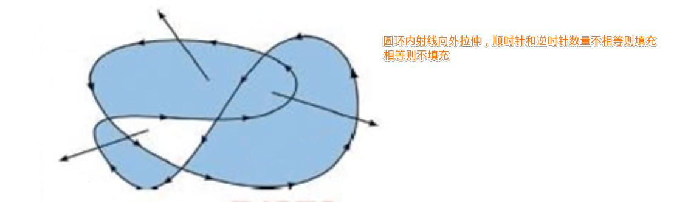

## 通用API
::: tip
|变量|作用|调用|
|---|---|---|
|beginPath|重开一个路径|beginPath()|
|closePath|将画笔以直线回到此次路径的起点|closePath()|
|stroke|将本次beginPath以后的线都`描`出来|stroke(path2D)|
|fill|将本次beginPath以后的线都`填充`出来|fill(path2D?, fillRule?)|
|clip|`剪裁掉`之前的路径以外的区域(可以通过restore恢复)|ctx.clip(path?, fillRule?)|
|clearRect|清除方块|clearRect(x, y, width, height)|
:::
### path2D
>path2D是固定一套路径，随时可以复用
::: codePen val=stroke select=[stroke,fill,clip]
```html{6-10,14}
<canvas id="canvas" width="200" height="200" style="width:200px; height: 200px;"></canvas>
<script>
    const canvas = document.querySelector("#canvas");
    const ctx = canvas.getContext("2d");

    // path2D固定路径
    const path2D = new Path2D();
    path2D.arc(100, 100, 70, 0, Math.PI * 2);
    path2D.moveTo(200, 0);
    path2D.bezierCurveTo(100, 0, 80, 70, 170, 90);

    ctx.fillStyle = "red";
    ctx.strokeStyle = "blue";
    ctx.{{val}}(path2D); // 不同的方法使用path2D操作会有不同的效果

    //
    ctx.fillStyle = "black";
    ctx.rect(0, 0, 50, 100);
    ctx.fill();
</script>
```
:::
### fill规则

### ctx.canvas
::: tip 
* ctx对象获取本canvas的反向引用
:::
```html{4,9}
<body>
    <canvas id="canvas" width="500" height="500" style="width:500px; height: 500px;"></canvas>
    <script>
        const ctx = canvas.getContext("2d");

        ctx.fillText("你好呀", 50, 50, 100);

        document.body.append(canvas);
        console.log(ctx.canvas.height); // 500
    </script>
</body>
```
### clip规则
::: tip
* 作用：以之前的图形为基准，剪切掉外部的canvas，**以后绘图都只会在之前的图形基础上绘制**
* 使用：ctx.clip(path?, fillRule?)
* path：路径
* fillRule（判断内部和外部的算法）：`evenodd` | `nonzero`
:::
::: codePen height=100
```html
<body>
    <canvas id="canvas" width="500" height="500" style="width:500px; height: 500px;"></canvas>
    <script>
        const canvas = document.querySelector("#canvas");
        const ctx = canvas.getContext("2d");

        ctx.arc(100, 100, 70, Math.PI, 0, false);
        ctx.clip(); // 将上述部分剪裁掉
        ctx.fillRect(0, 0, 100, 100); // 填充形状，被剪裁掉的无法填充
    </script>
</body>
```
:::
### save/restore
::: tip
* save通过`栈的形式`存储ctx的`状态`
* restore出栈状态
* 当前的`变换矩阵`, 当前的`剪切区域？`, 当前的`虚线列表`, `strokeStyle`, `fillStyle`, `globalAlpha`, `lineWidth`, `lineCap`, `lineJoin`, `miterLimit`, `lineDashOffset`, `shadowOffsetX`, `shadowOffsetY`, `shadowBlur`, `shadowColor`, `globalCompositeOperation`, `font`, `textAlign`, `textBaseline`, `direction`, `imageSmoothingEnabled`.
:::
::: codePen height=50
```html{7,11,16,19}
<canvas id="canvas" width="200" height="200" style="width:200px; height: 200px;"></canvas>
<script>
    const canvas = document.querySelector("#canvas");
    const ctx = canvas.getContext("2d");

    ctx.fillRect(10, 10, 20, 20);
    ctx.save();

    ctx.fillStyle = "#999999";
    ctx.fillRect(40, 10, 20, 20);
    ctx.save();

    ctx.fillStyle = "red";
    ctx.fillRect(70, 10, 20, 20);

    ctx.restore();
    ctx.fillRect(100, 10, 20, 20);

    ctx.restore();
    ctx.fillRect(130, 10, 20, 20);
</script>
```
:::
::: codePen
```html
<canvas id="canvas" width="200" height="200" style="width:200px; height: 200px;"></canvas>
<script>
    const canvas = document.querySelector("#canvas");
    const ctx = canvas.getContext("2d");

    ctx.save()
    ctx.arc(100, 100, 50, 0, 2 * Math.PI)
    ctx.clip();

    ctx.fillStyle = "red";
    ctx.fillRect(0, 0, 120, 200);

    ctx.restore();
    ctx.fillRect(125, 0, 120, 200);
</script>
```
:::
## 文字
::: tip
|变量|作用|调用|
|---|---|---|
|fillText|填充文字, 超出maxWidth会被**压缩**|fillText(text, x, y, maxWidth?)|
|strokeText|描边空心文字|strokeText(text, x, y , maxWidth?)|
|measureText|检测文字的信息|ctx.measureText("你好呀").width|
:::
::: codePen val=strokeText select=[strokeText,fillText] width=300 height=50
```html
<canvas id="canvas" width="300" height="200" style="width:300px; height: 200px;"></canvas>
<script>
    const canvas = document.querySelector("#canvas");
    const ctx = canvas.getContext("2d");
    const dpr = window.devicePixelRatio;
    canvas.style.width = canvas.width;
    canvas.style.height = canvas.height;
    canvas.width = canvas.width * dpr;
    canvas.height = canvas.height * dpr;
    ctx.scale(dpr, dpr);

    ctx.font = "30px serif";
    ctx.{{val}}("你好呀，大佬！", 30, 30, 300);
</script>
```
:::
### font
::: tip
* 设置字体`大小`和`类型`
* 值：与[css Font](https://developer.mozilla.org/zh-CN/docs/Web/CSS/font)可配置项相同

|值|必填|事项|例|
|---|---|---|---|
|font-size|必填||20px|
|font-family|必填|**必须最后指定**|通用字体：`serif`/`sans-serif`/`monospace`/`cursive`/`fantasy`/`system-ui`/`math`/`emoji`/`fangsong`|
|font-style|非|必须在 font-size 之前|`normal` / `italic` / `oblique 10deg` |
|font-variant|非|必须在 font-size 之前|`normal` / `none` |
|font-weight|非|必须在 font-size 之前，`1~1000`|`normal` / `bold` / `700` |
|line-height|非|必须在 font-size 之后，数字 / 长度 / 百分比 / `normal`|`normal` / `1.5` / `30px` / `150%` |

:::
```html
<body>
    <canvas id="canvas" width="500" height="500" style="width:500px; height: 500px;"></canvas>
    <script>
        const canvas = document.getElementById("canvas");
        const ctx = canvas.getContext("2d");

        ctx.font = "oblique 30deg 20px serif";
        ctx.fillText("你好呀", 30, 30);

        document.body.append(canvas);
    </script>
</body>
```
### direction
::: tip
* 设置`文字`左右方向
* 值：`ltr` | `rtl` | `inherit`
:::
```html{11}
<body>
    <canvas id="canvas" width="500" height="500" style="width:500px; height: 500px;"></canvas>
    <script>
        const ctx = canvas.getContext("2d");

        //  默认从左往右
        ctx.font = '48px serif';
        ctx.fillText('Hi, Toney!', 250, 40);

        // 修改从右往左
        ctx.direction = 'rtl';
        ctx.fillText('Hi, Toney!', 250, 40);

        document.body.append(canvas);
    </script>
</body>
```
### textBaseLine
* 文字对齐方式
```js
ctx.textBaseLine = 'center';
```


::: codePen height=150 val=center select=[top,hanging,middle,alphabetic,ideographic,bottom]
```html
<body>
    <canvas id="canvas" width="500" height="500" style="width:500px; height: 500px;"></canvas>
    <script>
        const canvas = document.querySelector("#canvas");
        const ctx = canvas.getContext("2d");
        const dpr = window.devicePixelRatio;
        canvas.style.width = canvas.width;
        canvas.style.height = canvas.height;
        canvas.width = canvas.width * dpr;
        canvas.height = canvas.height * dpr;
        ctx.scale(dpr, dpr);

        ctx.moveTo(10, 25);
        ctx.lineTo(100, 25);
        ctx.stroke();
        ctx.moveTo(10, 55);
        ctx.lineTo(100, 55);
        ctx.stroke();
        ctx.moveTo(10, 40);
        ctx.lineTo(100, 40);
        ctx.stroke();
        ctx.font = "30px emoji";
        ctx.textBaseline = "{{val}}";
        
        ctx.fillText("你好呀", 100, 40);
    </script>
</body>
```
:::
### textAlign
::: codePen label=textAlign val=center select=[center,left,right,start,end] height=100
```html{16}
<body>
    <canvas id="canvas" width="500" height="500" style="width:500px; height: 500px;"></canvas>
    <script>
        const canvas = document.querySelector("#canvas");
        const ctx = canvas.getContext("2d");
        const dpr = window.devicePixelRatio;
        canvas.style.width = canvas.width;
        canvas.style.height = canvas.height;
        canvas.width = canvas.width * dpr;
        canvas.height = canvas.height * dpr;
        ctx.scale(dpr, dpr);

        ctx.moveTo(100, 0);
        ctx.lineTo(100, 100);
        ctx.stroke();
        ctx.font = "30px emoji";
        ctx.textAlign = "{{val}}";
        ctx.fillText("你好呀", 100, 30);
    </script>
</body>
```
:::
## 线
::: tip 常用属性
|变量|作用|调用|
|---|---|---|
|moveTo|移动到XX|moveTo(x, y)|
|lineTo|连接到XX，（并没有绘制）|lineTo(x, y)|
|getLineDash|获取当前线段（虚线）样式|fillText(text, x, y, maxWidth?)|
|setLineDash|描粗体文字|setLineDash([4, 4, 10, 10])|
:::
### lineCap
::: tip
* 线段末端的属性

|值|效果|
|---|---|
|butt|线段末端以方形结束|
|round|线段末端以圆形结束|
|square|线段末端以方形结束，增加了一个宽度和线段相同，高度是线段厚度一半的矩形区域|
:::
::: codePen label=lineCap val=round select=[round,bott,square]
```html
<canvas id="canvas100" width="500" height="500" style="width:500px; height: 500px;"></canvas>
<style>
    canvas {
        background-color: rgb(180, 236, 147);
    }
</style>
<script>
    const canvas = document.getElementById("canvas100");
    const ctx = canvas.getContext("2d");

    ctx.beginPath();
    ctx.moveTo(10, 10);
    ctx.lineTo(100, 100);
    ctx.lineWidth = 15;
    ctx.lineCap = "{{val}}";

    ctx.stroke();
</script>
```
:::
### lineDashOffset
::: tip
* 虚线偏移量
:::

::: codePen label=lineDashOffset val=2 type=number height=151
```html
<body>
    <canvas id="dashCanvas" width="500" height="500" style="width:500px; height: 500px;"></canvas>
    <script>
        const canvas = document.querySelector("#dashCanvas");
        const ctx = canvas.getContext("2d");

        ctx.setLineDash([4, 16]);
        ctx.lineDashOffset = {{val}};

        ctx.beginPath();
        ctx.moveTo(0, 50);
        ctx.lineTo(400, 50);
        ctx.stroke();

        ctx.setLineDash([0, 0]);
        ctx.beginPath();
        ctx.moveTo(10, 10);
        ctx.lineTo(100, 100);
        ctx.lineWidth = 15;
        ctx.lineCap = "round";

        ctx.stroke();
    </script>
</body>
```
:::
* 蚂蚁线
::: codePen label=timer val=10 type=number height=170
```html
<body>
    <canvas id="dashCanvas" width="500" height="500" style="width:500px; height: 500px;"></canvas>
    <script>
        const canvas = document.querySelector("#dashCanvas");
        const ctx = canvas.getContext("2d");

        ctx.setLineDash([5, 10]);
        let offset = 0;
        const stashLine = (x, y) => {
            ctx.clearRect(0, 0, canvas.width, canvas.height);
            offset++;
            ctx.lineDashOffset = offset;
            ctx.beginPath();
            ctx.moveTo(x, y);
            ctx.lineTo(x + 100, y);
            ctx.lineTo(x + 100, y + 100);
            ctx.lineTo(x, y + 100);
            ctx.lineTo(x, y);
            ctx.stroke();
            setTimeout(() => stashLine(x, y), {{val}});
        }
        stashLine(10, 10);
    </script>
</body>
```
:::
:::: tabs
::: tab label=lineDashOffset
```html{8,10}
<body>
    <canvas id="dashCanvas" width="500" height="500" style="width:500px; height: 500px;"></canvas>
    <script>
        const canvas = document.querySelector("#dashCanvas");
        const ctx = canvas.getContext("2d");

        // 设置虚线 实线4-虚线16
        ctx.setLineDash([4, 16]);
        // 向前偏移
        ctx.lineDashOffset = 2;

        ctx.beginPath();
        ctx.moveTo(0, 50);
        ctx.lineTo(400, 50);
        ctx.stroke();

        // 重置虚线配置
        ctx.setLineDash([0, 0]);
        ctx.beginPath();
        ctx.moveTo(10, 10);
        ctx.lineTo(100, 100);
        ctx.lineWidth = 15;
        ctx.lineCap = "round";

        ctx.stroke();
    </script>
</body>
```
:::
::: tab label=蚂蚁线
```html{11,12}
<body>
    <canvas id="dashCanvas" width="500" height="500" style="width:500px; height: 500px;"></canvas>
    <script>
        const canvas = document.querySelector("#dashCanvas");
        const ctx = canvas.getContext("2d");

        ctx.setLineDash([5, 10]);
        let offset = 0;
        const stashLine = (x, y) => {
            ctx.clearRect(0, 0, canvas.width, canvas.height);
            offset++;
            ctx.lineDashOffset = offset;
            ctx.beginPath();
            ctx.moveTo(x, y);
            ctx.lineTo(x + 100, y);
            ctx.lineTo(x + 100, y + 100);
            ctx.lineTo(x, y + 100);
            ctx.lineTo(x, y);
            ctx.stroke();
            setTimeout(() => stashLine(x, y), 10);
        }
        stashLine(10, 10);
    </script>
</body>
```
:::
::::
### lineJoin
::: tip
* 同一条线转弯位置的连接方式
* 可选值：`bevel`,`round`,`miter`
:::
::: codePen height=130 label=lineJoin val=bevel select=[bevel,round,miter]
```html{12}
<body>
    <canvas id="dashCanvas" width="500" height="500" style="width:500px; height: 500px;"></canvas>
    <script>
        const canvas = document.querySelector("#dashCanvas");
        const ctx = canvas.getContext("2d");

        ctx.lineWidth = 20;
        ctx.beginPath();
        ctx.moveTo(10, 10);
        ctx.lineTo(50, 50);

        ctx.lineJoin = "{{val}}";

        ctx.lineTo(100, 10);
        ctx.stroke();
    </script>
</body>
```
:::
### lineWidth
::: tip
* 线宽
:::
```js
ctx.lineWidth = 7;
```
### bezierCurveTo
::: tip
* 重要：贝塞尔曲线
* ctx.bezierCurveTo(cp1x, cp1y, cp2x, cp2y, x, y)
* 参照点两个，一个结束点
:::
::: codePen height=100
```html
<body style="overflow:hidden;">
    <canvas id="canvas" width="500" height="500" style="width:500px; height: 500px;"></canvas>
    <script>
        const canvas = document.querySelector("#canvas");
        const ctx = canvas.getContext("2d");

        ctx.beginPath();
        ctx.moveTo(100, 100);
        ctx.bezierCurveTo(100, 0, 10, 30, 10, 90);
        ctx.stroke();

        ctx.fillRect(100, 0, 2, 2);
        ctx.fillRect(10, 30, 2, 2);
    </script>
</body>
```
:::
### quadraticCurveTo
::: tip
* 二次贝塞尔曲线
* quadraticCurveTo(cpx, cpy, x, y)
* 参照点坐标，终点坐标
:::
::: codePen height=120
```html
<canvas id="canvas" width="200" height="200" style="width:200px; height: 200px;"></canvas>
<script>
    const canvas = document.querySelector("#canvas");
    const ctx = canvas.getContext("2d");
    ctx.moveTo(0, 0);
    ctx.quadraticCurveTo(50, 100, 100, 0);
    ctx.stroke();
    ctx.fillRect(50, 100, 2, 2)
</script>
```
:::
## 形状
::: tip
|变量|作用|调用|
|---|---|---|
|rect|I 创建矩形路径|rect(x, y, width, height)|
|fillRect|填充一个方块|fillRect(x, y, width, height)|
|strokeRect|描绘一个方块|strokeRect(x, y, width, height)|
:::
### strokeStyle/fillStyle
::: tip
* strokeStyle：画笔（`边框`/`线条`）的颜色、样式
* fillStyle/描述即将渲染的图形（`内部`）的颜色和样式
* 值： `color` | `ctx.createLinearGradient`对象 | `ctx.createPattern`对象
:::
::: codePen height=100
```html
<canvas id="c1" width="500" height="500" style="width:500px; height: 500px;"></canvas>
<script>
    const canvas = document.querySelector("#c1");
    const ctx = canvas.getContext("2d");

    ctx.fillStyle = "#333";
    ctx.fillRect(10, 5, 30, 30);

    ctx.fillStyle = "#879900";
    ctx.fillRect(10, 40, 30, 30);

    ctx.strokeStyle = "red";
    ctx.strokeRect(10, 40, 31, 31);
</script>
```
:::
:::: tabs
::: tab label=fillStyle
```html{6,9,12,15-18}
<body>
    <canvas id="canvas" width="500" height="500" style="width:500px; height: 500px;"></canvas>
    <script>
        const ctx = canvas.getContext("2d");

        ctx.fillStyle = "red";
        ctx.fillRect(10, 10, 30, 30);

        ctx.fillStyle = "#879900";
        ctx.fillRect(10, 40, 30, 30);

        ctx.fillStyle = "rgba(255,130,130,0.3)";
        ctx.fillRect(10, 70, 30, 30);

        const gradient = ctx.createLinearGradient(10, 100, 10, 130);
        gradient.addColorStop(0, "blue");
        gradient.addColorStop(1, "#fff");
        ctx.fillStyle = gradient;
        ctx.fillRect(10, 100, 30, 30);

        document.body.append(canvas);
    </script>
</body>
```
:::
::: tab label=strokeStyle
```html
<body>
    <canvas id="canvas" width="500" height="500" style="width:500px; height: 500px;"></canvas>
    <script>
        const ctx = canvas.getContext("2d");

        ctx.fillStyle = "#333";
        ctx.fillRect(10, 5, 30, 30);

        ctx.fillStyle = "#879900";
        ctx.fillRect(10, 40, 30, 30);

        ctx.strokeStyle = "red";
        ctx.strokeRect(10, 40, 31, 31)

        document.body.append(canvas);
    </script>
</body>
```
:::
::::
### filter
::: tip
* 模糊、灰度等过滤效果
* 值：`url(<url>)` | `blur(<length>)` | `brightness(<percentage>)` | `contrast(<percentage>)` | `drop-shadow(<offset-x>, <offset-y>, <blur-radius>, <spread-radius>, <color>)`
:::
### globalAlpha
::: tip
* 全局的`形状`和`图片`的透明度
:::
```html{7}
<body>
    <canvas id="canvas" width="500" height="500" style="width:500px; height: 500px;"></canvas>
    <script>
        const canvas = document.getElementById("canvas");
        const ctx = canvas.getContext("2d");

        ctx.globalAlpha = "0.3";

        ctx.fillStyle = "red";
        ctx.fillRect(10, 10, 100, 100);

        ctx.fillStyle = "blue";
        ctx.fillRect(60, 60, 100, 100);
    </script>
</body>
```
### globalCompositeOperation
::: tip
* 重叠图形的混合配置

|值|效果|
|---|---|
|destination-atop|`当前已存在的图形只有和新的图形重叠`才可以展现，并且居上|
|source-atop|只能在`当前已存在的图形上绘制`的是可展现的部分|
|source-over|后来居上|
|destination-over|先来居上|
|source-in|透明所有图形，`新建图形与当前已存在图形重叠`才会展示|
|source-out|透明所有图形，`新建图形与当前已存在图形不重叠`才会展示|
|destination-in|`已存在图形与新建图形重叠`才会展示并居上|
|destination-out|`已存在图形与新建图形不重叠`才会展示并居上|
|lighter|高亮重叠部分|
|copy|将现有的图形全部删掉，新建图形|
|xor|重叠部分全部透明|
|multiply|重叠部分重新计算复合颜色|

:::

::: codePen label=globalCompositeOperation val=destination-atop height=300 select=[destination-atop,source-atop,source-over,destination-over,source-in,source-out,destination-in,destination-out,lighter,copy,xor,multiply,screen,overlay,darken,lighten,color-dodge,color-burn,hard-light,soft-light,difference,exclusion,hue,saturation,color,luminosity]
```html
<canvas id="canvas100" width="500" height="500" style="width:500px; height: 500px;"></canvas>
<style>
    canvas {
        background-color: rgb(180, 236, 147);
    }
</style>
<script>
    const canvas = document.getElementById("canvas100");
    const ctx = canvas.getContext("2d");

    ctx.fillStyle = "blue";
    ctx.fillRect(10, 10, 100, 100);

    ctx.fillStyle = "blue";
    ctx.fillRect(120, 10, 100, 100);

    ctx.globalCompositeOperation = "{{val}}";

    ctx.fillStyle = "red";
    ctx.fillRect(50, 90, 100, 100);
</script>
```
:::

:::: tabs
::: tab label=source-atop
```html{19}
<body>
    <canvas id="canvas" width="500" height="500" style="width:500px; height: 500px;"></canvas>
    <style>
        body {
            background-color: rgb(180, 236, 147);
        }
    </style>
    <script>
        const canvas = document.getElementById("canvas");
        const ctx = canvas.getContext("2d");


        ctx.fillStyle = "blue";
        ctx.fillRect(10, 10, 100, 100);

        ctx.fillStyle = "blue";
        ctx.fillRect(130, 10, 100, 100);

        ctx.globalCompositeOperation = "source-atop";

        ctx.fillStyle = "red";
        ctx.fillRect(50, 90, 100, 100);
    </script>
</body>
```
:::
::: tab label=destination-atop
```html
<body>
    <canvas id="canvas" width="500" height="500" style="width:500px; height: 500px;"></canvas>
    <style>
        body {
            background-color: rgb(180, 236, 147);
        }
    </style>
    <script>
        const canvas = document.getElementById("canvas");
        const ctx = canvas.getContext("2d");

        ctx.fillStyle = "blue";
        ctx.fillRect(10, 10, 100, 100);

        ctx.fillStyle = "blue";
        ctx.fillRect(130, 10, 100, 100);

        ctx.globalCompositeOperation = "destination-atop";

        ctx.fillStyle = "red";
        ctx.fillRect(50, 90, 100, 100);
    </script>
</body>
```
:::
::::
## shadow
::: tip
|属性|作用|值|例|
|---|---|---|---|
|shadowBlur|阴影范围|数字|10|
|shadowColor|阴影颜色|String|"#333333"|
|shadowOffsetX|阴影x轴偏移量|Number|10|
|shadowOffsetY|阴影Y轴偏移量|Number|10|

:::
::: codePen height=170
```html
<body>
    <canvas id="dashCanvas" width="500" height="500" style="width:500px; height: 500px;"></canvas>
    <script>
        const canvas = document.querySelector("#dashCanvas");
        const ctx = canvas.getContext("2d");

        ctx.shadowColor = "red";
        ctx.shadowBlur = 30;
        ctx.fillStyle = "#333"
        ctx.fillRect(50, 30, 200, 100)
    </script>
</body>
```
:::
## 圆
### arc
::: tip
* 绘制圆弧`形状`
* ctx.arc(x, y, `radius`, `startAngle`, `endAngle`, `anticlockwise`);
* `anticlockwise`: 逆时针，默认为false
:::
::: codePen height=100
```html{13}
<body>
    <canvas id="canvas" width="500" height="500" style="width:500px; height: 500px;"></canvas>
    <script>
        const canvas = document.querySelector("#canvas");
        const ctx = canvas.getContext("2d");
        const dpr = window.devicePixelRatio;
        canvas.style.width = canvas.width;
        canvas.style.height = canvas.height;
        canvas.width = canvas.width * dpr;
        canvas.height = canvas.height * dpr;
        ctx.scale(dpr, dpr);

        ctx.arc(100, 100, 50, Math.PI, 0, false);
        ctx.stroke();
    </script>
</body>
```
:::
### arcTo
::: tip
* ctx.arcTo(x1, y1, x2, y2, radius);
* 需要先到一个点，然后根据arcTo传的两个点做出来一个角，然后从初始点到这个角的切线
:::
::: codePen height=130
```html
<body>
    <canvas id="canvas" width="500" height="500" style="width:500px; height: 500px;"></canvas>
    <script>
        const canvas = document.querySelector("#canvas");
        const ctx = canvas.getContext("2d");

        ctx.beginPath();
        ctx.moveTo(100, 100);
        ctx.arcTo(100, 0, 0, 0, 100); // 直角切线，半径100
        ctx.stroke();

        // 画出直角
        ctx.beginPath();
        ctx.moveTo(0, 0);
        ctx.lineTo(100, 0);
        ctx.lineTo(100, 100);
        ctx.setLineDash([4, 4]);
        ctx.stroke();
    </script>
</body>
```
:::
### ellipse
::: tip
* 椭圆：ellipse(x, y, radiusX, radiusY, rotation, startAngle, endAngle, anticlockwise)
* x, y：圆心
* rotation: 旋转角度，**顺时针旋转**
* startAngle, endAngle：开始结束角度，**顺时针计算**
* anticlockwise：是否逆时针，默认false
:::
>定完 startAngle, endAngle就已经确定起始和结束位置了
::: codePen label=anticlockwise val=true select=[true,false]
```html 
<canvas id="canvas" width="1000" height="1000" style="width:1000px; height: 1000px;"></canvas>
<script>
    const canvas = document.querySelector("#canvas");
    const ctx = canvas.getContext("2d");
    ctx.ellipse(100, 100, 40, 20, 45/180 * Math.PI, 0, 1 / 3 * Math.PI, {{val}});
    ctx.stroke();
</script>
```
:::
## 颜色
### addColorStop
::: tip
* 渐变颜色的填充器
* 调用：`gradient.addColorStop(0.3, "blue")`
:::
### createConicGradient
::: tip
* 作用：围绕某个点做圆状渐变
* 调用：ctx.createConicGradient(`startAngle`, `x`, `y`)
* 返回：圆状渐变`制作器`
* 制作渐变：gradient.addColorStop(0～1, color)
* 通过`fillStyle`将渐变制作器加上。
:::
::: codePen height=250
```html{8-12}
<body>
    <canvas id="canvas" width="500" height="500" style="width:500px; height: 500px;"></canvas>

    <script>
        const canvas = document.querySelector("#canvas");
        const ctx = canvas.getContext("2d");

        const gradient = ctx.createConicGradient(0, 120, 120);
        gradient.addColorStop(0, "red");
        gradient.addColorStop(0.5, "blue");
        gradient.addColorStop(1, "red");
        ctx.fillStyle = gradient;
        ctx.arc(120, 120, 100, 0, 2 * Math.PI);
        ctx.fill();
    </script>
</body>
```
:::
### createLinearGradient
::: codePen height=120
```html
<canvas id="canvas" width="200" height="200" style="width:200px; height: 200px;"></canvas>

<script>
    const canvas = document.querySelector("#canvas");
    const ctx = canvas.getContext("2d");

    const gradient = ctx.createLinearGradient(10, 0, 100, 100);
    gradient.addColorStop(0, "red");
    gradient.addColorStop(0.3, "blue");
    gradient.addColorStop(1, "pink");
    ctx.fillStyle = gradient;
    ctx.fillRect(10, 10, 100, 100);
</script>
```
:::
### createRadialGradient
::: codePen height=210
```html
<body>
    <canvas id="canvas" width="200" height="200" style="width:200px; height: 200px;"></canvas>

    <script>
        const canvas = document.querySelector("#canvas");
        const ctx = canvas.getContext("2d");


        let stopR = new Proxy({ val: 80 }, {
            set(t, k, v) {
                ctx.clearRect(0, 0, 200, 200);
                const gradient = ctx.createRadialGradient(100, 100, 100, 100, 100, v);
                gradient.addColorStop(0, "#fff");
                gradient.addColorStop(1, "#a2d5ec");
                ctx.fillStyle = gradient;
                ctx.arc(100, 100, 100, 0, 2 * Math.PI);
                ctx.fill();
                Reflect.set(t, k, v);
            }
        })
        const animate = () => {
            stopR.val = stopR.val > 80 ? 0 : stopR.val + 3;
            setTimeout(animate, 100)
        }
        animate();
    </script>
</body>
```
:::
## 图片
### 增删改

::: tip
|api|调用|说明|
|---|---|---|
|drawImage|`img.onload = () => ctx.drawImage(img, x, y, width, height)`|**需要已加载完毕的图片才能绘制**|
|createImageData|`createImageData(width, height)`｜`imagedata`|都是指定为透明黑，只不过使用`imagedata`会创造相同的像素的透明黑初始图片|
|getImageData|getImageData(`left`, `top`, `width`, `height`)|获取canvas指定区域的像素作为图片对象|
|putImageData|putImageData(myImageData, dx, dy)|将指定Image对象以像素的形式写入|
:::
>点击图片反转颜色
::: codePen
```html{11,13,20}
<body>
    <canvas id="canvas" width="200" height="200" style="width:200px; height: 200px;"></canvas>

    <script>
        const canvas = document.querySelector("#canvas");
        const ctx = canvas.getContext("2d");
        canvas.width = 1000;
        canvas.height = 1000;
        const img = new Image();
        img.src = "/assets/img/portrait.jpg";
        img.onload = () => ctx.drawImage(img, 0, 0);
        const reverse = () => {
            const imgData = ctx.getImageData(0, 0, 1000, 1000);
            const data = imgData.data;
            for (let i = 0; i < data.length; i += 4) {
                data[i] = 255 - data[i];
                data[i + 1] = 255 - data[i + 1];
                data[i + 2] = 255 - data[i + 2];
            }
            ctx.putImageData(imgData, 0, 0)
        }
        canvas.addEventListener("click", reverse)
    </script>
</body>
```
:::
### getImageData
::: tip
* 作用：获取canvas画布的像素对象
* 调用：getImageData(`left`, `top`, `width`, `height`)
* [图片取色器](https://coderhdy.github.io/h5-demo/#canvas%E5%8F%96%E8%89%B2/index.html)
:::
::: codePen width=400 height=400
```html{11,13,20}
<body>
  <canvas width="300px" height="300px" id="canvas"></canvas>
  
  <h4>移动取色，点击固定色：<span id="span"></span></h4>

    <script>
      const canvas = document.querySelector("canvas");
      const ctx = canvas.getContext("2d");
      const setColor = (e) => {
          const {x, y} = e;
          const {data: rgba} = ctx.getImageData(x, y, 1, 1);
          if (rgba) {
            const color = `rgba(${rgba[0]}, ${rgba[1]}, ${rgba[2]}, ${rgba[3]})`
            canvas.style.backgroundColor = color;
            span.innerText = color;
          }
      };
      canvas.addEventListener("mousemove", setColor);
      canvas.addEventListener("click", () => canvas.removeEventListener("mousemove", setColor));
      img.onload = () => ctx.drawImage(img, 50, 50, 200, 200);
    </script>
</body>
```
:::
### toDataURL
::: tip
* 导出canvas为图像，**可以用来下载**
* 调用：canvas.toDataURL("image/png", 1)
* 第二个参数为图片质量，默认`0.92`
:::
::: codePen height=250 width=310
```html{36-44}
<body>
    <canvas id="canvas" width="300" height="200" style="width:300px; height: 200px;border: 1px solid #333"></canvas>
    <button id="btn">下载</button>
    <script>
        const canvas = document.querySelector("#canvas");
        const ctx = canvas.getContext("2d");
        const dpr = window.devicePixelRatio;
        canvas.width *= dpr;
        canvas.height *= dpr;
        ctx.scale(dpr, dpr);

        ctx.lineWidth = 3;
        const rect = canvas.getBoundingClientRect();
        let drawing = new Proxy({ val: false }, {
            set(target, k, v) {
                if (v === true) ctx.beginPath();
                Reflect.set(target, k, v);
            }
        });
        canvas.addEventListener("mousedown", e => drawing.val = true);
        canvas.addEventListener("touchstart", e => drawing.val = true);
        canvas.addEventListener("mousemove", e => {
            if (!drawing.val) return;
            ctx.lineTo(e.x - rect.x, e.y - rect.y);
            ctx.stroke();
        })
        canvas.addEventListener("touchmove", e => {
            e.preventDefault();
            if (!drawing.val) return;
            ctx.lineTo(e.targetTouches[0].clientX - rect.x, e.targetTouches[0].clientY - rect.y);
            ctx.stroke();
        })
        canvas.addEventListener("mouseup", e => drawing.val = false);
        canvas.addEventListener("touchend", e => drawing.val = false);

        btn.addEventListener("click", () => {
            const url = canvas.toDataURL("image/png");
            const a = document.createElement("a");
            a.href = url;
            a.download = "img.png"; // 下载文件名
            document.body.append(a);
            a.click();
            a.remove();
            ctx.clearRect(0, 0, 300, 200);
        })
    </script>
</body>
```
:::
## 变换
::: tip
|变量|作用|调用|
|---|---|---|
|getTransform|获取当前被应用到上下文的转换矩阵|getTransform()|
|setTransform|重新设置变换矩阵并调用变换的方法|setTransform(a, b, c, d, e, f)|
|resetTransform|重新设置当前变形|setTransform(a, b, c, d, e, f)|
|transform|多次叠加当前变换|transform(a, b, c, d, e, f)|
|translate|canvas平移变换|translate(x, y)|
|rotate|旋转|rotate(angle)|
:::
### rotate
>旋转中心是canvas起始点，可以通过 translate() 方法移动 canvas。
::: codePen height=100
```html
<canvas id="canvas" width="200" height="200" style="width:200px; height: 200px;"></canvas>
<script>
    const canvas = document.querySelector("#canvas");
    const ctx = canvas.getContext("2d");

    ctx.rotate(45 / 180 * Math.PI);
    ctx.fillRect(50, 10, 20, 20);
</script>
```
:::
::: codePen
```html{18,20-24,28-29}
<body>
    <canvas id="canvas"></canvas>
    <script>
        const canvas = document.querySelector("#canvas");
        canvas.setAttribute("style", "width: 100vw; height: 100vh");
        const { innerWidth, innerHeight, devicePixelRatio: dpr } = window;

        canvas.width = innerWidth * dpr;
        canvas.height = innerHeight * dpr;


        const ctx = canvas.getContext("2d");
        ctx.scale(dpr, dpr);

        const xOffset = 100;
        const yOffset = 75;

        ctx.save();

        // 画布旋转圆心总是 ctx 左上角，所以移动圆心就要移动 ctx
        // 将圆心从左上角移动到指定位置，再把 ctx 拉回来绘画
        ctx.translate(xOffset, yOffset);
        ctx.rotate(15 * Math.PI / 180);
        ctx.translate(-xOffset, -yOffset);
        ctx.fillStyle = "#000000";
        ctx.fillRect(50, 50, 100, 50);

        // 恢复到初始ctx状态
        ctx.restore();

        ctx.fillStyle = "#000000";
        ctx.fillRect(50, 130, 100, 50);
    </script>
</body>
``
:::
## setTransform
* 将整个canvas画板进行变换
```js
// 水平缩放，垂直倾斜，水平倾斜，垂直缩放，水平移动，垂直移动
ctx.setTransform(a, b, c, d, e, f);
```
## 其他
::: tip
|变量|作用|调用|
|---|---|---|
|isPointInPath|检测当前路径中是否包含检测点|isPointInPath(path?, x, y, fillRule?)|
|isPointInStroke|检测当前描边线中是否包含检测点|resetTransform()|
:::
