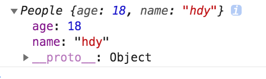
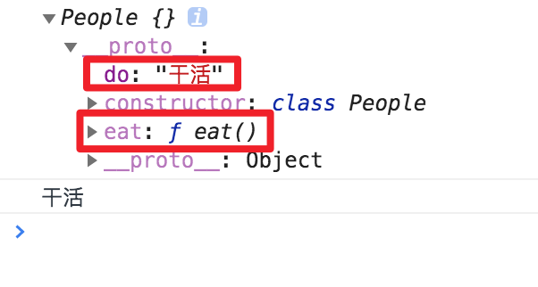
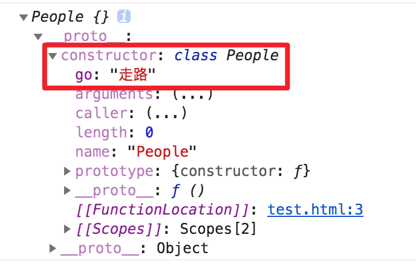
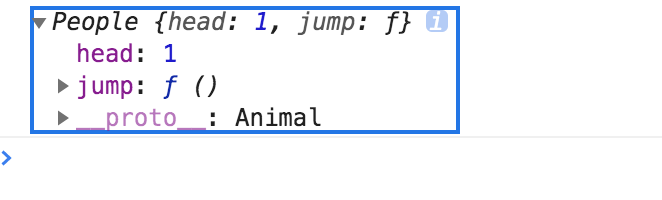
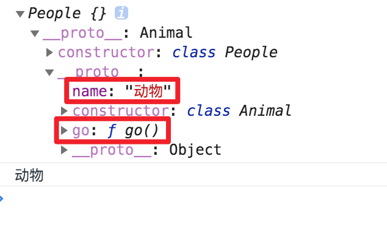

## 声明
::: warning 没有变量提升
* 普通function可以调用后声明，因为有变量提升
* class没有变量提升机制，不可以先调用后声明
:::
* function的变量提升
```js
fn(); // ---

function fn() {console.log('---')}
```
* class无变量提升
```js
const p = new People(); // error

class People {}
```

## 继承
::: tip
* 继承的class在constructor内要要使用this，需要先调用super
* 类的继承的本质是super调用父类constructor创造this给子类，再把子类和父类的prototype通过_ _ _proto_ _ _连起来
:::
::::tabs
::: tab label=super
* constructor内要使用继承，需要先调用super
```js
class A {}
class B extends A {
    constructor() {
        // super()
        this.name = 'b'; // 报错，要使用this先调用super
    }
}

const b = new B();
```
:::
::: tab label=函数仿写类继承
* class本身就是function的一个子集
* 类的继承的本质是super调用父类创造this，再把子类和父类的prototype通过_ _ _proto_ _ _连起来,就可以通过函数来构造继承类
```js{12,16}
function Father() {
    if (!(this instanceof Father)) {
        throw Error('只能用new调用类');
    }
    console.log('father调用')
    this.name = 'hdy';
}
function Child() {
    if (!(this instanceof Child)) {
        throw Error('只能用new调用类');
    }
    Father.call(this);
    console.log('child调用')
    this.name = '张三';
}
Object.setPrototypeOf(Child.prototype, Father.prototype);

const a = new Child(); // father调用 child调用
console.log(a); // {name: '张三'}
```
:::
::: tab label=多个继承
* JS中一个类只能继承一个超类
* 如果要同时继承多个，可以用mixin函数仿写出效果
```js
class A {
    name = 'hdy';
}
function mixin(superClass) {
    return class extends superClass {
        age = 18;
    }
}
```
* 现在就可以通过调用mixin函数一次性继承A类和mixin返回的匿名类
```js
class B extends mixin(A) {
    height = 180;
}
const b = new B();
console.log(Object.keys(b)); // ['name', 'age', 'height']
```
:::
::::
## 实体属性
::: tip 两种绑定方法
1. 类内用 = 号赋值
2. constructor内声明到this
:::

:::: tabs
::: tab label=等于号赋值
```js
class A {
    eat = '吃属性';
    go = function() {
        console.log('走方法')
    }
}

const a = new A();
console.log(Object.keys(a)); // ['eat', 'go']
```
:::
::: tab label=constructor声明
```js
class A {
    constructor() {
        this.eat = '吃';
        this.go = () => console.log('走');
    }
}

const a = new A();
console.log(Object.keys(a)); // ['eat', 'go']
```
:::
::::

## 实体方法
::: tip 实体方法
* 实体方法可以类内=号定义
* 也可以constructor内绑定
:::
:::: tabs 
::: tab label=定义方式
```js{2-4,6}
class A {
    go = function() {
        console.log('走路');
    }
    constructor() {
        this.say = () => console.log('说话');
    }
}

const a = new A();
console.log(Object.keys(a)); // ['go', 'say']
```
:::
::: tab label=原型方法生成绑定this的实例方法
* 实例方法要生成绑定好的this可以用bind方法构造
* React组件经常用到此方法绑定this
```js{7,12}
class A {
    go() {
        console.log(Object.keys(this));
    }
    constructor(name) {
        this.name = name;
        this.go = this.go.bind(this);
    }
}

const a = new A('hdy');
a.go(); // ['name', 'go']
```
:::
::::
## 静态属性
::: tip
* 静态属性通常作为常量使用，如：Number.EPSILON
:::

## 静态方法
::: tip 作用
* 静态方法通常作为全局工具函数使用，因为不需要创建对象也能访问
:::
::: warning 静态函数的this
* 静态方法没有绑定this，谁调用指向谁
:::
```js
class A {
    static go() {
        console.log(this);
    }
}
A.go(); // Class A

// 谁调用this是谁
const b = {go: A.go};
b.go(); // { go: [Function: go] }
```
## 原型属性
::: tip
* 原型属性只能在类外定义
:::
```js{2,4,5}
class A {}
A.prototype.age = 18;
const a = new A();
console.log(a.age); // 18
console.log(Object.hasOwnProperty('age')); // false
```

## 原型方法
:::: tabs
::: tab label=定义
```js
class A {
    go() {
        console.log('走');
    }
}
const a = new A();
a.__proto__.go(); // 走
```
:::
::: tab label=this
* 原型方法上this不是固定的，谁调用就是谁
```js{3,11-13}
class A {
    go() {
        console.log(this.name);
    }
    constructor(name) {
        this.name = name;
    }
}
const a = new A('小a');
const b = new A('小b');
a.go(); // 小a
b.go(); // 小b
console.log(Object.keys(a)); // ['name']  方法go不在实例上，在原型上
```
* 所以有[原型方法绑定this](./class.html#实体方法)
:::
::::
## this
::: tip
* class内有三种this
    1. 实例身上的函数this指向实例本身
    2. 原型对象上的函数this指向调用的实例
    3. 类上的静态方法谁调用指向谁，一般就是类本身
:::
>另外，class内的this是有值的，因为class本质是function的封装，由于new调用的方式，会给作用域绑定上this值，所以箭头函数也能拿到正确的this
```js{2-3,6-7,9-11}
class A {
    // 实例方法
    a = function() { console.log(this) };
    // a = () => console.log(this);
    
    // 原型函数
    b() { console.log(this) }

    // 静态方法
    static  c = function() { console.log(this) }
    static  d = () => console.log(this)
}

const obj = new A();
obj.a(); // { a: [Function] }
obj.b(); // { a: [Function] }
A.c();   // [class A] { c: [Function: c] }
```
## 总结
* js中class是特殊的function
* function内部有call方法和constructor方法，**class定义后只能用new方法调用内部constructor方法**
* class自身可以有有`静态属性`/方法
* 一个class和构造出来的对象有：
    1. 对象的`实例属性`/方法
    2. class`原型对象的属性`/方法
    4. 继承构造的`实例属性`/方法
    5. 原型链上`继承的属性`/方法
::: tip 总结
* 除了原型属性，其他都可以在类内定义
:::
:::: tabs
::: tab label=概览
```html
<body>
    <script>
        class Animal {
            // 被继承实例属性
            head = 1;

            // 被继承的实例方法
            sit = function() {}

            // 被继承的原型方法
            jump() {}
        }
        class People extends Animal{
            // 静态属性
            static hand = 2;
            static foot = 2;
            // 静态方法
            static say = () => {};

            // 实例属性
            age = 18;

            // 原型方法
            sing() {}

            constructor() {
                super();
                // 实例属性
                this.name = 'hdy'

                // 实例方法
                this.go = () => {}
            }
        }

        // 原型属性
        People.prototype.do = '干活'

        const p = new People();
        console.log(Object.keys(p)); // ['head', 'sit', 'age', 'name', 'go']
    </script>
</body>
```
:::
::: tab label=①
* 对象的实例属性、方法
```js{2,4}
class People {
    age = 18;
    constructor() {
        this.name = 'hdy';
    }
}

const p = new People();
console.log(p);
```

:::
::: tab label=②
* class原型对象的属性/方法
```js{2}
class People {
    eat() {}
}
People.prototype.do = '干活';

const p = new People();
console.log(p);
console.log(p.do); // 干活
```

:::
::: tab label=③
* class自身的静态属性/方法
```js{2}
class People {
    static go = '走路';
}

const p = new People();
console.log(p);
```

:::
::: tab label=④
* 继承构造的实例属性/实例方法
```js{2,3}
class Animal {
    head = 1;
    jump = function() {}

    // 这是原型方法
    go() {}
}
class People extends Animal {}

const p = new People();
console.log(p);
```

:::
::: tab label=⑤
* 原型链上继承的原型属性/原型方法
```js{2,4}
class Animal {
    go() {}
}
Animal.prototype.name = '动物';
class People extends Animal {}
const p = new People();

console.log(p);
console.log(p.name); // 动物
```

:::
::::
