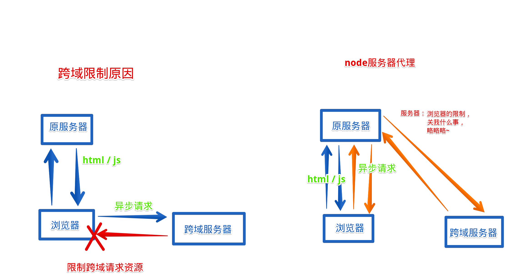
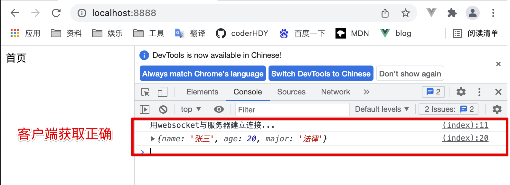
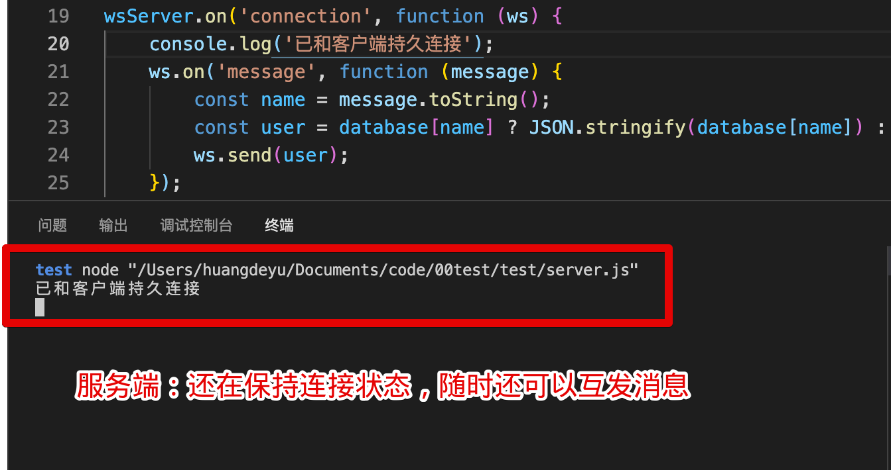

## 介绍
### 同源策略
::: tip
* **协议 // 域名 : 端口号**
* 完全一致才叫同源，否则会产生跨域
* 这个同源策略是W3C对**浏览器的异步请求**的限制，也就是说服务器和html内嵌的资源请求没有此限制
* 跨域资源是可以发送的，但是接收的数据时候会被浏览器限制
:::
:::: tabs
::: tab label=源服务器
* 本端口号【8888】 -> 取异步【8889】的数据，报错
* 但是image拿百度的图片资源，能拿到
```js{10,14-16}
const express = require('express');
const app = new express();
app.listen(8888,() => {
    console.log('listen 8888');
});

app.get('/', (req, res) => res.send(`
<body>
    <div>首页</div>
    <image src='https:////www.baidu.com/img/flexible/logo/pc/result@2.png'/>

    <script>
        setTimeout(() => {
            fetch('http://localhost:8889')
            .then(res => res.text())
            .then(res => console.log(res)); // error
        }, 2000);
    </script>
</body>
`));
```
:::
::: tab label=跨域资源服务器
```js{9}
const express = require('express');
const app = new express();

app.listen(8889, () => {
    console.log('listen 8889');
});

app.get('/', function(req, res) {
    res.send('跨域内容哈哈哈，拿不到拿不到~');
});
```
:::
::::
## 解决方案
### JSONP
::: tip 思想
* 同源策略限制的是ajax异步请求，并没有限制内嵌的script代码，所以可以利用这一点去取对应的数据
* 前端和后端约定好回调函数名称，然后前端创建script标签向后端指定url发起get请求，后端将回调函数执行且传入希望有的数据，前端接受到数据由于是script标签，就会开始执行，拿到数据且执行出希望的结果。
* 限制：只能请求get数据，因为是script标签发起的请求
* 限制：需要约定好回调函数名，较为不方便
:::
:::: tabs
::: tab label=源服务器1
* 和 跨域数据服务器1，约定好回调函数叫【fn】
* 跨域数据服务器1，返回【fn执行代码块】，在浏览器端执行
```js{12-14,16-18}
const express = require('express');
const app = new express();
app.listen(8888,() => {
    console.log('listen 8888');
});

app.get('/', (req, res) => res.send(`
<body>
    <div>首页</div>

    <script>
        function fn(str) {
            console.log(str);
        }
        setTimeout(() => {
            const script = document.createElement('script');
            script.src = 'http://localhost:8889'
            document.body.appendChild(script); // 我们约定好的兄弟~
        }, 2000);
    </script>
</body>
`));
```
:::
::: tab label=跨域数据服务器1
```js{9}
const express = require('express');
const app = new express();

app.listen(8889, () => {
    console.log('listen 8889');
});

app.get('/', function(req, res) {
    res.send('fn("我们约定好的兄弟~")');
});
```
:::
::: tab label=源服务器2
* 向跨域数据服务器2，取用户数据，约定好回调函数为【getUser】
```js{12-16,18-20,23-24}
const express = require('express');
const app = new express();
app.listen(8888,() => {
    console.log('listen 8888');
});

app.get('/', (req, res) => res.send(`
<body>
    <div>首页</div>

    <script>
        const name = 'hdy'
        let user;
        function getUser(userData) {
            user = userData;
        }
        setTimeout(() => {
            const script = document.createElement('script');
            script.src = 'http://localhost:8889?name=' + name
            document.body.appendChild(script);

            // 请求回来后本地user读取正确
            setTimeout(() => console.log(user), 2000);
            // {"name":"hdy","age":18,"major":"软件工程"}
        }, 2000);
    </script>
</body>
`));
```
:::
::: tab label=跨域数据服务器2
* database对象模拟数据库数据
```js{21-25}
const express = require('express');
const app = new express();
app.listen(8889, () => {
    console.log('listen 8889');
});

const database = {
    hdy: {
        name: 'hdy',
        age: 18,
        major: '软件工程'
    },
    zs: {
        name: '张三',
        age: 20,
        major: '法律'
    }
}

app.get('/', function(req, res) {
    const name = req.query.name;
    const data = database[name] ? JSON.stringify(database[name]) : '{}';

    // 入参到前端会直接解析成对象，因为这是script标签返回内容字段
    res.send(`getUser(${data})`);
});
```
:::
::::
### CORS
::: tip
* 全称：Cross-origin resource sharing
* 服务器同意跨域的资源请求，并在响应头上添加对应字段
* 响应头设置的字段：

|字段|值|
|---|---|
|Access-Control-Allow-Origin|【必须】允许请求的源域名，url \| *|
|Access-Control-Request-Method|可选，支持跨域的方法|
|Access-Control-Expose-Headers|可选，允许包含的请求头|
|Access-Control-Allow-Credentials|可选，布尔值，headers是否接收cookie字段|
|Access-Control-Max-Age|可选，本次预检请求有效期|
:::
:::: tabs
::: tab label=get
* fetch默认方式是get，直接去向资源服务器拿数据
* 请求能不能回来就看服务器的响应头【Access-Control-Allow-Origin】字段有没有我这个服务器
```js{16-22}
const express = require('express');
const app = new express();
app.listen(8888,() => {
    console.log('listen 8888');
});

app.get('/', (req, res) => res.send(`
<body>
    <div>首页</div>

    <script>
        let user;
        const name = 'hdy'

        setTimeout(() => {
            fetch('http://localhost:8889?name=' + name)
            .then(res => res.json())
            .then(res => {
                user = res;
                console.log(user);
                // {name: 'hdy', age: 18, major: '软件工程'}
            })
        }, 2000);
    </script>
</body>
`));
```
:::
::: tab label=get服务器
```js{7-15}
const express = require('express');
const app = new express();
app.listen(8889, () => {
    console.log('listen 8889');
});

// 允许跨域中间件
const allowCors = function(req, res, next) {
    res.header('Access-Control-Allow-Origin', req.headers.origin);
    res.header('Access-Control-Allow-Methods', 'GET,PUT,POST,DELETE,OPTIONS');
    res.header('Access-Control-Allow-Headers', 'Content-Type');
    res.header('Access-Control-Allow-Credentials','true');
    next();
};
app.use(allowCors); // 使用跨域中间件

// 模拟数据库
const database = {
    hdy: {
        name: 'hdy',
        age: 18,
        major: '软件工程'
    },
    zs: {
        name: '张三',
        age: 20,
        major: '法律'
    }
}

app.get('/', function(req, res) {
    const name = req.query.name;
    const data = database[name] ? JSON.stringify(database[name]) : '{}';
    res.send(data);
});
```
:::
::: tab label=post
* 以post的形式向服务器发送请求

```js{15-19,23-24}
const express = require('express');
const app = new express();
app.listen(8888,() => {
    console.log('listen 8888');
});

app.get('/', (req, res) => res.send(`
<body>
    <div>首页</div>

    <script>
        let user;

        setTimeout(() => {
            fetch('http://localhost:8889', {
                method: 'POST',
                headers: {'Content-Type': 'application/json'},
                body: JSON.stringify({name: 'zs'})
            })
            .then(res => res.json())
            .then(res => {
                user = res;
                console.log(user);
                // {name: '张三', age: 20, major: '法律'}
            })
        }, 2000);
    </script>
</body>
`));
```
:::
::: tab label=post服务器
* express解析请求体【req.body】需要【body-parser】这个库
```js{8-15,30-32}
const express = require('express');
const app = new express();
app.listen(8889, () => {
    console.log('listen 8889');
});

// 自定义跨域中间件
const allowCors = function(req, res, next) {
    res.header('Access-Control-Allow-Origin', req.headers.origin);
    res.header('Access-Control-Allow-Methods', 'GET,PUT,POST,DELETE,OPTIONS');
    res.header('Access-Control-Allow-Headers', 'Content-Type');
    res.header('Access-Control-Allow-Credentials','true');
    next();
};
app.use(allowCors); // 使用跨域中间件

const database = {
    hdy: {
        name: 'hdy',
        age: 18,
        major: '软件工程'
    },
    zs: {
        name: '张三',
        age: 20,
        major: '法律'
    }
}

const bdParser = require('body-parser');
app.use(bdParser.urlencoded({extended: false}));
app.use(bdParser.json());

app.post('/', function(req, res) {
    const name = req.body.name;
    const data = database[name] ? JSON.stringify(database[name]) : '{}';
    res.send(data);
});
```
:::
::: tab label=cookie

* 跨域传cookie需要同时满足三个条件：
    1. Access-Control-Allow-Origin为非 *
    2. Access-Control-Allow-Credentials为true
    3. 请求设置credentials
* 请求带去同源服务器，同源服务器拿到user字段，响应头增加cookie，再重定向到跨域服务器要数据
* 首先默认允许跨域，然后还要允许【credentials】，重定向要跟随也要特殊设置【redirect】
```js{15-18,31-32}
const express = require('express');
const app = new express();
app.listen(8888,() => {
    console.log('listen 8888');
});

app.get('/', (req, res) => res.send(`
<body>
    <div>首页</div>

    <script>
        let user;

        setTimeout(() => {
            fetch('http://localhost:8888/data', {
                credentials: 'include',
                redirect: 'follow'
            })
            .then(res => res.json())
            .then(res => {
                user = res;
                console.log(user);
                // {name: '张三', age: 20, major: '法律'}
            })
        }, 2000);
    </script>
</body>
`));

app.get('/data' , (req, res) => {
    res.cookie('user', 'zs');
    res.redirect('http://localhost:8889');
})
```
:::
::: tab label=cookie服务器
* express解析cookie需要【cookie-parser】
```js{8-15,30-31,34}
const express = require('express');
const app = new express();
app.listen(8889, () => {
    console.log('listen 8889');
});

// 自定义跨域中间件
const allowCors = function(req, res, next) {
    res.header('Access-Control-Allow-Origin', req.headers.origin);
    res.header('Access-Control-Allow-Methods', 'GET,PUT,POST,DELETE,OPTIONS');
    res.header('Access-Control-Allow-Headers', 'Content-Type');
    res.header('Access-Control-Allow-Credentials','true');
    next();
};
app.use(allowCors); // 使用跨域中间件

const database = {
    hdy: {
        name: 'hdy',
        age: 18,
        major: '软件工程'
    },
    zs: {
        name: '张三',
        age: 20,
        major: '法律'
    }
}

const ckParser = require('cookie-parser');
app.use(ckParser());

app.get('/', function(req, res) {
    const user = req.cookies.user;
    const data = database[user] ? JSON.stringify(database[user]) : '{}';
    res.send(data);
});
```
:::
::::
### node代理
::: tip 思路
* 同源限制是浏览器规定的
* 不限制其他平台的网络请求
* 那么就让服务器代理发送请求，再把数据还给浏览器端，浏览器就不知道这是跨域的资源了
:::
:::: tabs
::: tab label=图解
* 浏览器还是向源服务器发送请求，源服务器去发跨域请求。取回数据给浏览器

:::
::: tab label=资源服务器
* 代理的情况下不需要跨域的服务器做什么，因为他也不知道这是浏览器的跨域请求
```js{22-32}
const express = require('express');
const app = new express();
app.listen(8889, () => {
    console.log('listen 8889');
});

// 模拟数据库
const database = {
    hdy: {
        name: 'hdy',
        age: 18,
        major: '软件工程'
    },
    zs: {
        name: '张三',
        age: 20,
        major: '法律'
    }
}

app.get('/', function(req, res) {
    new Promise(resolve => {
        setTimeout(() => {

            // 异步：假装去数据库读取
            const name = req.query.name;
            const data = database[name] ? JSON.stringify(database[name]) : '{}';
            resolve(data);
        }, 1000);
    }).then(data => {
        res.send(data);
    })
});
```
:::
::: tab label=express代理
* express代理有封装好的【express-http-proxy】库
```js{16,28-29}
const express = require('express');
const app = new express();
app.listen(8888,() => {
    console.log('listen 8888');
});

app.get('/', (req, res) => res.send(`
<body>
    <div>首页</div>

    <script>
        let user;
        const name = 'hdy'

        setTimeout(() => {
            fetch('http://localhost:8888/proxy?name=' + name)
            .then(res => res.json())
            .then(res => {
                user = res;
                console.log(user);
                // {name: 'hdy', age: 18, major: '软件工程'}
            })
        }, 2000);
    </script>
</body>
`));

const proxy = require('express-http-proxy');
app.use('/proxy', proxy('http://localhost:8889'));
```
:::
::: tab label=vue2配置代理
* 开发环境下
* vue.config.js配置
```js
// vue项目开发模式中，所有【/api】开头的请求路径都使用node代理请求，再把数据还给浏览器
module.exports = {
  devServer: {
    proxy: {
        '/api': {
            target: 'http://localhost:8889',
            changeOrigin: true, // 跨域
            pathRewrite: {
                '^/api': '/'
            }
        }
    }
  }
}
```
* 跨域请求vue文件
```vue
<template>
    <div>
        <div>{{data}}</div>
        <button @click='getData'>获取跨域数据</button>
    </div>
</template>

<script>
export default {
    data() {
        return {
            data: '默认数据'
        }
    },
    methods: {
        getData() {
            fetch('/api?name=zs')
            .then(res => res.json())
            .then(res => this.data = res);
        }
    }
}
</script>

<style>
</style>
```
:::
::: tab label=react
* 安装插件
```shell
npm i http-proxy-middleware
```
* src目录下创建文件，名字固定，react脚手架会调用
* 可以创建多个代理
```js
// src/setupProxy.js
const proxy = require('http-proxy-middleware')

module.exports = function(app) {
  app.use(
    proxy.createProxyMiddleware('/api1', {
      target: 'http://localhost:8888',
      changeOrigin: true,
      pathRewrite: {'^/api1': ''}
    })
  )
}
```
:::
::::
### Nginx
::: tip
* 原理和proxy代理一样，只是vue的proxy配置只有开发环境生效，生产环境一般用nginx
:::
:::: tabs
::: tab label=nginx配置
* nginx.conf
```shell{11-13}
server {
    # ...

    # 源页面路径
    location / {
        root   /Users/huangdeyu/Documents/code/00test/test;
        index  test.html;
    }

    # 代理服务器路径
	location /api {
        proxy_pass http://localhost:8889;
    }

    # ...
}
```
* 执行命令
```shell
# 启动
nginx

# 重载配置文件
nginx -s reload
```
:::
::: tab label=源页面
* 还是向源服务器发起同源请求，nginx处理跨域请求
```html{15}
<!DOCTYPE html>
<html lang="en">
<head>
    <meta charset="UTF-8">
    <title>Document</title>
</head>
<body>
    <div>首页</div>

    <script>
        let user;
        const name = 'hdy'

        setTimeout(() => {
            fetch('/api?name=' + name)
            .then(res => res.json())
            .then(res => {
                user = res;
                console.log(user);
                // {name: 'hdy', age: 18, major: '软件工程'}
            })
        }, 2000);
    </script>
</body>
</html>

```
:::
::: tab label=跨域数据服务器
* 注：nginx配置代理默认会带上路径，例：【/api】
```js{21-33}
const express = require('express');
const app = new express();
app.listen(8889, () => {
    console.log('listen 8889');
});

// 模拟数据库
const database = {
    hdy: {
        name: 'hdy',
        age: 18,
        major: '软件工程'
    },
    zs: {
        name: '张三',
        age: 20,
        major: '法律'
    }
}

app.get('/api', function(req, res) {
    new Promise(resolve => {
        setTimeout(() => {

            // 异步：假装去数据库读取
            const name = req.query.name;
            const data = database[name] ? JSON.stringify(database[name]) : JSON.stringify({msg: "未查到此人"});
            resolve(data);
        }, 1000);
    }).then(data => {
        res.send(data);
    })
});
```
:::
::::
### webSocket
::: tip 定义
* 规范定义了一种 API，可在网络浏览器和服务器之间建立“套接字”连接。简单地说：客户端和服务器之间存在持久的连接，而且双方都可以随时开始发送数据。
* 跨域原理：本质上是浏览器和服务器建立了持久链接，并不是传统的http请求，所以并没有跨域限制
:::
:::: tabs 
::: tab label=源服务器
```js{14-17,19-21,24-25}
const express = require('express');
const app = new express();
app.listen(8888,() => {
    console.log('listen 8888');
});

app.get('/', (req, res) => res.send(`
<body>
    <div>首页</div>

    <script>
        let user;

        let socket = new WebSocket("ws://localhost:8889");
        socket.onopen = function() {
            console.log('用websocket与服务器建立连接...');
        };

        socket.onmessage = function(e) {
            user = JSON.parse(e.data);
        };

        setTimeout(() => {
            socket.send('zs');
            setTimeout(() => console.log(user), 1000);
        }, 2000);
    </script>
</body>
`));
```
:::
::: tab label=跨域数据服务器
* node服务器可用的webSocket库有：
    * ws
    * Socket.IO
    * WebSocket-Node
* 这里用ws库
```js{15-16,18-25}
// 模拟数据库
const database = {
    hdy: {
        name: 'hdy',
        age: 18,
        major: '软件工程'
    },
    zs: {
        name: '张三',
        age: 20,
        major: '法律'
    }
}

const ws = require('ws');
const wsServer = new ws.Server({ port: 8889 });

wsServer.on('connection', function (ws) {
    console.log('已和客户端持久连接');
    ws.on('message', function (message) {
        const name = message.toString();
        const user = database[name] ? JSON.stringify(database[name]) : JSON.stringify({msg: '查无此人'})
        ws.send(user);
    });
});
```
:::
::: tab label=效果



:::
::::
## 谷歌浏览器关闭跨域
1. 桌面新建文件夹`aaa`
2. 注意路径
    ```md
    pwd
    open -n /Applications/Google\ Chrome.app/ --args --disable-web-security  --user-data-dir=/Users/dreamarts/Desktop/aaa
    ```
### 其他方案
::: tip 其他不常用方案

|方案|适用|
|---|---|
|window.postMessage|可以向浏览器的其他窗口或内嵌iframe进行跨域通信|
|document.domain + iframe|可以让同一个基础域名的网页进行相互操作，如：【id.qq.com】和【qq.com】可以互相嵌套iframe进行跨域通信操作，只要把他们都设置【document.domain = 'qq.com'】|
|浏览器关闭跨域限制|启动增加参数【--disable-web-security --user-data-dir】|
:::
:::: tabs
::: tab label=iframe
* iframe嵌套的是跨域的网站时，会隔离外层DOM的事件，也就是说外层的事件传不进DOM去。例如iframe内部点击，不会传播到iframe外层的div上。

:::
::::