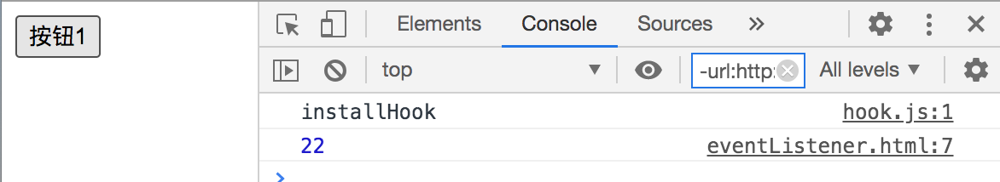
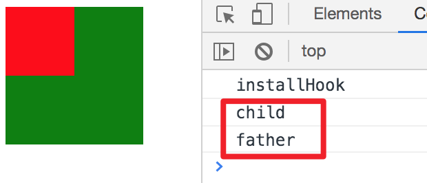

# event

## addEventListener
::: tip addEventListener
* 作用：为**文档上的元素**绑定事件监听，触发**函数**
* 调用：element.addEventlistener(event, callback[, option | useCapture])
* 入参：String, Function[, Object | boolean]
* 返回：undefined
* tip：文档上的元素指Element/Window/Document/XMLHttpRequest/其他支持事件的对象
:::
* DOM上onclick类的事件绑定都是以属性的形式存在DOM对象上，因此不能重复绑定
* addEventListener可以同时绑定多个事件，因为注册的是一个事件列表
:::: tabs
::: tab label=onlick
```html
<body>
    <button class="btn1">按钮1</button>

    <script>
        const btn1 = document.getElementsByClassName("btn1")[0];

        // 会被覆盖
        btn1.onclick = () => console.log(11);
        btn1.onclick = () => console.log(22);
    </script>
</body>
```

:::
::: tab label=addEventListener
```html
<body>
    <button class="btn1">按钮1</button>
    <script>
        const btn1 = document.getElementsByClassName("btn1")[0];
        const fn1 = e => console.log(11);
        const fn2 = e => console.log(22);
        //都会展示
        btn1.addEventListener('click', fn1);
        btn1.addEventListener('click', fn2);
    </script>
</body>
```


:::
::: tab label=第三个参数
* 可查看[mdn](https://developer.mozilla.org/zh-CN/docs/Web/API/EventTarget/addEventListener)
* 事件传播的一些配置
    1. 事件捕获、冒泡
    2. 阻止关闭此事件（preventDefault）
    3. 是否只能调用一次
    4. 移除方法
:::
::: tab label=事件捕获
* event在DOM树从上到下捕获，再从下到上冒泡
```html
<body>
    <div id="father">
        <div id="child"></div>
    </div>
    <style>
        #father {
            width: 100px;
            height: 100px;
            background-color: green;
        }
        #child {
            width: 50px;
            height: 50px;
            background-color: red;
        }
    </style>
    <script>
        const father = document.getElementById('father');
        const child = document.getElementById('child');
    </script>
</body>
```
* 默认
```js
// 默认都是捕获阶段触发，father在DOM树的上面，所以是father先
father.addEventListener('click', () => console.log('father'));
child.addEventListener('click', () => console.log('child'));
```


* 冒泡
```js
// father把第三个参数设置false，就变成冒泡阶段触发
// 所以是child先触发，然后事件冒泡到father再触发
father.addEventListener('click', () => console.log('father'),false);
child.addEventListener('click', () => console.log('child'));
```

:::
::: tab label=手写简易版
* 期望
```html
<body>
    <button class="btn1">按钮1</button>
    <script>
        const btn1 = document.getElementsByClassName("btn1")[0];
        const fn1 = e => console.log(11);
        const fn2 = e => console.log(22);

        btn1.myAddEventListener('mouseover', fn1);
        btn1.myAddEventListener('click', fn2);
    </script>
</body>
```

* 实现
```js
Object.prototype.myAddEventListener = function(type, callback) {
    const eventTypeHandlers = `on${type}handler`;
    const eventType = `on${type}`;
    if (!this[eventTypeHandlers]) {
        this[eventTypeHandlers] = [];
    }
    if (!this[eventType]) {
        this[eventType] = e => {
            this[eventTypeHandlers].forEach(item => item.call(this, e))
        }
    }

    this[eventTypeHandlers].push(callback);
}
```

* 其实是依赖于on事件回调触发，并不算自己触发的
:::
::::