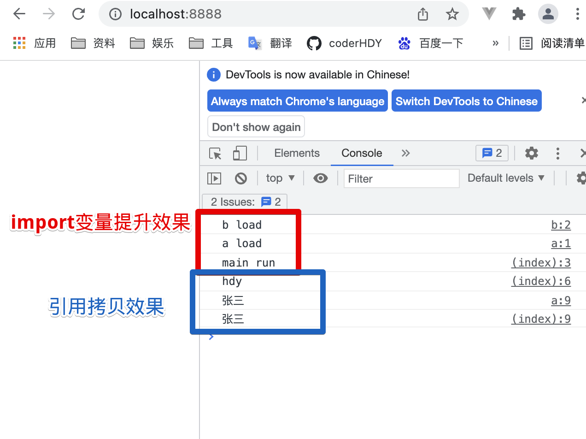

## 介绍
::: tip 模块化的引入
* 项目的难点：管理变量
* 出现问题：变量污染
* 解决命名污染技术进步：
    1. 闭包，每个函数有自己独立的作用域。问题：闭包之间要互相通信呢？
    2. 接口，写个函数拿到数据接口
    3. 模块化，谁要用谁引用
* commonJS是同步加载，所以浏览器端没有引入。而是有了esm规范
* 按需引入的重点是利用promise
:::
:::: tabs
::: tab label=commonJS
```js
const a = 1;
const b = 2;
module.exports = { a }
exports.b = b;

// 禁止，会断开链接
// exports = { b }
```
```js
const { a } = require('./a');
```
:::
::: tab label=es6
```js
const a = 1;
let b = 2;

export let c = 3;
export class A {}
export new Promise()
export { a, b }

// 导出默认
export default { a }
```
```js
import { a, c } from "./b.js"

// 导入默认/自定义命名
import myName from "./a.js"

// 导入所有内容/自定义命名
import * as myName from "./c.js"
```
:::
::::

## commonJS
### 加载顺序
::: tip commonJS
* 同步加载：require的文件会先被执行一遍，然后将暴露的 exports内容赋值给要接收的变量
:::
:::: tabs
::: tab label=a.js
```js
console.log('a load');

const a = {
    run: function() {
        console.log('a run')
    }
}

module.exports = a
```
:::
::: tab label=b.js
```js
console.log('b load');

const b = {
    run: function() {
        console.log('b run')
    }
}

module.exports = b
```
:::
::: tab label=main.js
```js
const a = require('./a');
const b = require('./b');
console.log('main run');
a.run();
b.run();
```
* 执行打印
```js
// a load
// b load
// main run
// a run
// b run
```
:::
::::
### 值的拷贝
::: tip 值引用
* 引用的值属于拷贝了一份，值修改与原值无关
:::
:::: tabs
::: tab label=main.js
* add修改了他的空间的count，和我拷贝过来的count无关
```js
const { count, add, get } = require('./b');
console.log(count);    // 1
add();
console.log(count);    // 1
console.log(get());    // 2
```
:::
::: tab label=b.js
```js
let count = 1;
module.exports = {
  count,
  add() {
    count++;
  },
  get() {
    return count;
  }
};
```
:::
::::
### 手写require
::: tip 思路
1. 入参就是引入文件的路径
2. 输出是 mudule.exports
3. exports 是 module.exports的引用
:::
文件目录：
>require.js  
>main.js  
>a.js  
>b.js  
:::: tabs
::: tab label=require.js
```js{4-17}
const fs = require('fs');
const path = require('path');

function _require(url) {
    const target = path.join(__dirname, url + '.js');

    // exports 就是 module.exports 的引用
    const _module = { _exports: {} };
    const _exports = _module._exports;

    // 将读取文件在这个函数作用域下执行，文件代码中就能访问到本作用域的 _module
    const code = fs.readFileSync(target).toString();
    eval(code);

    // 将exports内容暴露出去
    return _module._exports;
}
```
:::
::: tab label=a.js
```js{8}
console.log('a load');
const a = {
    run: function() {
        console.log('a run')
    }
}

_module._exports = {a};
```
:::
::: tab label=b.js
```js{8}
console.log('b load');
const b = {
    run: function() {
        console.log('b run')
    }
}

_module._exports = {b};
```
:::
::: tab label=main.js
```js{3-4}
const _require = require('./require');

const {a} = _require('./a');
const {b} = _require('./b');
console.log('main run');
a.run();
b.run();
```
* 执行效果
```js
// a load
// b load
// main run
// a run
// b run
```
:::
::::

## ES6 模块化
### 介绍
::: tip ES6模块化 
* 拿的是引用拷贝
* 先会**静态解析**，不执行代码，生成`依赖关系图`，然后根据依赖关系图进行解析执行
:::

### 加载顺序
::: tip 加载顺序
* import 有变量提升效果
:::
* 目录：
>server.js  
>main.html  
>a.js  
>b.js  
:::: tabs
::: tab label=server.js
```js{8,15,22}
const express = require('express');
const fs = require('fs');
const path = require('path');
const app = express();
app.listen('8888', () => console.log('listen 8888'));

app.get('/', (req, res) => {
    res.setHeader('Content-Type', 'text/html')
    const url = path.join(__dirname, './main.html');
    const code = fs.readFileSync(url);
    return res.send(code);
})

app.get('/a', (req, res) => {
    res.setHeader('Content-Type', 'text/javascript')
    const url = path.join(__dirname, './a.js');
    const code = fs.readFileSync(url);
    res.send(code)
})

app.get('/b', (req, res) => {
    res.setHeader('Content-Type', 'text/javascript')
    const url = path.join(__dirname, './b.js');
    const code = fs.readFileSync(url);
    res.send(code)
})
```
:::
::: tab label=main.html
```html{4-7,9-13}
<body>
    <script type="module">

        // 还是加载模块会先load，因为 import 会变量提升
        console.log('main run');
        import { a } from './a';
        import { hdy } from './b';

        // 用的是同一个 hdy引用，所以一个修改一起改
        console.log(hdy.name); // hdy
        a.changeName();
        a.getName(); // 张三
        console.log(hdy.name); // 张三
    </script>
</body>
```
:::
::: tab label=a.js
```js{3-4,7-9}
console.log('a load');

// b load 还是会先打印，因为变量提升
import { hdy } from './b';

const a = {
    changeName: function() {
        hdy.name = '张三';
    },
    getName() {
        console.log(hdy.name);
    }
}

export { a };
```
:::
::: tab label=b.js
```js
console.log('b load');

const hdy = {
    name: 'hdy',
    age: 18,
    books: [
        '你不知道的JS',
        'JS高级程序设计'
    ]
}

export { hdy };
```
:::
::: tab label=效果

:::
::::

### 值的引用
::: tip 引用拷贝
* es的模块化拿的是原值的引用，所以多次引用一个值拿的是同一个值
:::
* 目录：
>server.js  
>main.html  
>b.js  
:::: tabs
::: tab label=server.js
```js
const express = require('express');
const fs = require('fs');
const path = require('path');
const app = express();
app.listen('8888', () => console.log('listen 8888'));

app.get('/', (req, res) => {
    res.setHeader('Content-Type', 'text/html')
    const url = path.join(__dirname, './main.html');
    const code = fs.readFileSync(url);
    return res.send(code);
})

app.get('/b', (req, res) => {
    res.setHeader('Content-Type', 'text/javascript')
    const url = path.join(__dirname, './b.js');
    const code = fs.readFileSync(url);
    res.send(code)
})
```
:::
::: tab label=main.html
* add修改的是count，count只是原值的一个引用，实际上修改的还是b.js里面定义的count
* 所以一直都是同一个count
```html{4-7}
<body>
    <script type="module">
        import { count, add, get } from './b';
        console.log(count);    // 1
        add();
        console.log(count);    // 2
        console.log(get());    // 2
    </script>
</body>
```
:::
::: tab label=b.js
```js
let count = 1;
function add() {
    count++;
}
function get() {
    return count;
}
export { count, add, get }
```
:::
::: tab label=效果

:::
::::
