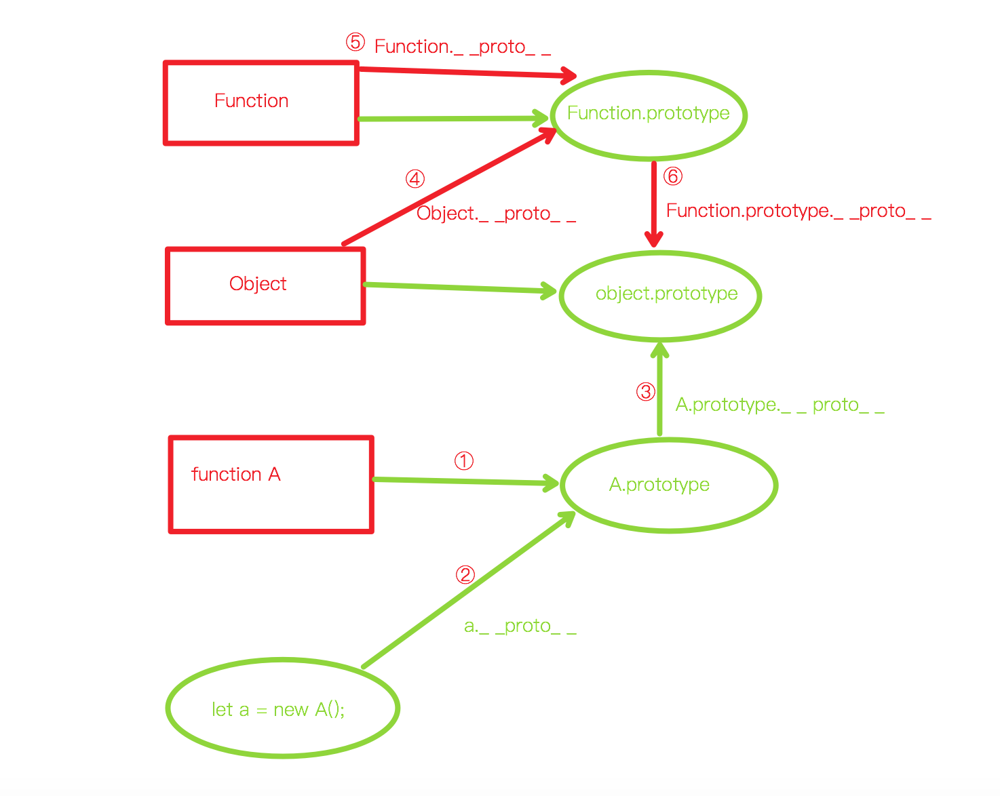

# Object

## 原型链
### 原理
1. 每个function上都有一个prototype属性，指向一个对象，叫做**原型对象**
2. 原型对象上又有一个constructor属性能够找到构造他的function
    * constructor 是用 new 关键字调用时才会调用，主要做四件事：
        > 1. 生成一个新的对象 {}
        > 2. 给这个对象添加一个属性 _ _ _proto_ _ _  = function的prototype;
        > 3. function 的this绑定到这个对象上去执行
        > 4. **返回新生对象（所以新对象就有一个_ _ _proto_ _ _属性指向了这个function的prototype），就能说他的原型链上能找到这个function的原型对象**
```html
<head>
    <title>Document</title>
</head>
<body>
    <script>
        function A() {
            this.name = '张三';
            this.age = 18;
        }
        let a = new A();

        // 原型链判断理论（需要递归查找）
        console.log(a.__proto__ === A.prototype); // true
        console.log(a.__proto__.constructor === A); // true
        console.log(a.__proto__.constructor.name === 'A'); // true
        console.log(a instanceof A); // true
    </script>
</body>
</html>
```

### 证明
1. new出来的对象能够通过_ _ _proto_ _ _ 属性找到function的 prototype 对象
2. prototype对象里又有一个constructor函数
3. constructor函数有一个name属性，能够拿到函数名
4. constructor还有一个prototype属性，又指回它的原型对象（循环指向）
:::: tabs
::: tab label=示意图

:::
::: tab label=代码
```html
<head>
    <title>Document</title>
</head>
<body>
    <script>
        function A() {
            this.name = '张三';
            this.age = 18;
        }
        A.prototype.height = 180;

        let a = new A();
        console.log(a);
    </script>
</body>
```
:::
::: tab label=证明1
* new出来的对象能够通过_ _ proto _ _ 属性找到function的 prototype 对象  
---

:::
::: tab label=证明2、3
* prototype对象里又有一个constructor函数  
* constructor函数有一个name属性，能够拿到函数名  
---

:::
::: tab label=证明4
* 循环指向  
---

:::
::::

### 原型链顶层
1. 每个**对象**的原型链顶层都是 obj._ _ _proto_ _ _ = Object.prototype
2. 而Object._ _ _proto_ _ _ 指向的是 Function.prototype
3. Function._ _ _proto_ _ _ 指向的也是 Function.prototype
4. 而Function.prototype是一个对象，根据原则1，它的_ _ _proto_ _ _ 指向的也是Object.prototype,所以原型链顶端就会出现循环指向的问题。
---

:::: tabs
:::tab label=代码
```html
<body>
    <script>
        function A() {
            this.name = '张三';
            this.age = 18;
        }

        let a = new A();
        console.log(a);
    </script>
</body>
```
:::
::: tab label=①
* 任意一个function都有一个原型对象
* A的原型对象是A.prototype
:::

::: tab label=②
* 任何一个对象，都有一个 _ _ _proto_ _ _ 属性，指向**构造函数的原型对象**
* a._ _ _proto_ _ _ 就指向 A.prototype
```js
a.__proto__ === A.prototype; // true
```
:::
::: tab label=③
* 任何对象，原型链都能追溯到 Object.prototype (所以所有对象都有一些默认的原型方法)
```js
A.prototype.__proto__ === Object.prototype; // true
```
:::
::: tab label=④
* Object作为一个基础对象的构造函数，它也有一个_ _ _proto_ _ _ 属性，指向的是Function.prototype
---

```js
Object.__proto__ === Function.prototype; // true
```
:::
::: tab label=⑤
* 在顶层，Function._ _ _proto_ _ _指向他自己的prototype (唯一一个比较特殊的地方)
```js
Function.__proto__ === Function.prototype; // true
```
:::
::: tab label=⑥
* 最后，由于Function.prototype也是对象，所以根据第③条，他的向上追溯也能找到Object.prototype
* 由此，Object.prototype 和 Function.prototype 形成了 **原型链顶端的闭环**，因此有下列结论：
```js
Function.__proto__ === Function.prototype; // true
Function instanceof Function; // true

Function.prototype.__proto__ === Object.prototype; // true
Function instanceof Object; // true

Object.__proto__.__proto__ === Object.prototype; // true
Object instanceof Object; // true

Object.__proto__ === Function.prototype;  // true
Object instanceof Function; // true
```

::: 
::::