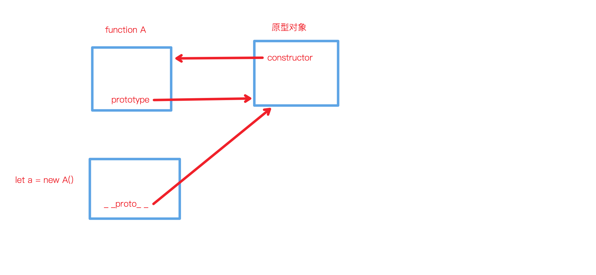
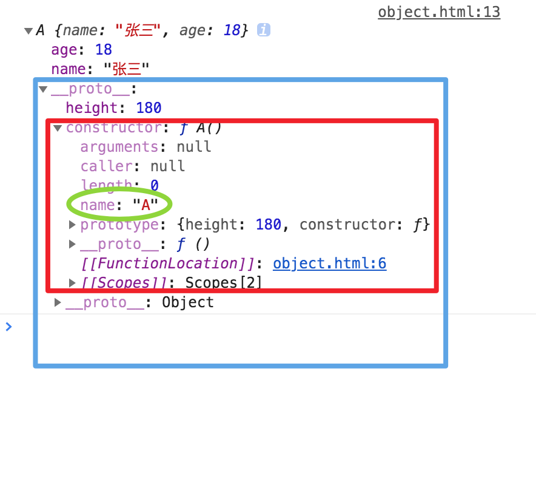
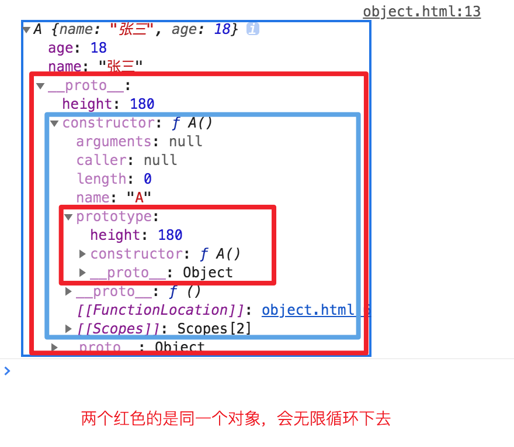
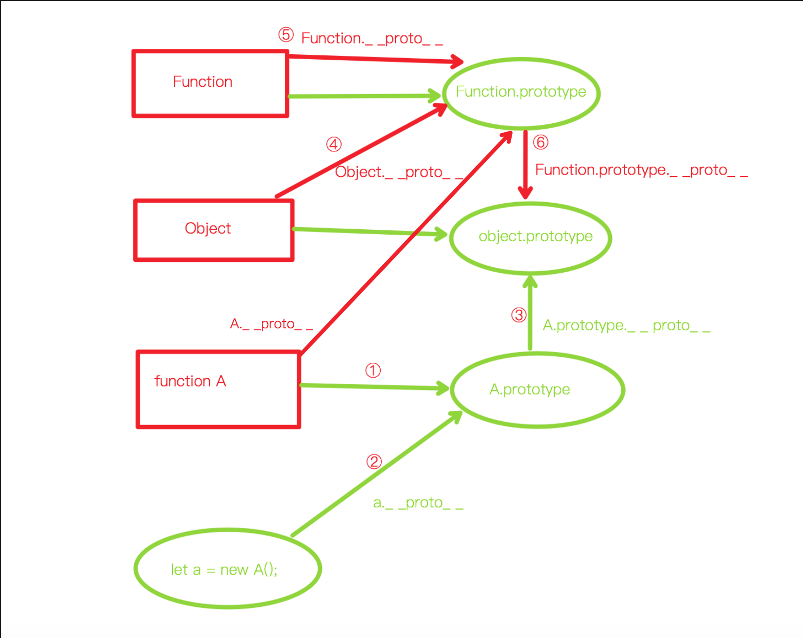
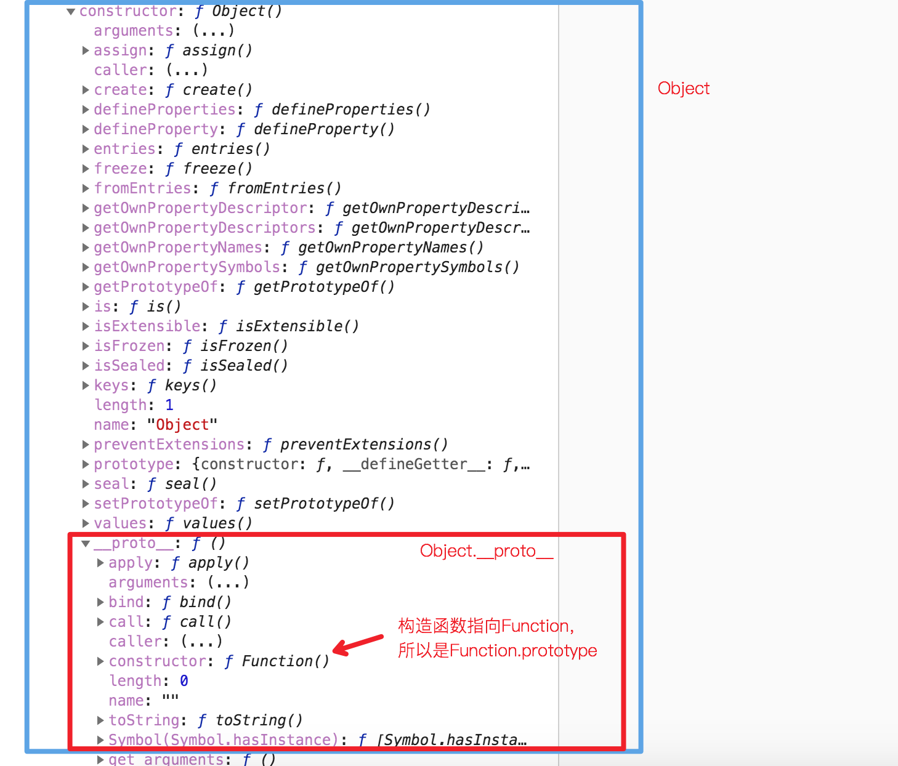
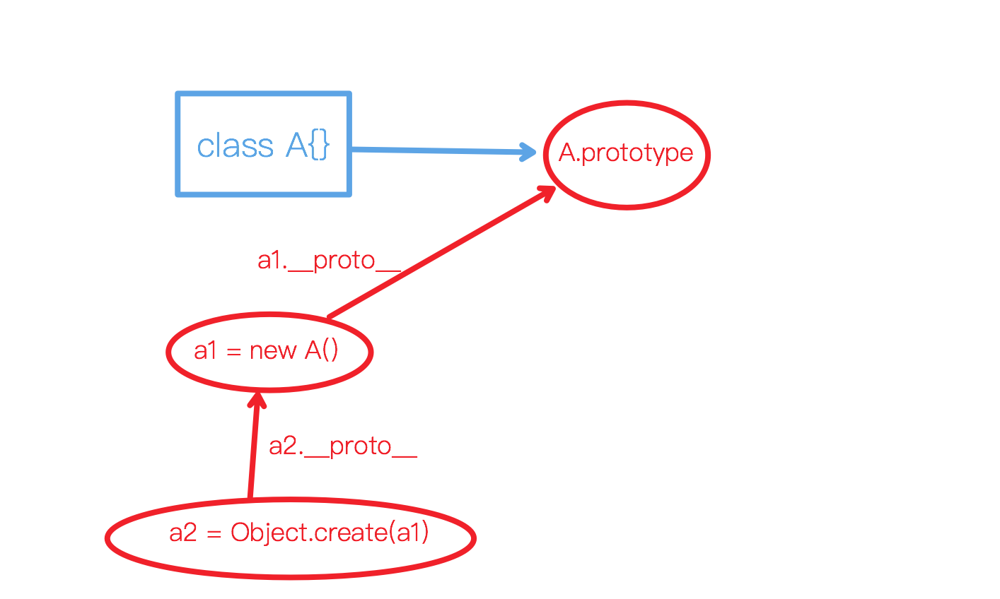
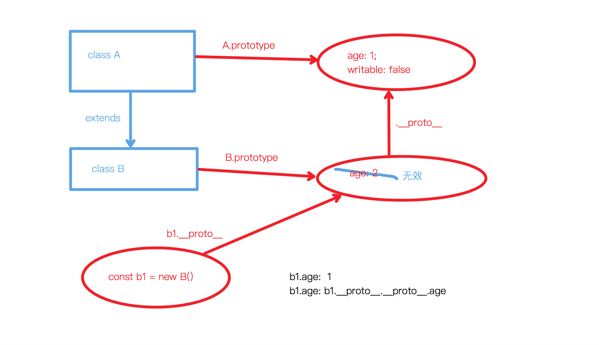
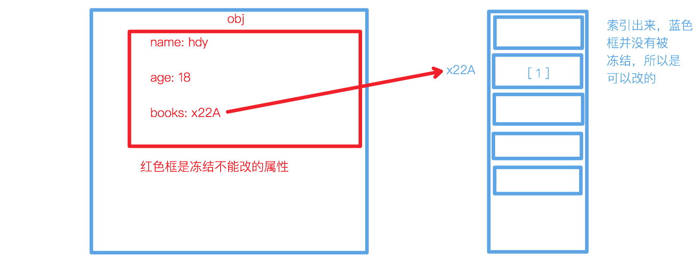

## 原型链
### 原理
1. 每个function上都有一个prototype属性，指向一个对象，叫做`原型对象`
2. 原型对象上又有一个constructor属性能够找到构造他的function
    * 用 new 关键字调用function时主要做四件事：
        > 1. 生成一个新的对象 {}
        > 2. 给这个对象添加一个属性 _ _ _proto_ _ _  = function的prototype;
        > 3. function 的this绑定到这个对象上去执行
        > 4. **返回新生对象（所以新对象就有一个_ _ _proto_ _ _属性指向了这个function的prototype），就能说他的原型链上能找到这个function的原型对象**
        > * 因此可以用[instanceof判断是否是new调用](./typeof.html#阻止函数式调用)
```html
<head>
    <title>Document</title>
</head>
<body>
    <script>
        function A() {
            this.name = '张三';
            this.age = 18;
        }
        let a = new A();

        // 原型链判断理论（需要递归查找）
        console.log(a.__proto__ === A.prototype); // true
        console.log(a.__proto__.constructor === A); // true
        console.log(a.__proto__.constructor.name === 'A'); // true
        console.log(a instanceof A); // true
    </script>
</body>
</html>
```

### 证明
1. new出来的对象能够通过_ _ _proto_ _ _ 属性找到function的 prototype 对象
2. prototype对象里又有一个constructor函数
3. constructor函数有一个name属性，能够拿到函数名
4. constructor还有一个prototype属性，又指回它的原型对象（循环指向）
:::: tabs
::: tab label=示意图

:::
::: tab label=代码
```html
<body>
    <script>
        function A() {
            this.name = '张三';
            this.age = 18;
        }
        A.prototype.height = 180;

        let a = new A();
        console.log(a);
    </script>
</body>
```
:::
::: tab label=证明1
* new出来的对象能够通过_ _ proto _ _ 属性找到function的 prototype 对象  
---

:::
::: tab label=证明2、3
* prototype对象里又有一个constructor函数  
* constructor函数有一个name属性，能够拿到函数名  
---

:::
::: tab label=证明4
* 循环指向  
---

:::
::::

### 原型链顶层
1. 每个**对象**的原型链顶层都是 obj._ _ _proto_ _ _ = Object.prototype
2. 而Object._ _ _proto_ _ _ 指向的是 Function.prototype
3. Function._ _ _proto_ _ _ 指向的也是 Function.prototype
4. 而Function.prototype是一个对象，根据原则1，它的_ _ _proto_ _ _ 指向的也是Object.prototype,所以原型链顶端就会出现循环指向的问题。
---

:::: tabs
:::tab label=代码
```html
<body>
    <script>
        function A() {
            this.name = '张三';
            this.age = 18;
        }

        let a = new A();
        console.log(a);
    </script>
</body>
```
:::
::: tab label=①
* 任意一个function都有一个原型对象
* A的原型对象是A.prototype
:::

::: tab label=②
* 任何一个对象，都有一个 _ _ _proto_ _ _ 属性，指向**构造函数的原型对象**
* a._ _ _proto_ _ _ 就指向 A.prototype
```js
a.__proto__ === A.prototype; // true
```
:::
::: tab label=③
* 任何对象，原型链都能追溯到 Object.prototype (所以所有对象都有一些默认的原型方法)
```js
A.prototype.__proto__ === Object.prototype; // true
```
:::
::: tab label=④
* Object作为一个基础对象的构造函数，它也有一个_ _ _proto_ _ _ 属性，指向的是Function.prototype
---

```js
Object.__proto__ === Function.prototype; // true
```
:::
::: tab label=⑤
* 在顶层，Function._ _ _proto_ _ _指向他自己的prototype (唯一一个比较特殊的地方)
```js
Function.__proto__ === Function.prototype; // true
```
:::
::: tab label=⑥
* 最后，由于Function.prototype也是对象，所以根据第③条，他的向上追溯也能找到Object.prototype
* 由此，Object.prototype 和 Function.prototype 形成了 **原型链顶端的闭环**，因此有下列结论：
```js
Function.__proto__ === Function.prototype; // true
Function instanceof Function; // true

Function.__proto__.__proto__ === Object.prototype; // true
Function instanceof Object; // true

Object.__proto__.__proto__ === Object.prototype; // true
Object instanceof Object; // true

Object.__proto__ === Function.prototype;  // true
Object instanceof Function; // true
```
::: 
::::
### create
::: tip
* 作用：创造一个带有指定原型链的对象
* 调用：Object.create(obj[, descriptors])
* 入参：Object[, definePropertiesObj]
* 返回：Object[, Object]
:::
:::: tabs
::: tab label=使用

```js
class A {}
A.prototype.age = 18;

const a1 = new A();
a1.name = 'hdy';

const a2 = Object.create(a1);

console.log(a2.name); // hdy
console.log(a2.age); // 18
console.log(a2 instanceof A); // true
console.log(a2.__proto__ === a1); // true
```
:::
::: tab label=对象继承
* 普通继承是通过class B extends A {}来实现的
* 但是单个对象要继承另一个对象的属性就可以用Object.created()来实现，通过原型链的机制
```js
// 类式继承
class A {}
class B extends A {}

const b = new B();
console.log(b instanceof A); // true

// 函数式继承
function C() {}
function D() {
}
D.prototype.__proto__ = C.prototype;

const d = new D();
console.log(d instanceof C); // true

// 对象式继承
const f = Object.create(d);
console.log(f instanceof C); // true
```
:::
::: tab label=通过对象继承实现类继承
```js
class A {
    constructor() {
        this.name = 'hdy';
    }
}
function B() {}

// 通过对象的继承来实现原型链
B.prototype = Object.create(A.prototype);
// ->相当于
// B.prototype.__proto__ = A.prototype;

const b = new B();
console.log(b instanceof A); // true
```
:::
::: tab label=第二个参数
* 第二个参数类似Object.defineProperty的第二个参数
```js
const obj1 = { name: 'hdy' }
const obj2 = Object.create(obj1, {
    age: {
        configurable: true,
        enumerable: true,
        writable: true,
        value: 18
    }
})

console.log(obj2); // { age: 18 }
console.log(obj2.name); // hdy
```
:::
::::
### getPropertypeOf
::: tip
* 作用：获取_ _ _proto_ _ _
* 调用：Object.getPropertypeOf(obj)
* 入参：Object
* 返回：Object
:::
```js
class A {}
class B extends A {}
console.log(Object.getPrototypeOf(B.prototype) === A.prototype); // true
```
```js
console.log(Object.getPrototypeOf(Object)=== Function.prototype); // true
```

### setPrototypeOf
::: warning 性能消耗大
* 官方说性能消耗较大，建议使用Object.create()替代写法
:::
::: tip setPrototypeOf
* 作用：设置对象原型链
* 调用：Object.setPrototypeOf(obj, _ _ _proto_ _ _)
* 入参：Object, Object
* 返回：Object(参数1)
:::
```js
const obj1 = { name: 'hdy' };
const obj2 = Object.setPrototypeOf({}, obj1);

console.log(obj2); // {}
console.log(obj2.name); // hdy
```
* create替代
```js
const obj1 = { name: 'hdy' };
const obj2 = Object.create(obj1);

console.log(obj2); // {}
console.log(obj2.name); // hdy
```
### isPrototypeOf
::: tip
* 作用：查看是否在指定对象的**原型链上**
* 调用：obj1.isPrototypeOf(obj2)
* 入参：Object
* 返回：Boolean
:::
```js
const obj1 = {}
const obj2 = Object.setPrototypeOf({}, obj1);

console.log(obj1.isPrototypeOf(obj2)); // true
```
* 原型链上
```js
const obj1 = {};
const obj2 = Object.create(obj1);
const obj3 = Object.create(obj2);

console.log(obj2.isPrototypeOf(obj3)); // true
console.log(obj1.isPrototypeOf(obj3)); // true
```

## 迭代器
### for in
::: tip for in
* 作用：迭代**本身包括原型链**的`可枚举属性`的`键`
* 调用：for (let key in obj) {}
:::
:::: tabs
::: tab label=使用
* in操作符可以遍历包括原型链的可枚举属性的键
```js{7-10}
const father = {
    name: 'hdy'
}

const child = Object.create(father);

// 遍历到原型链上的【键】
for (let key in child) {
    console.log(key); // name
}
```
:::
::: tab label=if
* if...in..也同理，会去找原型链的属性
```js{6-8}
const father = {
    name: 'hdy'
}
const child = Object.create(father);

if( 'name' in child) {
    console.log(child['name']); // hdy
}
```
:::
::::
### entries
::: tip
* 作用：返回对象实例`可枚举属性`的键值对（**不包括原型链**）
* 调用：Object.entries(obj);
* 入参：Object
* 返回：Array（二维数组）
:::
:::: tabs
::: tab label=使用
```js
const obj = {
    name: 'hdy',
    age: 18,
}
Object.defineProperty(obj, 'books', {
    value: ['红宝书']
})
console.log([...Object.entries(obj)]); // [[name: 'hdy'], [age: 18]]
```
:::
::: tab label=对象转map
```js {5}
const obj = {
    name: 'hdy',
    age: 18,
}
const map = new Map(Object.entries(obj));
console.log(map); // Map(2) { 'name' => 'hdy', 'age' => 18 }
```
:::
::::
### keys
::: tip
* 作用：拿到对象自身的`可枚举属性`
* 调用：Object.keys(obj)
* 入参：Object
* 返回：Array
:::
```js
const obj = {
    name: 'hdy'
}
Object.defineProperty(obj, 'age', {
    enumerable: false,
    value: 18
})

console.log(Object.keys(obj)); // ['name']
```
### values
::: tip
* 作用：拿到自身所有`可枚举属性`的值
* 调用：Object.keys(obj)
* 入参：Object
* 返回：Array
:::
```js
const obj = {
    name: 'hdy'
}
Object.defineProperty(obj, 'age', {
    enumerable: false,
    value: 18
})

console.log(Object.values(obj)); // ['hdy']
```
### getOwnPropertyNames
::: tip
* 作用：拿到自身所有属性名（**包括不可枚举属性**）
* 调用：Object.getOwnPropertyNames(obj)
* 入参：Object
* 返回：Array
:::
::: warning 与Object.keys()对比
* 相同：都不会去原型链拿属性
* 不同：getOwnPropertyNames() 可以拿到自身不可枚举属性
:::
:::: tabs
::: tab label=使用
```js
const obj = {
    name: 'hdy'
}
Object.defineProperty(obj, 'age', {
    enumerable: false,
    age: 18
})

console.log(Object.getOwnPropertyNames(obj)); // [ 'name', 'age' ]
```
:::
::: tab label=自身可枚举属性
* Object.keys()
* Object.entries()
* Object.values()
```js {12}
const obj = Object.defineProperties({}, {
    name: {
        enumerable: true,
        value: 'hdy'
    },
    age: {
        value: 18
    }
})

console.log(obj); // { name: 'hdy' }
console.log(Object.keys(obj)); // [ 'name' ]
```
:::
::: tab label=自身不可枚举属性
```js {11-13}
const obj = Object.defineProperties({}, {
    name: {
        enumerable: true,
        value: 'hdy'
    },
    age: {
        value: 18
    }
})

const unEnumerable = Object.getOwnPropertyNames(obj).filter(function(item) {
    return !this.includes(item);
}, Object.keys(obj))
console.log(unEnumerable); // [ 'age' ]
```
:::
::::
### getOwnPropertySymbols
::: tip
* 作用：获取本对象的symbol
* 调用：Object.getOwnPropertySymbols(obj)
* 入参：Object
* 返回：Symbol []
:::
```js
var obj = {};
var a = Symbol("a");
var b = Symbol.for("b");

obj[a] = "localSymbol";
obj[b] = "globalSymbol";

var objectSymbols = Object.getOwnPropertySymbols(obj);

console.log(objectSymbols.length); // 2
console.log(objectSymbols)         // [Symbol(a), Symbol(b)]
console.log(objectSymbols[0])      // Symbol(a)
```
### hasOwnProperty
::: tip
* 作用：查看属性是不是属于实例本身
* 调用：obj.hasOwnProperty(key)
* 入参：String
* 返回：Boolean
:::
:::: tabs
::: tab label=使用
```js
const obj = { name: 'hdy' };
const obj2 = Object.create(obj);

console.log(obj2.name); // hdy
console.log(obj2.hasOwnProperty('name')); // false
```
:::
::: tab label=模拟keys
* 获取自身属性名可以用Object.keys()
```js
const obj1 = { name: 'hdy' };
const obj2 = Object.create(obj1, { age: { enumerable: true } });
```
```js
Object.keys(obj2); // [ age ]
```
* 用hasOwnProperty()实现
```js
const ownProperty = [];
for (let key in obj2) {
    if (obj2.hasOwnProperty(key)) {
        ownProperty.push(key);
    }
}
console.log(ownProperty); // [ age ]
```
:::
::::
## 描述符
### defineProperty
::: tip
* 作用：以描述符的形式给对象定义属性，可以支持get/set劫持
* 调用：Object.defineProperty(obj, key, descriptor)
* 入参：Object, String, Object
* 返回：Object（第一个入参的引用）
:::
:::: tabs
::: tab label=使用
```js{6,7,10}
const obj = {
    name: 'hdy'
}

Object.defineProperty(obj, '_age', {
    configurable: true,
    writable: true,

    // 内置属性可以配置不可枚举
    emuerable: false,
    value: 18
})

Object.defineProperty(obj, 'age', {
    configurable: true,

    // 有getter时，这个属性就是一个函数，配置了也不会被枚举出来
    emumerable: true,
    get() {
        return this._age + '岁';
    },
    set(value) {
        this._age = value;
    }
})

console.log(obj.age); // 18岁
obj.age = 20;         // 走的setter赋值
console.log(obj.age); // 20岁
```
:::
::: tab label=descriptor规则
1. configurable为true时，所有属性都只能配置这一遍，包括configurable，且属性不可删（默认是false）
2. emuerable配置是true打印对象时才会被枚举出来，（直接赋值出来的属性默认是true，defineProperty的属性默认是false）
3. value: 值
4. writable决定是否可改变value
5. get 属性的getter器
6. set 属性的setter器
:::
::: tab label=configurable
* configurable为true时，所有属性都只能配置这一遍，包括configurable(除了value和writable)，且属性不可删（默认是false）
---
> 不可配置不可删
```js {3,8}
const obj = {};
Object.defineProperty(obj, 'age', {
    configurable: false,
    value: 18
})

console.log(obj.age); // 18
delete obj.age;       // 不起作用
console.log(obj.age); // 18
```
```js {3,8}
const obj = {};
Object.defineProperty(obj, 'age', {
    configurable: true,
    value: 18
})

console.log(obj.age); // 18
delete obj.age;       // 起作用
console.log(obj.age); // undefined
```
---
> 可配置下可再改属性
```js
var obj = {};
Object.defineProperty(obj, 'age', {
    configurable: true,
    writable: false
    value: 18,
});

obj.age = 19;         // 不生效
console.log(obj.age); // 18

// 更改配置
Object.defineProperty(obj, 'age', {
    writable: true
});

obj.age = 19;         // 生效
console.log(obj.age); // 19
```
:::
::: tab label=enumerable
* enumerable配置是true打印对象时才会被枚举出来，（直接赋值出来的属性默认是true，defineProperty的属性默认是false）
```js {3,11}
const obj = {};

// 默认enumerable是false
Object.defineProperty(obj, 'age', {
    value: 18
})

console.log(obj); // {}
console.log(obj.age); // 18

// 直接赋值时enuerable是true
obj.height = 180;
console.log(obj.height); // 180

// 检查属性可枚举配置
console.log(obj.propertyIsEnumerable('age')); // false
console.log(obj.propertyIsEnumerable('height')); // true
```
* 包括for...in 和Object.keys()
```js {4}
const father = { name: 'hdy' };
const child = Object.create(father, {
    age: {
        enumerable: false,
        value: 19
    }
});

console.log(child); // {}
console.log(child.age); // 19

for (let key in child) {
    console.log(key); // name
}
```
:::
::: tab label=writable/value
* value: 值
* writable决定是否可改变value，默认false
```js {3,8}
const obj = {};
Object.defineProperty(obj, 'age', {
    writable: false,
    value: 10
})

console.log(obj.age); // 10
obj.age = 11;         // 不生效（也不报错）
console.log(obj.age); // 10
```
> 引用类型只判断引用是否改变
```js {3,8,11}
const obj = {};
Object.defineProperty(obj, 'books', {
    writable: false,
    value: ['红宝书']
})

console.log(obj.books); // ['红宝书']
obj.books.push('蝴蝶书'); // 引用不变，所以不判定为写，生效
console.log(obj.books); // ['红宝书', '蝴蝶书']

obj.books = ['你不知道的js']; // 引用改变，判定为写，失效
console.log(obj.books); // ['红宝书', '蝴蝶书']

```
:::

::: tab label=get/set
* 就是对象的getter/setter器
```js
const obj = {
    _age: 18,
    get age() { return this._age + '岁'; },
    set age(value) { this._age = value; }
}

console.log(obj.age); // 18岁
obj.age = 20;
console.log(obj.age); // 20岁
```
```js
const obj = { _age: 18 }
Object.defineProperty(obj, 'age', {
    get() { return this._age; },
    set(value) { this._age = value; }
})

console.log(obj.age); // 18岁
obj.age = 20;
console.log(obj.age); // 20岁
```
:::
::: tab label=规则
1. 同时拥有((value || writable) && (get || set))会产生异常
```js
Object.defineProperty({}, 'age', {
    value: 18,

    // 报错
    get() {},
    set(value) {}
})
```
:::
::: tab label=劫持数组
```js{4,9}
const arr = [1, 2, 3];
arr.forEach((item, index) => {
    Object.defineProperties(arr,{
        // 留一个不可枚举属性用来存值
        [`_${index}`]: {
            value: item,
            writable: true
        },
        // 暴露属性做劫持
        [index]: {
            get() {
                console.log(`劫持get操作：下标${index}的值是${this['_' + index]}`);
                return this[`_${index}`];
            },
            set(value) {
                console.log(`劫持set操作：下标${index}的值变换为${value}`);
                this[`_${index}`] = value;
            }
        }
    })
})

console.log(arr[0]);      // 劫持get操作：下标0的值是1     1
console.log(arr[1] = 3);  // 劫持set操作：下标1的值变换为3  3
```
:::
::::

::: warning writable与继承
* 一个对象的writable设置成false时，其继承者只能通过defineProperty定义同名属性
* getter/setter设置时就默认writable是false，且无法更改，所以实例也无法生成自己的同名属性
* 类的constructor函数可以主动为实例对象添加实例属性，可以覆盖同名父类属性
:::
:::: tabs
::: tab label=继承修改无效
* 一个对象的writable设置成false时，其继承者普通赋值方式无效

```js {6,10}
class A {}
Object.defineProperty(A.prototype, 'age', {
    value: 1
})
class B extends A {}
B.prototype.age = 2; // 父类同名属性writable是false，无效

const b1 = new B();
console.log(b1.age); // 1
b1.age = 3;          // writable是false，还是无效
console.log(b1.age); // 1
```
:::
::: tab label=继承修改方式
* * 一个对象的writable设置成false时，后续的原型链上也用defineProperty设置属性才有效
```js {3-4,8-9,13,15,18-19}
class A {}
Object.defineProperty(A.prototype, 'age', {
    writable: false,
    value: 1
})
class B extends A {}
Object.defineProperty(B.prototype, 'age', {
    writable: true // 有效覆盖，且开放了后面原型链上的可写能力
    value: 2,
})

const b1 = new B();
console.log(b1.age); // 2
b1.age = 3;          // writable是true，有效
console.log(b1.age); // 3
console.log(b1.hasOwnProperty('age')); // true  说明writable是true让后续原型链可以自身新增同名属性

// 证明没有修改到原型链
const b2 = new B();
console.log(b2.age); // 2
```
:::
::: tab label=getter/setter
* getter/setter设置时就默认writable是false，且无法更改，
* 所以后续原型链也无法通过赋值生成自己的同名属性，一直都是调用的原型链上的getter/setter方法
* 重写方式也是defineProperty
```js{14}
const obj1 = {
    _age: 1,
    get age() {
        return obj1._age;
    },
    set age(value) {
        obj1._age = value;
    }
};
const obj2 = Object.create(obj1);
const obj3 = Object.create(obj1);

console.log(obj2.age); // 1
obj2.age = 18; // 调用了原型链的setter，修改了obj1的属性
console.log(obj1._age); // 18
console.log(obj3.age); // 18
```
:::
::: tab label=constructor覆盖
* 类的构造函数中为类的实例对象添加实例属性，可以覆盖同名父类属性
```js
class A {}
Object.defineProperty(A.prototype, 'age', { value: 1 })
class B extends A { age = 2; }

const b = new B();
console.log(b.age); // 2
console.log(b.hasOwnProperty('age')); // true
```
:::
::::

### defineProperties
::: tip
* 作用：同时可定义多个属性，作用与[defineProperty](./object.html#defineproperty)一样
* 调用：Object.defineProperties(obj, {name: descriptor[, name: descriptor...] })
* 入参：Object,Object
* 返回：Object(第一个参数的应用)
:::
```js
const obj = {};
Object.defineProperties(obj, {
    name: {
        enumerable: true,
        value: 'hdy'
    },
    _age: {
        value: 1
    },
    age: {
        get() { return this._age + '岁'; },
        set(value) {this._age = value}
    }
})

console.log(obj); // { name: 'hdy' }
console.log(obj.age); // 1
```

### getOwnPropertyDescriptor
::: tip
* 作用：查看对象某个属性的描述符对象
* 调用：Object.getOwnPropertyDescriptor(obj, key)
* 入参：Object, String
* 返回：Object(描述对象)
:::
```js {12}
const desc = {
    configurable: false,
    enumerable: true,
    writable: false,
    value: 'hdy'
}
const obj = Object.defineProperty({}, 'name', desc);

const d = Object.getOwnPropertyDescriptor(obj, 'name');

// 拿到描述符对象（键值对相同）
console.log(Object.entries(d).every(([key, value]) => desc[key] === value)); // true
```
### getOwoPropertyDescriptors
::: tip getOwnPropertyDescriptors
* 作用：获取所有对象的属性描述符
* 调用：Object.getOwnPropertyDescriptors(obj)
* 入参：Object
* 返回：Object
:::
:::: tabs
::: tab label=使用
```js
const desc = {
    name: {
        writable: true,
        value: 'hdy'
    },
    age: {
        writable: false,
        value: 18
    }
}
const obj = Object.defineProperties({}, desc);
const d = Object.getOwnPropertyDescriptors(obj);
console.log(Object.keys(d).every(item => desc[item])); // true
```
:::
::: tab label=带描述符浅拷贝对象
* 浅拷贝一个对象，且带着属性描述符
```js {9}
const obj = {
    name: 'hdy',
    books: [
        '红宝书',
        '蝴蝶书'
    ]
}

const obj2 = Object.defineProperties({}, Object.getOwnPropertyDescriptors(obj));

obj.name = 'coderHdy';
console.log(obj2.name); // 'hdy'

obj.books[0] = '深入理解ES6';
console.log(obj2.books[0]); // '深入理解ES6'
```
:::
::: tab label=带描述符深拷贝对象
* 期望：将对象所有属性深拷贝出一个新的对象，且各属性描述符不变
```js {15,18}
const obj1 = Object.defineProperties({}, {
    name: {
        writable: false,
        value: 'hdy'
    },
    books: {
        values:[
            '蝴蝶书',
            '你不知道的JS'
        ]
    }
})

const obj2 = deepCloneWithDescriptor(obj1);
obj2.name = 'coderHDY'; // writable为false 无效
console.log(obj2.name); // hdy

obj1.books[0] = '深入理解ES6'; // 深拷贝，只改了obj1
console.log(obj2.books[0]); // '蝴蝶书'
```
```js
function deepCloneWithDescriptor(obj) {
    const oldDesc = Object.getOwnPropertyDescriptors(obj);
    const deepEntries = Object.entries(oldDesc).map(([key, value]) =>
        typeof value.value === 'object' && value != null ?
            [key, JSON.parse(JSON.stringify(value))] :[key, value]
    );

    // 重新生成descriptors
    const newDesc = Object.fromEntries(deepEntries);
    return Object.defineProperties({}, newDesc);
}
```
:::
::::
### propertyIsEnumerable
::: tip
* 作用：查看对象的属性是否可枚举
* 调用：obj.propertyIsEnumerable(key)
* 入参：String
* 返回：Boolean
:::
:::: tabs
::: tab label=作用
```js
const obj = Object.defineProperties({}, {
    name: {
        enumerable: true,
        writable: false,
        value: 'hdy'
    },
    age: {
        enumerable: false,
        value: 18
    }
})

console.log(obj.propertyIsEnumerable('name')); // true
console.log(obj.propertyIsEnumerable('age')); // false
```
:::
::: tab label=所有不可枚举属性
* Object.keys() 可以查看所有自身可枚举属性
* Object.getOwnPropertyNames() 可以查看自身所有属性，包括不可枚举
* 过滤取反即可得出所有不可枚举属性
```js
const obj1 = { book: '蝴蝶书' }; // 原型链上的属性
const obj2 = Object.create(obj1);
Object.defineProperties(obj2, {
    name: {
        enumerable: true,
        writable: false,
        value: 'hdy'
    },
    age: {
        enumerable: false,
        value: 18
    }
})

// 期望：
const unEnumerable = getUnEnumerable(obj2);
console.log(unEnumerable); // [ 'age' ]
```
* 实现
```js
function getUnEnumerable(obj) {
    return Object.getOwnPropertyNames(obj).filter(function (item) {
        return !this.includes(item);
    }, Object.keys(obj))
}
```
:::
::::
## 增加限制
::: warning preventExtensions/seal/freeze对比
||限制_ _ _proto_ _ _不可改(不能修改原型链的指向)、不可以增加属性|configurable:false(不可删除属性、其他配置不可改)| writable:false|
|--|---|---|---|
|preventExtensions|*|||
|seal|*|*||
|freeze|*|*|*|
:::
### freeze
::: tip
* 作用：冻结本对象的所有属性，禁止增删改属性，只能查看，**且configurable也变成false**
* 使用：Object.freeze(obj)
* 入参：Object
* 返回：Object(入参引用)
:::
:::: tabs
::: tab label=使用
* 冻结对象
```js
const obj1 = { name: 'hdy' };
const obj2 = Object.create(obj1);
const obj3 = Object.create(obj2);

Object.freeze(obj2);
obj1.age = 17;
obj2.age = 18; // 已冻结，无效
console.log(obj3.age); // 17

// 冻结对象新增属无效，但不会报错
obj2.height = 180; // error
console.log(obj2.height);
```
* 冻结数组
```js
const arr = [1, 2];
Object.freeze(arr);
arr[0] = 3;
console.log(arr); // [1, 2]

// 冻结数组无法调用push，会报错
arr.push(3);
```
:::
::: tab label=索引属性
* 属性值是数组、对象类的，存储的是一个索引，那么它的内部值是可以改变的，只要不更改索引

```js {6}
const obj1 = {
    books: []
}
Object.freeze(obj1);

obj1.books.push(1); // 生效
console.log(obj1); // { books: [1] }
```
```js
const obj = {
    name: {
        firstName: 'h',
        lastName: 'dy'
    }
}
Object.freeze(obj);

obj.name.firstName = 'H'; // 生效
console.log(`${obj.name.firstName} ${obj.name.lastName}`); // H dy
```
:::
::: tab label=手写深度冻结
* 期望：
```js {13-14,16-17,19}
const obj = {
    books: [],
    names: {},
    age: 1,
    friend: {
        jack: {
            names: 'Jack Chen'
        }
    }
}
Object.deepFreeze(obj);

obj.names.firstName = 'H';
console.log(obj.names.firstName); // undefined

obj.friend.jack.names = 'Jack Sun';
console.log(obj.friend.jack.names); // 'JackChen';

console.log(obj); // 不变
```
```js
Object.deepFreeze = function (obj) {
    Object.freeze(obj);
    for (let value of Object.values(obj)) {
        if (typeof value === 'object' && obj != null) {
            Object.deepFreeze(value);
        }
    }
}
```
:::
::::
### isFrozen
::: tip
* 作用：判断一个对象是否被冻结
* 调用：Object.isFrozen(obj)
* 入参：Object
* 返回：Boolean
:::
::: warning 判断条件
1. 所有属性不可增删改
2. 所有属性 configurable: false
3. 原型链指向不能改（_ _ _proto_ _ _）
:::
```js
const obj = {};
console.log(Object.isFrozen(obj)); // false
Object.freeze(obj);
console.log(Object.isFrozen(obj)); // true
```
* **空的、不可扩展**的对象，也就是**所有属性 configurable:false**
```js
const obj = Object.preventExtensions({});
console.log(Object.isFrozen(obj)); // true
```

### seal
::: tip
* 单词：seal 密封
* 作用：将一个对象密封起来，不可新增属性，当前所有属性的configurable变成false
* 调用：Object.seal(obj)
* 入参：Object
* 返回：Object(入参引用)
:::
::: warning 对比freeze
* 相同：都是**不可扩展**、属性都**configurable:false**
* 不同：freeze冻住的对象属性**writable也是false**，seal密封的没有限制
:::
* 自身密封前已有属性的configurable变为false（也就不能删除）
* 自身不能新增属性
```js {10,12-14,16}
const obj = { name: 'hdy' };
Object.defineProperty(obj, 'age', {
    configurable: true,
    enumerable: true,
    writable: false,
    value: 18
})
Object.seal(obj);

// Object.defineProperty(obj, 'age', { writable: true }); // 报错，密封后configurable是false

obj.name = 'coderHdy'; // 生效
obj.age = 20; // 无效，writable是false
obj.book = '红宝书'; // 无效，已密封

delete obj.name; // 无效
console.log(obj); // { name: 'coderHdy', age: 18 }
```
### isSealed
::: tip
* 作用：判断一个对象有没有被密封
* 调用：Object.isSealed(obj)
* 入参：Object
* 返回：Boolean
:::
```js
const obj = {};
console.log(Object.isSealed(obj)); // false
Object.seal(obj);
console.log(Object.isSealed(obj)); // true
```

### preventExtensions
::: tip
* 作用：使对象**不可扩展**，此操作**不可逆**
* 调用：Object.preventExtensions(obj)
* 入参：Object
* 返回：Object(入参)
* tip：不会影响到原型链，但**本对象_ _ _proto_ _ _属性也不可变**
:::
```js {5,7,10,15}
const obj = { name: 'hdy' };
const obj2 = Object.create(obj);
obj2.age = 18;

Object.preventExtensions(obj2); // 此后属性只能删、改、查，不能增，且原型链不能变

obj2.book = '蝴蝶书'; // 无效
console.log(obj2); // { age: 18 }

obj2.age = 19; // 有效
console.log(obj2.age); // 19

// 改动原型链也无效
const obj3 = { name: '张三' };
// Object.setPrototypeOf(obj2, obj3); // 报错
```
### isExtensible
::: tip
* 作用：对象是否可扩展
* 调用：Object.isExtensible(obj)
* 入参：Object
* 返回：Boolean
* 限制可扩展性的有：freeze/seal/preventExtensions
:::
```js
const obj = { name: 'hdy' };
console.log(Object.isExtensible(obj)); // true
```
```js
const obj = Object.preventExtensions({ name: 'hdy' });
console.log(Object.isExtensible(obj)); // false
```
```js
const obj = Object.freeze({ name: 'hdy' });
console.log(Object.isExtensible(obj)); // false
```
```js
const obj = Object.seal({ name: 'hdy' });
console.log(Object.isExtensible(obj)); // false
```
## 其他属性
### assign
::: tip
* 作用：将多个对象的`可枚举属性`集成到第一个对象上,**返回第一个对象的引用**
* 使用：Object.assign(obj1, obj2[, obj3...])
* 入参：Object, Object[, Object]
* 返回：Object
* tip：浅拷贝
* tip：相同属性以后来的为准
* tip：不支持es5就没有的Symbols
:::
:::: tabs
::: tab label=使用
```js
const obj1 = {
    name: '张三',
    book: '红宝书'
}
const obj2 = {
    name: '李四',
    age: 19
}

const ans = Object.assign(obj1, obj2);
console.log(ans === obj1); // true
console.log(obj1); // { name: '李四', book: '红宝书', age: 19}
console.log(obj2); // { name: '李四', age: 19 }
```
:::
::: tab label=浅拷贝
```js
const obj1 = {
    name: 'hdy'
}
const obj2 = {
    books: ['红宝书']
}

Object.assign(obj1, obj2);
obj2.books[0] = '你不知道的JS';
console.log(obj1); // { name: 'hdy', books: ['你不知道的JS'] }
```
:::
::: tab label=手写
* 期望：
```js
const obj1 = {
    name: 'hdy'
}
const obj2 = {
    name: '李四',
    books: ['红宝书']
}

Object.myAssign(obj1, obj2);
obj2.books[0] = '你不知道的JS';
console.log(obj1); // { name: '李四', books: ['你不知道的JS'] }
```
```js
Object.prototype.myAssign = (obj1, ...objs) => {
    objs.forEach(item =>
        Object.entries(item).forEach(([key, value]) => 
            obj1[key] = value));

    return obj1;
}
```
:::
::: tab label=深拷贝实现
* 期望：
```js
const obj1 = {
    name: 'hdy'
}
const obj2 = {
    name: '李四',
    books: ['红宝书']
}

Object.myDeepAssign(obj1, obj2);
obj2.books[0] = '你不知道的JS';
console.log(obj1); // { name: '李四', books: ['红宝书'] }
```
```js
Object.prototype.myDeepAssign = (obj1, ...objs) => {
    let newObj = Object.assign({}, ...objs);

    // 断连接
    newObj = JSON.parse(JSON.stringify(newObj));

    for (let [key, value] of Object.entries(newObj)) {
        obj1[key] = value;
    }
    return obj1;
}
```
::::
### fromEntries
::: tip
* 作用：将键值对转化成对象，类似于entries反向操作
* 调用：Object.fromEntries(entries)
* 入参：Iterator
* 返回：Object
:::
:::: tabs
::: tab label=map转对象
```js
const map = new Map([['name', 'hdy'],['age', 18]]);
const obj = Object.fromEntries(map);
console.log(obj); // { name: 'hdy', age: '18' }
```
:::
::: tab label=数组转对象
```js
const arr = [['name', 'hdy'], ['age', 18]];
const obj = Object.fromEntries(arr);
console.log(obj); // { name: 'hdy', age: 18 }
```
:::
::: tab label=键值对互换
```js
const obj = {
    name: 'hdy',
    age: 18,
    books: '蝴蝶书'
}

const reverseObj = Object.fromEntries(
    Object.entries(obj)
    .map(([ key, value ]) => [ value, key ])
)

console.log(reverseObj); // { hdy: 'name', '18': 'age', '蝴蝶书': 'books' }
```
:::
::::
### is
::: tip
* 作用：比较两个参数是否相等
* 调用：Object.is(arg1, arg2)
* 入参：any, any
* 返回：Boolean
:::
* 更详细的类型比较请查看：[类型比较](./typeof.html#object-is)
```js
const obj1 = {};
const obj2 = {};
console.log(Object.is(obj1, obj2)); // false
console.log(Object.is(+0, -0)); // false
console.log(Object.is(NaN, NaN)); // true
```
### toString
::: tip
* 作用：检测对象类型
* 调用：obj.toString()
* 返回：[ object type ]
* tip：只是最基础的toString，继承类也可以自定义自己的toString方法
:::
:::: tabs
::: tab label=使用
* 固定返回：[ object type]
```js
const obj = {}
console.log(obj.toString()); // [ object Object]

// 继承重写
const func = function () {};
console.log(func.toString()); // function () {}

const arr = [1, 2, 3];
console.log(arr.toString()); // [1, 2, 3]
```
:::
::: tab label=判断类型
* 由于返回值第一个是固定的object，但是第二个是构造器类型，就可以利用call/apply配合做类型检测
```js
const arr = [1, 2, 3];
console.log(Object.prototype.toString.call(arr)); // [object Array]
```
* 只能做基础类型检测
```js
class A {}
const a = new A();
console.log(Object.prototype.toString.call(a)); // [object Object]
```
```js
const a = '';
console.log(Object.prototype.toString.call(a)); // [object String]
```
:::
::::
### length
* 值为1
### constructor
* 原型对象上的属性，指向构造函数
* 每个对象都能够通过[原型链](./object.html#原型链)找到构造函数的原型对象，然后原型对象上就有对应的constructor属性，所以每个对象都能拿到自己的构造函数
:::: tabs
::: tab label=使用
* 类
```js
class A {}
const a = new A();

console.log(a.constructor); // A
```
* 函数类
```js
function B() {}
const b = new B();

console.log(b.constructor); // B
```
:::
::: tab label=创造function的继承
* class的extends继承现象的内部行为
```js
function Parent() {}
function Child() {}

// 关联 Child.__proto__.__proto === Parent.prototype
Child.prototype = Object.create(Parent.prototype);

// prototype变成了一个新的对象，所以要重新关联constructor
Child.prototype.constructor = Child;
```
:::
::::
