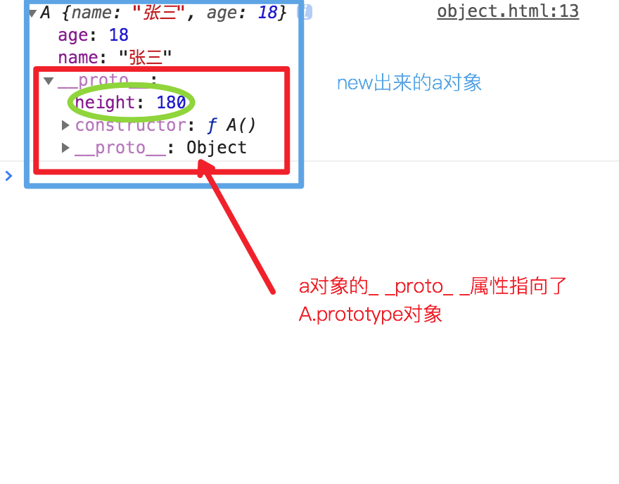

# Object

## 原型链
### 原理
1. 每个function上都有一个prototype属性，指向一个对象，叫做**原型对象**
2. 原型对象上又有一个constructor属性能够找到他的function
    * constructor 是用 new 关键字调用时才会调用，主要做四件事：
        > 1. 生成一个新的对象 {}
        > 2. 给这个对象添加一个属性 _ _ _proto_ _ _  = function的prototype;
        > 3. function 的this绑定到这个对象上去执行
        > 4. **返回新生对象（所以新对象就有一个属性指向了这个function的prototype），就能说他的原型链上能找到这个function的原型对象**
```html
<head>
    <title>Document</title>
</head>
<body>
    <script>
        function A() {
            this.name = '张三';
            this.age = 18;
        }
        let a = new A();

        // 原型链判断理论（需要递归查找）
        console.log(a.__proto__.constructor === A); // true
        console.log(a.__proto__.constructor.name === 'A'); // true
        console.log(a instanceof A); // true
    </script>
</body>
</html>
```

### 证明
1. new出来的对象能够通过_ _ _proto_ _ _ 属性找到function的 prototype 对象
2. prototype对象里又有一个constructor函数
3. constructor函数有一个name属性，能够拿到函数名
4. constructor还有一个_ _ _proto_ _ _ 属性，又指回它的原型对象（循环指向）
:::: tabs
::: tab label=示意图

:::
::: tab label=代码
```html
<head>
    <title>Document</title>
</head>
<body>
    <script>
        function A() {
            this.name = '张三';
            this.age = 18;
        }
        A.prototype.height = 180;

        let a = new A();
        console.log(a);
    </script>
</body>
```
:::
::: tab label=证明1
* new出来的对象能够通过_ _ proto _ _ 属性找到function的 prototype 对象  
---

:::
::: tab label=证明2、3
* prototype对象里又有一个constructor函数  
* constructor函数有一个name属性，能够拿到函数名  
---

:::
::: tab label=证明4
* 循环指向  
---

:::
::::