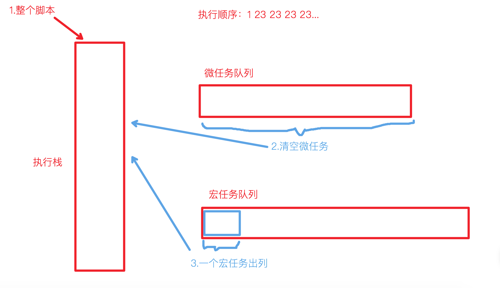
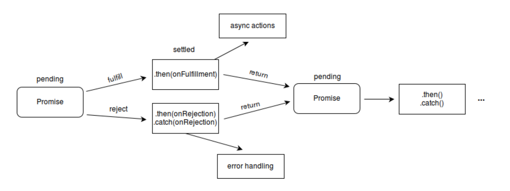
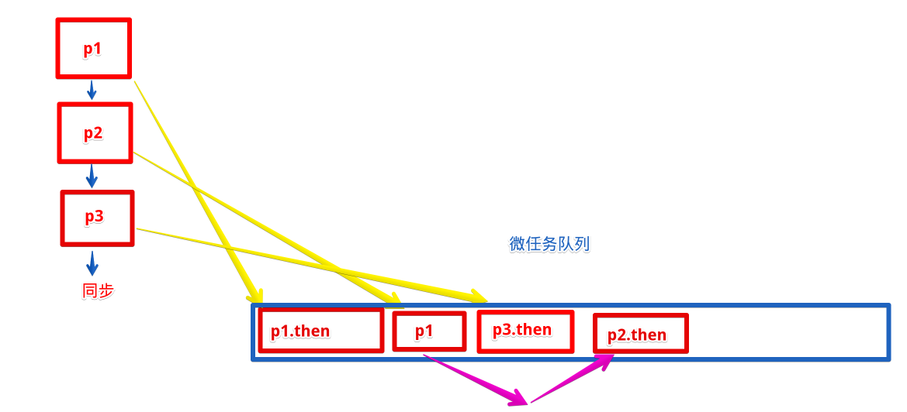
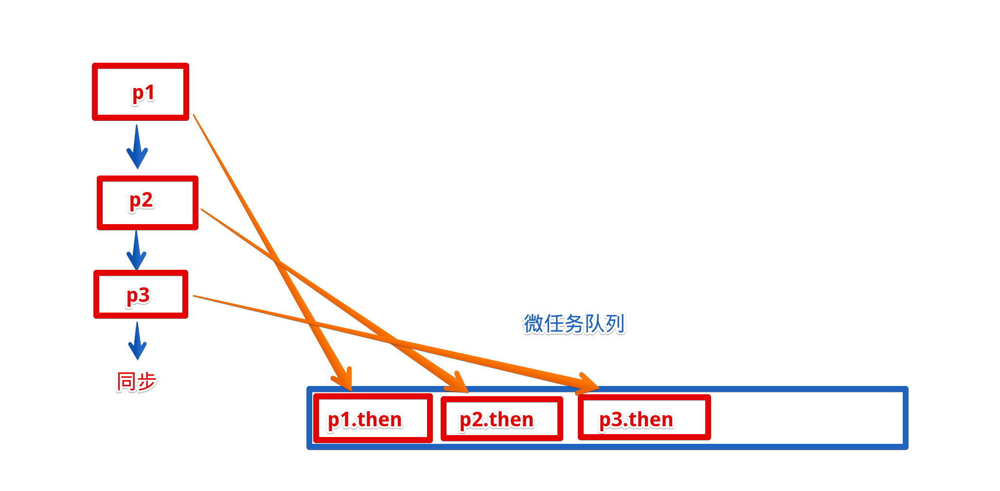

## 浏览器的JS异步
### 宏任务/微任务
::: tip 概念
* js是单线程语言，执行顺序是单线程异步模型，所以有宏任务/微任务机制来处理异步操作
* 三种机制任务：同步任务、（异步）宏任务、（异步）微任务
* 宏任务：以下任务`的回调函数`
    1. I/O
    2. setTimeout
    3. setInterval
    4. requestAnimationFrame
    5. setImmediate
* 微任务
    1. process.nextTick
    2. Promise.then / .catch / .finally
    3. async/await
    4. MutationObserver
:::
::: warning
* 注意区分，setTimeout自身并不是宏任务，宿主环境将setTimeout的回调任务推入延迟队列。
* 延迟队列中计时到了，才会将回调函数推入宏任务队列
* 其他同理
:::
:::: tabs
::: tab label=概念图
1. 整个script脚本作为同步任务推入执行栈
    * 遇到宏任务推入宏任务队列
    * 遇到微任务推入微任务队列
2. 本轮事件执行完毕后，将微任务队列全部按序推入执行栈
3. 微任务队列队列清空后，宏任务的第一个任务出列
4. 再清空微任务队列，再出列一个宏任务...

:::
::: tab label=宏任务证明
* setTimeout一秒后进入宏任务队列
* 同步任务执行了两秒（多）
> 结果宏任务还是等到同步任务执行完毕才执行
```js{2,6}
// 异步操作等一秒
setTimeout(() => console.log('setTimeout'), 1000);

// 同步操作等2秒
const current = Date.now();
while(Date.now() < current + 2000) {}
console.log('同步');

// 最后还是同步先输出
/**
 * 同步
 * setTimeout
 */
```
:::
::: tab label=微任务证明
* 无论定义顺序怎样，总是同步任务 -> 微任务 -> 宏任务
    1. 同步代码执行完，宏任务和微任务2直接进队列
    2. 微任务2、宏任务执行完
    3. 1秒后微任务1才被推进微任务队列
```js
setTimeout(() => console.log('宏任务'), 0);
const p1 = new Promise(resolve => setTimeout(resolve, 1000)).then(res => console.log('微任务1'));
const p2 = Promise.resolve().then(res => console.log('微任务2'));
console.log('同步任务');

/**
 * 同步任务
 * 微任务2
 * 宏任务
 * 微任务1
 */
```
:::
::::
### 浏览器多线程
* JS引擎线程
* GUI渲染线程（渲染页面）
* 事件触发线程
* 定时器触发线程
* http请求线程
* 其他线程

### 递归函数的风险
* 递归函数是函数调用自身。
* 递归函数是有风险的。因为递归函数会触发大量的栈帧堆积，让执行栈高度很高，可能会触发栈溢出。
* 优化
    1. 尾调用优化
    2. 将递归写成同步函数(while)
    3. 递归函数放到异步函数里面(会一直变换任务队列，会比同步代码慢)
:::: tabs
::: tab label=递归爆栈
* 实现阶乘函数
* 递归函数如果没被释放会有`栈帧`，根据环境栈会有上限值，超过就会出现爆栈
```js
function factorial(i) {
    console.log(i);
    return i === 1 ? i : i * factorial(i -1);
}
console.log(factorial(100000));
/**
 * ...
 * 88702
 * RangeError: Maximum call stack size exceeded
 */
```
:::
::: tab label=尾调用优化
* 尾调用优化：函数return递归函数，本函数不依赖递归函数的返回值做计算，本函数就会被释放。
> 目前没有环境支持JS尾调用优化写法，但是可以用异步配合将其实现，防止爆栈
* 递归返回一个计时器，以参数的形式传递了计算值，没有与本函数变量计算的地方，所以本轮调用栈清空，进入下一轮事件轮询
* 返回Promise，让外部能拿到最终计算的值
```js{4-11}
// setTimeout配尾调用优化
function factorial(i) {
    return new Promise(resolve => {
        const deepFn = (num, total) => {
            console.log(num);
            if (num === 1) {
                return resolve(total);
            }
            total = total * num;
            return setTimeout(() => deepFn(num - 1, total));
        }

        return i <= 1 ? Promise.resolve(i) : deepFn(i, 1);
    })
}
factorial(100000).then(res => console.log(res));
/**
 * 3
 * 2
 * 1
 * Infinity
 */
```
:::
::: tab label=while优化
* setTimeout是将事件存储到宿主环境的延迟列表里面，存取效率会比较低
* 用while将递归函数换成同步执行的代码也能实现同样的目标，效率会高很多（mac2014十倍左右）
```js{6-14}
// while优化
function factorial(i) {
    if (i <= 1) {
        return i;
    }
    let total = i;
    while(--i !== 1) {
        console.log(i);
        total = total * i;
    }
    return total;
}

console.log(factorial(100000));
/**
 * 3
 * 2
 * 1
 * Infinity
 */
```
:::
::: tab label=promise异步优化
* 每层的promise拿到上层的结果再做计算
```js
// promise优化
function factorial(i) {

    // 一直变换当前的promise值，做动态定义then回调
    let cPromise = Promise.resolve(i);
    while(--i > 1) {
        console.log(i);

        // 外层的i是入参，是一直在变化的，里面再定义一个块级的i，给每个Promise自调用
        const scopedI = i;
        cPromise = cPromise.then(res => res * scopedI);
    }
    return cPromise;
}

factorial(1000000).then(res => console.log(res));
/**
 * ...
 * 3
 * 2
 * 1
 * Infinity
 */
```
:::
::::
### 宏任务
:::: tabs
::: tab label=setTimeout
* 调用：setTimeout(fn, time[, args...])
```js
function say(name, age) {
    console.log(`我叫${name}，我今年${age}岁啦！`);
}
setTimeout(say, 2000, 'hdy', 18); // (...2s后) 我叫hdy，我今年18岁啦！
```
* 可以用clearTimeout清除
```js
const timer = setTimeout(() => console.log('不会执行'), 2000);
clearTimeout(timer); // 计时器被清除，无打印
```
:::
::: tab label=setInterval
* 调用：setInterval(fn, time[, args...])
```js
function say(name, age) {
    console.log(`我叫${name}，我今年${age}岁啦！`);
}
setInterval(say, 2000, 'hdy', 18); // (每隔2s) 我叫hdy，我今年18岁啦！
```
* 可以用clearInterval清除
```js
const timer = setInterval(() => console.log('不会执行'), 2000);
clearInterval(timer); // 计时器被清除，无打印
```
:::
::: tab label=循环选择
* setTimeout保证等待time后执行
* setInterval在每次执行完后再计时
> 如果要保证每次的间隔的话可以选择setTimeout递归
```js
// 等两秒推一个宏任务，但是每个任务执行了1秒，宏任务在最下面递归调用，就能标准的等2秒
const run = () => {
    const now = Date.now();
    const end = now + 1000;
    console.log(now);
    while(Date.now() < end) {}
    console.log('本人耗时1秒，要求间隔两秒执行');
    setTimeout(run,2000);
}
setTimeout(run, 2000);
```
* setInterval
```js
// 隔两秒把回调函数推入一次调用栈，但是函数自己执行了一秒，所以看起来函数执行间隔少了一秒
setInterval(() => {
    const now = Date.now();
    const end = now + 1000;
    console.log(now);
    while(Date.now() < end) {}
    console.log('本人未耗时1秒，要求间隔两秒执行');
}, 2000);
```
:::
::: tab label=requestAnimationFrame
* requestAnimationFrame是setInterval的升级版，解决了一些循环上的问题,会在浏览器重新加载指定代码之前执行代码块，从而允许动画以适当的帧速率运行
>只有浏览器支持
* 在动画函数最后用requestAnimationFrame在下次重绘前调用自己
* 入参：Function，并传入了一个时间戳
```js
function draw(timeStamp) {
    console.log(timeStamp)
   
   // Drawing code goes here

   requestAnimationFrame(draw);
}

const now = Date.now();
draw(now);
```
* 撤销
```js
const timer;
function draw(timeStamp) {
   timer = requestAnimationFrame(draw);
}
draw();

cancelAnimationFrame(timer);
```
:::
::::
## nodeJS的异步
* nodejs只有轮询机制
* `process.nextTick`为这一次轮询的末尾执行
* `setImmediate`为下一次轮询开始执行
* `setTimeout`加到下次轮询执行队列内
```js
console.log(1);
setTimeout(() => console.log(5));
setImmediate(() => console.log(4));
process.nextTick(() => console.log(3));
console.log(2);

// 打印 1 2 3 4 5
```
## 方法
### Promise
::: tip 构造器
* 调用：new Promise((resolve, reject) => {})
* 入参：Function
* 返回：Promise对象
:::
::: warning 状态
* Promise有三种状态，不可逆转   
pending -> fulfilled  
pending -> rejected

:::
:::: tabs
::: tab label=使用
* 接收参数是一个函数，函数有resolve和reject两个入参
* new Promise/then/catch返回的是Promise，所以能链式调用
* 无论返回的是什么都会被包装成promise，undefined也是
* 一个promise返回了异常，调用本Promise后面的catch函数，catch函数还可以返回fulfilling的promise
* resolve()触发状态 -> fulfilling，将then()方法的入参函数推入微任务队列
* reject()触发状态 -> rejected，将catch()方法推入微任务队列，且不再执行后续的then方法，因为不可逆
```js{5-8}
new Promise((resolve, reject) => {
    console.log('同步任务');
    resolve();
    console.log('同步任务2');
}).then(res => console.log('默认返回一个已满足的promise'))
.then(res => Promise.reject('状态转换成了rejected，后面的then不执行，直接跳到catch'))
.then(_ => console.log('不执行'))
.catch(err => console.log(err));

/**
 * 同步任务
 * 同步任务2
 * 默认返回一个已满足的promise
 * 状态转换成了rejected，后面的then不执行，直接跳到catch
 */
```
:::
::: tab label=状态不可逆
* 每个Promise只能转换一次状态，不可逆
```js
new Promise((resolve, reject) => {
    resolve('111');
    reject('222'); // 无效状态转换
    console.log('333');
}).then(res => console.log(res))
.catch(err => console.log(err));

/**
 * 333
 * 111
 */ 
```
:::
::: tab label=互不影响
* 一个promise变成了rejected，调用本Promise后面的catch函数，catch函数还可以返回fulfilling的promise
```js
new Promise((resolve, reject) => {
    resolve('111');
}).then(res => Promise.reject('失败的promise1'))
.then(
    res => {},
    err => {
        console.log(err)
        return Promise.reject('失败的promise2')
    }
).then(
    res => {},
    err => {
        console.log(err);
        return new Promise(resolve => resolve('成功的promise3'));
    }
).then(res => console.log(res));
/**
 * 失败的promise1
 * 失败的promise2
 * 成功的promise3
 */
```
:::
::::
### then
::: tip
* 作用：Promise对象状态发生改变后的回调函数
* 定义：promise.then(res => {}[, err => {}])
* 入参：Function[, Function]
* 返回：Promise
* tip：第一个入参是状态变为fulfilling的回调，第二个入参是状态变为rejected的回调
:::
:::: tabs
::: tab label=使用
```js
const promise = new Promise((resolve, reject) => {
    resolve('满足1');
}).then(res => {
    console.log(res);
    return Promise.reject('拒绝2')
}).then(res => {}, err => console.log(err));
/**
 * 满足1
 * 拒绝2
 */
```
:::
::: tab label=链式调用
```js
new Promise(resolve => resolve(1))
.then(res => Promise.resolve(res + 1))
.then(res => Promise.resolve(res + 1))
.then(res => Promise.resolve(res + 1))
.then(res => Promise.resolve(res + 1))
.then(res => console.log(res)) // 5
```
:::
::: tab label=返回值
* 返回值一定是一个Promise，如果不是，会被包装成一个已resolve的Promise，值是return的值
```js
new Promise(resolve => resolve('同步代码'))
.then(res => console.log(res)) // 同步带吗
.then(res => console.log(res)) // undefined
```
:::
::::
### catch
::: tip
* 作用：promise状态变rejected或抛出异常时调用
* 定义：promise.catch(err => {})
* 定义2：promise.then(undefined, err => {})
* 入参：Function
* 返回：Promise
:::
:::: tabs
::: tab label=使用
```js
new Promise((resolve, reject) => reject('Some error!'))
.then(undefined, err => console.log(err)); // Some error

Promise.reject('Some error 2!')
.catch(err => console.log(err)); // Some error 2!
```
:::
::: tab label=捕获错误
* 注：箭头函数后直接throw不能省略大括号
```js
new Promise(resolve => {throw 'error!'})
.catch(err => console.log(err)); // error
```
:::
::: tab label=返回值
* 返回值一定是一个Promise，如果不是，会被包装成一个已fulfilling的promise
```js
new Promise(resolve => {throw 'error!'})
.catch(err => console.log(err)) // error
.then(res => console.log('---')) // ---
```
:::
::::
### finally
::: tip
* 作用：无论状态变成什么，最后都会执行的一个回调
* 定义：promise.finally(callback)
* 入参：Function
* 返回：Promise
:::
:::: tabs
::: tab label=使用
* 无论最后状态是什么都会调用
```js{4}
new Promise(resolve => {
    resolve('11');
}).then(res => console.log(res))
.finally(arg => console.log(arg))
```
:::
::: tab label=链式
```js{8,12}
Promise.resolve('11')
.then(res => console.log(res))
.then(_ => {throw '22'})
.catch(err => {
    console.log(err);
})
.then(_ => {throw '33'})
.then(_ => {throw '44'}) // 前面Promise已经reject，不会执行
.catch(err => {  // 执行
    console.log(err);
})
.finally(() => console.log('一定会执行')); // 执行
/**
 * 11
 * 22
 * 33
 * 一定会执行
 */
```
:::
::::
## 静态方法
### all
::: tip
* 作用：将多个Promise包装成一个Promise
* 调用：Promise.all(promiseArr)
* 入参：Iterator
* 返回：Promise
:::
::: warning
* .then的回调函数接受的参数是所有promise的resolve结果数组（有序）
* .catch是任意一个入参promise被reject或抛出错误就会执行
:::
:::: tabs
::: tab label=then
* then接收的是所有promise的resolve结果数组
```js
const p1 = new Promise(resolve => setTimeout(() => resolve('1'), 1000));
const p2 = new Promise(resolve => setTimeout(() => resolve('2'), 2000));

const all = Promise.all([p1, p2]);
all.then(res => console.log(res)); // [ '1', '2' ]
```
::: 
::: tab label=catch
* 任意一个入参promise抛出异常或reject都会导致整体的包装Promise被reject
* reject接受的参数是抛出的异常或reject的值
```js{2}
const p1 = new Promise(resolve => setTimeout(() => resolve('1'), 1000));
const p2 = new Promise((resolve, reject) => setTimeout(() => reject('2'), 2000));

const all = Promise.all([p1, p2]);
all.then(undefined, err => console.log(err)); // 2
```
* 抛出异常
```js{2}
const p1 = new Promise(resolve => setTimeout(() => resolve('1'), 1000));
const p2 = new Promise((resolve, reject) => setTimeout(() => {throw 'err'}, 2000));

const all = Promise.all([p1, p2]);
all.then(undefined, err => console.log(err)); // err
```
:::
::::
### any
::: warning 未完全支持
|环境|版本|
|---|---|
|chrome|85|
|node|15.0|
:::
::: tip any
* 作用：接收一个可迭代的promise集合，只返回第一个成功的promise结果
:::
::: warning 与race区别
* race就是要第一个结果，无论是成功还是失败
:::
### race
::: tip
* 作用：接收一个promise集合，采用第一个状态改变的promise的结果作为整体的结果
* 定义：Promise.race(promiseArr)
* 入参：Iterator
* 返回：Promise
:::
:::: tabs
::: tab label=then
* 只要第一个出结果的，但是其他promise还是会执行完毕
```js{4}
// p2先出结果，所以race是返回的 p2的结果。但是p1也会执行完
const p1 = new Promise(resolve => setTimeout(() => resolve('1'), 2000));
const p2 = new Promise(resolve => setTimeout(() => resolve('2'), 500));

const race = Promise.race([p1, p2]);
race.then(res => console.log(res)); // 2
```
:::
::: tab label=catch
```js
const p1 = new Promise(resolve => setTimeout(() => resolve('1'), 2000));
const p2 = new Promise((resolve, reject) => setTimeout(() => reject('err'), 500));

const race = Promise.race([p1, p2]);
race.catch(err => console.log(err)); // err
```
:::
::::
### allSettled
::: tip
* 作用：收集一个promise集合，等所有的promise状态都发生转变了，将所有的promise结果包装起来返回**无论是成功还是失败**
* 定义：Promise.allSettled(promiseArr)
* 入参：Iterator
* 返回：Promise
* tip：和all区别：all有失败就只返回失败的结果
* tip：选择：promise之间有相互依赖选all；无依赖，只是并发选allSettled
:::
:::: tabs
::: tab label=then
```js
const p1 = new Promise(resolve => setTimeout(() => resolve('1'), 1000));
const p2 = new Promise(resolve => setTimeout(() => resolve('2'), 2000));

const allSettled = Promise.allSettled([p1, p2]);
allSettled.then(res => console.log(res));
/**
 * [
 *   { status: 'fulfilled', value: '1' },
 *   { status: 'fulfilled', value: '2' }
 * ]
 */
```
:::
::: tab label=catch
* 无论入参promise集合有多少成功失败，allSettled最后都是返回成功，并返回所有的状态
```js
const p1 = new Promise(resolve => setTimeout(() => resolve('1'), 1000));
const p2 = new Promise((resolve, reject) => setTimeout(() => reject('err'), 2000));

const allSettled = Promise.allSettled([p1, p2]);
allSettled.then(res => console.log(res));
/**
 * [
 *   { status: 'fulfilled', value: '1' },
 *   { status: 'rejected', reason: 'err' }
 * ]
 */
```
:::
::::
### resolve
::: tip
* 作用：返回一个以给定值解析后的Promise对象
* 定义：Promise.resolve(promise)
* 入参：[Promise | thenable]（当做本promise.resovle的返回） | any（被当做resolve的值）
* 返回：Promise
:::
::: warning 入参
* 入参有两种情况
    1. Promise/thenble
    2. other
* Promise/thenable会被当做Promise.resolve(promise) 的返回处理。也就是直接入参当做返回值
* other会被当做本Promise成功时resolve的值。也就是返回一个新的Promise，resolve(other)
:::
:::: tabs
::: tab label=promise
```js{3,4,6-7}
const p = new Promise(resolve => setTimeout(() => resolve('1'), 2000));

// 由于p是promise，所以resolve接受到的就是p
const resolve = Promise.resolve(p);

console.log(resolve === p); // true
resolve.then(res => console.log(res)); // 1
```
:::
::: tab label=other
```js{3,4,6-7}
const p = () => console.log('非Promise');

// 由于p不是promise，所以返回值被包装成了一个已经fulfilling的Promise，传递value就是p
const resolve = Promise.resolve(p);

console.log(resolve === p); // false
resolve.then(res => console.log(res)); // [Function: p]
```
:::
::: tab label=异步入参机制
* Promise.resolve(value)实际上就是new Promise(resolve => resolve(value))
>对比1：Promise.resolve(value) 的 value 为 Promise。  
>p2发现入参p1是promise，就将p1推入了微任务队列，而p1存的是p1这一行的promise.then返回的**pending状态的promise**，也就是要等p1行的promise.then执行完后才能将p2后续的then推入微任务队列


```js{3-5}
const p1 = new Promise(resolve => resolve(1)).then(res => console.log(res));

// 返回promise的情况下会推promise进微任务队列，promise执行完了才执行.then。
// new Promise和Promise.resolve结果一样
const p2 = Promise.resolve(p1).then(res => console.log(2));
// const p2 = new Promise(resolve => resolve(p1)).then(res => console.log(2));

const p3 = new Promise(resolve => resolve(3)).then(res => console.log(res));

console.log('同步');
/**
 * 同步
 * 1
 * 3
 * 2
 */
```
:::
::: tab label=同步入参机制
* Promise.resolve入参是同步代码时，那么会直接resolve(value)，将自己的then推入微任务队列

```js{6-7}
const p1 = new Promise(resolve => {
    console.log('p1代码')
    resolve(1)
}).then(res => console.log(res));

// 同步代码，直接将 then 的回调推入微任务队列，并且入参为resolve的值
Promise.resolve(2).then(res => console.log(res));
// new Promise(resolve => resolve(2)).then(res => console.log(res));

const p3 = new Promise(resolve => resolve(3)).then(res => console.log(res));

console.log('同步');
/**
 * p1同步代码
 * 同步
 * 1
 * 2
 * 3
 */
```
:::
::::
### reject
::: tip
* 作用：reject返回一个带有拒绝原因的Promise对象
* 定义：Promise.reject(reason)
* 入参：any
* 返回：Promise
:::
:::: tabs
::: tab label=使用
```js
const p = Promise.reject('err');
p.catch(reason => console.log(reason)); // err
```
:::
::::