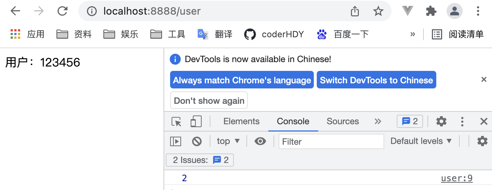

# storage
## 对比
::: tip localStorage和sessionStorage
|特性|localStorage|sessionStorage|
|---|---|---|
|有效时长|永久|当前浏览器会话关闭即消失|
|存储类型|String|String|
|访问限制|同源策略|同源策略|
:::
:::: tabs
::: tab label=localStorage
```js{14-15,29}
const express = require('express');
const app = new express();
app.listen(8888,() => {
    console.log('listen 8888');
});

app.get('/', (req, res) => res.send(`
<body>
    <div>首页</div>

    <script>
        const userId = '123456';
        const userName = 'hdy';
        localStorage.setItem('userId', userId);
        localStorage.setItem('userName', userName);
        setTimeout(() => window.open('http://localhost:8888/user', "_self"), 2000)
    </script>
</body>
`));

app.get('/user', (req, res) => res.send(`
<body>
    <div>用户：</div>

    <script>
        const userId = localStorage.getItem('userId');
        const div = document.querySelector('div');
        div.append(userId);
        console.log(localStorage.length); // 2
    </script>
</body>
`));
```
* 关闭浏览器，再直接进 http://localhost:8888/user，发现还是一样的输出，说明数据长期存在

:::
::: tab label=sessionStorage
```js{14-15,29}
const express = require('express');
const app = new express();
app.listen(8888,() => {
    console.log('listen 8888');
});

app.get('/', (req, res) => res.send(`
<body>
    <div>首页</div>

    <script>
        const userId = '123456';
        const userName = 'hdy';
        sessionStorage.setItem('userId', userId);
        sessionStorage.setItem('userName', userName);
        setTimeout(() => window.open('http://localhost:8888/user', "_self"), 2000)
    </script>
</body>
`));

app.get('/user', (req, res) => res.send(`
<body>
    <div>用户：</div>

    <script>
        const userId = sessionStorage.getItem('userId');
        const div = document.querySelector('div');
        div.append(userId);
        console.log(sessionStorage.length); // 2
    </script>
</body>
`));
```
* 关闭浏览器，再直接进 http://localhost:8888/user，发现输出不一样，说明数据删除了

:::
::::
## setItem
::: tip setItem
* 作用：设置storage键值对
* 调用：localStorage.setItem(key, value)
* 入参：String, String
* 返回：undefined
:::
```html
<body>
    <div>首页</div>

    <script>
        const userId = '123456';
        const userName = 'hdy';
        sessionStorage.setItem('userId', userId);
        sessionStorage.setItem('userName', userName);

        console.log(sessionStorage.length); // 2
    </script>
</body>
```
## getItem
::: tip getItem
* 作用：拿到某一项的值，没有返回null
* 调用：localStorage.getItem(key)
* 入参：String
* 返回：String | null
:::
```html
<body>
    <div>首页</div>

    <script>
        const userId = '123456';
        const userName = 'hdy';
        sessionStorage.setItem('userId', userId);
        sessionStorage.setItem('userName', userName);

        console.log(sessionStorage.getItem('userName')); // hdy
    </script>
</body>
```
## length
::: tip length
* 作用：存储在当前的storage对象中的键值对数量
* 值：Number
:::
```js
console.log(localStorage.length);
console.log(sessionStorage.length);
```
## key
::: tip key
* 作用：拿到某个索引的键
* 调用：localStorage.key(num)
* 入参：Number
* 返回：String
:::
```html{9}
<body>
    <div>首页</div>

    <script>
        const userId = '123456';
        const userName = 'hdy';
        sessionStorage.setItem('userId', userId);
        sessionStorage.setItem('userName', userName);
        console.log(sessionStorage.key(1)); // userName
    </script>
</body>
```
## removeItem
::: tip removeItem
* 作用：移除某一个键值对
* 调用：localStorage.removeItem(key)
* 入参：String
* 返回：String | null
:::
## clear
::: tip clear
* 作用：清空storage
* 调用：localStorage.clear()
* 返回：undefined
:::
