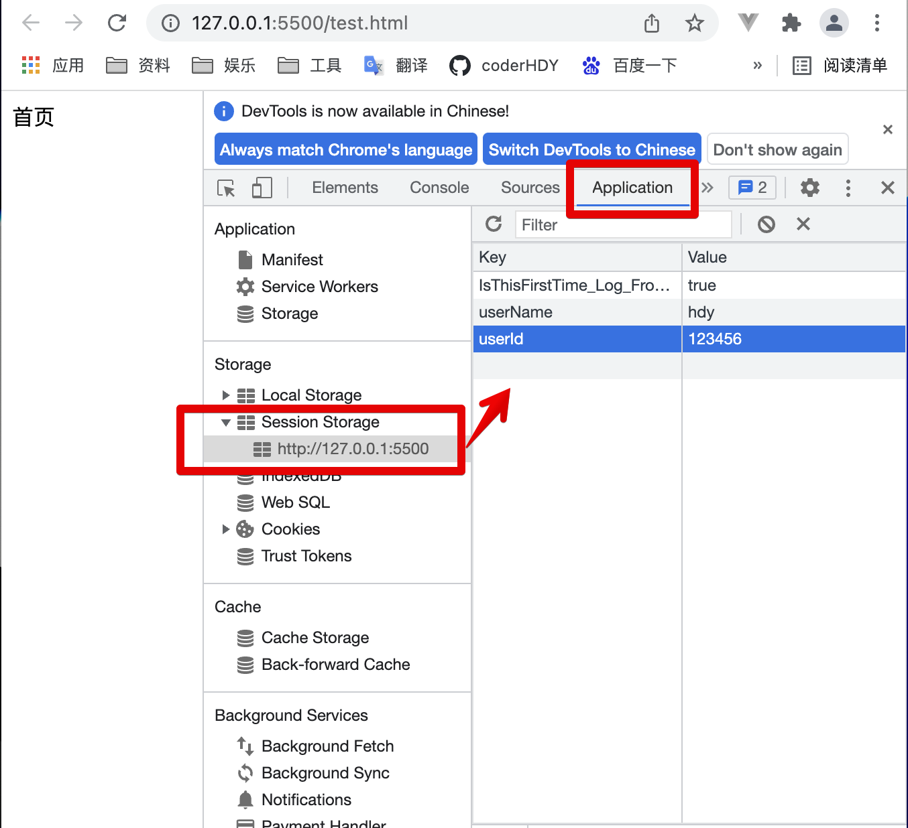
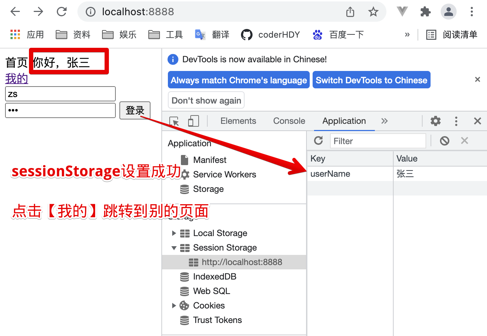
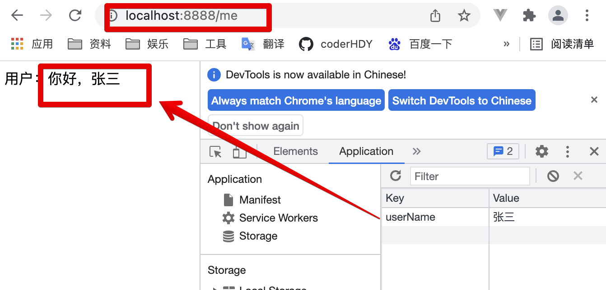

# storage
## 对比
::: tip localStorage和sessionStorage
|特性|localStorage|sessionStorage|
|---|---|---|
|有效时长|永久|当前浏览器会话关闭即消失|
|存储类型|String|String|
|访问限制|同源策略|同源策略|
:::
:::: tabs
::: tab label=localStorage
```js{14-15,29}
const express = require('express');
const app = new express();
app.listen(8888,() => {
    console.log('listen 8888');
});

app.get('/', (req, res) => res.send(`
<body>
    <div>首页</div>

    <script>
        const userId = '123456';
        const userName = 'hdy';
        localStorage.setItem('userId', userId);
        localStorage.setItem('userName', userName);
        setTimeout(() => window.open('http://localhost:8888/user', "_self"), 2000)
    </script>
</body>
`));

app.get('/user', (req, res) => res.send(`
<body>
    <div>用户：</div>

    <script>
        const userId = localStorage.getItem('userId');
        const div = document.querySelector('div');
        div.append(userId);
        console.log(localStorage.length); // 2
    </script>
</body>
`));
```
* 关闭浏览器，再直接进 http://localhost:8888/user，发现还是一样的输出，说明数据长期存在

:::
::: tab label=sessionStorage
```js{14-15,29}
const express = require('express');
const app = new express();
app.listen(8888,() => {
    console.log('listen 8888');
});

app.get('/', (req, res) => res.send(`
<body>
    <div>首页</div>

    <script>
        const userId = '123456';
        const userName = 'hdy';
        sessionStorage.setItem('userId', userId);
        sessionStorage.setItem('userName', userName);
        setTimeout(() => window.open('http://localhost:8888/user', "_self"), 2000)
    </script>
</body>
`));

app.get('/user', (req, res) => res.send(`
<body>
    <div>用户：</div>

    <script>
        const userId = sessionStorage.getItem('userId');
        const div = document.querySelector('div');
        div.append(userId);
        console.log(sessionStorage.length); // 2
    </script>
</body>
`));
```
* 关闭浏览器，再直接进 http://localhost:8888/user，发现输出不一样，说明数据删除了

:::
::: tab label=浏览器查看

:::
::::
## setItem
::: tip setItem
* 作用：设置storage键值对
* 调用：localStorage.setItem(key, value)
* 入参：String, String
* 返回：undefined
:::
```html{7-8}
<body>
    <div>首页</div>

    <script>
        const userId = '123456';
        const userName = 'hdy';
        sessionStorage.setItem('userId', userId);
        sessionStorage.setItem('userName', userName);

        console.log(sessionStorage.length); // 2
    </script>
</body>
```
## getItem
::: tip getItem
* 作用：拿到某一项的值，没有返回null
* 调用：localStorage.getItem(key)
* 入参：String
* 返回：String | null
:::
```html{10}
<body>
    <div>首页</div>

    <script>
        const userId = '123456';
        const userName = 'hdy';
        sessionStorage.setItem('userId', userId);
        sessionStorage.setItem('userName', userName);

        console.log(sessionStorage.getItem('userName')); // hdy
    </script>
</body>
```
## length
::: tip length
* 作用：存储在当前的storage对象中的键值对数量
* 值：Number
:::
```html{10-12}
<body>
    <div>首页</div>

    <script>
        const userId = '123456';
        const userName = 'hdy';
        sessionStorage.setItem('userId', userId);
        sessionStorage.setItem('userName', userName);

        console.log(sessionStorage.length); // 2
        sessionStorage.removeItem('userName');
        console.log(sessionStorage.length); // 1
    </script>
</body>
```
## key
::: tip key
* 作用：拿到某个索引的键
* 调用：localStorage.key(num)
* 入参：Number
* 返回：String
:::
```html{9}
<body>
    <div>首页</div>

    <script>
        const userId = '123456';
        const userName = 'hdy';
        sessionStorage.setItem('userId', userId);
        sessionStorage.setItem('userName', userName);
        console.log(sessionStorage.key(1)); // userName
    </script>
</body>
```
## removeItem
::: tip removeItem
* 作用：移除某一个键值对
* 调用：localStorage.removeItem(key)
* 入参：String
* 返回：String | null
:::
```html{8-10}
<body>
    <div>首页</div>

    <script>
        const userName = 'hdy';
        sessionStorage.setItem('userName', userName);

        console.log(sessionStorage.getItem('userName')); // hdy
        sessionStorage.removeItem('userName');
        console.log(sessionStorage.getItem('userName')); // null
    </script>
</body>
```
## clear
::: tip clear
* 作用：清空storage
* 调用：localStorage.clear()
* 返回：undefined
:::
```html{10-12}
<body>
    <div>首页</div>

    <script>
        const userId = '123456';
        const userName = 'hdy';
        sessionStorage.setItem('userId', userId);
        sessionStorage.setItem('userName', userName);

        console.log(sessionStorage.length); // 2
        sessionStorage.clear();
        console.log(sessionStorage.length); // 0
    </script>
</body>
```
## 遍历
::: tip 遍历storage
* 思路：利用length拿下标，key用下标拿键名，getItem拿值
:::
```html{10-19}
<body>
    <div>首页</div>

    <script>
        const userId = '123456';
        const userName = 'hdy';
        sessionStorage.setItem('userId', userId);
        sessionStorage.setItem('userName', userName);

        function getAllSessionStorage() {
            const len = sessionStorage.length;
            const ans = [];
            for (let i = 0; i < len; i++) {
                const key = sessionStorage.key(i);
                const val = sessionStorage.getItem(key);
                ans.push([key, val]);
            }
            return ans;
        }

        console.log(getAllSessionStorage());
    </script>
</body>
```
## 应用
* 一些应用场景实例
:::: tabs
::: tab label=每日问好
* 每天第一次打开此网页会问好
```html{9-12}
<body>
    <div>首页</div>

    <script>
        ;(function sayHello() {
            const lastSay = localStorage.getItem('lastSay');
            const today =  new Date().toLocaleDateString();
            const hour = +new Date().getHours();
            if (!lastSay || (lastSay !== today && hour > 8)) {
                alert('hello，今天是：' + today);
                localStorage.setItem('lastSay', today);
            }
        })();
    </script>
</body>
```
:::
::: tab label=登录网页
* 有两个网页，【/】和【/user】，登录成功后设置sessionStorage，两个页面都能拿到设置的值
```js{21-42,82-87}
const express = require('express');
const app = new express();
app.listen(8888, () => {
    console.log('listen 8888');
});

app.get('/', (req, res) => res.send(`
<body>
    <div id="top">首页</div>
    <div><a href="http://localhost:8888/me">我的<a></div>
    <div id="login-box">
        <input type="text" id="account">
        <input type="password" id="pwd">
        <button id="logBtn">登录</button>
    </div>

    <script>
        const logBtn = document.querySelector('#logBtn');
        logBtn.addEventListener('click', login);

        function login() {
            const account = document.querySelector('#account').value;
            const pwd = document.querySelector('#pwd').value;

            fetch('/login', {
                method: 'POST',
                body: JSON.stringify({account, pwd}),
                headers: {'Content-Type': 'application/json'}
            }).then(res => {
                return res.ok ?  res.json() : return Promise.reject();
            })
            .then(res => {
                const userName = res.userName;
                sessionStorage.setItem('userName', userName);
                const top = document.querySelector('#top');
                top.append(' 你好，' + userName);
            })
            .catch(() => {
                const loginBox = document.querySelector('#login-box');
                loginBox.append('用户不存在或输入不正确！');
            })
        }
    </script>
</body>
`));

app.get('/me', (req, res) => res.send(`
<body>
    <div>用户：</div>

    <script>
        const userName = sessionStorage.getItem('userName');
        const div = document.querySelector('div');
        if (userName) {
            div.append('你好，' + userName);
        } else {
            div.append('你好，请先登录！');
        }
    </script>
</body>
`));

// 模拟数据库
const database = {
    hdy: {
        name: 'hdy',
        age: 18,
        pwd: '123'
    },
    zs: {
        name: '张三',
        age: 20,
        pwd: '456'
    }
}

const bdParser = require('body-parser');
app.use(bdParser.json());
app.use(bdParser.urlencoded({extended: false}));
app.post('/login', (req, res) => {
    const {account, pwd} = req.body;
    if (database[account] && pwd === database[account].pwd) {
        const userName = database[account].name;
        res.send({userName});
    } else {
        res.status(302).send('用户不存在');
    }
});
```
:::
::: tab label=登录网页测试
* 输入正确可以在sessionStorage中添加本次会话用户信息

---
* 点击我的，跳转到别的页面，依旧能拿到本次会话用户的信息

---
* 关闭浏览器，直接打开【localhost:8888/me】，发现登录信息没了

:::
::::