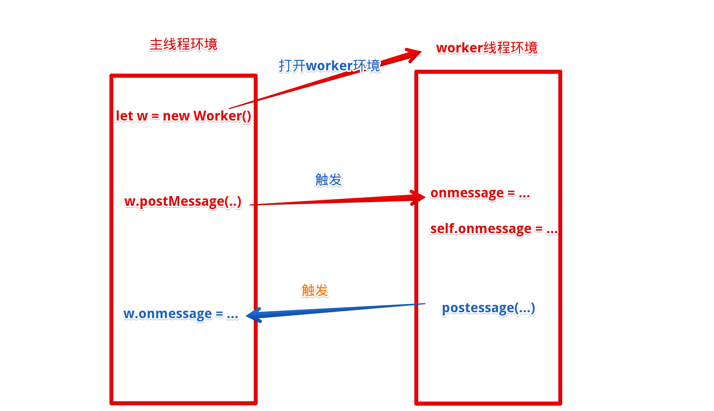
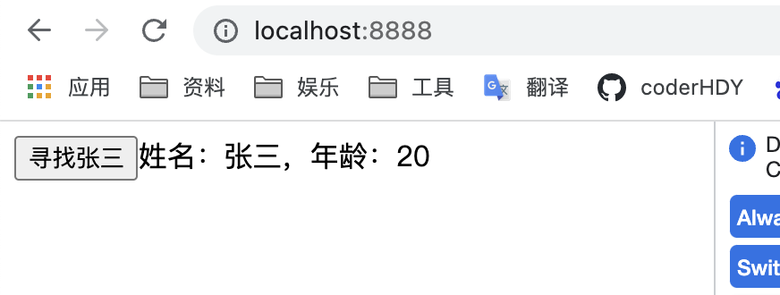

## 介绍
::: tip worker
* 作用：为 JavaScript 创造多线程环境，主线程运行的同时，Worker 线程在后台运行，两者互不干扰
* 限制：
    1. 同源策略
    2. 无法使用document、window、parent，可以navigator对象和location对象
    3. 和主线程不在同一个上下文环境，它们不能直接通信，必须通过消息完成
    4. 不能执行alert()方法和confirm()方法，但可以使用 XMLHttpRequest 对象发出 AJAX 请求
    5. 程无法读取本地文件，即不能打开本机的文件系统（file://），它所加载的脚本，必须来自网络
* 使用：比较消耗资源，使用完就应该关闭
* [官网](https://developer.mozilla.org/zh-CN/docs/Web/API/Web_Workers_API)
:::
## 方法
### 构造函数
::: tip 构造函数
* 调用：new Worker(url[, options])
* 入参：String[, Object]
* options:
    * type: `classic` | module
    * credentials: `omit` | same-origin | include
    * name: String
:::
::: warning
* worker应该是一个网络文件，属于一个半封闭环境，里面可以定义一些方法，和指定的事件监听钩子
* 主线程向worker发送消息或发射事件时会调用定义好的事件钩子
:::
:::: tabs
::: tab label=server.js
```js{7,14}
const express = require('express');
const fs = require('fs');
const path = require('path');
const app = express();
app.listen('8888', () => console.log('listen 8888'));

app.get('/', (req, res) => {
    res.setHeader('Content-Type', 'text/html')
    const url = path.join(__dirname, './test.html');
    const code = fs.readFileSync(url);
    return res.send(code);
})

app.get('/worker', (req, res) => {
    res.setHeader('Content-Type', 'text/javascript')
    const url = path.join(__dirname, './worker.js');
    const code = fs.readFileSync(url);
    res.send(code)
})
```
:::
::: tab label=test.html
```html{9,13}
<head>
    <meta charset="utf-8"> 
</head>
<body>
    <input type="text">
    <button>搜索</button>

    <script>
        var myWorker = new Worker('./worker');
        const input = document.querySelector('input');
        const btn = document.querySelector('button');
        btn.addEventListener('click', () => {
            myWorker.postMessage(input.value);
        })
    </script>
</body>
```
:::
::: tab label=worker.js
* worker线程的环境接收到事件以后触发钩子，打印输入框搜索的值
```js
onmessage = e => {
    console.log(e.data);
}
```
:::
::::
### postMessage
::: tip postMessage
* 作用：
    1. 向worker内发信息，触发内部onmessage钩子
    2. worker环境内部调用，触发主线程的onmessage钩子
* 调用：
    1. worker.postMessage(data[, transferList])
    2. postMessage(data)
* 入参：any[, array]
* tip：第一个参数是任意数据，onmessage会通过事件接受到.第二个参数是所有权转移数组，转移所有权后上下文变更为worker的【一般不用第二个参数】。
:::
:::: tabs
::: tab label=图解

:::
::: tab label=server.js
* 服务器代码
```js
const express = require('express');
const fs = require('fs');
const path = require('path');
const app = express();
app.listen('8888', () => console.log('listen 8888'));

app.get('/', (req, res) => {
    res.setHeader('Content-Type', 'text/html')
    const url = path.join(__dirname, './test.html');
    const code = fs.readFileSync(url);
    return res.send(code);
})

app.get('/worker', (req, res) => {
    res.setHeader('Content-Type', 'text/javascript')
    const url = path.join(__dirname, './worker.js');
    const code = fs.readFileSync(url);
    res.send(code)
})
```
:::
::: tab label=test.html
* 主线程开启worker，点击按钮后向worker环境发送信息
```html{8,13,16-19}
<head>
    <meta charset="utf-8"> 
</head>
<body>
    <button>寻找张三</button>

    <script>
        var myWorker = new Worker('./worker');
        const btn = document.querySelector('button');

        btn.addEventListener('click', () => {
            myWorker.postMessage('zs');
        })

        myWorker.addEventListener('message', (e) => {
            const {name, age} = e.data;
            btn.insertAdjacentText('afterend', `姓名：${name}，年龄：${age}`);
        })
    </script>
</body>
```
:::
::: tab label=worker.js
* worker环境代码，接受到信息后触发事件。
* 又可以向主线程发送信息，触发主线程的worker对象的message事件
* self也可以拿到本环境
```js{1,6,9-11}
onmessage = e => {
    const zs = {
      name: '张三',
      age: 20,
    }
    postMessage(zs);
}

self.addEventListener('message', e => {
  console.log('self也可以拿到本环境');
})
```
:::
::: tab label=效果

:::
::::

### terminate
::: tip terminate
* 作用：立即终止worker线程，**无论内部在执行什么**
* 调用：worker.terminate()
:::
:::: tabs
::: tab label=服务器
```js
const express = require('express');
const fs = require('fs');
const path = require('path');
const app = express();
app.listen('8888', () => console.log('listen 8888'));

app.get('/', (req, res) => {
    res.setHeader('Content-Type', 'text/html')
    const url = path.join(__dirname, './test.html');
    const code = fs.readFileSync(url);
    return res.send(code);
})

app.get('/worker', (req, res) => {
    res.setHeader('Content-Type', 'text/javascript')
    const url = path.join(__dirname, './worker.js');
    const code = fs.readFileSync(url);
    res.send(code)
})
```
:::
::: tab label=test.html
* 开启一个worker，每两秒钟worker会发射事件，但是五秒后就关闭worker
```html{15}
<head>
    <meta charset="utf-8"> 
</head>
<body>
    <button>每秒给我一个张三</button>

    <script>
        var myWorker = new Worker('./worker');
        const btn = document.querySelector('button');

        myWorker.addEventListener('message', (e) => {
            const data = e.data;
            btn.insertAdjacentHTML('afterend', `<div>${data}</div>`);
        })
        setTimeout(() => myWorker.terminate(), 5000)
    </script>
</body>
```
:::
::: tab label=worker.js
```js
setInterval(() => {
  postMessage('我是张三，你找我？');
}, 1000);
```
:::
::: tab label=效果

:::
::::
## 钩子
### onmessage
::: tip onmessage
* 作用：主线程调用postMessage向worker内发送信息时调用
* 定义：onmessage = (e) => console.log(e.data)
:::
### onerror
::: tip onerror
* 作用：传入方法错误时的钩子函数
* 定义：onerror = (e) => console.log(e);
:::
### onmessageerror
::: tip onmessageerror
* 作用：worker收到的消息是不能进行序列化的时候触发
* 定义：onmessageerror = (e) => console.log(e)
:::