## 基本概念
::: tip flex
* 两根轴：主轴和交叉轴
    1. 主轴：flex-direction
    2. 交叉轴：垂直于主轴
* 两根线：起始线和终止线
* flexbox 的特性是沿着主轴或者交叉轴对齐之中的元素。
* 可用空间：父元素【主轴方向的长度】减去【所有子元素相加】
    1. 默认情况下可用空间有剩余会放在最后一个元素之后
    2. 可以修改flex子元素属性来修改可用空间的使用
:::
## flex容器
::: tip display
|值|效果|
|---|---|
|flex|设置默认flex盒子|
:::
:::: tabs
::: tab label=flex
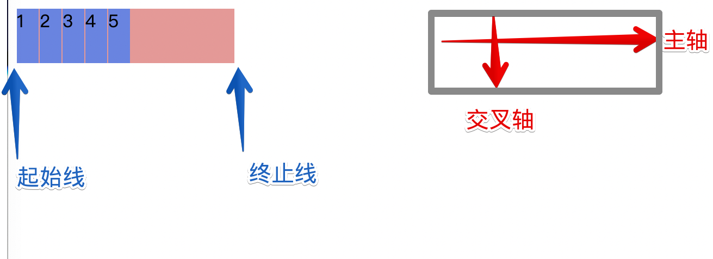

```html{12}
<body>
    <div id='container'>
        <div class='child'>1</div>
        <div class='child'>2</div>
        <div class='child'>3</div>
        <div class='child'>4</div>
        <div class='child'>5</div>
    </div>

    <style>
        #container {
            display: flex;
            background-color: rgb(241, 149, 149);
            height: 50px;
            width: 200px;
        }
        .child {
            background-color: rgb(98, 133, 231);
            width: 20px;
            margin-right: 1px;
        }
    </style>
</body>
```
:::
::::
## flex-direction
::: tip flex-direction
|值|效果|
|---|---|
|row|【默认】横向主轴|
|row-reverse|主轴横向，所有元素倒序排|
|column|主轴纵向|
|column-reverse|主轴纵向且倒序排|
:::
:::: tabs
::: tab label=row-reverse
* reverse的情况下**起始线和终止线互换了**  
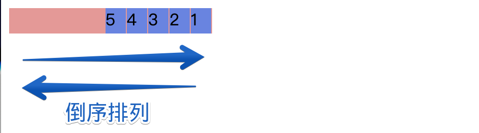

```html{16}
<body>
    <div id='container'>
        <div class='child'>1</div>
        <div class='child'>2</div>
        <div class='child'>3</div>
        <div class='child'>4</div>
        <div class='child'>5</div>
    </div>

    <style>
        #container {
            display: flex;
            background-color: rgb(241, 149, 149);
            width: 200px;
            height: 25px;
            flex-direction: row-reverse;
        }
        .child {
            background-color: rgb(98, 133, 231);
            width: 20px;
            margin-right: 1px;
        }
    </style>
</body>
```
:::
::: tab label=column
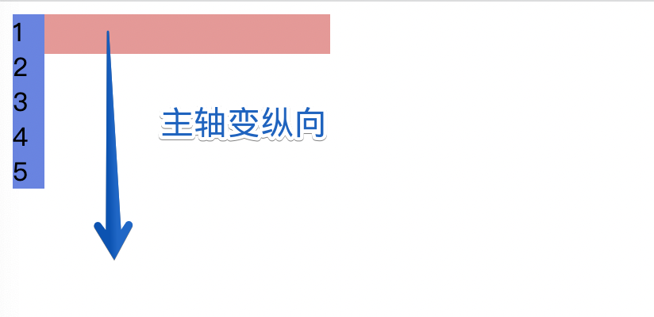

```html{16}
<body>
    <div id='container'>
        <div class='child'>1</div>
        <div class='child'>2</div>
        <div class='child'>3</div>
        <div class='child'>4</div>
        <div class='child'>5</div>
    </div>

    <style>
        #container {
            display: flex;
            background-color: rgb(241, 149, 149);
            width: 200px;
            height: 25px;
            flex-direction: column;
        }
        .child {
            background-color: rgb(98, 133, 231);
            width: 20px;
            margin-right: 1px;
        }
    </style>
</body>
```
:::
::: tab label=column-reverse
* reverse的情况下**起始线和终止线互换了**  


```html{16}
<body>
    <div id='container'>
        <div class='child'>1</div>
        <div class='child'>2</div>
        <div class='child'>3</div>
        <div class='child'>4</div>
        <div class='child'>5</div>
    </div>

    <style>
        #container {
            display: flex;
            background-color: rgb(241, 149, 149);
            width: 200px;
            height: 25px;
            flex-direction: column-reverse;
        }
        .child {
            background-color: rgb(98, 133, 231);
            width: 20px;
            margin-right: 1px;
        }
    </style>
</body>
```
:::
::::
## flex-wrap
::: tip flex-wrap
|值|效果|
|---|---|
|nowrap|【默认】元素被摆放到到一行，这可能导致溢出 flex 容器|
|wrap|元素超出父盒子大小会被换行处理|
|wrap-reverse|换行，**交叉轴方向逆转**|
:::
:::: tabs
::: tab label=nowrap
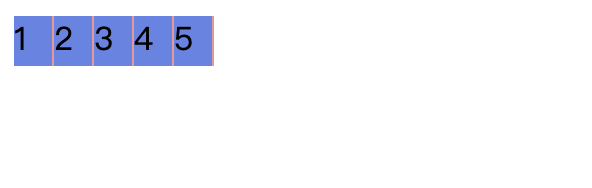

* **子盒子被压缩了**，因为nowrap不换行，且父盒子只有100px，所以超过了就按比例分
```html{14,16,21}
<body>
    <div id='container'>
        <div class='child'>1</div>
        <div class='child'>2</div>
        <div class='child'>3</div>
        <div class='child'>4</div>
        <div class='child'>5</div>
    </div>

    <style>
        #container {
            display: flex;
            background-color: rgb(241, 149, 149);
            width: 100px;
            height: 25px;
            flex-wrap: nowrap;
        }
        .child {
            background-color: rgb(98, 133, 231);
            margin-right: 1px;
            width: 30px;
        }
    </style>
</body>
```
:::
::: tab label=wrap
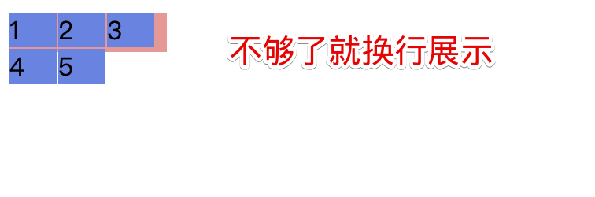

```html{14,16,22}
<body>
    <div id='container'>
        <div class='child'>1</div>
        <div class='child'>2</div>
        <div class='child'>3</div>
        <div class='child'>4</div>
        <div class='child'>5</div>
    </div>

    <style>
        #container {
            display: flex;
            background-color: rgb(241, 149, 149);
            width: 100px;
            height: 25px;
            flex-wrap: wrap;
        }
        .child {
            background-color: rgb(98, 133, 231);
            margin-right: 1px;
            margin-bottom: 1px;
            width: 30px;
        }
    </style>
</body>
```
:::
::: tab label=wrap-reverse
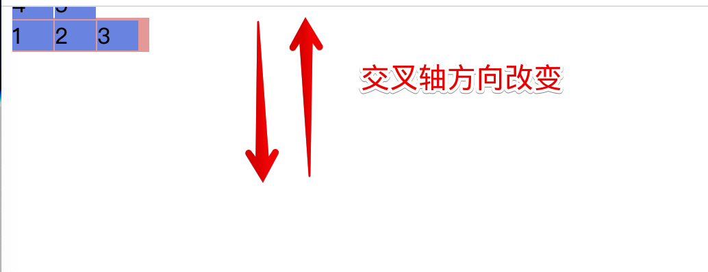

```html{14,16,22}
<body>
    <div id='container'>
        <div class='child'>1</div>
        <div class='child'>2</div>
        <div class='child'>3</div>
        <div class='child'>4</div>
        <div class='child'>5</div>
    </div>

    <style>
        #container {
            display: flex;
            background-color: rgb(241, 149, 149);
            width: 100px;
            height: 25px;
            flex-wrap: wrap-reverse;
        }
        .child {
            background-color: rgb(98, 133, 231);
            margin-right: 1px;
            margin-bottom: 1px;
            width: 30px;
        }
    </style>
</body>
```
:::
::::
## flex-flow
::: tip flex-flow
* flex-direction 和 flex-wrap 的组合简写
:::
:::: tabs
::: tab label=组合
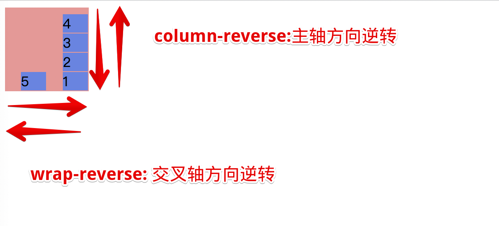

```html{16}
<body>
    <div id='container'>
        <div class='child'>1</div>
        <div class='child'>2</div>
        <div class='child'>3</div>
        <div class='child'>4</div>
        <div class='child'>5</div>
    </div>

    <style>
        #container {
            display: flex;
            background-color: rgb(241, 149, 149);
            width: 100px;
            height: 100px;
            flex-flow: column-reverse wrap-reverse;
        }
        .child {
            background-color: rgb(98, 133, 231);
            margin-right: 1px;
            margin-bottom: 1px;
            width: 30px;
        }
    </style>
</body>
```
:::
::: tab label=组合2
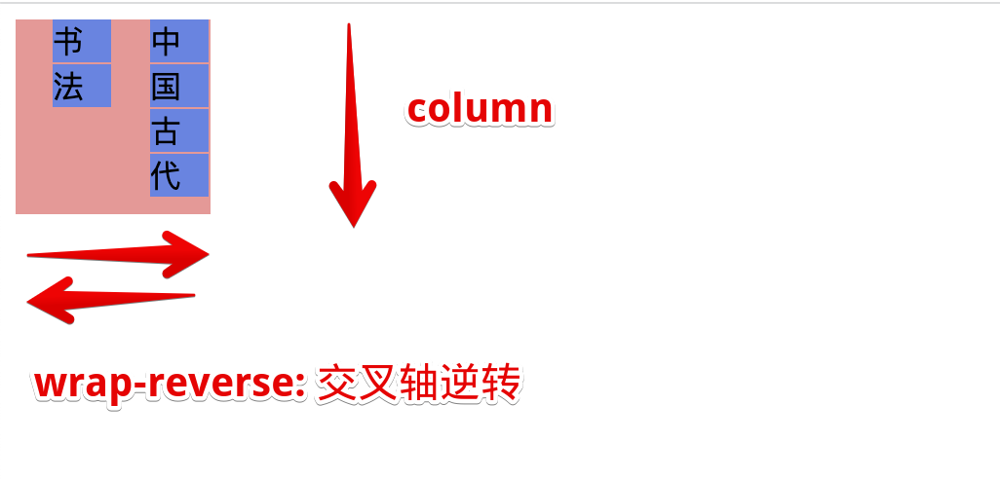

```html{17}
<body>
    <div id='container'>
        <div class='child'>中</div>
        <div class='child'>国</div>
        <div class='child'>古</div>
        <div class='child'>代</div>
        <div class='child'>书</div>
        <div class='child'>法</div>
    </div>

    <style>
        #container {
            display: flex;
            background-color: rgb(241, 149, 149);
            width: 100px;
            height: 100px;
            flex-flow: column wrap-reverse;
        }
        .child {
            background-color: rgb(98, 133, 231);
            margin-right: 1px;
            margin-bottom: 1px;
            width: 30px;
        }
    </style>
</body>
```
:::
::::
## flex-grow
::: tip flex-grow
* 作用：决定父盒子分配**剩余空间**的比例，不允许负数

|值|效果|
|---|---|
|【>0正数】|剩余可用空间的分配增长系数|
|默认1|所有元素等比分配|
:::
:::: tabs
::: tab label=等比分配
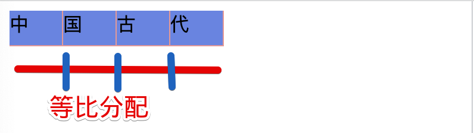

```html{20}
<body>
    <div id='container'>
        <div class='child'>中</div>
        <div class='child'>国</div>
        <div class='child'>古</div>
        <div class='child'>代</div>
    </div>

    <style>
        #container {
            display: flex;
            background-color: rgb(241, 149, 149);
            width: 180px;
            height: 30px;
        }
        .child {
            background-color: rgb(98, 133, 231);
            margin-right: 1px;
            margin-bottom: 1px;
            flex-grow: 1;
        }
    </style>
</body>
```
:::
::: tab label=非等比分配
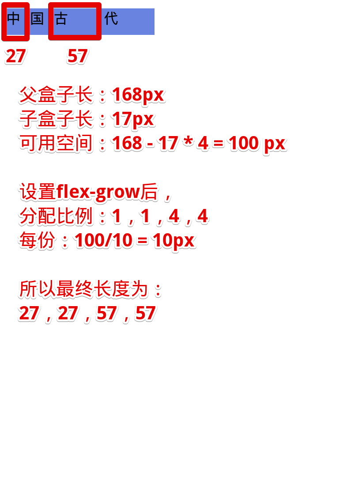

```html{21,24}
<body>
    <div id='container'>
        <div class='child child1'>中</div>
        <div class='child child1'>国</div>
        <div class='child child2'>古</div>
        <div class='child child2'>代</div>
    </div>

    <style>
        #container {
            display: flex;
            background-color: rgb(241, 149, 149);
            width: 168px;
            height: 30px;
        }
        .child {
            width: 17px;
            background-color: rgb(98, 133, 231);
        }
        .child1 {
            flex-grow: 1;
        }
        .child2 {
            flex-grow: 4;
        }
    </style>
</body>
```
:::
::::
## flex-shrink
::: tip flex-shink
* 作用：指定flex盒子可用空间不足时，子元素的收缩规则，该数值越大，收缩的程度越大
:::
:::: tabs
::: tab label=等比收缩
* 只有flex盒子空间不够时才会发生收缩，此参数才会生效  
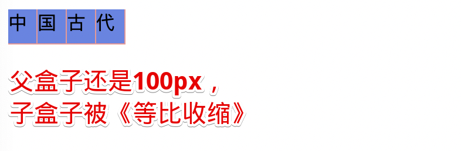

```html{21}
<body>
    <div id='container'>
        <div class='child'>中</div>
        <div class='child'>国</div>
        <div class='child'>古</div>
        <div class='child'>代</div>
    </div>

    <style>
        #container {
            display: flex;
            background-color: rgb(241, 149, 149);
            width: 100px;
            height: 30px;
        }
        .child {
            background-color: rgb(98, 133, 231);
            margin-right: 1px;
            margin-bottom: 1px;
            width: 30px;
            flex-shrink: 1;
        }
    </style>
</body>
```
:::
::: tab label=非等比收缩
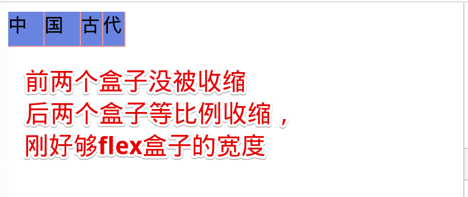

```html{23,26}
<body>
    <div id='container'>
        <div class='child child1'>中</div>
        <div class='child child1'>国</div>
        <div class='child child2'>古</div>
        <div class='child child2'>代</div>
    </div>

    <style>
        #container {
            display: flex;
            background-color: rgb(241, 149, 149);
            width: 100px;
            height: 30px;
        }
        .child {
            background-color: rgb(98, 133, 231);
            margin-right: 1px;
            margin-bottom: 1px;
            width: 30px;
        }
        .child1 {
            flex-shrink: 0;
        }
        .child2 {
            flex-shrink: 1;
        }
    </style>
</body>
```
:::
::::
## flex-basis
::: tip flex-basis
*  flex 子元素在主轴方向上的初始大小

|值|效果|
|---|---|
|【width值】|【默认，就是跟着width值】可以用auto 或者具体的像素大小|
|content|早期没有，可以用auto|
:::
:::: tabs
::: tab label=auto
* 默认就是按照内容所占的大小分配  


```html{20}
<body>
    <div id='container'>
        <div class='child'>中</div>
        <div class='child'>国</div>
        <div class='child'>古</div>
        <div class='child'>代</div>
    </div>

    <style>
        #container {
            display: flex;
            background-color: rgb(241, 149, 149);
            width: 180px;
            height: 30px;
        }
        .child {
            background-color: rgb(98, 133, 231);
            margin-right: 1px;
            margin-bottom: 1px;
            flex-basis: auto;
        }
    </style>
</body>
```
:::
::: tab label=自定义


```html{20}
<body>
    <div id='container'>
        <div class='child'>中</div>
        <div class='child'>国</div>
        <div class='child'>古</div>
        <div class='child'>代</div>
    </div>

    <style>
        #container {
            display: flex;
            background-color: rgb(241, 149, 149);
            width: 180px;
            height: 30px;
        }
        .child {
            background-color: rgb(98, 133, 231);
            margin-right: 1px;
            margin-bottom: 1px;
            flex-basis: 40px;
        }
    </style>
</body>
```
:::
::::
## flex
::: tip flex
* 混合属性，**按序**
* flex: xx yy zz;
    1. flex-grow
    2. flex-shrink
    3. flex-basis

|值|相当于|效果|
|---|---|---|
|initial|0 1 auto|不分配可用空间，等比例压缩，按照width宽度排大小|
|auto|1 1 auto|等比例分配可用空间，等比例压缩，按照width宽度排大小|
|none|0 0 auto|不分配，不压缩，原样展示，多的溢出|
|1|1 1 0|等比例分配可用空间，等比例压缩，不管原始大小|
:::
:::: tabs
::: tab label=initial
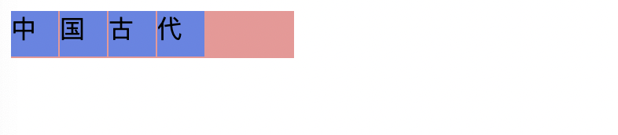

```html{21}
<body>
    <div id='container'>
        <div class='child child1'>中</div>
        <div class='child child1'>国</div>
        <div class='child child2'>古</div>
        <div class='child child2'>代</div>
    </div>

    <style>
        #container {
            display: flex;
            background-color: rgb(241, 149, 149);
            width: 180px;
            height: 30px;
        }
        .child {
            background-color: rgb(98, 133, 231);
            margin-right: 1px;
            margin-bottom: 1px;
            width: 30px;
            flex: initial;
        }
    </style>
</body>
```
:::
::: tab label=auto
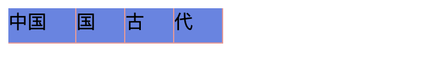

```html{21}
<body>
    <div id='container'>
        <div class='child child1'>中国</div>
        <div class='child child1'>国</div>
        <div class='child child2'>古</div>
        <div class='child child2'>代</div>
    </div>

    <style>
        #container {
            display: flex;
            background-color: rgb(241, 149, 149);
            width: 180px;
            height: 30px;
        }
        .child {
            background-color: rgb(98, 133, 231);
            margin-right: 1px;
            margin-bottom: 1px;
            width: 30px;
            flex: auto;
        }
    </style>
</body>
```
:::
::: tab label=none


```html{20-22}
<body>
    <div id='container'>
        <div class='child child1'>中</div>
        <div class='child child1'>国</div>
        <div class='child child2'>古</div>
        <div class='child child2'>代</div>
    </div>

    <style>
        #container {
            display: flex;
            background-color: rgb(241, 149, 149);
            width: 100px;
            height: 30px;
        }
        .child {
            background-color: rgb(98, 133, 231);
            margin-right: 1px;
            margin-bottom: 1px;
            width: 30px;
            height: 25px;
            flex: none;
        }
    </style>
</body>
```
:::
::: tab label=1


```html{3,21}
<body>
    <div id='container'>
        <div class='child child1'>中国</div>
        <div class='child child1'>国</div>
        <div class='child child2'>古</div>
        <div class='child child2'>代</div>
    </div>

    <style>
        #container {
            display: flex;
            background-color: rgb(241, 149, 149);
            width: 100px;
            height: 30px;
        }
        .child {
            background-color: rgb(98, 133, 231);
            margin-right: 1px;
            margin-bottom: 1px;
            height: 25px;
            flex: 1;
        }
    </style>
</body>
```
:::
::::
## align-items
::: tip align-items
* 子元素交叉轴方向的对齐方式

|值|stretch|
|---|---|
|stretch|【默认】弹性子盒子被拉伸到flex盒子相同的交叉轴长度|
|flex-start|交叉轴起点对齐|
|flex-start|交叉轴终点对齐|
|center|居中|
:::
:::: tabs
::: tab label=stretch


```html{14-15}
<body>
    <div id='container'>
        <span class='child child1'>中</span>
        <span class='child child1'>国</span>
        <span class='child child2'>古</span>
        <span class='child child2'>代</span>
    </div>

    <style>
        #container {
            display: flex;
            background-color: rgb(241, 149, 149);
            width: 150px;
            height: 30px;
            align-items: stretch;
        }
        .child {
            background-color: rgb(98, 133, 231);
            margin-right: 1px;
            margin-bottom: 1px;
        }
    </style>
</body>
```
:::
::: tab label=flex-start
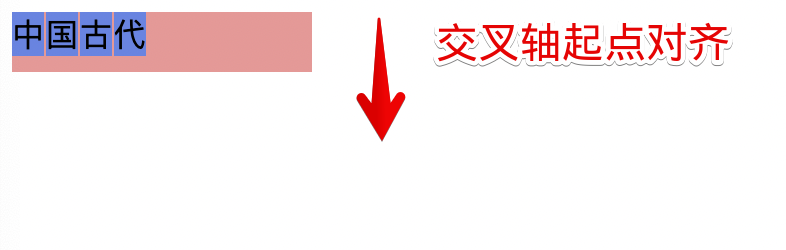

```html{14-15}
<body>
    <div id='container'>
        <span class='child child1'>中</span>
        <span class='child child1'>国</span>
        <span class='child child2'>古</span>
        <span class='child child2'>代</span>
    </div>

    <style>
        #container {
            display: flex;
            background-color: rgb(241, 149, 149);
            width: 150px;
            height: 30px;
            align-items: flex-start;
        }
        .child {
            background-color: rgb(98, 133, 231);
            margin-right: 1px;
            margin-bottom: 1px;
        }
    </style>
</body>
```
:::
::: tab label=flex-end
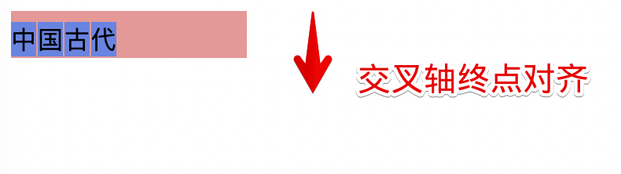

```html{14-15}
<body>
    <div id='container'>
        <span class='child child1'>中</span>
        <span class='child child1'>国</span>
        <span class='child child2'>古</span>
        <span class='child child2'>代</span>
    </div>

    <style>
        #container {
            display: flex;
            background-color: rgb(241, 149, 149);
            width: 150px;
            height: 30px;
            align-items: flex-end;
        }
        .child {
            background-color: rgb(98, 133, 231);
            margin-right: 1px;
            margin-bottom: 1px;
        }
    </style>
</body>
```
:::
::: tab label=center


```html{14-15}
<body>
    <div id='container'>
        <span class='child child1'>中</span>
        <span class='child child1'>国</span>
        <span class='child child2'>古</span>
        <span class='child child2'>代</span>
    </div>

    <style>
        #container {
            display: flex;
            background-color: rgb(241, 149, 149);
            width: 150px;
            height: 30px;
            align-items: center;
        }
        .child {
            background-color: rgb(98, 133, 231);
            margin-right: 1px;
            margin-bottom: 1px;
        }
    </style>
</body>
```
:::
::::
## justify-content
::: tip justify-content
* 作用：分配主轴元素位置与剩余可用空间的关系

|值|效果|
|---|---|
|start|每行与第一个元素对齐|
|end|向主轴尾部对齐，可用空间放起始线方向|
|center|居中，可用空间等比放两边|
|space-between|均匀分配中间元素和可用空间，两侧元素靠边|
|space-arround|均匀分配所有元素和可用空间，【1元素1 1元素1】的形式|
|space-evenly|均匀分配所有元素和可用空间，【1元素1元素1】 的形式|
:::
:::: tabs
::: tab label=start


```html{23-24}
<body>
    <div id='container'>
        <span class='child child1'>中</span>
        <span class='child child2'>国</span>
        <span class='child child3'>古</span>
        <span class='child child4'>代</span>
        <span class='child child1'>中</span>
        <span class='child child2'>国</span>
        <span class='child child3'>古</span>
        <span class='child child4'>代</span>
        <span class='child child1'>中</span>
        <span class='child child2'>国</span>
        <span class='child child3'>古</span>
        <span class='child child4'>代</span>
    </div>

    <style>
        #container {
            display: flex;
            background-color: rgb(241, 149, 149);
            width: 160px;
            height: 100px;
            flex-wrap: wrap;
            justify-content: start;
        }
        .child {
            background-color: rgb(98, 133, 231);
            margin-right: 1px;
            margin-bottom: 1px;
        }
        .child1 {
            width: 20px;
            height: 25px;
        }
        .child2 {
            width: 20px;
            height: 20px;
        }
        .child3 {
            width: 20px;
            height: 25px;
        }
        .child4 {
            width: 20px;
            height: 15px;
        }
    </style>
</body>
```
:::
::: tab label=end


```html{23-24}
<body>
    <div id='container'>
        <span class='child child1'>中</span>
        <span class='child child2'>国</span>
        <span class='child child3'>古</span>
        <span class='child child4'>代</span>
        <span class='child child1'>中</span>
        <span class='child child2'>国</span>
        <span class='child child3'>古</span>
        <span class='child child4'>代</span>
        <span class='child child1'>中</span>
        <span class='child child2'>国</span>
        <span class='child child3'>古</span>
        <span class='child child4'>代</span>
    </div>

    <style>
        #container {
            display: flex;
            background-color: rgb(241, 149, 149);
            width: 160px;
            height: 100px;
            flex-wrap: wrap;
            justify-content: end;
        }
        .child {
            background-color: rgb(98, 133, 231);
            margin-right: 1px;
            margin-bottom: 1px;
        }
        .child1 {
            width: 20px;
            height: 25px;
        }
        .child2 {
            width: 20px;
            height: 20px;
        }
        .child3 {
            width: 20px;
            height: 25px;
        }
        .child4 {
            width: 20px;
            height: 15px;
        }
    </style>
</body>
```
:::
::: tab label=center
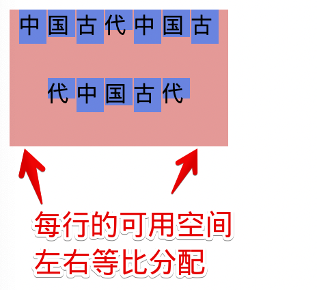

```html{23-24}
<body>
    <div id='container'>
        <span class='child child1'>中</span>
        <span class='child child2'>国</span>
        <span class='child child3'>古</span>
        <span class='child child4'>代</span>
        <span class='child child1'>中</span>
        <span class='child child2'>国</span>
        <span class='child child3'>古</span>
        <span class='child child4'>代</span>
        <span class='child child1'>中</span>
        <span class='child child2'>国</span>
        <span class='child child3'>古</span>
        <span class='child child4'>代</span>
    </div>

    <style>
        #container {
            display: flex;
            background-color: rgb(241, 149, 149);
            width: 160px;
            height: 100px;
            flex-wrap: wrap;
            justify-content: center;
        }
        .child {
            background-color: rgb(98, 133, 231);
            margin-right: 1px;
            margin-bottom: 1px;
        }
        .child1 {
            width: 20px;
            height: 25px;
        }
        .child2 {
            width: 20px;
            height: 20px;
        }
        .child3 {
            width: 20px;
            height: 25px;
        }
        .child4 {
            width: 20px;
            height: 15px;
        }
    </style>
</body>
```
:::
::: tab label=space-between


```html{23-24}
<body>
    <div id='container'>
        <span class='child child1'>中</span>
        <span class='child child2'>国</span>
        <span class='child child3'>古</span>
        <span class='child child4'>代</span>
        <span class='child child1'>中</span>
        <span class='child child2'>国</span>
        <span class='child child3'>古</span>
        <span class='child child4'>代</span>
        <span class='child child1'>中</span>
        <span class='child child2'>国</span>
        <span class='child child3'>古</span>
        <span class='child child4'>代</span>
    </div>

    <style>
        #container {
            display: flex;
            background-color: rgb(241, 149, 149);
            width: 160px;
            height: 100px;
            flex-wrap: wrap;
            justify-content: space-between;
        }
        .child {
            background-color: rgb(98, 133, 231);
            margin-right: 1px;
            margin-bottom: 1px;
        }
        .child1 {
            width: 20px;
            height: 25px;
        }
        .child2 {
            width: 20px;
            height: 20px;
        }
        .child3 {
            width: 20px;
            height: 25px;
        }
        .child4 {
            width: 20px;
            height: 15px;
        }
    </style>
</body>
```
:::
::: tab label=space-around
* 注：以主轴为基准，也就是每行情况会不同  


```html{23-24}
<body>
    <div id='container'>
        <span class='child child1'>中</span>
        <span class='child child2'>国</span>
        <span class='child child3'>古</span>
        <span class='child child4'>代</span>
        <span class='child child1'>中</span>
        <span class='child child2'>国</span>
        <span class='child child3'>古</span>
        <span class='child child4'>代</span>
        <span class='child child1'>中</span>
        <span class='child child2'>国</span>
        <span class='child child3'>古</span>
        <span class='child child4'>代</span>
    </div>

    <style>
        #container {
            display: flex;
            background-color: rgb(241, 149, 149);
            width: 160px;
            height: 100px;
            flex-wrap: wrap;
            justify-content: space-around;
        }
        .child {
            background-color: rgb(98, 133, 231);
            margin-right: 1px;
            margin-bottom: 1px;
        }
        .child1 {
            width: 20px;
            height: 25px;
        }
        .child2 {
            width: 20px;
            height: 20px;
        }
        .child3 {
            width: 20px;
            height: 25px;
        }
        .child4 {
            width: 20px;
            height: 15px;
        }
    </style>
</body>
```
:::
::: tab label=space-evenly
* 注：以主轴为基准，也就是每行情况会不同  
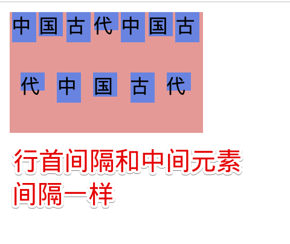

```html{23-24}
<body>
    <div id='container'>
        <span class='child child1'>中</span>
        <span class='child child2'>国</span>
        <span class='child child3'>古</span>
        <span class='child child4'>代</span>
        <span class='child child1'>中</span>
        <span class='child child2'>国</span>
        <span class='child child3'>古</span>
        <span class='child child4'>代</span>
        <span class='child child1'>中</span>
        <span class='child child2'>国</span>
        <span class='child child3'>古</span>
        <span class='child child4'>代</span>
    </div>

    <style>
        #container {
            display: flex;
            background-color: rgb(241, 149, 149);
            width: 160px;
            height: 100px;
            flex-wrap: wrap;
            justify-content: space-evenly;
        }
        .child {
            background-color: rgb(98, 133, 231);
            margin-right: 1px;
            margin-bottom: 1px;
        }
        .child1 {
            width: 20px;
            height: 25px;
        }
        .child2 {
            width: 20px;
            height: 20px;
        }
        .child3 {
            width: 20px;
            height: 25px;
        }
        .child4 {
            width: 20px;
            height: 15px;
        }
    </style>
</body>
```
:::
::::
## space-between问题
:::: tabs
::: tab label=space-between
* 使用space-between时最后一行居中不美观  
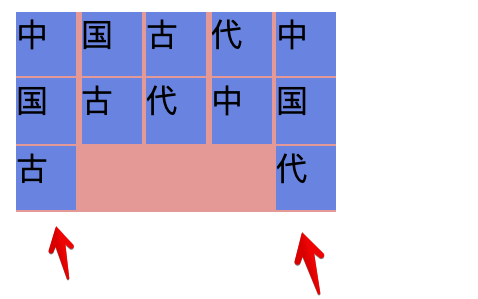

```html{23-24}
<body>
    <div id='container'>
        <span class='child'>中</span>
        <span class='child'>国</span>
        <span class='child'>古</span>
        <span class='child'>代</span>
        <span class='child'>中</span>
        <span class='child'>国</span>
        <span class='child'>古</span>
        <span class='child'>代</span>
        <span class='child'>中</span>
        <span class='child'>国</span>
        <span class='child'>古</span>
        <span class='child'>代</span>
    </div>

    <style>
        #container {
            display: flex;
            background-color: rgb(241, 149, 149);
            width: 160px;
            height: 100px;
            flex-wrap: wrap;
            justify-content: space-between;
        }
        .child {
            background-color: rgb(98, 133, 231);
            margin-bottom: 1px;
            width: 30px;
        }
    </style>
</body>
```
:::
::: tab label=伪元素解决
* 需要计算出伪元素占主轴的长度  
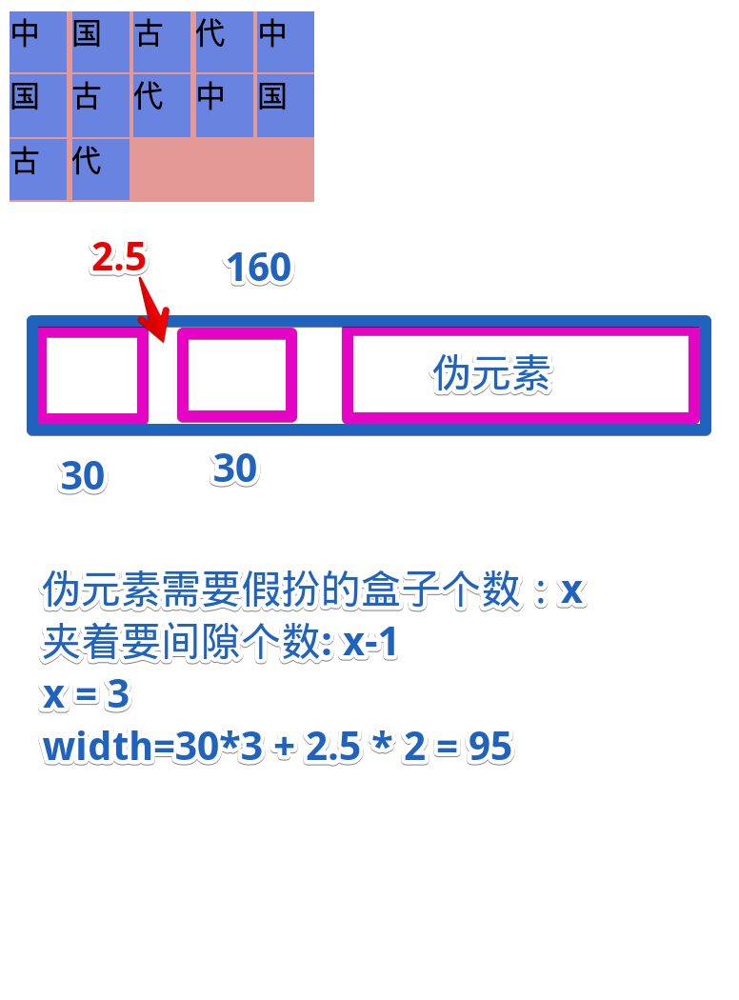

```html{31-34}
<body>
    <div id='container'>
        <span class='child'>中</span>
        <span class='child'>国</span>
        <span class='child'>古</span>
        <span class='child'>代</span>
        <span class='child'>中</span>
        <span class='child'>国</span>
        <span class='child'>古</span>
        <span class='child'>代</span>
        <span class='child'>中</span>
        <span class='child'>国</span>
        <span class='child'>古</span>
        <span class='child'>代</span>
    </div>

    <style>
        #container {
            display: flex;
            background-color: rgb(241, 149, 149);
            width: 160px;
            height: 100px;
            flex-wrap: wrap;
            justify-content: space-between;
        }
        .child {
            background-color: rgb(98, 133, 231);
            margin-bottom: 1px;
            width: 30px;
        }
        #container::after {
            content: '';
            width: 95px;
        }
    </style>
</body>
```
::::