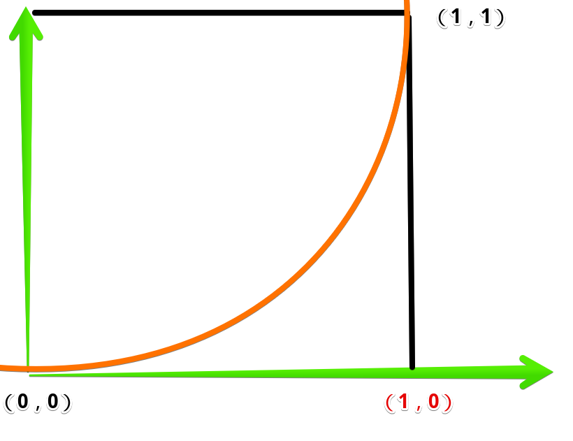

## keyframes
::: tip keyframes
* 建立两个或以上关键帧，每一个关键帧都描述了动画元素在给定的时间点上应该如何渲染。

|值|含义|
|---|---|
|from|0%|
|to|100%|
|50%|执行到一半的时间节点|
:::
## 组合属性
::: tip animation
* animation是组合属性
```css
animation: roll 2s 0s linear forwards infinite running;
```

|属性|效果|值|
|---|---|---|
|animation-name|应用的关键帧的名字|none /【 [0-9a-zA-Z-_]+ 】|
|animation-delay|动画开始执行的时间长度|1s, 20ms|
|animation-direction|动画执行顺序以及循环动作设定|normal / alternate / reverse / alternate-reverse|
|animation-duration|动画周期的时长|1s, 15s / 10s, 30s, 230ms|
|animation-iteration-count|动画重复运行次数|infinite【无限循环】 /  1【默认】|
|animation-play-state|定义一个动画是否运行或者暂停，恢复时会从暂停位置继续|running / paused|
|animation-timing-function|定义CSS动画在每一动画周期中执行的节奏|ease / ease-in / ease-out / ease-in-out / linear / steps(4, end) / cubic-bezier(0.1, 0.7, 1.0, 0.1) / step-start / step-end|
|animation-fill-mode|动画在执行之前和之后如何将样式应用于其目标。|none / forwards / backwards / both|
:::
::: codePen label=animation-direction val=alternate select=[normal,alternate,reverse,alternate-reverse] height=520
```html{22-26,28-35}
<body>
    <div id="container">
        <div id="ball"></div>
    </div>

    <style>
        #container {
            position: relative;
            width: 200px;
            height: 500px;
            background-color: rgb(118, 144, 233);
            overflow: hidden;
        }
        #ball {
            width: 100px;
            height: 100px;
            margin-left: 50%;
            transform: translate(-50%, 0);
            background-color: #fff;
            border-radius: 50px;

            animation-name: jump;
            animation-delay: 1s;
            animation-duration: 3s;
            animation-direction: {{val}};
            animation-iteration-count: infinite;
        }
        @keyframes jump {
            0% {
                margin-top: 0%;
            }
            100% {
                margin-top: 400px;
            }
        }
    </style>
</body>
```
:::
:::: tabs
::: tab label=name/delay/duration
>animation-name
* 调用定义好的关键帧，本例中调用了下面的jump关键帧
```css{2,4}
#ball {
    animation-name: jump;
}
@keyframes jump {
    0% {
        margin-top: 0%;
    }
    100% {
        margin-top: 400px;
    }
}
```
>animation-delay
* **帧加载到元素以后**，等多久执行动画，本例中直接绑定，所以浏览器等一秒执行动画
* 注意，是帧加载到元素身上以后的计时
```css
animation-delay: 1s;
```
>animation-duration
* 执行完一个周期的所有帧需要的时间，本例中【0% - 100%】共花费3s
```css
animation-duration: 3s;
```
:::
::: tab label=count/direction
>animation-iteration-count
* 执行的次数，默认是1，可以设置数字或者无限循环【infinite】
```css
animation-iteration-count: infinite;
```
>animation-direction
* 执行的方向以及重复执行的方向
```css
animation-direction: alternate;
```
:::
::::

* 动画
:::: tabs
::: tab label=旋转球

```html{27-40}
<body>
    <div id="container">
        <div id="ball">你好</div>
    </div>

    <style>
        #container {
            position: relative;
            margin: 50px;
            width: 200px;
            height: 200px;
            padding-left: 50px;
            padding-top: 50px;
            box-sizing: border-box;
            background-color: rgb(118, 144, 233);
            overflow: hidden;
        }
        #ball {
            width: 100px;
            height: 100px;
            border-radius: 50px;
            background-color: rgb(185, 247, 183);
            text-align: center;
            line-height: 100px;
        }

        #ball:hover {
            animation-name: roll;
            animation-duration: 1s;
            animation-delay: 0;
            animation-timing-function: linear;
            animation-fill-mode: forwards;
        }
        @keyframes roll {
            0% {
            }
            100% {
                transform: rotate(180deg);
            }
        }
    </style>
</body>
```
:::
::: tab label=fill-mode
>animation-fill-mode
* 决定动画结束时的样式：

|值|样式|
|---|---|
|froward|就是结束时的样式|
|backwards|回到起始样式|

```css
animation-fill-mode: backwards;
```


:::
::: tab label=timing-function
>animation-timing-function
* 描述过渡加速曲线，如：【cubic-bezier(0.1, 0.7, 1.0, 0.1)】是一个[贝塞尔曲线(Cubic Bezier)](https://blog.csdn.net/wjnf012/article/details/78795573)
* 分别对应的值是：cubic-bezier(x1, y1, x2, y2)，与[0, 0]、[1, 1] 分别连线生成的曲线，作为加速曲线
```css
animation-timing-function: cubic-bezier(0.1, 0.7, 1.0, 0.1);
```
* 匀加速曲线：
```css
animation-timing-function: cubic-bezier(1, 0, 1, 0);
```

* 效果:

|值|效果|
|---|---|
|ease|【默认】慢-快-慢（cubic-bezier(0.25, 0.1, 0.25, 1)）|
|linear|全程匀速，（等于 cubic-bezier(0, 0, 1, 1)）|
|ease-in|慢-快（等于 cubic-bezier(0.42, 0, 1, 1)）|
|ease-out|快-慢（等于 cubic-bezier(0, 0, 0.58, 1)）|
|ease-in-out|慢-快-慢，（等于 cubic-bezier(0.42, 0, 0.58, 1)）|
:::
::: tab label=play-state
>animation-play-state

|值|效果|
|---|---|
|running|动画动起来|
|paused|动画暂停|

```html{32-33,45-51}
<body>
    <div id="container">
        <div id="ball">你好</div>
    </div>

    <style>
        #container {
            position: relative;
            margin: 50px;
            width: 200px;
            height: 200px;
            padding-left: 50px;
            padding-top: 50px;
            box-sizing: border-box;
            background-color: rgb(118, 144, 233);
            overflow: hidden;
        }
        #ball {
            width: 100px;
            height: 100px;
            border-radius: 50px;
            background-color: rgb(185, 247, 183);
            text-align: center;
            line-height: 100px;

            animation-name: roll;
            animation-duration: 2s;
            animation-delay: 0;
            animation-timing-function: linear;
            animation-iteration-count: infinite;
            animation-timing-function: linear;
            animation-fill-mode: forwards;
            animation-play-state: running;
        }
        @keyframes roll {
            0% {
            }
            100% {
                transform: rotate(360deg);
            }
        }
    </style>
    <script>
        const ball = document.querySelector("#ball");
        ball.addEventListener('click', () => {
            if (ball.hasAttribute('style')) {
                ball.removeAttribute('style');
            } else {
                ball.setAttribute('style', 'animation-play-state: paused;');
            }
        })
    </script>
</body>
```
:::
::::