## BFC盒子
::: tip BFC
* 块格式化上下文（Block Formatting Context，BFC）
* 块格式内的元素不会影响到外部样式，作为一个绝对样式隔离的空间
:::
::: warning 条件
|条件|设置|
|---|---|
|根元素| body|
|浮动元素|元素的 float 不是 none|
|overflow| 计算值(Computed)不为 visible 的块元素|
|绝对定位元素|元素的 position 为 absolute 或 fixed|
|行内块元素|元素的 display 为 inline-block|
|表格单元格|元素的 display 为 table-cell，HTML表格单元格默认为该值|
|表格标题|元素的 display 为 table-caption，HTML表格标题默认为该值|
|匿名表格单元格元素|元素的 display 为 table、table-row、 table-row-group、table-header-group、table-footer-group分别是HTML table、row、tbody、thead、tfoot 的默认属性或 inline-table|
|display| 值为 flow-root 的元素|
|contain| 值为 layout、content 或 paint 的元素|
|弹性元素|display 为 flex 或 inline-flex 元素的直接子元素|
|网格元素|display 为 grid 或 inline-grid 元素的直接子元素|
|多列容器|元素的 column-count 或 column-width (en-US) 不为 auto，包括 column-count 为 1|
>column-span 为 all 的元素始终会创建一个新的BFC，即使该元素没有包裹在一个多列容器中（标准变更，Chrome bug）。
:::
:::: tabs
::: tab label=margin重叠
* 非BFC盒子之间，内部的子盒子margin溢出且与外面别的margin重叠，说明本盒子内部布局影响到外部  
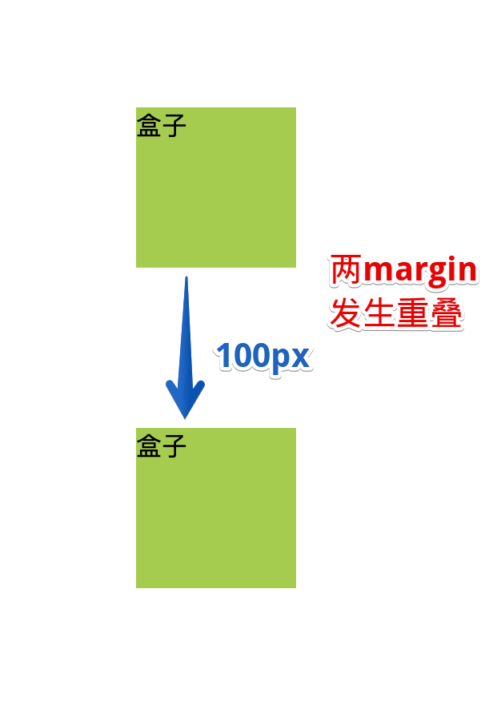

```html
<body>
    <div class="nobfc">
        <div>盒子</div>
    </div>

    <div class="nobfc">
        <div>盒子</div>
    </div>

    <style>
        .nobfc>div {
            width: 100px;
            height: 100px;
            background-color: yellowgreen;
            margin: 100px;
        }
    </style>
</body>
```
:::
::: tab label=浮动塌陷
```html{2-5}
<body>
    <div class="father">
        <!-- father盒子塌陷不显示 -->
        <div class="child">1</div>
    </div>
    <div class="other"></div>
    <style>
        .father {
            background-color: red;
        }

        .child {
            width: 100px;
            height: 100px;
            float: left;
            margin: 10px;
            background-color: blue;
        }

        .other {
            height: 100px;
            width: 200px;
            background-color: green;
        }

    </style>
</body>

```
:::
::: tab label=BFC盒子
* BFC盒子内部无论怎么折腾都不会影响到外部的盒子  
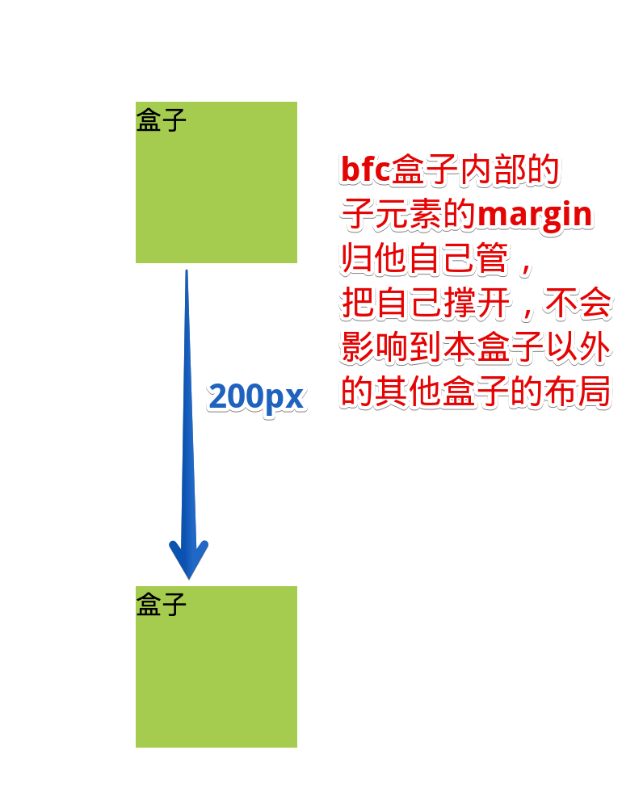

```html{11-13}
<body>
    <div class="nobfc">
        <div>盒子</div>
    </div>

    <div class="nobfc">
        <div>盒子</div>
    </div>

    <style>
        .nobfc {
            overflow: hidden;
        }
        .nobfc>div {
            width: 100px;
            height: 100px;
            background-color: yellowgreen;
            margin: 100px;
        }
    </style>
</body>
```
:::
::: tab label=其他效果
* BFC可以包含浮动元素（清除浮动脱离文档流的影响）
* BFC可以让外部浮动不影响自己
:::
::::
## box-sizing
::: tip box-sizing
|值|效果|
|---|---|
|content-box|【标准盒子】宽高设置只包括内容部分|
|border-box|【怪异盒子/IE盒子】宽高设置包括【内容+padding】|
:::
:::: tabs
::: tab label=content-box
* 默认效果，宽高只包括内容，设置border和padding会撑大盒子


```html
<body>
    <div class="father">你好</div>

    <style>
        .father {
            width: 200px;
            height: 200px;
            background-color: rgb(109, 219, 238);

            margin: 10px;
            padding: 50px;
            border: 20px solid #333;
            box-sizing: content-box;
        }
    </style>
</body>
```
:::
::: tab label=border-box
* 默认效果，宽高只包括内容，设置border和padding会撑大盒子


```html
<body>
    <div class="father">你好</div>

    <style>
        .father {
            width: 200px;
            height: 200px;
            background-color: rgb(109, 219, 238);

            margin: 10px;
            padding: 50px;
            border: 20px solid #333;
            box-sizing: border-box;
        }
    </style>
</body>
```
:::
::::
## 居中
### 行内块元素
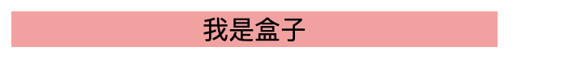

```html{9}
<body>
    <span>我是盒子</span>

    <style>
        span {
            display: inline-block;
            width: 300px;
            background-color: rgb(255, 158, 158);
            text-align: center;
        }
    </style>
</body>
```
### transform
::: tip
* 先移动父盒子的50%，再往回拉自身的50%
:::
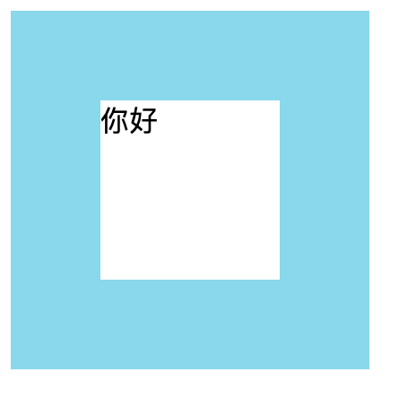

```html{11,18-21}
<body>
    <div class="father">
        <div class="child">你好</div>
    </div>

    <style>
        .father {
            width: 200px;
            height: 200px;
            background-color: rgb(109, 219, 238);
            overflow: hidden;
        }
        .child {
            width: 100px;
            height: 100px;
            background-color: #fff;

            margin-top: 50%;
            margin-left: 50%;
            box-sizing: border-box;
            transform: translate(-50%, -50%);
        }
    </style>
</body>
```
### margin
::: tip
* 用margin: 0 auto; 自适应水平居中
:::
:::: tabs
::: tab label=margin
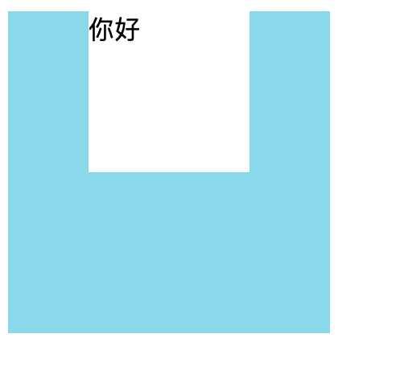

```html{17}
<body>
    <div class="father">
        <div class="child">你好</div>
    </div>

    <style>
        .father {
            width: 200px;
            height: 200px;
            background-color: rgb(109, 219, 238);
        }
        .child {
            width: 100px;
            height: 100px;
            background-color: #fff;

            margin: 0 auto;
        }
    </style>
</body>
```
:::
::: tab label=配合flex
* 可以配合flex做到水平垂直居中  


```html{12-14,21}
<body>
    <div class="father">
        <div class="child">你好</div>
    </div>

    <style>
        .father {
            width: 200px;
            height: 200px;
            background-color: rgb(109, 219, 238);
            
            display: flex;
            align-items: center;
            overflow: hidden;
        }
        .child {
            width: 100px;
            height: 100px;
            background-color: #fff;

            margin: 0 auto;
        }
    </style>
</body>
```
:::
::::
### flex
::: tip 思想
* justify-content主轴居中
* align-items交叉轴居中
:::
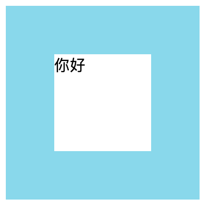

```html{12-14}
<body>
    <div class="father">
        <div class="child">你好</div>
    </div>

    <style>
        .father {
            width: 200px;
            height: 200px;
            background-color: rgb(109, 219, 238);
            
            display: flex;
            justify-content: center;
            align-items: center;
        }
        .child {
            width: 100px;
            height: 100px;
            background-color: #fff;
        }
    </style>
</body>
```
### line-height
::: tip
* 文字本身就在行内垂直居中。
* 行高 === 父盒子高让文字在父盒子居中
:::


```html
<body>
    <div class="father">你好</div>

    <style>
        .father {
            width: 200px;
            height: 200px;
            background-color: rgb(109, 219, 238);

            line-height: 200px;
            text-align: center;
        }
    </style>
</body>
```
## background
::: tip
1. `background-image`可以通过写多个url的形式传递兜底图片，前面题片加载失败才会加载后面图片
    ```css
    background-image: url("https://media.giphy.com/media/EZqwsBSPlvSda/giphy.gif"), url("https://coderhdy.com/assets/img/bg.svg");
    ```
2. `background-position`是指**图片相对于盒子的位置**
    ```css
    /** 背景图片向左移动 盒子的 50% */
    background-position: -50% 0;
    ```
:::
## table
```css
table {
    overflow: scroll;

    /* 文本不换行 */
    white-space: nowrap;

    /* tr 的 border 之间没有间隙 */
    border-collapse: collapse;
}

td {
    border: 1px solid #333;
    padding: 1rem;
    max-width: 10rem;
    overflow: scroll;
}
```
## 特殊
### 三角形盒子
::: tip 画出三角形
* 使用边框border的特性
:::
:::: tabs
::: tab label=三角形
* 原理：border解析的原理  

```html{12-17}
<body>
    <div class="father">
        <div class="box"></div>
    </div>
    <style>
        .father {
            width: 200px;
            height: 200px;
            background-color: rgb(255, 173, 173);
            overflow: hidden;
        }
        .box {
            border-top: 100px solid transparent;
            border-left: 100px solid transparent;
            border-right: 100px solid transparent;
            border-bottom: 100px solid #333;
        }
    </style>
</body>
```

:::
::: tab label=原理
* border解析会有斜边，让内容消失，也就是【content、padding=0】那么斜边就会交叉，形成三角形

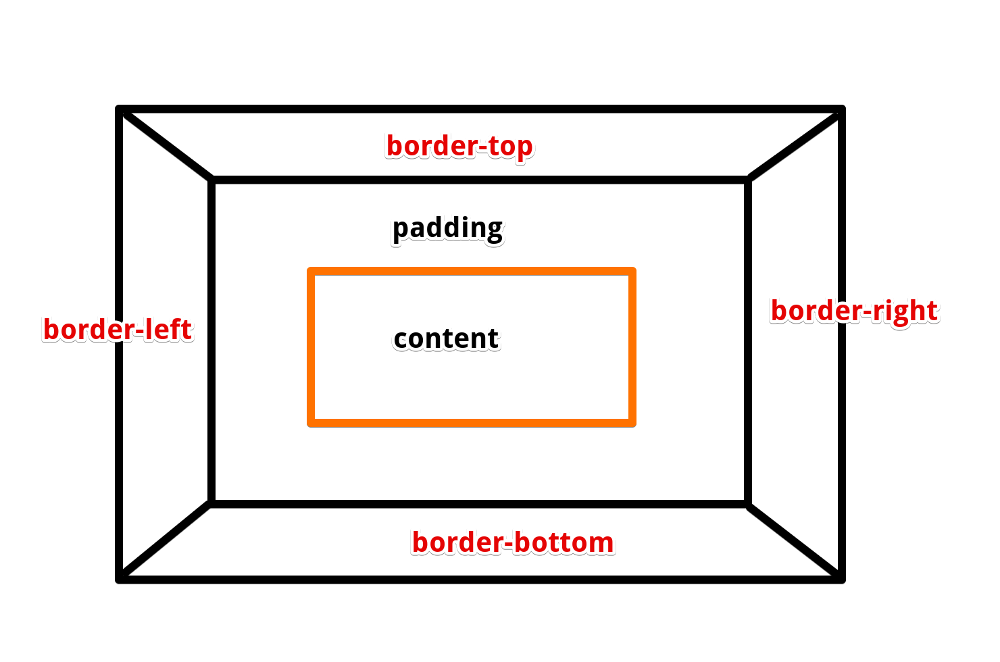

* 然后再让其他几个边的border颜色继承父盒子，也就是自己透明，就形成了三角形
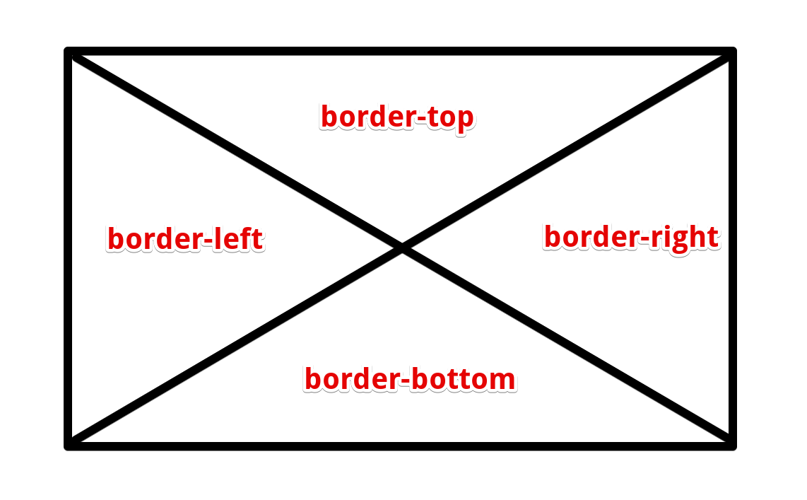
:::
::: tab label=示例


```html
<body>
    <div class="father">
        <div class="decoration">
            <div class="triangle-left"></div>
        </div>

        <div class="content">大家好</div>

        <div class="decoration">
            <div class="triangle-right"></div>
        </div>
    </div>
    <style>
        .father {
            display: flex;
            justify-content: left;
            width: 100%;
            height: 50px;
            background-color: rgb(255, 173, 173);
            overflow: hidden;
        }
        .decoration {
            width: 50px;
            height: 50px;
            overflow: hidden;
        }
        .triangle-left {
            border-top: 100px solid #333;
            border-right: 100px solid transparent;
            transform: translate(-50px);
        }
        .triangle-right {
            border-bottom: 100px solid #333;
            border-left: 100px solid transparent;
            transform: translate(0, -50px);
        }
        .content {
            flex: 1;
            text-align: center;
            line-height: 50px;
        }
    </style>

</body>
```
:::
::::
### 渐变背景色
::: warning
注：渐变背景色被解析成`background-imag`e，因此不能与北京图片一起使用
:::
::: tip linear-gradient
* 使用：渐变背景色，可以定义多个位置颜色，并以渐变的形式变化过去

|入参|含义|
|---|---|
|top/right/bottom/left|渐变方向，同时决定起始方位|
|45deg|渐变轴|
|black 10%|10%处是黑色|
|#33333333 20%|20%处是透明|
:::
:::: tabs
::: tab label=渐变颜色
* 从20%处开始渐变，100%处变色完成  
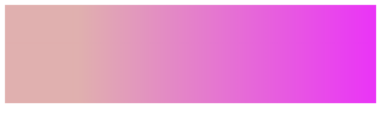

```html{8}
<body>
    <div id='div'></div>

    <style>
        #div {
            height: 100px;
            width: 375px;
            background: linear-gradient(to right, #e9adad 20%, #ff00ff 100%);
        }
    </style>
</body>
```
:::
::: tab label=多段渐变
* 从20%处开始渐变，60%处设置一个变色点，100%处再设置一个变色点  


```html{8}
<body>
    <div id='div'></div>

    <style>
        #div {
            height: 100px;
            width: 375px;
            background: linear-gradient(to right, #e9adad 20%, #ff00ff 60%, #ffcc5f 100%);
        }
    </style>
</body>
```
:::
::: tab label=多段背景色
* 让渐变的初始状态和结束状态都是一个颜色就可以了   
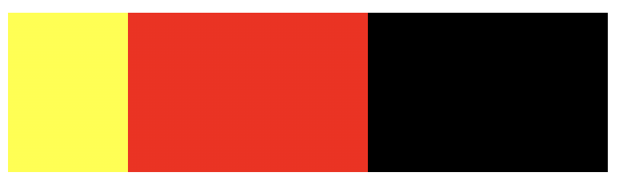

```html{8}
<body>
    <div id='div'></div>

    <style>
        #div {
            height: 100px;
            width: 375px;
            background: linear-gradient(to right, yellow 20%,red 20%,red 60%,black 60%);
        }
    </style>
</body>
```
:::
::: tab label=透明色
* 透明色可以用【rgba(0,0,0,0)】或者【#3333333（八位）】来实现  
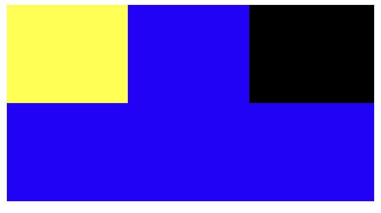

```html{15}
<body>
    <div id="father">
        <div id='div'></div>
    </div>

    <style>
        #father {
            height: 200px;
            width: 375px;
            background-color: rgb(38, 0, 255);
        }
        #div {
            height: 100px;
            width: 375px;
            background: linear-gradient(to right, yellow 33%,rgba(0,0,0,0) 33%,rgba(0,0,0,0) 66%,black 60%,black 100%)
        }
    </style>
</body>
```
:::
::::
## 问题总结
### 移动端盒子点击阴影问题
```css
div,a,img {
    -webkit-tap-highlight-color: transparent;
    -webkit-touch-callout: none;
    -webkit-user-select: none;
    user-select:none;
}
```
