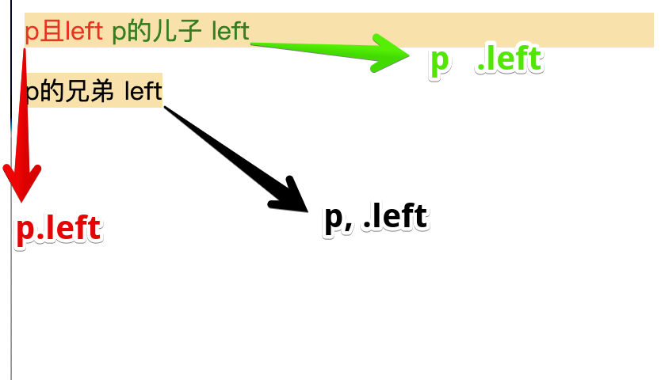
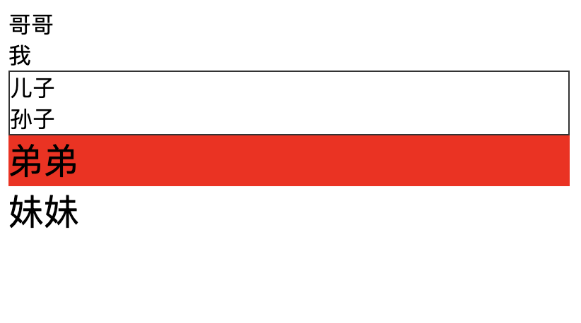
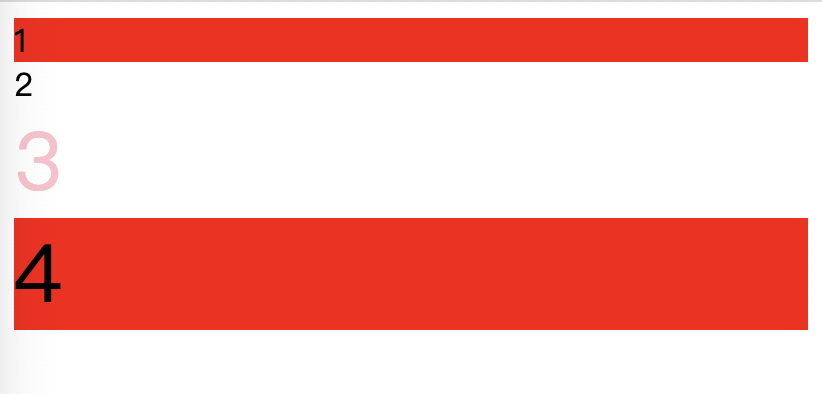
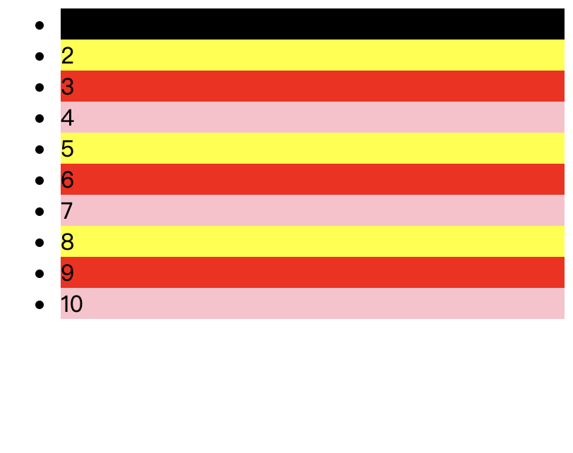
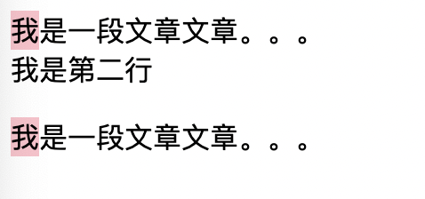
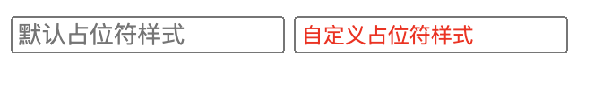

# 选择器
## 状态选择
::: tip 状态
|属性|状态|
|---|---|
|link|无状态|
|hover|覆盖|
|active|鼠标按下去时|
|focus|光标聚焦|
|visited|已访问过(历史记录有这一条)|
:::
:::: tabs
::: tab label=超链接
<video src="./assets/csslinkvisited.mp4" style="width:300px;" controls />


* 注意：【:link】和【:visited】应该放在最上面，因为同时多种状态且属性冲突时，取最下面一种状态设置的属性
* 例：【:hover】时元素的【:link】属性依旧触发，所以【:hover】应该定义在【:link的下面】
```html
<body>
    <a href="#a1">超链接</a>

    <div id="a1">锚点</div>
    <style>
        a:visited {
            background-color: yellow;
        }
        a:link {
            background-color: red;
        }
        a:hover {
            background-color: blue;
        }
        a:active {
            background-color:greenyellow;
        }
    </style>
</body>
```
:::
::: tab label=focus
* 取消【input】元素选中时的边框  
<video src="./assets/inputfocus.mp4" style="width:300px;" controls />

```html{6-8}
<body>
    <input type="text" id="input1">
    <input type="text" id="input2">

    <style>
        #input1:focus {
            outline: none;
        }
    </style>
</body>
```
:::
::::
## 关联选择器
::: tip 
|选择器|选择元素|
|---|---|
|交集：【p标签】且【.left】|p.left|
|后代：【p标签】内的【.left】|p .left【空格分开】|
|并集：【p标签】和【.left】|p,.left|
|子代|p>.left|
|所有弟弟|p~.left|
|下一个弟弟|p+.left|
:::
:::: tabs
::: tab label=交集/后代/并集


```html
<body>
    <p class="left">
        p且left
        <span class="left">p的儿子 left</span>
    </p>
    
    <span class="left">p的兄弟 left</span>

    <style>
        /* 交集选择器，p 且 left */
        p.left {
            color: red;
        }

        /* 后代选择器，p 的后代 left */
        p .left {
            color: green;
        }

        /* 并集选择器，p 和 left */
        p,.left {
            background-color: rgb(253, 224, 162);
        }
    </style>
</body>
```
:::
::: tab label=子代/兄弟


```html{4-10}
<body>
    <div class="big-brother">哥哥</div>
    
    <div class="me">
        我
        <div class="child">
            儿子
            <div>孙子</div>
        </div>
    </div>
    
    <div class="brother">弟弟</div>

    <div class="sister">妹妹</div>


    <style>
        /* 下一个弟弟 */
        .me+div{
            background-color: red;
        }

        /* 所有弟弟 */
        .me~div {
            font-size: 25px;
        }

        /* 儿子 */
        .me>div {
            border: #333 solid 1px;
        }
    </style>
</body>
```
:::
::::
## 属性选择器
::: tip 属性选择器
* 元素拥有某个属性时选择，【css scope原理】
```css
[property] {}
```
:::
:::: tabs
::: tab label=属性选择器


```html
<body>
    <div>tag选择器</div>
    <div class="box">普通class选择器</div>
    <div class="box" data-hash123>class配属性选择器</div>


    <style>
        div {
            background-color: red;
        }
        .box {
            background-color: yellow;
        }
        .box[data-hash123] {
            background-color: green;
        }
    </style>
</body>
```
:::
::::
## 正则属性选择器
::: tip 正则匹配属性
|选择器|含义|
|---|---|
|[id^=my]|id以my开头|
|[data$=box]|data以box结尾|
|[id*=container]|id包含container|
:::
:::: tabs
::: tab label=示例


```html
<body>
    <div id="my-box">1</div>
    <div id="his-box">2</div>
    <div id="our-container">3</div>
    <div id="my-container">4</div>


    <style>
        div[id^=my] {
            background-color: red;
        }

        div[id$=container] {
            font-size: 40px;
        }

        div[id*=our] {
            color: pink;
        }
    </style>
</body>
```
:::
::::
## 结构化伪类选择器
::: tip 伪类
|选择元素|选择器|
|---|---|
|非选择器|li:not(.me)|
|独子|container:only-child|
|大儿子|:first-child|
|小儿子|:last-child|
|按序选择|:nth-child(3) / :nth-child(2N)|
|奇偶选择器|:nth-of-type(even) / :nth-of-type(odd)|
|空选择器|:empty|
|跳转目标选择器|:target|
:::
:::: tabs
::: tab label=非
* 本选择器且非内部选择器


```html{10}
<body>
    <ul class="father">
        <li class="big-brother">哥哥</li>
        <li class="me">我</li>
        <li class="brother">弟弟</li>
        <li class="sister">妹妹</li>
    </ul>

    <style>
        li:not(.me) {
            background-color: pink;
        }
    </style>
</body>
```
:::
::: tab label=独子
* 本标签是父标签的独子  


```html{9-11}
<body>
    <ul class="father">
        <li class="big-brother">哥哥</li>
        <li class="me">我</li>
        <li class="brother">弟弟</li>
        <li class="sister">妹妹</li>
    </ul>

    <ul class="father">
        <li>独子</li>
    </ul>

    <style>
        li:only-child {
            background-color: pink;
        }
    </style>
</body>
```
:::
::: tab label=大儿子/小儿子
* 本标签是父标签的大儿子/小儿子，独子的情况下都触发，取后面那一个定义的  


```html
<body>
    <ul class="father">
        <li class="big-brother">哥哥</li>
        <li class="me">我</li>
        <li class="brother">弟弟</li>
        <li class="sister">妹妹</li>
    </ul>

    <ul class="father">
        <li>独子</li>
    </ul>

    <style>
        li:first-child {
            background-color: pink;
        }

        li:last-child {
            background-color: red;
        }
    </style>
</body>
```
:::
::: tab label=按序选择
* 本标签是【父标签的第X个】，可以使用N作为正整数来做无限渲染 【N=0，1，2，3...】
>例：列表三种颜色循环渲染，第一个例外渲染成黑色  



```html{16-24}
<body>
    <ul class="father">
        <li>1</li>
        <li>2</li>
        <li>3</li>
        <li>4</li>
        <li>5</li>
        <li>6</li>
        <li>7</li>
        <li>8</li>
        <li>9</li>
        <li>10</li>
    </ul>

    <style>
        li:nth-child(3N) {
            background-color: red;
        }
        li:nth-child(3N + 1) {
            background-color: pink;
        }
        li:nth-child(3N + 2) {
            background-color: yellow;
        }

        li:nth-child(1) {
            background-color: black;
        }
    </style>
</body>
```
:::
::: tab label=奇偶选择器


```html{16-21}
<body>
    <ul class="father">
        <li>1</li>
        <li>2</li>
        <li>3</li>
        <li>4</li>
        <li>5</li>
        <li>6</li>
        <li>7</li>
        <li>8</li>
        <li>9</li>
        <li>10</li>
    </ul>

    <style>
        li:nth-of-type(odd) {
            background-color: pink;
        }
        li:nth-of-type(even) {
            background-color: yellow;
        }
    </style>
</body>
```
:::
::: tab label=空选择器
* 本选择器且【没有内容和子标签】  


```html{11-12}
<body>
    <ul class="father">
        <li>1</li>
        <li>2</li>
        <li>3</li>
        <li>4</li>
        <li>5</li>
        <li>6</li>
        <li>7</li>
        <li>8</li>
        <li><span></span></li>
        <li></li>
    </ul>

    <style>
        li:empty {
            background-color: pink;
        }
    </style>
</body>
```
:::
::: tab label=跳转目标选择器
* 本选择器且【作为超链接的跳转目标被触发时】  
<video src="./assets/targetxuanzeqi.mp4" style="width:300px;" controls/>

```html{18-20}
<body>
    <a href="#a1">超链接1</a>
    <a href="#a2">超链接2</a>
    
    <ul class="father">
        <li id="a1">1</li>
        <li>2</li>
        <li>3</li>
        <li>4</li>
        <li>5</li>
        <li>6</li>
        <li>7</li>
        <li>8</li>
        <li><span></span></li>
        <li></li>
    </ul>
    <style>
        li:target {
            background-color: pink;
        }
    </style>
</body>
```
:::
::::
## 伪元素
::: tip 伪元素
* 伪元素：是一个附加至选择器末的关键词，允许你对被选择元素的特定部分修改样式。
* 与伪类的区别：CSS 伪类 是添加到选择器的关键字，指定要选择的元素的【特殊状态】。

|伪元素|效果|
|---|---|
|after|选择器内末尾添加一个伪元素|
|before|选择器内开头添加一个伪元素|
|first-letter|块级元素的第一行的第一个字母|
|first-line|所选块级元素的第一行|
|marker|结构化标识符|
|placeholder|占位文本|
|selection|选中文本的样式自定义|
:::
:::: tabs
::: tab label=after/before


```html{5-13}
<body>
    <p class="content">我是一段文章文章。。。</p>

    <style>
        .content::before {
            content: "hello~,";
            background-color: pink;
        }
        .content::after {
            content: "that is all~";
            background-color: yellow;
        }
    </style>
</body>
```
:::
::: tab label=first-letter


```html{13-15}
<body>
    <p class="content">
        我是一段文章文章。。。
        <br>
        我是第二行
    </p>

    <div class="content">
        我是一段文章文章。。。
    </div>

    <style>
        .content::first-letter {
            background-color: pink;
        }
    </style>
</body>
```
:::
::: tab label=first-line


```html{13-15}
<body>
    <p class="content">
        我是一段文章文章。。。
        <br>
        我是第二行
    </p>

    <div class="content">
        我是一段文章文章。。。
    </div>

    <style>
        .content::first-line {
            background-color: pink;
        }
    </style>
</body>
```
:::
::: tab label=marker
* HTML默认的结构化标记增加自定义样式  


```html{15-17}
<body>
    <ul>
        <li>1</li>
        <li>2</li>
        <li>3</li>
        <li class="me">4</li>
        <li>5</li>
        <li>6</li>
        <li>7</li>
        <li>8</li>
        <li>9</li>
        <li>10</li>
    </ul>
    <style>
        .me::marker {
            color: red;
        }
    </style>
</body>
```
:::
::: tab label=placeholder
* HTML默认的结构化标记增加自定义样式  


```html{5-8}
<body>
    <input type="text" placeholder="默认占位符样式">
    <input type="text" class="mybox"placeholder="自定义占位符样式">
    <style>
        .mybox::placeholder {
            color: red;
            font-size: .7rem;
        }
    </style>
</body>
```
:::
::: tab label=selection
* 本选择器内，鼠标选中文本时自定义样式  
<video src="./assets/selection.mp4" style="width:300px;" controls/>

```html
<body>
    <p>我是文字我是文字我是文字</p>
    <div>我是文字我是文字我是文字</div>
    <style>
        p::selection {
            color: hotpink;
        }
    </style>
</body>
```
:::
::::