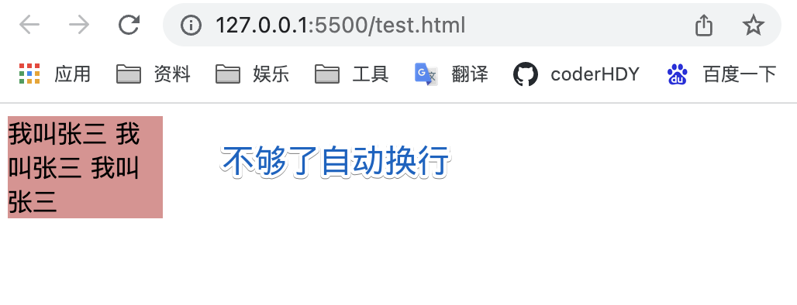

## text-align
::: tip text-align
|值|效果|
|---|---|
|start|如果内容方向是左至右，则等于left，反之则为right。|
|end|如果内容方向是左至右，则等于right，反之则为left。|
|left|左侧对齐|
|right|右侧对齐|
|center|居中|
|justify|两侧对齐，对最后一行无效|
|justify-all|两侧对齐，且最后一行生效【很多环境未实现】|
|match-parent|start和end的值根据父元素的direction确定，并被替换为恰当的left或right【很多环境未实现】|
|【String】|根据本字符串对齐【很多环境未实现】|
:::
<<<<<<< HEAD
:::: tabs 
::: tab label=start/left


```html{7}
<body>
    <div>我是张三，你找我？</div>

    <style>
        div {
            background-color: rgb(221, 144, 144);
            text-align: start;
            /* text-align: left; */
        }
    </style>    
</body>
```
:::
::: tab label=right/end


```html{7}
<body>
    <div>我是张三，你找我？</div>

    <style>
        div {
            background-color: rgb(221, 144, 144);
            text-align: end;
            /* text-align: right; */
        }
    </style>    
</body>
```
:::
::: tab label=center


```html{7}
<body>
    <div>我是张三，你找我？</div>

    <style>
        div {
            background-color: rgb(221, 144, 144);
            text-align: center;
        }
    </style>    
</body>
```
:::
::: tab label=justify


```html{7}

<body>
=======
::: codePen label=text-align val=start select=[start,left,right,end,center,justify]
```html{7}
<body>
>>>>>>> 38feadc4e84ab8388b6bf5687e195f07fb5867e6
    <div>我是张三，你找我？我是张三，你找我？我是张三，你找我？我是张三，你找我？</div>

    <style>
        div {
            background-color: rgb(221, 144, 144);
<<<<<<< HEAD
            width: 200px;
            text-align: justify;
=======
            width: 220px;
            text-align: {{val}};
>>>>>>> 38feadc4e84ab8388b6bf5687e195f07fb5867e6
        }
    </style>    
</body>
```
:::
<<<<<<< HEAD
::::
=======
>>>>>>> 38feadc4e84ab8388b6bf5687e195f07fb5867e6
## text-decoration
::: tip text-decoration
* 文字装饰

|值|效果|
|---|---|
|underline|下划线|
|line-through|删除线|
|#333|线的颜色|
|solid \| double \| dotted \| dashed \| wavy| 线的样式|
|1px|粗细|
:::

```html
<body>
    <div>我叫张三</div>

    <style>
        div {
            text-decoration: line-through rgb(164, 141, 245) wavy 3px;
        }
    </style>    
</body>
```
## text-overflow
::: tip text-overflow
* 如何处理溢出文本

|值|效果|
|---|---|
|clip|溢出父盒子的位置剪裁|
|ellipsis|溢出位置省略号|
:::
<<<<<<< HEAD
:::: tabs
::: tab label=clip


=======
>默认效果，截断
::: codePen height=50
>>>>>>> 38feadc4e84ab8388b6bf5687e195f07fb5867e6
```html{6-7,11}
<body>
    <div>我叫张三我叫张三我叫张三我叫张三我叫张三</div>

    <style>
        div {
            overflow: hidden;
            white-space: nowrap;
            width: 100px;
            background-color: rgb(250, 167, 167);

            text-overflow: clip;
        }
    </style>    
</body>
```
:::
<<<<<<< HEAD
::: tab label=ellipsis


=======
>单行省略号
::: codePen height=50
>>>>>>> 38feadc4e84ab8388b6bf5687e195f07fb5867e6
```html{6-7,11}
<body>
    <div>我叫张三我叫张三我叫张三我叫张三我叫张三</div>

    <style>
        div {
            overflow: hidden;
            white-space: nowrap;
            width: 100px;
            background-color: rgb(250, 167, 167);

            text-overflow: ellipsis;
        }
    </style>    
</body>
```
:::
<<<<<<< HEAD
::: tab label=多行省略号
* 多行超出显示省略号写法
=======
>多行省略号
::: codePen height=100
>>>>>>> 38feadc4e84ab8388b6bf5687e195f07fb5867e6
```html
<body>
    <div>这是一本好书这是一本好书这是一本好书这是一本好书这是一本好书这是一本好书这是一本好书这是一本好书</div>

    <style>
        div {
            display: -webkit-box;
            white-space: normal;
            text-overflow: ellipsis;
            overflow: hidden;
            -webkit-line-clamp: 2;
            -webkit-box-orient: vertical;
        }
    </style>
</body>
```
:::
<<<<<<< HEAD
::::
=======
>>>>>>> 38feadc4e84ab8388b6bf5687e195f07fb5867e6
## text-shadow
::: tip text-shadow
* 文字阴影

|值|效果|
|---|---|
|#333|阴影颜色|
|10px|x轴偏移|
|10px|y轴偏移|
|2px|模糊半径|
:::
:::: tabs
::: tab label=正下方阴影


```html{6-7}
<body>
    <div>我叫张三我叫张三我叫张三我叫张三我叫张三</div>

    <style>
        div {
            /* 颜色 x轴偏移0px y轴偏移20px 2px的模糊半径 */
            text-shadow: rgb(216, 130, 130) 0 20px 2px;
        }
    </style>    
</body>
```
:::
::: tab label=左上方阴影


```html{6-7}
<body>
    <div>我叫张三我叫张三我叫张三我叫张三我叫张三</div>

    <style>
        div {
            /* 颜色 x轴偏移-5px y轴偏移-10px 2px的模糊半径 */
            text-shadow: rgb(216, 130, 130) -5px -10px 2px;
        }
    </style>    
</body>
```
:::
::: tab label=多个阴影重叠


```html{6}
<body>
    <div>我叫张三我叫张三我叫张三我叫张三我叫张三</div>

    <style>
        div {
            text-shadow: 1px 1px 2px red, 0 0 1em blue, 0 0 0.2em blue;;
        }
    </style>    
</body>
```
:::
::::
## text-indent
::: tip text-indent
* 首行文本缩进
:::


```html{8}
<body>
    <div>我叫张三我叫张三我叫张三我叫张三我叫张三我叫张三我叫张三我叫张三</div>

    <style>
        div {
            width: 100px;
            background-color: rgb(224, 144, 144);
            text-indent: 2rem;
        }
    </style>    
</body>
```
## white-space
::: tip white-space
* 空白处理

|值|效果|
|---|---|
|normal|空格不做处理，到边界自动换行|
|pre|按书写格式保留|
|nowrap|空格无效，强制不能换行|
|pre-line|空格无效，换行按书写保留|
|pre-wrap|换行按书写保留，但是不够写了就换行|
:::
::::tabs
::: tab label=normal
* 多少个空格换行都转化成一个空格


```html{12}
<body>
    <div>
        我叫张三
        我叫张三
        我叫张三
    </div>

    <style>
        div {
            width: 100px;
            background-color: rgb(224, 144, 144);
            white-space: normal;
        }
    </style>    
</body>
```
:::
::: tab label=pre


```html{12}
<body>
    <div>
        我叫张三
        我叫张三
        我叫张三
    </div>

    <style>
        div {
            width: 100px;
            background-color: rgb(224, 144, 144);
            white-space: pre;
        }
    </style>    
</body>
```
:::
::: tab label=nowrap


```html{12}
<body>
    <div>
        我叫张三
        我叫张三
        我叫张三
    </div>

    <style>
        div {
            width: 100px;
            background-color: rgb(224, 144, 144);
            white-space: nowrap;
        }
    </style>    
</body>
```
:::
::: tab label=pre-line


```html{12}
<body>
    <div>
        我叫张三    我叫张三
        我叫张三
        我叫张三
    </div>

    <style>
        div {
            width: 100px;
            background-color: rgb(224, 144, 144);
            white-space: pre-line;
        }
    </style>    
</body>
```
:::
::: tab label=pre-line


```html{12}
<body>
    <div>
        我叫张三    我叫张三
        我叫张三
        我叫张三
    </div>

    <style>
        div {
            width: 100px;
            background-color: rgb(224, 144, 144);
            white-space: pre-wrap;
        }
    </style>    
</body>
```
:::
::::
## text-transform
::: tip text-transform
* 英语大小写转换

|属性|效果|
|---|---|
|capitalize|首字母大写|
|uppercase|全部大写|
|lowercase|全部小写|
:::
## user-select
::: tip 指定用户选中文本的能力
|值|效果|
|---|---| 
|auto|【默认】伪元素和html产生的结构化标记不能选中|
|none|禁止选中文本|
|text|文本|
|content|元素内可以选择|
|all|一选择就整体选中|
:::
::: codePen
```html
<body>
    <p class="all">我是all我是all我是all我是all</p>
    <p class="content">我是content我是content</p>
    <p class="none">我是none我是none我是none</p>
    <style>
        .all {
            user-select: all;
        }
        .content {
            user-select: content;
        }
        .none {
            user-select: none;
        }
    </style>
</body>
```
:::
## vertical-align
::: tip vertical-align
* 行内元素或表格元素的对齐方式
* 可设置图片的此属性来对齐同行内的文字
>图片是行内块元素

```css
vertical-align: middle;
```
:::