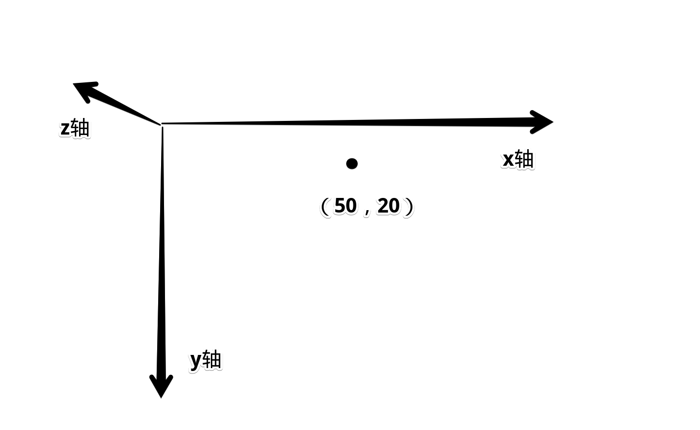
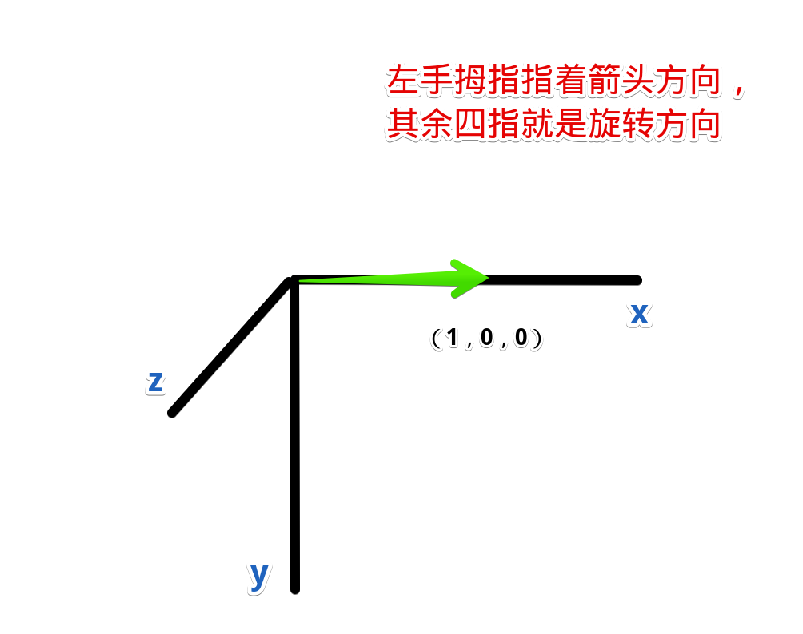
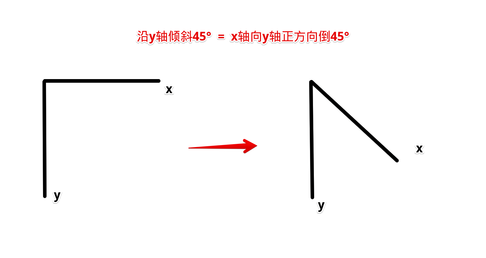
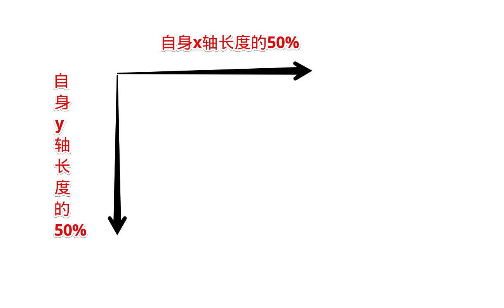

## transform-origin
::: tip transform-origin
* 作用：定义【translate】变换的原点
* 使用：transform-origin:x y z;

|值|原点|
|---|---|
|center|盒子中心|
|top|盒子上边中心|
|left|盒子左边中心|
|bottom right|下右顶点|
|50px 20px|x轴向左跑50，y轴向下跑20|
:::
>图解  


## transform-function
### rotate
::: tip
* 作用：2D旋转。旋转圆心根据transform-origin定义
* 定义：rotate(angle)
* 入参：旋转角度。
* 角度：有四种单位，可接受负数，逆时针旋转

|入参|值|
|---|---|
|45deg|45°|
|400grad|360°|
|6.2832rad|360°【2π】|
|1turn|360°|
:::
>旋转球
::: codePen
```html{23-24,26-28}
<body>
    <div id="container">
        <div id="ball">你好</div>
    </div>

    <style>
        #container {
            position: relative;
            width: 200px;
            height: 200px;
            background-color: rgb(118, 144, 233);
            padding-left: 50px;
            padding-top: 50px;
            box-sizing: border-box;
            overflow: hidden;
        }

        #ball {
            width: 100px;
            height: 100px;
            background-color: #fff;

            transform-origin: center;
            transition: all 1s ease;
        }
        #ball:hover {
            transform: rotate(360deg);
        }
    </style>
</body>
```
:::
### rotate3d
::: tip
* 作用：定义3d旋转动画
* 旋转轴：transform-origin定义轴的起点，rotate3d三个值【x, y, z】定义矢量方向，合成旋转轴
* 使用：rotate3d(a, y, z, a)

|入参|含义|
|---|---|
|x|【0~1】旋转轴X坐标方向的矢量|
|y|【0~1】y坐标方向的矢量|
|z|【0~1】z坐标方向的矢量|
|a|旋转角度，与rotate一样，四种单位。支持负值逆时针旋转|
:::
::: warning 简写
* 单独一个方向旋转可以简写

|属性|相当于|
|---|---|
|rotateX(a)|rotate3d(1, 0, 0, a)|
|rotateY(a)|rotate3d(0, 1, 0, a)|
|rotateZ(a)|rotate3d(0, 0, 1, a)|
:::
:::: tabs
::: tab label=旋转坐标轴
* 原点为【transform-origin】定义，默认是【center】

:::
::: tab label=翻牌
<video src="./assets/ratate3d0.mp4" style="width:300px;" controls />

```html{27}
<body>
    <div id="container">
        <div id="ball">你好</div>
    </div>

    <style>
        #container {
            position: relative;
            margin: 50px;
            width: 200px;
            height: 200px;
            background-color: rgb(118, 144, 233);
            padding-left: 50px;
            padding-top: 50px;
            box-sizing: border-box;
            overflow: hidden;
        }
        #ball {
            width: 100px;
            height: 100px;
            background-color: #fff;

            transform-origin: center;
            transition: all 1s ease;
        }
        #ball:hover {
            transform: rotate3d(1, 0, 0, 180deg);
        }
    </style>
</body>
```
:::
::::
### scale
::: tip
* 作用：2d平面图像伸缩，伸缩的起点由transform-origin定义
* 使用：
    1. scale(both)
    2. scale(x, y)
* 入参：
    1. x和y方向整体共同伸缩比例
    2. x轴方向伸缩的比例，y轴方向伸缩的比例
:::
::: danger 伸缩内容
* 整个盒子内容都会被伸缩，包括文字
:::
:::: tabs
::: tab label=both
<video src="./assets/scale0.mp4" controls style="width:300px;"/>

```html{27}
<body>
    <div id="container">
        <div id="ball">你好</div>
    </div>

    <style>
        #container {
            position: relative;
            margin: 50px;
            width: 200px;
            height: 200px;
            background-color: rgb(118, 144, 233);
            padding-left: 50px;
            padding-top: 50px;
            box-sizing: border-box;
            overflow: hidden;
        }
        #ball {
            width: 100px;
            height: 100px;
            background-color: #fff;

            transform-origin: center;
            transition: all 1s ease;
        }
        #ball:hover {
            transform: scale(1.5);
            background-color: rgb(252, 92, 92);
        }
    </style>
</body>
```
:::
::: tab label=分别伸缩
* x轴放大1.5倍，y轴不变

<video src="./assets/scale1.mp4" style="width:300px;" controls/>

```html{23,27}
<body>
    <div id="container">
        <div id="ball">你好</div>
    </div>

    <style>
        #container {
            position: relative;
            margin: 50px;
            width: 200px;
            height: 200px;
            background-color: rgb(118, 144, 233);
            padding-left: 50px;
            padding-top: 50px;
            box-sizing: border-box;
            overflow: hidden;
        }
        #ball {
            width: 100px;
            height: 100px;
            background-color: #fff;

            transform-origin: left;
            transition: all 1s ease;
        }
        #ball:hover {
            transform: scale(1.5, 1);
            background-color: rgb(252, 92, 92);
        }
    </style>
</body>
```
:::
::::
### scale3d
::: tip
* 作用：3d图像各方向伸缩比例
* 使用：scale3d(x, y, z)
* 简写：

|简写|相当于|
|---|---|
|scaleX(a)|scale3d(a, 1, 1)|
|scaleY(a)|scale3d(1, a, 1)|
|scaleZ(a)|scale3d(1, 1, a)|
:::
### skew
::: tip
* 作用：二维平面上的倾斜，对应的像素会做拉伸处理
* 使用：skew(x, y)
* 入参：倾斜角度，同rotate四种单位
* 简写：

|简写|相当于|
|---|---|
|skewX(x)|skew(x, 0)|
|skewY(x)|skew(0, y)|
:::
:::: tabs
::: tab label=规则
```css
transform: skew(45deg, 0);
```


```css
transform: skew(0, 45deg);
```

:::
::: tab label=倾斜
<video src="./assets/skew0.mp4" style="width:300px;" controls />

```html{27}
<body>
    <div id="container">
        <div id="ball">你好</div>
    </div>

    <style>
        #container {
            position: relative;
            margin: 50px;
            width: 200px;
            height: 200px;
            background-color: rgb(118, 144, 233);
            padding-left: 50px;
            padding-top: 50px;
            box-sizing: border-box;
            overflow: hidden;
        }
        #ball {
            width: 100px;
            height: 100px;
            background-color: #fff;

            transform-origin: center;
            transition: all 500ms ease;
        }
        #ball:hover {
            transform: skew(45deg, 0);
        }
    </style>
</body>
```
::::
### translate
::: tip
* 作用：平移
* 使用：translate(x, y)
* 入参：向量上的平移量，**如果是百分比，参照的是自身向量方向上的长度**
:::
:::: tabs
::: tab label=图解
```css
transform: translate(50%, 50%);
```

:::
::: tab label=平移
<video src="./assets/translatehezi.mp4" style="width:300px;" controls/>

>自身x轴长100px，所以x轴平移50px，y轴同
```html{16-17,24}
<body>
    <div id="container">
        <div id="ball">你好</div>
    </div>

    <style>
        #container {
            position: relative;
            margin: 50px;
            width: 200px;
            height: 200px;
            background-color: rgb(118, 144, 233);
            overflow: hidden;
        }
        #ball {
            width: 100px;
            height: 100px;
            background-color: rgb(185, 247, 183);

            transform-origin: center;
            transition: all 500ms ease;
        }
        #ball:hover {
            transform: translate(50%, 50%);
        }
    </style>
</body>
```
:::
::::
### translate3d
::: tip
* 作用：3d方向上的平移矢量
* 使用：translate3d(x, y, z)
* 简写：

|简写|相当于|
|---|---|
|translateX(a)|translate3d(a, 0, 0)|
|translateY(a)|translate3d(0, a, 0)|
|translateZ(a)|translate3d(0, 0, a)|
:::

