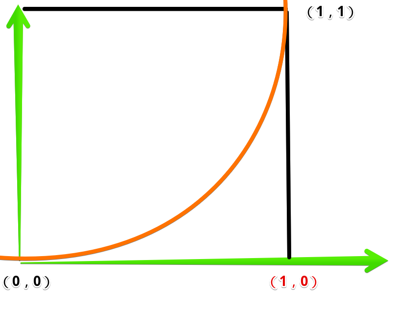

## 整合属性
::: tip 整合属性
* 过渡：过渡可以为一个元素在不同状态之间切换的时候定义不同的过渡效果。
* 注：transition使用时是按序的
```css
transition: property duration delay timing-function;
```

|属性|效果|值|
|---|---|---|
|transition-property|指定状态过渡关联的属性的名称|none / all /【[0-9a-zA-Z-_]+】|
|transition-duration|过渡动画所需的时间|0s【默认，无动画】 / 100ms|
|transition-delay|开始前等待时间|1s / 3ms|
|transition-timing-function|描述动画的加速曲线|ease / ease-in / ease-out / ease-in-out / linear / steps(4, end) / cubic-bezier(0.1, 0.7, 1.0, 0.1) / step-start / step-end|
:::
>过渡球
::: codePen
```html{23,25-28}
<body>
    <div id="container">
        <div id="ball"></div>
    </div>

    <style>
        #container {
            position: relative;
            width: 200px;
            height: 200px;
            background-color: rgb(118, 144, 233);
            overflow: hidden;
        }

        #ball {
            width: 100px;
            height: 100px;
            margin-left: 50%;
            transform: translate(-50%, 50%);
            background-color: #fff;
            border-radius: 50px;

            transition: all 1s 100ms cubic-bezier(0.1, 0.7, 1.0, 0.1);
        }
        #ball:hover {
            border-radius: 0;
            background-color: rgb(227, 159, 236);
        }
    </style>
</body>
```
:::

### property
>transition-property
* 关联变化过渡的属性名称，本例中【all】代表**所有的变化都要遵循此过渡方式**
```css
transition-property: all;

transition: all 1s 100ms cubic-bezier(0.1, 0.7, 1.0, 0.1);
```
* 有多个变化，但只要期中几个有过渡效果，就不能组合写
```css{10-11,13-17}
#ball {
    width: 100px;
    height: 100px;
    margin-left: 50%;
    box-sizing: border-box;
    transform: translate(-50%, 50%);
    background-color: #fff;
    border-radius: 50px;

    transition: none 1s cubic-bezier(0.1, 0.7, 1.0, 0.1);
    transition-property:  border-radius, background-color;
}
#ball:hover {
    border-radius: 0;
    background-color: rgb(227, 159, 236);
    border: 10px #333 solid;
}
```
### duration/delay
>transition-duration
* 过渡完成需要的总时长
```css
transition-duration: 1s;

transition: all 1s 100ms cubic-bezier(0.1, 0.7, 1.0, 0.1);
```
>transition-delay
* 延迟多久开始过渡
```css
transition-delay: 100ms;

transition: all 1s 100ms cubic-bezier(0.1, 0.7, 1.0, 0.1);
```

### timing-function
>transition-timing-function
* 描述过渡加速曲线，本例中【cubic-bezier(0.1, 0.7, 1.0, 0.1)】是一个[贝塞尔曲线(Cubic Bezier)](https://blog.csdn.net/wjnf012/article/details/78795573)
* 分别对应的值是：cubic-bezier(x1, y1, x2, y2)，与[0, 0]、[1, 1] 分别连线生成的曲线，作为加速曲线
```css
transition-timing-function: cubic-bezier(0.1, 0.7, 1.0, 0.1);
```
* 匀加速曲线：
```css
transition-timing-function: cubic-bezier(1, 0, 1, 0);
```

* 效果:


::: codePen
```html{23,25-28}
<body>
    <div id="container">
        <div id="ball"></div>
    </div>

    <style>
        #container {
            position: relative;
            width: 200px;
            height: 200px;
            background-color: rgb(118, 144, 233);
            overflow: hidden;
        }

        #ball {
            width: 100px;
            height: 100px;
            margin-left: 50%;
            transform: translate(-50%, 50%);
            background-color: #fff;
            border-radius: 50px;

            transition: all 1s 100ms cubic-bezier(0.1, 0.7, 1.0, 0.1);
            transition-timing-function: cubic-bezier(1, 0, 1, 0);
        }
        #ball:hover {
            border-radius: 0;
            background-color: rgb(227, 159, 236);
        }
    </style>
</body>
```
:::

<video src="./assets/cubicbezier.mp4" style="width:300px" controls />

|值|效果|
|---|---|
|ease|【默认】慢-快-慢（cubic-bezier(0.25, 0.1, 0.25, 1)）|
|linear|全程匀速，（等于 cubic-bezier(0, 0, 1, 1)）|
|ease-in|慢-快（等于 cubic-bezier(0.42, 0, 1, 1)）|
|ease-out|快-慢（等于 cubic-bezier(0, 0, 0.58, 1)）|
|ease-in-out|慢-快-慢，（等于 cubic-bezier(0.42, 0, 0.58, 1)）|