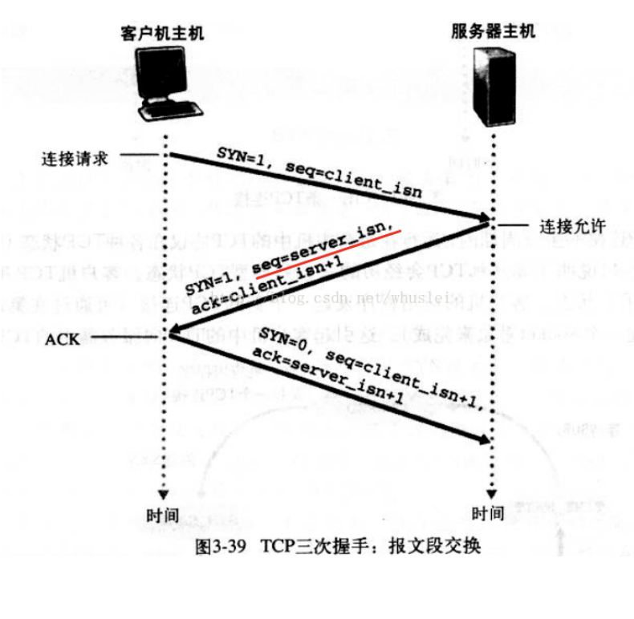
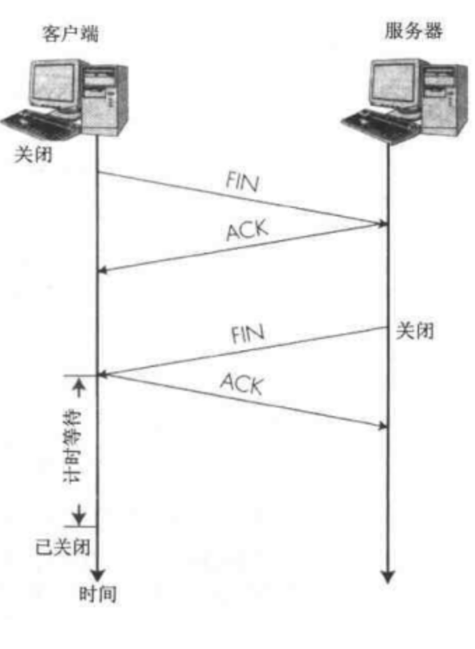

## JS相关
### 连续赋值
:::: tabs
::: tab label=题目
```js
var a = {
    n: 1,
    x: 3
}
a.x = a = { n: 2};
console.log(a.x); // ?
```
:::
::: tab label=思路
* 理解：正常时从右到左赋值，但是【.】操作符比【=】操作符优先级高，所以先走a.x的赋值
```js{7}
var a = {
    n: 1,
    x: 3
}
// a.x = a = { n: 2};
a.x = {n: 2};
a = {n: 2}; // 引用赋值，所以现在 a = {n: 2}，a.x消失
console.log(a.x); // undefined
```
:::
::: tab label=证明
* 证明猜测
```js
let me = {
    name: 'hdy',
    age: 18,
    books: [
        '红宝书',
        '蝴蝶书'
    ]
}

me.name = me = me.books;
console.log(me); // ['红宝书', '蝴蝶书']

/**
 * 1. me.name = me.books; ['红宝书', '蝴蝶书']
 * 2. me = me.books;      ['红宝书', '蝴蝶书']
 */
```
:::
::::
## 操作系统相关
### 线程和进程
:::tip
1. 线程是进程的最小执行单位
2. 进程是系统分配资源的最小单位
3. 线程使用进程分配的资源执行
4. 执行时可以给资源上锁，使用完后解锁，其他资源才可以使用
5. JS是单线程语言，但是使用worker可以多开一个线程
6. 浏览器是多线程工作的，内部主要线程有：
    * JS引擎线程
    * GUI渲染线程（渲染页面）
    * 事件触发线程
    * 定时器触发线程
    * http请求线程
    * 其他线程
7. 如果要在系统内多开一个线程shell命令：shell代码后加【&】
```shell
# 无多线程
for ((i=0;i<5;i++))
do
    {
        sleep 3
        echo "${i} done!" >> log.txt
    }
done
wait
```
```shell{7}
# 当前代码多开一个线程后台执行
for ((i=0;i<5;i++))
do
    {
        sleep 3
        echo "${i} done!" >> log.txt
    } &
done
wait
```
:::
## 网络相关
### 网络七层
:::: tabs
::: tab label=总览
* 七层划分
    1. 应用层
    2. 表示层
    3. 会话层
    4. 传输层
    5. 网络层
    6. 数据链路层
    7. 物理层
* 五层划分
    1. 应用层（包括表示会话）
    2. 传输层
    3. 网络层
    4. 数据链路层
    5. 物理层
* 每一层都在网络传输中实现了不同的功能作用
* 每一层都将数据进行了一次**封装或切割**，到指定目标后再**反向解除封装、拼接**。达到传输目的。
:::
::: tab label=图解

:::
::: tab label=应用层
* 应用层（Application Layer）是计算机用户，以及各种应用程序和网络之间的接口，其功能是直接向用户提供服务，完成用户希望在网络上完成的各种工作。
* 应用层为用户提供的服务和协议有：文件服务、目录服务、文件传输服务（FTP）、远程登录服务（Telnet）、电子邮件服务（E-mail）、打印服务、安全服务、网络管理服务、数据库服务等。
* 应用层的主要功能如下：
    * 用户接口：应用层是用户与网络，以及应用程序与网络间的直接接口，使得用户能够与网络进行交互式联系。
    * 实现各种服务：该层具有的各种应用程序可以完成和实现用户请求的各种服务。
:::
::: tab label=表示层
* 其主要功能是“处理用户信息的表示问题，如编码、数据格式转换和加密解密”等。
* 表示层的具体功能如下：
    * 数据格式处理：协商和建立数据交换的格式，解决各应用程序之间在数据格式表示上的差异。
    * 数据的编码：处理字符集和数字的转换。例如由于用户程序中的数据类型（整型或实型、有符号或无符号等）、用户标识等都可以有不同的表示方式，因此，在设备之间需要具有在不同字符集或格式之间转换的功能。
    * 压缩和解压缩：为了减少数据的传输量，这一层还负责数据的压缩与恢复。
    * 数据的加密和解密：可以提高网络的安全性。
:::
::: tab label=会话层
* 会话层（Session Layer）是用户应用程序和网络之间的接口
* 主要任务是：
    * 向两个实体的表示层提供建立和使用连接的方法。将不同实体之间的表示层的连接称为会话。
    * 因此会话层的任务就是组织和协调两个会话进程之间的通信，并对数据交换进行管理。
:::
::: tab label=传输层
* 传输层（Transport Layer）是通信子网和资源子网的接口和桥梁，起到承上启下的作用。
* 该层的主要任务是：
    * 向用户提供可靠的端到端的差错和流量控制，保证报文的正确传输。传输层的作用是向高层屏蔽下层数据通信的细节，即向用户透明地传送报文。
    * 该层常见的协议：TCP/IP中的TCP协议、Novell网络中的SPX协议和微软的NetBIOS/NetBEUI协议。
* 传输层提供会话层和网络层之间的传输服务，这种服务从会话层获得数据，并在必要时，**对数据进行分割**。
* 然后，传输层将数据传递到网络层。
* 因此，传输层负责提供两节点之间数据的可靠传送，当两节点的联系确定之后，传输层则负责监督工作。
* 传输层的主要功能如下：
    * 传输连接管理：**提供建立、维护和拆除传输连接的功能。**
    * 处理传输差错：提供可靠的`tcp`和不太可靠的`udp`的数据传输服务、差错控制和流量控制。
    * 监控服务质量。
:::
::: tab label=网络层
* 网络层（Network Layer）是OSI参考模型中最复杂的一层，也是通信子网的最高一层。
* 其主要任务是：
    * 通过路由选择算法，为报文或分组通过通信子网选择最适当的路径。
    * 数据链路层的数据在这一层被转换为数据包，然后通过路径选择、分段组合、顺序、进/出路由等控制，将信息从一个网络设备传送到另一个网络设备。
    * 一般地，数据链路层是解决同一网络内节点之间的通信，而网络层主要解决不同子网间的通信。例如在广域网之间通信时，必然会遇到路由（即两节点间可能有多条路径）选择问题。 

* 在实现网络层功能时，需要解决的主要问题如下：
    * 寻址：数据链路层中使用的物理地址（如MAC地址）仅解决网络内部的寻址问题。
    * 交换：规定不同的信息交换方式。常见的交换技术有：线路交换技术和存储转发技术，后者又包括报文交换技术和分组交换技术。
    * 路由算法：当源节点和目的节点之间存在多条路径时，本层可以根据路由算法，通过网络为数据分组选择最佳路径，并将信息从最合适的路径由发送端传送到接收端。
    * 连接服务：与数据链路层流量控制不同的是，前者控制的是网络相邻节点间的流量，后者控制的是从源节点到目的节点间的流量。其目的在于防止阻塞，并进行差错检测。
:::
::: tab label=数据链路层
* 数据链路层（Data Link Layer）负责建立和管理节点间的链路。
* 该层的主要功能是：
    * 通过各种控制协议，将有差错的物理信道变为无差错的、能可靠传输数据帧的数据链路。
    * 在计算机网络中由于各种干扰的存在，物理链路是不可靠的。因此，这一层的主要功能是在物理层提供的比特流的基础上，通过**差错控制、流量控制方法，使有差错的物理线路变为无差错的数据链路，即提供可靠的通过物理介质传输数据的方法。**
    * 该层通常又被分为介质访问控制（MAC）和逻辑链路控制（LLC）两个子层。
* 数据链路层的具体工作是接收来自物理层的位流形式的数据，**并封装成`帧`**，传送到上一层；同样，也将来自上层的数据帧，**拆装为`位流`形式的数据转发到物理层**；并且，还负责处理接收端发回的确认帧的信息，以便提供可靠的数据传输。

>MAC子层的主要任务是解决共享型网络中多用户对信道竞争的问题，完成网络介质的访问控制；

>LLC子层的主要任务是建立和维护网络连接，执行差错校验、流量控制和链路控制。
:::
::: tab label=物理层
* 物理层（Physical Layer）的主要功能是：利用传输介质为数据链路层提供物理连接，实现**比特流的透明传输。**
* **尽可能屏蔽掉具体传输介质和物理设备的差异。使其上面的数据链路层不必考虑网络的具体传输介质是什么。**“透明传送比特流”表示经实际电路传送后的比特流没有发生变化，对传送的比特流来说，这个电路好像是看不见的。
::::
### http2.0/3.0特性
:::: tabs
::: tab label=概览
* http1.1是1999年发布，http2.0是2014年11月实现标准化
* 主要解决http1.1问题：
    * 反复连接：http1.1有长连接特性，不过返回数据分组标识还是以请求来分的，一个请求一个响应。
    * 单向请求：客户端 -> 服务器
    * 文件未压缩，会比较大


:::
::: tab label=二进制分帧
* **HTTP2.0中所有加强性能的核心是二进制传输**，在HTTP1.x中，我们是通过文本的方式传输数据
* 在应用层（HTTP）和传输层（TCP）之间增加一个`二进制分帧层`
* 在二进制分帧层上，HTTP2.0会将所有传输的信息分为更小的消息和帧，并采用二进制格式编码，其中HTTP1.x的首部信息会被封装到Headers帧，而Request Body则封装到Data帧。
:::
::: tab label=首部压缩
* http传输header多了一个压缩处理，有两个优化点：
    * 一个是采用了一个压缩算法，给传输头部进行编码压缩
    * 另一个是服务器端和浏览器端各维护一个索引表，如果要传输已经传过的header就直接传索引就行了，比如说cookie。登录以后，两端各维护一份，然后就可以直接通过键键名来沟通对应的header了。
:::
::: tab label=多路复用
* 长连接问题产生与优化：
    * http1.0是以请求为单位的，一个请求一个返回，T**CP连接没有长连接的特性**
    * http1.1有长连接特性，不过返回数据分组标识还是以请求来分的，**一个请求一个响应。**
    * http2.0传输是以`帧`为单位的传输，以`数据流`为单位区分的，每个帧有一个标识，说明他是哪个数据流的，然后就可以在http连接里直接传输，到了本地的时候再进行一个**数据流重组**，让帧根据标识重组成数据流，就完成了这个多路复用，**一个请求可以返回很多数据流**
:::
::: tab label=其他
* 请求优先级：
    * 因为一个请求可以返回很多数据流了，所以就可以在服务器端进行优先级的排序，先发送哪些数据流给浏览器。
    * 到的顺序不一定能保证按序，因为是多路复用，二进制分帧，到客户端再重组。
* 服务器推送
    * [websocket](../base/cors.html#websocket)
    * 浏览器发送一条请求，服务器可以推送多个响应。
* 安全限制：HTTP/2 必须采用 SSL 安全连接
:::
::: tab label=http3.0
* QUIC (Quick UDP Internet Connections), 快速 UDP 互联网连接。
* QUIC是**基于UDP协议**的。
    * 由于是基于UDP协议，丢包阻塞的问题就不会发生。【HTTP2.0是基于TCP，还是会有**TCP队头阻塞(HOL)问题**】
    >TCP协议在收到数据包之后，这部分数据可能是乱序到达的，但是TCP必须将所有数据收集排序整合后给上层使用，如果其中某个包丢失了，就必须等待重传，从而出现某个丢包数据阻塞整个连接的数据使用。
    * QUIC在非首次连接的情况下，第一个数据包就可以发业务数据(包含了连接数据)，从而在连接延时有很大优势，可以节约数百毫秒的时间。
    >首次连接传递保存了config包，客户端直接进行保存`有时效性`，后续再连接时可以直接使用
:::
::::
### DNS解析
:::: tabs
::: tab label=查找过程
>目的就是查找域名对应的IP地址
1. 浏览器缓存
2. 操作系统缓存（hosts文件）
>域名劫持：黑客通过修改hosts文件让域名解析到指定的地址上
3. DNS路由缓存：每个路由器内会有缓存，如果访问过的域名路由器会存储缓存。清除方式：重启路由器
4. 本地域名服务器`LDNS`。一般是比较近的运营商
5. 如果都没找到最后去根域名服务器开始`解析`。
:::
::: tab label=解析过程
>例：查找【mail.qq.com】
0. 本地域名服务器`LDNS`向根域名服务器发送请求
1. 根域名服务器`root Server`：全球13个。可以拿到顶级域名服务器`gTLD Server`【存储.com的服务器】地址返回给LDNS【.com】
2. 顶级域名服务器：拿到域名注册IP地址`Name Server`返回给LDNS【qq.com】
3. 子域名服务器：如果有二级、三级域名，就会继续向下返回对应的ip给LDNS【mail.qq.com】
>自此，解析完毕，LDNS拿到了mail.qq.com的服务器ip地址，返回给客户端，客户端就能和服务器建立连接，进行数据通信了
:::
::: tab label=递归和迭代查询
* 其实DNS客户端和本地DNS服务器是递归，而本地名称服务器和其他名称服务器之间是迭代查询
>DNS客户端向本地DNS服务器发送DNS解析请求，之后就处于等待状态，等结果回来，这就是`递归查询`

>本地DNS服务器发现自己没有域名对应的解析，就会向:  
[ 根域名服务器, 顶级域名服务器, 二级域名服务器, 权威域名服务器... ]   
进行`迭代查询`

* 可以进行网络设置让DNS客户端自己进行迭代查询
:::
::::
### 三次握手/四次挥手
:::: tabs
::: tab label=图解
* `TCP连接`时使用
* 三次握手的本质：
    * 客户端发送带特殊标记的请求
    * 服务端返回此标记，同时附带服务器的标记
    * 客户端返回服务器带有同样标记的数据
* 三次握手的目的：
    * 1、2客户端确认了服务器的收发数据的能力
    * 2、3服务器端确认了客户端的数据收发能力
    * 之后再开始数据传输，保证了数据传输的`可靠性`



:::
::: tab label=四次挥手
* 四次挥手的本质：
    * 客户端发送断开连接请求
    * 服务器端响应请求，但不做操作
    * 服务器端发送断开请求
    * 客户端回应同意断开，结束
* 四次挥手的目的：
    * 客户端发送断开请求，服务器可能还在发送数据，因此不能立即断开，但要响应一下，告诉客户端请求收到了
    * 服务器数据发送完了，再向客户端发送一个断开请求，但也不能立即断开，防止客户端没收到，还在傻傻的等数据，所以等客户端回应一个消息后，双方默认断开



::::
### HTTPS加密原理
:::: tabs
::: tab label=加密技术
* 对称加密：双方拿着同一个钥匙，既用来加密，也用来解密。
    * 钥匙都**不能公开**
    * 如：数字数据加密【-1 * data】，解密【-1 * data】
* 非对称加密：自己有一个公钥，有一个私钥，公钥给别人加密，自己拿私钥才能解开
    * 公钥**可以公开**，私钥不能公开
    * 私钥加密可以用公钥解开，公钥加密可以用私钥解开
:::
::: tab label=思路
>服务器和客户端怎样建立安全连接？
* 对称加密，**那怎么把对称密钥传给对方，且不被黑客知道？**
* 非对称加密:
    * 客户端给公钥，服务器返回自己的公钥
    * 双方开始用公钥加密传递消息
    * **万一公钥被黑客掉包成了黑客的公钥了呢？** 客户端就一直用黑客的公钥加密消息
* 非对称加密+对称加密
    * 客户端发送请求，服务器返回公钥
    * 客户端生成随机密钥，用公钥加密返回给服务器，这样随机密钥作为对称加密的钥匙，就能安全的使用对称加密了
    * **假如服务器返回公钥的消息被黑客劫持了，返回了黑客的公钥呢？那么随机密钥也只有黑客能解开**

>最后问题：非对称加密+对称加密的方式，**如何证明返回的公钥是服务器的公钥?**
:::
::: tab label=数字证书
* 网站在使用HTTPS前，需要向`CA机构`申领一份数字证书，数字证书里含有**证书持有者信息、公钥信息**等。服务器把证书传输给浏览器，浏览器从证书里获取公钥就行了。
* 签名：防止证书被篡改，把证书原本的内容生成一份“数字签名”
    1. CA机构拥有非对称加密的私钥和公钥。
    2. CA机构对证书明文T数据进行hash。
    3. 对hash后的值用私钥加密，得到数字签名S。
    4. 明文和数字签名共同生成了数字证书。
* 验证：浏览器有CA机构的公钥
    1. 拿到证书，得到明文T，签名S。
    2. 用CA机构的公钥对S解密（由于是浏览器信任的机构，所以浏览器保有它的公钥。），得到S’。
    3. 用证书里指明的hash算法对明文T进行hash得到T’。
    4. 显然通过以上步骤，T’应当等于S‘，除非明文或签名被篡改。所以此时比较S’是否等于T’，等于则表明证书可信。
>这种方式除非CA机构的私钥泄露，否则黑客很难攻击。因为是用CA机构的私钥进行加密的数字签名，数字签名解开又必须等于明文。
更改明文 -> 解开的签名不会相等
更改签名 -> 浏览器是用CA机构的公钥解密的，也无法生成对应的明文
都更改 -> 浏览器只有CA机构的公钥，除非黑客把浏览器的CA机构公钥改成自己的。浏览器也有对应的保密技术。
:::
::: tab label=最终方案
0. 浏览器会有主流**CA证书机构的公钥。**
1. 服务器向CA机构递交证书申请，含有证书持有者信息、**服务器的公钥**信息。
2. CA机构生成`明文证书`并用自己的私钥进行加密生成`数字签名`，作为`完整的证书`给服务器。
3. 浏览器向服务器发送请求
4. 服务器返回自己的证书，含明文部分和签名部分
5. 浏览器用CA机构的公钥解开签名部分，看是否完全相等于明文部分
6. 完全相等，浏览器信任这份证书，也就**信任内部的服务器公钥**
7. 浏览器生成`随机密钥`，用服务器公钥加密返回给服务器
8. 服务器用自己的私钥解开随机密钥，作为`对称密钥`和浏览器进行交流
:::
::::