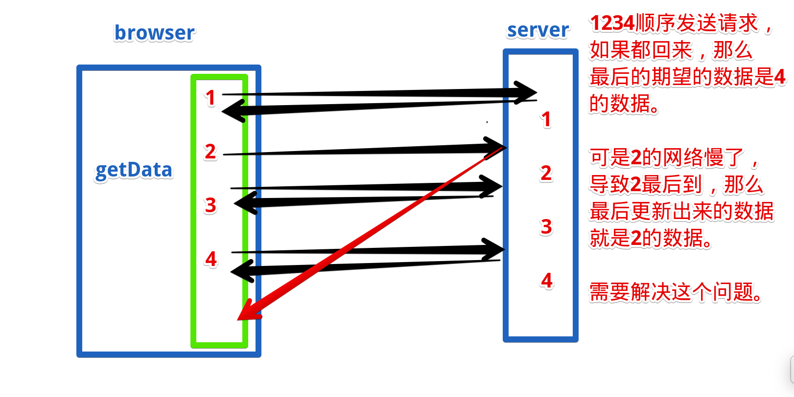

## 手写stringify

:::: tabs
::: tab label=期望
```js
const obj = {
    name: 'hdy',
    books: [
        'js高程',
        'js语言精粹'
    ],
    friends: {
        '小红': '18岁',
        '小蓝': '20岁'
    }
}

console.log(stringify(obj) === JSON.stringify(obj)); // true
```
:::
::: tab label=深浅拷贝实现
* 主要就是判断类型，然后拼接对应的效果
* 需要注意的是【typeof null === 'object'】
```js{2}
function stringify(obj) {
    if (typeof obj === 'object' && obj != null) {
        let ans = Array.isArray(obj) ?
            `[${obj.map(item => stringify(item))}]`
            : `{${Object.entries(obj).map(([key, value]) => '"' + key + '"' + ':' + stringify(value))}}`;
        return ans;
    } else {
        return '"' + obj.toString() + '"';
    }
}
```
:::
::::
## 深浅拷贝
:::: tabs
::: tab label=期望
```js
const a = {
    books: []
}
const b = deepClone(a);

b.books.push('js高程');
console.log(a.books); // []
console.log(b.books); // ['js高程']
```
:::
::: tab label=JSON实现
```js
function deepClone(obj) {
    return JSON.parse(JSON.stringify(obj));
}
```
:::
::::
## 事件轮询
:::: tabs
::: tab label=问题1
* [事件轮询知识点](../base/promise.html#宏任务-微任务)
```js{7}
// 一个await后面是一层.then，与下面的new Promise交叉进行推入微任务队列，证明。
async function sum() {
    await console.log(1);
    await console.log(2);
    await console.log(3);

    return 4;
}

console.log(0);

sum().then(res => console.log(res));

new Promise(resolve => { console.log(5); resolve(); })
.then(() => console.log(6))
.then(() => console.log(7))

.then(() => console.log(8))

console.log(9);
```
:::
::: tab label=解1
```js{14}
/* 同步 */
// 0
// 1
// 5
// 9

/* 微 */
// 2
// 6

// 3
// 7

// 【async 的包装【new Promise(....; resolve => resolve(4))】，整个sum.then被推进微任务队列】
// 8

// 4

/* 宏 */
```
:::
::: tab label=问题2
```js{2}
async function getData() {
    return 0;
}

getData().then(res => console.log(res));

new Promise(resolve => resolve())
.then(_ => console.log(1))
.then(_ => console.log(2))
.then(_ => console.log(3))

console.log('同步');
```
:::
::: tab label=解2
```js{2,6}
/* 同步 */
// 【async 包装new Promise(.....; resolve => resolve(0))】,getData().then被推进微任务队列
// 同步

/* 微 */
// 0

// 1
// 2
// 3
```
:::
::: tab label=问题3
```js{2}
async function getData() {
    return new Promise(resolve => resolve(0));
}

getData().then(res => console.log(res));

new Promise(resolve => resolve())
.then(_ => console.log(1))
.then(_ => console.log(2))
.then(_ => console.log(3))

console.log('同步');
```
:::
::: tab label=解3
```js{2,6,9,12}
/* 同步 */
// 【async包装，new Promise(.....; resolve => resolve(new Promise()))】
// 同步

/* 微 */
// 【内部 new Promise().then】
// 1

// 【外部 new Promise，getData().then推入】
// 2

// 0
// 3
```
:::
::: tab label=合并问题4
```js{8-9}
async function async1() {
  console.log('async1 start');
  await async2();
  console.log('async1 end');
}

async function async2() {
  console.log('async2 start');
  return console.log('async2 promise');
}

console.log('script start');

setTimeout(function () {
  console.log('setTimeout');
}, 0);

async1();

new Promise(function (resolve) {
  console.log('promise1');
  resolve();
}).then(function () {
  console.log('promise2');
}).then(function () {
  console.log('promise3');
});
console.log('script end');
```
:::
::: tab label=解4
```js{4-5}
/* 同步 */
// script start
// async1 start
// async2 start
// async2 promise
// promise1
// script end

/* 微 */

// async1 end
// promise2

// promise3

/* 宏 */
// setTimeout
```
:::
::: tab label=合并问题5
```js{9-13}
async function async1() {
    console.log('async1 start');
    await async2();
    console.log('async1 end');
}

async function async2() {
    console.log('async2 start');
    return new Promise((resolve, reject) => {
        console.log('---');
        resolve();
        console.log('async2 promise');
    }).then(() => console.log('then'));
}

console.log('script start');

setTimeout(function () {
    console.log('setTimeout');
}, 0);

async1();

new Promise(function (resolve) {
    console.log('promise1');
    resolve();
}).then(function () {
    console.log('promise2');
}).then(function () {
    console.log('promise3');
});
console.log('script end');
```
:::
::: tab label=解5
```js{11,14,17}
/* 同步 */
// script start
// async1 start
// async2 start
// ---
// async2 promise
// promise1
// script end

/* 微 */
// then
// promise2

// 【async被包装的promise.then执行，推入了await后面包装的的then】
// promise3

// async1 end

/* 宏 */
// setTimeout
```
:::
::::
## 手写instanceof
:::: tabs
::: tab label=期望
* [原型链知识点](../base/object.html#原型链)
```js
class A {}
a = new A();
console.log(instanceOf(a, A)); // true
console.log(instanceOf(a, Object)); // true
console.log(instanceOf(a, Function)); // false
```
:::
::: tab label=原型链实现
```js{4-9}
function instanceOf(obj, fn) {
    const prototype = fn.prototype;
    let __proto__ = obj.__proto__;
    while (__proto__) {
        if (__proto__ === prototype) {
            return true;
        }
        __proto__ = __proto__.__proto__;
    }
    return false;
}
```
:::
::::
## 对象flatten扁平化
:::: tabs
::: tab label=期望
```js
const obj = {
    a: {
        b: 1,
        c: 2,
        d: {
            e: 5
        }
    },
    b: [1, 3, {
        a: 2,
        b: 3
    }],
    c: 3
}

const obj2 = flatten(obj);

console.log(obj2);

// obj2 = {
//     'a.b': 1,
//     'a.c': 2,
//     'a.d.e': 5,
//     'b[0]': 1,
//     'b[1]': 3,
//     'b[2].a': 2,
//     'b[2].b': 3,
//     'c': 3
// }
```
:::
::: tab label=深浅拷贝实现
* 重点思路：
    * 递归叠加key
    * 通过作用域链共享返回对象进行写入
```js{6,8,10}
function flatten(obj) {
    const ans = {};

    const handler = (cKey, cObj) => {
        if (Array.isArray(cObj)) {
            cObj.forEach((item, index) => handler(`${cKey}[${index}]`, item));
        } else if (obj instanceof Object) {
            Object.entries(cObj).forEach(([k, val]) => handler(`${cKey}.${k}`, val))
        } else {
            ans[cKey] = cObj;
        }
    }

    Object.entries(obj).forEach(([key, value]) => handler(key, value));
    return ans;
}
```
:::
::: tab label=默认传参
```js
function flatten(obj, cKey, ans = {}) {
    if (!cKey) {
        Object.entries(obj).forEach(([key, val]) => flatten(val, key, ans));
        return ans;
    }
    if (Array.isArray(obj)) {
        obj.forEach((item, index) => flatten(item, `${cKey}[${index}]`, ans));
    } else if (null instanceof Object) {
        Object.entries(obj).forEach(([key, val]) => flatten(val, `${cKey}.${key}`, ans));
    } else {
        ans[cKey] = obj;
    }
}
```
:::
::::
## 手写模板字符串
:::: tabs
::: tab label=期望
```js
const obj = {
    name: '西瓜皮儿',
    age: 18,
    books: [
        'js红宝书',
        'js蝴蝶书'
    ],
    parents: {
        father: '西瓜',
        mather: '农民伯伯'
    }
}

console.log(`我叫${obj.name},我喜欢看${obj.books[1]},我爸是${obj.parents.father}`);
// 我叫西瓜皮儿,我喜欢看js蝴蝶书,我爸是西瓜

let str = '我叫${name},我喜欢看${books[1]},我爸是${parents.father}'
console.log(template(obj, str));  // 我叫西瓜皮儿,我喜欢看js蝴蝶书,我爸是西瓜
```
:::
::: tab label=实现
* 重点思路：
    * `中括号`键值转为`.`键值
    * reduce链式取值
```js{3,5}
function template(obj, str) {
    const reg1 = /\$\{(.+?)\}/g;
    const reg2 = /\[(.+?)\]/g;
    return str.replace(reg1, (_, match) => 
        match.replace(reg2, '.$1')
        .split('.')
        .reduce((pre, key) => pre[key], obj));
}
```
:::
::: tab label=柯里化期望
```js{16-17}
const obj = {
    name: '西瓜皮儿',
    age: 18,
    books: [
        'js红宝书',
        'js蝴蝶书'
    ],
    parents: {
        father: '西瓜',
        mather: '农民伯伯'
    }
}

let str = '我叫${name},我喜欢看${books[1]},我爸是${parents.father}'

const tempEnv = template(obj);
console.log(tempEnv(str));  // 我叫西瓜皮儿,我喜欢看js蝴蝶书,我爸是西瓜
```
:::
::: tab label=柯里化实现
```js
function template(obj) {
    const reg1 = /\$\{(.+?)\}/g;
    const reg2 = /\[(.+?)\]/g;
    return (str) => 
        str.replace(reg1, (_, match) => 
            match.replace(reg2, '.$1')
            .split('.')
            .reduce((pre, key) => pre[key], obj))
}
```
:::
::::

:::: steps
::: step

>解析过程
* 取出模板字符串
```js
'我叫${name},我喜欢看${books[1]},我爸是${parents.father}'
->
'name'
'books[1]'
'parents.father'
```
:::

::: step
* 全部换成 . 式写法
```js
'name'
'books[1]'
'parents.father'
-> 
'name'
'books.1'
'parents.father'
```
:::

::: step
* split变成属性的链式数组
```js
'name'
'books.1'
'parents.father'
->
['name']
['books', '1']
['parents', 'father']
```
:::

::: step
* 用reduce拿到obj身上最终要展示的属性
```js
obj['name']
obj['books']['1']
obj['parents']['father']
->
'西瓜皮儿'
'蝴蝶书'
'西瓜'
```
:::
::: step
* replace替换掉字符串
```js
'我叫${name},我喜欢看${books[1]},我爸是${parents.father}'
->
'我叫西瓜皮儿,我喜欢看js蝴蝶书,我爸是西瓜'
```
:::
::::
## 简易promise
:::: tabs
::: tab label=期望
```js
console.log(1)
new MyPromise((resolve, reject) => {
    setTimeout(() => resolve(2));
}).then(res => console.log(res))

console.log(3);
setTimeout(() => console.log(4))
/**
 * 1
 * 3
 * 2
 * 4
 */
```
:::
::: tab label=实现
```js
class MyPromise {
    // 规范2，三种状态是固定的值，存常量，初始值是pending
    static PENDING = 'pending';
    static FULFILLING = 'fulfilling';
    static REJECTED = 'rejected';
    status = MyPromise.PENDING;

    // 规范5，因为触发和调用并不是同时（微任务队列），所以将值保存起来
    value = undefined;
    result = undefined;

    // 规范3，成功和失败的回调函数，占位符，按规范应该要返回promise
    fulfilled = function(value) {}
    rejected = function(reason) {}

    // 规范5，回调函数要用他们的入参，所以调用时先将入参存起来
    resolve(value) {
        this.value = value;
        this.changeStatus(MyPromise.FULFILLING);
    }
    reject(reason) {
        this.reason = reason;
        this.changeStatus(MyPromise.REJECTED);
    }
    
    // 核心，状态控制
    changeStatus(status) {

        // 规范2，状态只能从pending流转出去
        if (this.status !== MyPromise.PENDING || status === MyPromise.PENDING) {
            return;
        }

        // 规范3，状态流转后推对应的回调进微任务队列
        if (status === MyPromise.FULFILLING) {
            process.nextTick(() => this.fulfilled.call(this, this.value));
            this.status = MyPromise.FULFILLING;
            return;
        }
        if (status === MyPromise.REJECTED) {
            process.nextTick(() => this.rejected.call(this, this.reason));
            this.status = MyPromise.REJECTED;
            return;
        }
    }

    // then 和 catch因为是同步执行，所以只做存回调函数
    then(fulfilled) {
        this.fulfilled = fulfilled;
    }
    catch(rejected) {
        this.rejected = rejected;
    }

    constructor(callback) {

        // 规范2，resolve和reject被当做入参，那么调用时this就是undefined，所以要绑定他们的this,才能正确的执行
        this.resolve = this.resolve.bind(this);
        this.reject = this.reject.bind(this);
        callback.call(this, this.resolve, this.reject);
    }
}
```
:::
::::
## 手写filter/reduce
:::: tabs
::: tab label=filter
* 期望
```js
const arr = [0, 10, 100, 1000];
console.log(arr.myFilter((item, index, arr) => item > 99)); // [100, 1000]
```
* 实现
```js
Array.prototype.myFilter = function(fn, thisArg) {
    let ans = [];
    for (let i = 0; i < this.length; i++) {
        if (fn.call(thisArg, this[i], i, this)) {
            ans.push(this[i]);
        }
    }
    return ans;
}
```
:::
::: tab label=reduce
* 期望
```js
const arr = [1, 2, 3];
console.log(arr.myReduce((pre, item) => pre + item, 0)); // 6
```
* 实现
```js
Array.prototype.myReduce = function(fn, pre, thisArg) {
    for (let i = 0; i< this.length; i++) {
        pre = fn.call(thisArg, pre, this[i], i, this);
    }
    return pre
}
```
:::
::::
## 防抖/节流
:::: tabs
::: tab label=防抖要求
* 说明：连续触发一个函数，只有最后一次触发有效
* 要求：间隔一定时间未重复触发事件才触发回调
----

<video src="./assets/debounce.mp4" style="width:600px;" controls />

:::
::: tab label=防抖实现
```html{5-13}
<body>
    普通输入框:<input class='input1'>
    防抖输入框:<input class='input2'>
    <script>
        function debounce(fn, daley) {
            let timer;
            return (...args) => {
                if (timer) {
                    clearTimeout(timer);
                }
                timer = setTimeout(() => fn.call(null, ...args), daley);
            }
        }

        const input1 = document.querySelector('.input1');
        const input2 = document.querySelector('.input2');
        function getData(e) {
            console.log('发送网络请求: ' + e.target.value);
        }
        const slowGetData = debounce(getData, 500);
        input1.addEventListener('input', getData);
        input2.addEventListener('input', slowGetData);
    </script>
</body>
```
:::
::: tab label=升级
* 第一次直接触发，后面再防抖

<video src="./assets/debounce2.mp4" style="width:600px;" controls/>

:::
::: tab label=升级实现
```html{8,10-12}
<body>
    普通输入框:<input class='input1'>
    升级防抖框:<input class='input2'>

    <script>
        function debounce(fn, daley) {
            let timer;
            let isFirst = true;
            return (...args) => {
                if (isFirst) {
                    isFirst = false;
                    fn.call(null, ...args);
                } else {
                    if (timer) {
                        clearTimeout(timer);
                    }
                    timer = setTimeout(() => fn.call(null, ...args), daley);
                }
            }
        }
        const input1 = document.querySelector('.input1');
        const input2 = document.querySelector('.input2');
        function getData(e) {
            console.log('发送网络请求: ' + e.target.value);
        }
        const slowGetData = debounce(getData, 500);
        input1.addEventListener('input', getData);
        input2.addEventListener('input', slowGetData);
    </script>
</body>
```
:::
::: tab label=节流要求
* 说明：每一段时间内只能触发一次
---
>例：两个按钮作用都是让div变大20px，一个有节流，一段时间只能触发一次。  
<video src="./assets/throttle.mp4" style="width:600px;" controls />

:::
::: tab label=节流实现
```html{8-20}
<body>
    <button class='btn1'>普通按钮</button>
    <button class='btn2'>节流按钮</button>

    <div style="background-color: #333;width:100px;height:100px;"></div>

    <script>
        function throttle(fn, daley) {
            let timer;
            return (...args) => {
                if (timer) {
                    return;
                }
                timer = setTimeout(() => {
                    fn.call(null, ...args);
                    clearTimeout(timer);
                    timer = null;
                }, daley);
            }
        }

        const btn1 = document.querySelector('.btn1');
        const btn2 = document.querySelector('.btn2');
        const div = document.querySelector('div');

        function big() {
            let width = div.style.width.split('px')[0];
            let height = div.style.width.split('px')[0];
            console.log(width);
            div.style.width = (+width + 20) + 'px';
            div.style.height = (+height + 20) + 'px';
        }
        const lessGetData = throttle(big, 1000);

        btn1.addEventListener('click', big);
        btn2.addEventListener('click', lessGetData);
    </script>
</body>
```
:::
::::
## 百度搜索原理
:::: tabs
::: tab label=效果
* 电脑搜索输入框输入文字即发送请求，继续输入就取消上次请求，发送新的请求

<video src="./assets/watcheffectanli.mp4" style="width:500px;" controls />

:::
::: tab label=server
```js
const express = require('express');
const fs = require('fs');
const path = require('path');
const app = express();
app.listen('8888', () => console.log('listen 8888'));

app.get('/', (req, res) => {
    res.setHeader('Content-Type', 'text/html')
    const url = path.join(__dirname, './test.html');
    const code = fs.readFileSync(url);
    return res.send(code);
})

app.get('/search', (req, res) => {
    const query = req.query.s;
    console.log(query);
    setTimeout(() => res.send({data: query}), 1000);
})
```
:::
::: tab label=test.html
* 核心：
    * 用`keyup`事件监听用户实时输入事件，实时发送网络请求。（v-model监听的是input事件，用输入法会有惰性触发）
    * 用`watch`或`watchEffect`来监听数据变化，同时可以拿到一个取消的函数，也就是用户再次输入，就取消上册的请求，用`AbortController`API
```html
<body>
    <div id="app">
        <div><input type="text" @keyup="change"></div>
        <h2>{{ search }}</h2>
        <div>
            <div v-for="ans of res" :key="ans">{{ans}}</div>
        </div>
    </div>

    <script src="https://unpkg.com/vue@next"></script>
    <script>
        const { createApp, reactive, ref, watchEffect } = Vue;
        const app = createApp({
            setup() {
                let search = ref('');
                let res = ref([]);
                watchEffect((onInvalidate) => {
                    let controller = new AbortController();
                    const { signal } = controller;
                    fetch(`http://localhost:8888/search?s=${search.value}`, { signal })
                    .then(res => res.json())
                    .then(response => {
                        console.log()
                        res.value.push(response.data)
                    });
                    onInvalidate(() => controller.abort());
                })

                const change = (e) => {
                    if (e.key != 'enter') {
                        search.value = e.target.value;
                    }
                }
                return {
                    search,
                    res,
                    change
                }
            }
        })
        app.mount("#app");
    </script>
</body>
```
:::
::::
## 连环log
:::: tabs
::: tab label=期望
* 一个打印机，可连续调用。wait(3)停三秒，log(1)打印1
```js
const printer = new Printer();
printer.log(1)
.wait(2)
.log(3)
.wait(4)
.log(5)

console.log('同步代码');
```
* 要求实现两种，一种同步打印机，一种异步打印机，也就是同步代码不会去等wait
:::
::: tab label=同步打印机
```js
class Printer {
    log(str) {
        console.log(str);
        return this;
    }
    wait(time) {
        const end = Date.now() + time * 1000;
        while (Date.now() < end) {};
        return this;
    }
}
```
:::
::: tab label=异步打印机
* 要异步，就不能用while循环。
* 用一个promise，链式then存储回调
```js{2,4,8-12}
class Printer {
    promise = Promise.resolve();
    log(str) {
        this.promise = this.promise.then(() => console.log(str));
        return this;
    }
    wait(time) {
        this.promise = this.promise.then(() => {
            return new Promise(resolve => {
                setTimeout(() => resolve(), time * 1000);
            })
        })
        return this;
    }
}
```
:::
::::
## 先发后置
:::: tabs
::: tab label=问题描述
* 一个函数多次请求数据，填写进dom里，需要考虑网络因素，后发的请求要放上面


:::
::: tab label=问题实现
<video src="./assets/xianfahouzhiwenti.mp4" style="width:400px;" controls />

```js{37-40,48-50}
const express = require('express');
const bdParser = require('body-parser');
const app = express();
app.use(bdParser.urlencoded({extended: false}));
app.use(bdParser.json());

app.listen('8088', () => console.log('server listen.'));

app.get('/', (req, res) => {
    res.setHeader('Content-Type', 'text/html');
    res.send(`
<body>
    <div class="app"></div>

    <script>
        const proxy = new Proxy({data: 0}, {
            set(target, key, val) {
                if (key === 'data') {
                    const app = document.querySelector('.app');
                    app.innerText = val;
                }
                target[key] = val;
            }
        })
        proxy.data = 0;

        function getData(key) {
            fetch('http://localhost:8088/data', {
                method: 'post',
                headers: {'Content-Type': 'application/json'},
                body: JSON.stringify({key})
            })
            .then(res => res.json())
            .then(res => proxy.data = res.data);
        }

        setTimeout(() => getData(1), 1000);
        setTimeout(() => getData(2), 3000);
        setTimeout(() => getData(3), 5000);
        setTimeout(() => getData(4), 7000);
    </script>
</body>
    `);
})

app.post('/data', (req, res) => {
    const key = req.body.key;
    if (+key === 2) {
        setTimeout(() => res.json({data: `${key}的数据回来晚了`}), 6000);
    } else {
        res.json({data: `${key}的数据`});
    }
})
```
:::
::: tab label=解决方案1
<video src="./assets/xianfahouzhijiejue.mp4" style="width:500px;" controls />

* 全局用一个reqIndex存储已经发送的请求数量，同时存一个showIndex作为当前展示的是第几个请求返回的数据。
* 函数作用域内存一个自身的请求index。
* 响应时拿到数据，对比一下index是否大于全局的showIndex，如果大于再放进去，同时更改showIndex；小了就说明这个数据无效了。
```js{26-27,30,39-42}
const express = require('express');
const bdParser = require('body-parser');
const app = express();
app.use(bdParser.urlencoded({extended: false}));
app.use(bdParser.json());

app.listen('8088', () => console.log('server listen.'));

app.get('/', (req, res) => {
    res.setHeader('Content-Type', 'text/html');
    res.send(`
<body>
    <div class="app"></div>

    <script>
        const proxy = new Proxy({data: 0}, {
            set(target, key, val) {
                if (key === 'data') {
                    const app = document.querySelector('.app');
                    app.innerText = val;
                }
                target[key] = val;
            }
        })
        proxy.data = 0;
        proxy.reqIndex = 0;
        proxy.showIndex = -1;
        
        function getData(key) {
            const index = proxy.reqIndex++;

            fetch('http://localhost:8088/data', {
                method: 'post',
                headers: {'Content-Type': 'application/json'},
                body: JSON.stringify({key})
            })
            .then(res => res.json())
            .then(res => {
                if (proxy.showIndex < index) {
                    proxy.data = res.data;
                    proxy.showIndex = index;
                }
            });
        }

        setTimeout(() => getData(1), 1000);
        setTimeout(() => getData(2), 3000);
        setTimeout(() => getData(3), 5000);
        setTimeout(() => getData(4), 7000);
    </script>
</body>
    `);
})

app.post('/data', (req, res) => {
    const key = req.body.key;
    if (+key === 2) {
        setTimeout(() => res.json({data: `${key}的数据回来晚了`}), 6000)
    } else {
        res.json({data: `${key}的数据`});
    }
})
```
:::
::::
## 手写bind
:::: tabs
::: tab label=期望
>难点：需要考虑函数式调用和new调用，new调用可以用`instanceof`或`new.target`来判断
* 函数使用
```js{9-10}
const name = '张三';
const obj = {
    name: 'hdy',
};

function getName() {
    console.log(this.name);
}
const objGetName = getName.myBind(obj);
objGetName(); // hdy
```
* 构造函数使用
```js{6-7}
function Cat(name, age) {
    this.name = name;
    this.age = age;
}

const initCat = Cat.myBind({}, 'hdy');
console.log(new initCat(20)); // Cat {name: 'hdy', age: 20}
```
:::
::: tab label=实现
* new调用时，this绑定的是一个对象，return隐式返回的就是该对象
* fn不能用箭头函数替代，因为**箭头函数不能用作构造函数**
```js{3,6,13}
Function.prototype.myBind = function(obj, ...args) {
    let fn;
    let that = this;

    fn = function (...args2) {
        if (new.target) {
            return that.call(this, ...args, ...args2);
        } else {
            return that.call(obj, ...args, ...args2);
        }
    }

    fn.prototype = this.prototype;
    return fn;
}
```
:::
::::
## this
:::: tabs
::: tab label=问题1
* 注：浏览器和node结果不一样，**node没有全局的window，默认也找不到**
* const/let 定义的变量也不会挂载到window上
```js{13}
var name = "window";
var person = {
    name: "person",
    sayName: function () {
        console.log(this.name);
    }
};

function sayName() {
    var sss = person.sayName;
    sss();
    person.sayName();
    (person.sayName)();
    (b = person.sayName)();
}
sayName();
```
:::
::: tab label=问题2
* 牢记箭头函数this指的是自己上层作用域的this
```js{34-36}
var name = 'window'
var person1 = {
    name: 'person1',
    foo1: function () {
        console.log(this.name)
    },
    foo2: () => console.log(this.name),
    foo3: function () {
        return function () {
            console.log(this.name)
        }
    },
    foo4: function () {
        return () => {
            console.log(this.name)
        }
    }
}

var person2 = {
    name: 'person2'
}

person1.foo1();
person1.foo1.call(person2);

person1.foo2();
person1.foo2.call(person2);

person1.foo3()();
person1.foo3.call(person2)();
person1.foo3().call(person2);

person1.foo4()();
person1.foo4.call(person2)();
person1.foo4().call(person2);
```
:::
::: tab label=问题3
* new调用function内部this指向本实例对象
```js{14-18,20,21}
var name = 'window';

function Person(name) {
    this.name = name;
    this.foo1 = function () {
        console.log(this.name);
    }
    this.foo2 = () => console.log(this.name);
    this.foo3 = function () {
        return function () {
            console.log(this.name);
        }
    }
    this.foo4 = function () {
        return () => {
            console.log(this.name);
        }
    }
}
var person1 = new Person('person1');
var person2 = new Person('person2');

person1.foo1();
person1.foo1.call(person2);

person1.foo2();
person1.foo2.call(person2);

person1.foo3()();
person1.foo3.call(person2)();
person1.foo3().call(person2);

person1.foo4()();
person1.foo4.call(person2)();
person1.foo4().call(person2);
```
:::
::: tab label=问题4
```js{12-16}
var name = 'window'

function Person(name) {
    this.name = name
    this.obj = {
        name: 'obj',
        foo1: function () {
            return function () {
                console.log(this.name);
            }
        },
        foo2: function () {
            return () => {
                console.log(this.name);
            }
        }
    }
}
var person1 = new Person('person1');
var person2 = new Person('person2');

person1.obj.foo1()(); // window
person1.obj.foo1.call(person2)(); // window
person1.obj.foo1().call(person2); // person2

person1.obj.foo2()(); // obj
person1.obj.foo2.call(person2)(); // person2
person1.obj.foo2().call(person2); // obj
```
:::
::::
## 手写require
:::: tabs
::: tab label=原理
* commonJS原理是require的时候将源文件包装成函数执行一遍，module.exports的数据作为返回值
* exports是module.exports的引用，所以exports等于号赋值会断开链接【exports = {xxx}】，返回的依旧是module.exports
```shell
# 目录
|- a.js
|- main.js
```
:::
::: tab label=a.js
```js
let a = 0;
function add() {
    a++;
}
_module.exports = {
    add,
    a
}
```
:::
::: tab label=main.js
```js{4-14,16}
const fs = require('fs');
const path = require('path');

function _require(filePath) {
    const _module = {exports: {}};
    let _exports = _module.exports;

    filePath = filePath.endsWith('.js') ? filePath : filePath + '.js';
    const p = path.join(__dirname, filePath);
    const file = fs.readFileSync(p).toString();

    eval(file);
    return _module.exports;
}

let {add, a} = _require('./a.js');
console.log(a); // 0
add();
console.log(a); // 0
```
:::
::::
## es6模块化原理
:::: tabs
::: tab label=ES6
* ES6模块化会先生成一个依赖关系图，然后根据依赖顺序进行反向执行
* import 有变量提升效果，就能方便的拿到依赖关系
* 最后所有的文件都只会执行一遍，因为有依赖关系图的存在
* 所拿到的是值的引用【commonJS拿的是值的拷贝】，所有的值共享一个值
```shell
# 目录
|- b.js
|- main.html
|- server.js
```
:::
::: tab label=server.js
```js
const express = require('express');
const fs = require('fs');
const path = require('path');
const app = express();
app.listen('8888', () => console.log('listen 8888'));

app.get('/', (req, res) => {
    res.setHeader('Content-Type', 'text/html');
    const url = path.join(__dirname, './main.html');
    const code = fs.readFileSync(url);
    return res.send(code);
})

app.get('/b', (req, res) => {
    res.setHeader('Content-Type', 'text/javascript');
    const url = path.join(__dirname, './b.js');
    const code = fs.readFileSync(url);
    res.send(code)
})
```
:::
::: tab label=b.js
```js
let a = 0;
function add() {
    a++;
}
export { a, add }
```
:::
::: tab label=main.html
* 和上面CommonJS规范形成对比，说明ES6是`值的引用`，commonjs是`值的拷贝`
```html{4-6}
<body>
    <script type="module">
        import { a, add } from './b';
        console.log(a);    // 0
        add();
        console.log(a);    // 1
    </script>
</body>
```
:::
::::
## 事件代理
:::: tabs
::: tab label=代理机制
* 一个列表每一项都要设置同一个事件的不同效果
* 如果每个列表项都增加事件监听，性能消耗比较大
* 实现在列表添加事件监听，然后对应不同的列表项触发不同的事件
---

<video src="./assets/shijiandaili.mp4" style="width:400px;" controls />

:::
::: tab label=事件代理
```html{20-26}
<body>
    <ul>
        <li data='1'>1</li>
        <li data='2'>2</li>
        <li data='3'>3</li>
        <li data='4'>4</li>
        <li data='5'>5</li>
        <li data='6'>6</li>
        <li data='7'>7</li>
        <li data='8'>8</li>
        <li data='9'>9</li>
        <li data='10'>10</li>
    </ul>

    <script>
        const ul = document.querySelector('ul');
        function getData(key) {
            console.log(`获取${key}的数据`);
        }
        ul.addEventListener('click', e => {
            const data = e.target.getAttribute('data');
            if (!data) {
                return;
            }
            getData(data);
        });
    </script>

    <style>
        li {
            width: 100px;
            height: 25px;
            margin-top: 2px;
            list-style: none;
        }
        ul>li:nth-child(3N) {
            background-color: blue;   
        }
        ul>li:nth-child(3N + 1) {
            background-color: red;   
        }
        ul>li:nth-child(3N + 2) {
            background-color: green;   
        }
    </style>
</body>
```
:::
::::
## 手写EventTarget
:::: tabs
::: tab label=期望
```js
function getData() {
    console.log('getData');
}
const target = new MyEventTarget();
target.addEventListener('click', () => console.log('---'));
target.addEventListener('click', getData);
target.dispatch('click');
/**
 * ---
 * getData
 */

target.removeEventListener('click', getData);
setTimeout(() => target.dispatch('click'), 1000);
/**
 * ---
 */

```
:::
::: tab label=实现
```js{12,18-19,27}
class MyEventTarget {
    bindMap = new Map();
    initListener(event) {
        if (!this.bindMap.get(event)) {
            this.bindMap.set(event, []);
        }
    }
    addEventListener(event, callback) {
        this.initListener(event);

        const callbackList = this.bindMap.get(event);
        callbackList.push(callback);
    }
    removeEventListener(event, callback) {
        this.initListener(event);

        let callbackList = this.bindMap.get(event);
        callbackList = callbackList.filter(item => item !== callback);
        this.bindMap.set(event, callbackList);
    }
    dispatch(e, ...args) {
        // const event = e instanceof Event ? e.type : e;
        const event = e;
        this.initListener(event);

        let callbackList = this.bindMap.get(event);
        callbackList.forEach(item => item.call(null, e, ...args));
    }
}
```
:::
::::
## 每天自动问好
:::: tabs
::: tab label=localStorage实现
* 一个网页每天自动问好，使用localStorage
* 使用IIFE，一次性的代码，不用污染全局变量
```html
<body>
    <script>
        (function() {
            let lastTime = localStorage.getItem('lastTime');
            let today = new Date().toDateString();
            if (!lastTime || lastTime != today) {
                localStorage.setItem('lastTime', today);
                alert('你好~，新的一天要开心哦~');
            }
        })()
    </script>
</body>
```
:::
::::