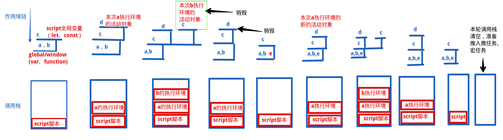
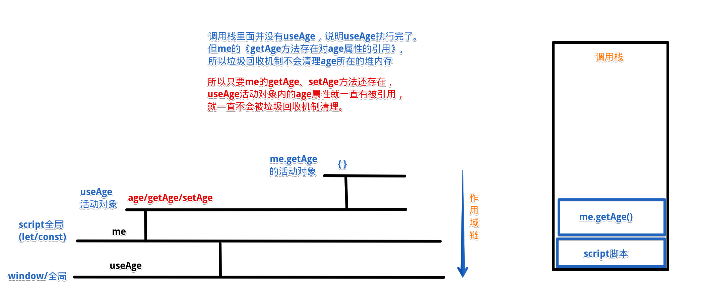

## 1.手写stringify

:::: tabs
::: tab label=期望
```js
const obj = {
    name: 'hdy',
    books: [
        'js高程',
        'js语言精粹'
    ],
    friends: {
        '小红': '18岁',
        '小蓝': '20岁'
    }
}

console.log(stringify(obj) === JSON.stringify(obj)); // true
```
:::
::: tab label=深浅拷贝实现
```js
function stringify(obj) {
    if (typeof obj === 'object' && obj != null) {
        if (Array.isArray(obj)) {
            let ans = `[${
                obj.map(item => typeof item === 'object'? stringify(item) : `"${item}"`)
            }]`
            return ans;
        } else {
            let ans = `{${
                Object.entries(obj).map(([key, item]) => typeof item === 'object'? `"${key}":${stringify(item)}` : `"${key}":"${item}"`)
            }}`
            return ans;
        }
    } else {
        return `"${obj.toString()}"`;
    }
}
```
>注意，数组转化成字符串的时候不带中括号
:::
::: tab label=代码优化
* 主要就是判断类型，然后拼接对应的效果
* 需要注意的是【typeof null === 'object'】
```js{2}
function stringify(obj) {
    if (typeof obj === 'object' && obj != null) {
        let ans = Array.isArray(obj) ?
            `[${obj.map(item => stringify(item))}]`
            : `{${Object.entries(obj).map(([key, value]) => '"' + key + '"' + ':' + stringify(value))}}`;
        return ans;
    } else {
        return '"' + obj.toString() + '"';
    }
}
```
:::
::::
## 2.深浅拷贝
:::: tabs
::: tab label=期望
```js
const a = {
    books: []
}
const b = deepClone(a);

b.books.push('js高程');
console.log(a.books); // []
console.log(b.books); // ['js高程']
```
:::
::: tab label=JSON实现
```js
function deepClone(obj) {
    return JSON.parse(JSON.stringify(obj));
}
```
:::
::::
## 3.事件轮询
:::: tabs
::: tab label=问题1
* [事件轮询知识点](../base/promise.html#宏任务-微任务)
```js{7}
// 一个await后面是一层.then，与下面的new Promise交叉进行推入微任务队列，证明。
async function sum() {
    await console.log(1);
    await console.log(2);
    await console.log(3);

    return 4;
}

console.log(0);

sum().then(res => console.log(res));

new Promise(resolve => { console.log(5); resolve(); })
.then(() => console.log(6))
.then(() => console.log(7))

.then(() => console.log(8))

console.log(9);
```
:::
::: tab label=解1
```js{14}
/* 同步 */
// 0
// 1
// 5
// 9

/* 微 */
// 2
// 6

// 3
// 7

// 【async 的包装【new Promise(....; resolve => resolve(4))】，整个sum.then被推进微任务队列】
// 8

// 4

/* 宏 */
```
:::
::: tab label=问题2
```js{2}
async function getData() {
    return 0;
}

getData().then(res => console.log(res));

new Promise(resolve => resolve())
.then(_ => console.log(1))
.then(_ => console.log(2))
.then(_ => console.log(3))

console.log('同步');
```
:::
::: tab label=解2
```js{2,6}
/* 同步 */
// 【async 包装new Promise(.....; resolve => resolve(0))】,getData().then被推进微任务队列
// 同步

/* 微 */
// 0

// 1
// 2
// 3
```
:::
::: tab label=问题3
```js{2}
async function getData() {
    return new Promise(resolve => resolve(0));
}

getData().then(res => console.log(res));

new Promise(resolve => resolve())
.then(_ => console.log(1))
.then(_ => console.log(2))
.then(_ => console.log(3))

console.log('同步');
```
:::
::: tab label=解3
```js{2,6,9,12}
/* 同步 */
// 【async包装，new Promise(.....; resolve => resolve(new Promise()))】
// 同步

/* 微 */
// 【内部 new Promise().then】
// 1

// 【外部 new Promise，getData().then推入】
// 2

// 0
// 3
```
:::
::: tab label=合并问题4
```js{8-9}
async function async1() {
  console.log('async1 start');
  await async2();
  console.log('async1 end');
}

async function async2() {
  console.log('async2 start');
  return console.log('async2 promise');
}

console.log('script start');

setTimeout(function () {
  console.log('setTimeout');
}, 0);

async1();

new Promise(function (resolve) {
  console.log('promise1');
  resolve();
}).then(function () {
  console.log('promise2');
}).then(function () {
  console.log('promise3');
});
console.log('script end');
```
:::
::: tab label=解4
```js{4-5}
/* 同步 */
// script start
// async1 start
// async2 start
// async2 promise
// promise1
// script end

/* 微 */

// async1 end
// promise2

// promise3

/* 宏 */
// setTimeout
```
:::
::: tab label=合并问题5
```js{9-13}
async function async1() {
    console.log('async1 start');
    await async2();
    console.log('async1 end');
}

async function async2() {
    console.log('async2 start');
    return new Promise((resolve, reject) => {
        console.log('---');
        resolve();
        console.log('async2 promise');
    }).then(() => console.log('then'));
}

console.log('script start');

setTimeout(function () {
    console.log('setTimeout');
}, 0);

async1();

new Promise(function (resolve) {
    console.log('promise1');
    resolve();
}).then(function () {
    console.log('promise2');
}).then(function () {
    console.log('promise3');
});
console.log('script end');
```
:::
::: tab label=解5
```js{11,14,17}
/* 同步 */
// script start
// async1 start
// async2 start
// ---
// async2 promise
// promise1
// script end

/* 微 */
// then
// promise2

// 【async被包装的promise.then执行，推入了await后面包装的的then】
// promise3

// async1 end

/* 宏 */
// setTimeout
```
:::
::::
## 4.手写instanceof
:::: tabs
::: tab label=期望
* [原型链知识点](../base/object.html#原型链)
```js
class A {}
a = new A();
console.log(instanceOf(a, A)); // true
console.log(instanceOf(a, Object)); // true
console.log(instanceOf(a, Function)); // false
```
:::
::: tab label=原型链实现
```js{4-9}
function instanceOf(obj, fn) {
    const prototype = fn.prototype;
    let __proto__ = obj.__proto__;
    while (__proto__) {
        if (__proto__ === prototype) {
            return true;
        }
        __proto__ = __proto__.__proto__;
    }
    return false;
}
```
:::
::::
## 5.对象flatten扁平化
:::: tabs
::: tab label=期望
```js
const obj = {
    a: {
        b: 1,
        c: 2,
        d: {
            e: 5
        }
    },
    b: [1, 3, {
        a: 2,
        b: 3
    }],
    c: 3
}

const obj2 = flatten(obj);

console.log(obj2);

// obj2 = {
//     'a.b': 1,
//     'a.c': 2,
//     'a.d.e': 5,
//     'b[0]': 1,
//     'b[1]': 3,
//     'b[2].a': 2,
//     'b[2].b': 3,
//     'c': 3
// }
```
:::
::: tab label=深浅拷贝实现
* 重点思路：
    * 递归叠加key
    * 通过作用域链共享返回对象进行写入
```js{6,8,10}
function flatten(obj) {
    const ans = {};

    const handler = (cKey, cObj) => {
        if (Array.isArray(cObj)) {
            cObj.forEach((item, index) => handler(`${cKey}[${index}]`, item));
        } else if (obj instanceof Object) {
            Object.entries(cObj).forEach(([k, val]) => handler(`${cKey}.${k}`, val))
        } else {
            ans[cKey] = cObj;
        }
    }

    Object.entries(obj).forEach(([key, value]) => handler(key, value));
    return ans;
}
```
:::
::: tab label=默认传参
```js
function flatten(obj, cKey, ans = {}) {
    if (!cKey) {
        Object.entries(obj).forEach(([key, val]) => flatten(val, key, ans));
        return ans;
    }
    if (Array.isArray(obj)) {
        obj.forEach((item, index) => flatten(item, `${cKey}[${index}]`, ans));
    } else if (null instanceof Object) {
        Object.entries(obj).forEach(([key, val]) => flatten(val, `${cKey}.${key}`, ans));
    } else {
        ans[cKey] = obj;
    }
}
```
:::
::::
## 6.手写模板字符串
:::: tabs
::: tab label=期望
```js
const obj = {
    name: '西瓜皮儿',
    age: 18,
    books: [
        'js红宝书',
        'js蝴蝶书'
    ],
    parents: {
        father: '西瓜',
        mather: '农民伯伯'
    }
}

console.log(`我叫${obj.name},我喜欢看${obj.books[1]},我爸是${obj.parents.father}`);
// 我叫西瓜皮儿,我喜欢看js蝴蝶书,我爸是西瓜

let str = '我叫${name},我喜欢看${books[1]},我爸是${parents.father}'
console.log(template(obj, str));  // 我叫西瓜皮儿,我喜欢看js蝴蝶书,我爸是西瓜
```
:::
::: tab label=实现
* 重点思路：
    * `中括号`键值转为`.`键值
    * reduce链式取值
```js{3,5}
function template(obj, str) {
    const reg1 = /\$\{(.+?)\}/g;
    const reg2 = /\[(.+?)\]/g;
    return str.replace(reg1, (_, match) => 
        match.replace(reg2, '.$1')
        .split('.')
        .reduce((pre, key) => pre[key], obj));
}
```
:::
::: tab label=柯里化期望
```js{16-17}
const obj = {
    name: '西瓜皮儿',
    age: 18,
    books: [
        'js红宝书',
        'js蝴蝶书'
    ],
    parents: {
        father: '西瓜',
        mather: '农民伯伯'
    }
}

let str = '我叫${name},我喜欢看${books[1]},我爸是${parents.father}'

const tempEnv = template(obj);
console.log(tempEnv(str));  // 我叫西瓜皮儿,我喜欢看js蝴蝶书,我爸是西瓜
```
:::
::: tab label=柯里化实现
```js
function template(obj) {
    const reg1 = /\$\{(.+?)\}/g;
    const reg2 = /\[(.+?)\]/g;
    return (str) => 
        str.replace(reg1, (_, match) => 
            match.replace(reg2, '.$1')
            .split('.')
            .reduce((pre, key) => pre[key], obj))
}
```
:::
::::

:::: steps
::: step

>解析过程
* 取出模板字符串
```js
'我叫${name},我喜欢看${books[1]},我爸是${parents.father}'
->
'name'
'books[1]'
'parents.father'
```
:::

::: step
* 全部换成 . 式写法
```js
'name'
'books[1]'
'parents.father'
-> 
'name'
'books.1'
'parents.father'
```
:::

::: step
* split变成属性的链式数组
```js
'name'
'books.1'
'parents.father'
->
['name']
['books', '1']
['parents', 'father']
```
:::

::: step
* 用reduce拿到obj身上最终要展示的属性
```js
obj['name']
obj['books']['1']
obj['parents']['father']
->
'西瓜皮儿'
'蝴蝶书'
'西瓜'
```
:::
::: step
* replace替换掉字符串
```js
'我叫${name},我喜欢看${books[1]},我爸是${parents.father}'
->
'我叫西瓜皮儿,我喜欢看js蝴蝶书,我爸是西瓜'
```
:::
::::
## 7.简易promise
:::: tabs
::: tab label=期望
```js
console.log(1)
new MyPromise((resolve, reject) => {
    setTimeout(() => resolve(2));
}).then(res => console.log(res))

console.log(3);
setTimeout(() => console.log(4))
/**
 * 1
 * 3
 * 2
 * 4
 */
```
:::
::: tab label=实现
```js
class MyPromise {
    // 规范2，三种状态是固定的值，存常量，初始值是pending
    static PENDING = 'pending';
    static FULFILLING = 'fulfilling';
    static REJECTED = 'rejected';
    status = MyPromise.PENDING;

    // 规范5，因为触发和调用并不是同时（微任务队列），所以将值保存起来
    value = undefined;
    result = undefined;

    // 规范3，成功和失败的回调函数，占位符，按规范应该要返回promise
    fulfilled = function(value) {}
    rejected = function(reason) {}

    // 规范5，回调函数要用他们的入参，所以调用时先将入参存起来
    resolve(value) {
        this.value = value;
        this.changeStatus(MyPromise.FULFILLING);
    }
    reject(reason) {
        this.reason = reason;
        this.changeStatus(MyPromise.REJECTED);
    }
    
    // 核心，状态控制
    changeStatus(status) {

        // 规范2，状态只能从pending流转出去
        if (this.status !== MyPromise.PENDING || status === MyPromise.PENDING) {
            return;
        }

        // 规范3，状态流转后推对应的回调进微任务队列
        if (status === MyPromise.FULFILLING) {
            process.nextTick(() => this.fulfilled.call(this, this.value));
            this.status = MyPromise.FULFILLING;
            return;
        }
        if (status === MyPromise.REJECTED) {
            process.nextTick(() => this.rejected.call(this, this.reason));
            this.status = MyPromise.REJECTED;
            return;
        }
    }

    // then 和 catch因为是同步执行，所以只做存回调函数
    then(fulfilled) {
        this.fulfilled = fulfilled;
    }
    catch(rejected) {
        this.rejected = rejected;
    }

    constructor(callback) {

        // 规范2，resolve和reject被当做入参，那么调用时this就是undefined，所以要绑定他们的this,才能正确的执行
        this.resolve = this.resolve.bind(this);
        this.reject = this.reject.bind(this);
        callback.call(this, this.resolve, this.reject);
    }
}
```
:::
::: tab label=链式调用
```js
class MyPromise {
    static PENDDING = 'pendding';
    static REJECTED = 'rejected';
    static RESOLVED = 'resolved';
    val = null;
    err = null;
    resolveCallbacks = [];
    rejectCallbacks = [];
    constructor(fn) {
        this.status = MyPromise.PENDDING;
        fn.call(null, this.resolve, this.reject);
    }
    resolve = (val) => {
        if (this.status !== MyPromise.PENDDING) return;
        this.status = MyPromise.RESOLVED;
        this.val = val;
        process.nextTick(() => this.resolveCallbacks.forEach(cb => cb(this.val)));
    }
    reject = (err) => {
        if (this.status !== MyPromise.PENDDING) return;
        this.status = MyPromise.RESOLVED;
        this.err = err;
        process.nextTick(() => this.rejectCallbacks.forEach(cb => cb(err)));
    }
    then(resolved, rejected) {
        if (this.status === MyPromise.PENDDING) {
            if (typeof resolved === 'function') this.resolveCallbacks.push(resolved);
            if (typeof rejected === 'function') this.resolveCallbacks.push(rejected);
        }
        let ans;
        if (this.status === MyPromise.RESOLVED) {
            if (typeof resolved === 'function') ans = resolved.call(null, this.val);
        }
        if (this.status === MyPromise.REJECTED) {
            if (typeof rejected === 'function') ans = rejected.call(null, this.err);
        }
        return ans instanceof MyPromise ? ans : new MyPromise(resolve => resolve());
    }
}


const p = new MyPromise((resolve, reject) => {
    setTimeout(() => resolve(11), 1000);
    // resolve(11);
}).then(res => console.log(res), err => console.log(err));
console.log(p);
const p2 = p.then(() => new MyPromise(resolve => resolve(1)));

setTimeout(() => {
    p2.then(res => console.log(res));
}, 1000);
// const p = new Promise((resolve, reject) => {
//     setTimeout(() => resolve(11), 1000);
//     // resolve(11);
// }).then(res => console.log(res), err => console.log(err));
// console.log(p);
// const p2 = p.then(() => new Promise(resolve => resolve(1)));

// setTimeout(() => {
//     p2.then(res => console.log(res));
// }, 1000);
```
:::
::::
## 8.手写filter/reduce
:::: tabs
::: tab label=filter
* 期望
```js
const arr = [0, 10, 100, 1000];
console.log(arr.myFilter((item, index, arr) => item > 99)); // [100, 1000]
```
* 实现
```js
Array.prototype.myFilter = function(fn, thisArg) {
    let ans = [];
    for (let i = 0; i < this.length; i++) {
        if (fn.call(thisArg, this[i], i, this)) {
            ans.push(this[i]);
        }
    }
    return ans;
}
```
:::
::: tab label=reduce
* 期望
```js
const arr = [1, 2, 3];
console.log(arr.myReduce((pre, item) => pre + item, 0)); // 6
```
* 实现
```js
Array.prototype.myReduce = function(fn, pre, thisArg) {
    for (let i = 0; i< this.length; i++) {
        pre = fn.call(thisArg, pre, this[i], i, this);
    }
    return pre
}
```
:::
::::
## 9.防抖/节流
:::: tabs
::: tab label=防抖要求
* 说明：连续触发一个函数，只有最后一次触发有效
* 要求：间隔一定时间未重复触发事件才触发回调
----

<video src="./assets/debounce.mp4" style="width:600px;" controls />

:::
::: tab label=防抖实现
```html{5-13}
<body>
    普通输入框:<input class='input1'>
    防抖输入框:<input class='input2'>
    <script>
        function debounce(fn, daley) {
            let timer;
            return (...args) => {
                if (timer) {
                    clearTimeout(timer);
                }
                timer = setTimeout(() => fn.call(null, ...args), daley);
            }
        }

        const input1 = document.querySelector('.input1');
        const input2 = document.querySelector('.input2');
        function getData(e) {
            console.log('发送网络请求: ' + e.target.value);
        }
        const slowGetData = debounce(getData, 500);
        input1.addEventListener('input', getData);
        input2.addEventListener('input', slowGetData);
    </script>
</body>
```
:::
::: tab label=升级
* 第一次直接触发，后面再防抖

<video src="./assets/debounce2.mp4" style="width:600px;" controls/>

:::
::: tab label=升级实现
```html{8,10-12}
<body>
    普通输入框:<input class='input1'>
    升级防抖框:<input class='input2'>

    <script>
        function debounce(fn, daley) {
            let timer;
            let isFirst = true;
            return (...args) => {
                if (isFirst) {
                    isFirst = false;
                    fn.call(null, ...args);
                } else {
                    if (timer) {
                        clearTimeout(timer);
                    }
                    timer = setTimeout(() => fn.call(null, ...args), daley);
                }
            }
        }
        const input1 = document.querySelector('.input1');
        const input2 = document.querySelector('.input2');
        function getData(e) {
            console.log('发送网络请求: ' + e.target.value);
        }
        const slowGetData = debounce(getData, 500);
        input1.addEventListener('input', getData);
        input2.addEventListener('input', slowGetData);
    </script>
</body>
```
:::
::: tab label=节流要求
* 说明：每一段时间内只能触发一次
---
>例：两个按钮作用都是让div变大20px，一个有节流，一段时间只能触发一次。  
<video src="./assets/throttle.mp4" style="width:600px;" controls />

:::
::: tab label=节流实现
```html{8-20}
<body>
    <button class='btn1'>普通按钮</button>
    <button class='btn2'>节流按钮</button>

    <div style="background-color: #333;width:100px;height:100px;"></div>

    <script>
        function throttle(fn, daley) {
            let timer;
            return (...args) => {
                if (timer) {
                    return;
                }
                timer = setTimeout(() => {
                    fn.call(null, ...args);
                    clearTimeout(timer);
                    timer = null;
                }, daley);
            }
        }

        const btn1 = document.querySelector('.btn1');
        const btn2 = document.querySelector('.btn2');
        const div = document.querySelector('div');

        function big() {
            let width = div.style.width.split('px')[0];
            let height = div.style.width.split('px')[0];
            console.log(width);
            div.style.width = (+width + 20) + 'px';
            div.style.height = (+height + 20) + 'px';
        }
        const lessGetData = throttle(big, 1000);

        btn1.addEventListener('click', big);
        btn2.addEventListener('click', lessGetData);
    </script>
</body>
```
:::
::: tab label=防抖、节流有多重要
* 触发事件的频率越高，防抖和节流的作用体现就越明显。
>监听窗口滚动，计算一秒钟内的滚动事件触发回调的次数。可以发现浏览器每秒一个事件触发100-150次，节流频率随计时器长短定。性能提升幅度很大。
```html{24-34}
<body>
    <div></div>
    <style>
        div {
            width: 100px;
            height: 10000px;
            background-color: rgb(250, 145, 145);
        }
    </style>
    <script>
        function throttle(fn, delay) {
            let timer;
            return function (...args) {
                if (timer) {
                    return;
                }
                timer = setTimeout(() => {
                    fn.call(null, ...args)
                    timer = null;
                }, delay)
            }
        }

        // 只监听一秒做对比
        let end;
        const callback1 = () => {
            if (!end) {
                end = Date.now() + 1000;
            } else if (Date.now() > end) {
                return;
            }
            console.log('e');
        };
        const callback2 = throttle(callback1, 100);

        document.addEventListener('scroll', callback1); // 103次
        // document.addEventListener('scroll', callback2); // 10次
    </script>
</body>
```
:::
::::
## 10.百度搜索原理
:::: tabs
::: tab label=效果
* 电脑搜索输入框输入文字即发送请求，继续输入就取消上次请求，发送新的请求

<video src="./assets/watcheffectanli.mp4" style="width:500px;" controls />

:::
::: tab label=server
```js
const express = require('express');
const fs = require('fs');
const path = require('path');
const app = express();
app.listen('8888', () => console.log('listen 8888'));

app.get('/', (req, res) => {
    res.setHeader('Content-Type', 'text/html')
    const url = path.join(__dirname, './test.html');
    const code = fs.readFileSync(url);
    return res.send(code);
})

app.get('/search', (req, res) => {
    const query = req.query.s;
    console.log(query);
    setTimeout(() => res.send({data: query}), 1000);
})
```
:::
::: tab label=test.html
* 核心：
    * 用`keyup`事件监听用户实时输入事件，实时发送网络请求。（v-model监听的是input事件，用输入法会有惰性触发）
    * 用`watch`或`watchEffect`来监听数据变化，同时可以拿到一个取消的函数，也就是用户再次输入，就取消上册的请求，用`AbortController`API
```html
<body>
    <div id="app">
        <div><input type="text" @keyup="change"></div>
        <h2>{{ search }}</h2>
        <div>
            <div v-for="ans of res" :key="ans">{{ans}}</div>
        </div>
    </div>

    <script src="https://unpkg.com/vue@next"></script>
    <script>
        const { createApp, reactive, ref, watchEffect } = Vue;
        const app = createApp({
            setup() {
                let search = ref('');
                let res = ref([]);
                watchEffect((onInvalidate) => {
                    let controller = new AbortController();
                    const { signal } = controller;
                    fetch(`http://localhost:8888/search?s=${search.value}`, { signal })
                    .then(res => res.json())
                    .then(response => {
                        res.value.push(response.data)
                    });
                    onInvalidate(() => controller.abort());
                })

                const change = (e) => {
                    if (e.key != 'enter') {
                        search.value = e.target.value;
                    }
                }
                return {
                    search,
                    res,
                    change
                }
            }
        })
        app.mount("#app");
    </script>
</body>
```
:::
::::
## 11.连环log
:::: tabs
::: tab label=期望
* 一个打印机，可连续调用。wait(3)停三秒，log(1)打印1
```js
const printer = new Printer();
printer.log(1)
.wait(2)
.log(3)
.wait(4)
.log(5)

console.log('同步代码');
```
* 要求实现两种，一种同步打印机，一种异步打印机，也就是同步代码不会去等wait
:::
::: tab label=同步打印机
```js
class Printer {
    log(str) {
        console.log(str);
        return this;
    }
    wait(time) {
        const end = Date.now() + time * 1000;
        while (Date.now() < end) {};
        return this;
    }
}
```
:::
::: tab label=异步打印机
* 要异步，就不能用while循环。
* 用一个promise，链式then存储回调
```js{2,4,8-12}
class Printer {
    promise = Promise.resolve();
    log(str) {
        this.promise = this.promise.then(() => console.log(str));
        return this;
    }
    wait(time) {
        this.promise = this.promise.then(() => {
            return new Promise(resolve => {
                setTimeout(() => resolve(), time * 1000);
            })
        })
        return this;
    }
}
```
:::
::: tab label=对象优化
```js
const logger = {
  timer: Promise.resolve(),
  log(val) {
    this.timer = this.timer.then(() => console.log(val));
    return this;
  },
  wait(time) {
    this.timer = this.timer.then(() => new Promise(res => setTimeout(res, time * 1000)));
    return this;
  }
}

logger
.log(1)
.wait(2)
.log(2)
.wait(3)
.log(4)
```
:::
::::
## 12.先发后置
:::: tabs
::: tab label=问题描述
* 一个函数多次请求数据，填写进dom里，需要考虑网络因素，后发的请求要放上面


:::
::: tab label=问题实现
<video src="./assets/xianfahouzhiwenti.mp4" style="width:400px;" controls />

```js{37-40,48-50}
const express = require('express');
const bdParser = require('body-parser');
const app = express();
app.use(bdParser.urlencoded({extended: false}));
app.use(bdParser.json());

app.listen('8088', () => console.log('server listen.'));

app.get('/', (req, res) => {
    res.setHeader('Content-Type', 'text/html');
    res.send(`
<body>
    <div class="app"></div>

    <script>
        const proxy = new Proxy({data: 0}, {
            set(target, key, val) {
                if (key === 'data') {
                    const app = document.querySelector('.app');
                    app.innerText = val;
                }
                target[key] = val;
            }
        })
        proxy.data = 0;

        function getData(key) {
            fetch('http://localhost:8088/data', {
                method: 'post',
                headers: {'Content-Type': 'application/json'},
                body: JSON.stringify({key})
            })
            .then(res => res.json())
            .then(res => proxy.data = res.data);
        }

        setTimeout(() => getData(1), 1000);
        setTimeout(() => getData(2), 3000);
        setTimeout(() => getData(3), 5000);
        setTimeout(() => getData(4), 7000);
    </script>
</body>
    `);
})

app.post('/data', (req, res) => {
    const key = req.body.key;
    if (+key === 2) {
        setTimeout(() => res.json({data: `${key}的数据回来晚了`}), 6000);
    } else {
        res.json({data: `${key}的数据`});
    }
})
```
:::
::: tab label=解决方案1
<video src="./assets/xianfahouzhijiejue.mp4" style="width:500px;" controls />

* 全局用一个reqIndex存储已经发送的请求数量，同时存一个showIndex作为当前展示的是第几个请求返回的数据。
* 函数作用域内存一个自身的请求index。
* 响应时拿到数据，对比一下index是否大于全局的showIndex，如果大于再放进去，同时更改showIndex；小了就说明这个数据无效了。
```js{26-27,30,39-42}
const express = require('express');
const bdParser = require('body-parser');
const app = express();
app.use(bdParser.urlencoded({extended: false}));
app.use(bdParser.json());

app.listen('8088', () => console.log('server listen.'));

app.get('/', (req, res) => {
    res.setHeader('Content-Type', 'text/html');
    res.send(`
<body>
    <div class="app"></div>

    <script>
        const proxy = new Proxy({data: 0}, {
            set(target, key, val) {
                if (key === 'data') {
                    const app = document.querySelector('.app');
                    app.innerText = val;
                }
                target[key] = val;
            }
        })
        proxy.data = 0;
        proxy.reqIndex = 0;
        proxy.showIndex = -1;
        
        function getData(key) {
            const index = proxy.reqIndex++;

            fetch('http://localhost:8088/data', {
                method: 'post',
                headers: {'Content-Type': 'application/json'},
                body: JSON.stringify({key})
            })
            .then(res => res.json())
            .then(res => {
                if (proxy.showIndex < index) {
                    proxy.data = res.data;
                    proxy.showIndex = index;
                }
            });
        }

        setTimeout(() => getData(1), 1000);
        setTimeout(() => getData(2), 3000);
        setTimeout(() => getData(3), 5000);
        setTimeout(() => getData(4), 7000);
    </script>
</body>
    `);
})

app.post('/data', (req, res) => {
    const key = req.body.key;
    if (+key === 2) {
        setTimeout(() => res.json({data: `${key}的数据回来晚了`}), 6000)
    } else {
        res.json({data: `${key}的数据`});
    }
})
```
:::
::::
## 13.手写bind/call/apply
:::: tabs
::: tab label=期望
>难点：需要考虑函数式调用和new调用，new调用可以用`instanceof`或`new.target`来判断
* 函数使用
```js{9-10}
const name = '张三';
const obj = {
    name: 'hdy',
};

function getName() {
    console.log(this.name);
}
const objGetName = getName.myBind(obj);
objGetName(); // hdy
```
* 构造函数使用
```js{6-7}
function Cat(name, age) {
    this.name = name;
    this.age = age;
}

const initCat = Cat.myBind({}, 'hdy');
console.log(new initCat(20)); // Cat {name: 'hdy', age: 20}
```
:::
::: tab label=实现
* new调用时，this绑定的是一个对象，return隐式返回的就是该对象
* fn不能用箭头函数替代，因为**箭头函数不能用作构造函数**
```js{3,6,13}
Function.prototype.myBind = function(obj, ...args) {
    let fn;
    let that = this;

    fn = function (...args2) {
        if (new.target) {
            return that.call(this, ...args, ...args2);
        } else {
            return that.call(obj, ...args, ...args2);
        }
    }

    fn.prototype = this.prototype;
    return fn;
}
```
:::
::: tab label=call
```js
Function.prototype.myCall = function (thisArg, ...args) {
    const ctx = thisArg ? thisArg : window;
    const syb = Symbol('fn');
    ctx[syb] = this;
    const ans = ctx[syb](...args);
    delete ctx[syb];
    return ans;
}

const obj = { name: 'hdy' };
function a(age) {
    console.log(`${this.name} ${age}`);
}

a.myCall(obj, 14);
```
:::
::: tab label=apply
```js
Function.prototype.myApply = function (thisArg, args) {
    const ctx = thisArg ? thisArg : window;
    const syb = Symbol('fn');
    ctx[syb] = this;
    const ans = ctx[syb](args);
    delete ctx[syb];
    return ans;
}

const obj = { name: 'hdy' };
function a(age) {
    console.log(`${this.name} ${age}`);
}

a.myApply(obj, 14);
```
::: 
::::
## 14.this
:::: tabs
::: tab label=问题1
* 注：浏览器和node结果不一样，**node没有全局的window，默认也找不到**
* const/let 定义的变量也不会挂载到window上
```js{13}
var name = "window";
var person = {
    name: "person",
    sayName: function () {
        console.log(this.name);
    }
};

function sayName() {
    var sss = person.sayName;
    sss();
    person.sayName();
    (person.sayName)();
    (b = person.sayName)();
}
sayName();
```
:::
::: tab label=问题2
* 牢记箭头函数this指的是自己上层作用域的this
```js{34-36}
var name = 'window'
var person1 = {
    name: 'person1',
    foo1: function () {
        console.log(this.name)
    },
    foo2: () => console.log(this.name),
    foo3: function () {
        return function () {
            console.log(this.name)
        }
    },
    foo4: function () {
        return () => {
            console.log(this.name)
        }
    }
}

var person2 = {
    name: 'person2'
}

person1.foo1();
person1.foo1.call(person2);

person1.foo2();
person1.foo2.call(person2);

person1.foo3()();
person1.foo3.call(person2)();
person1.foo3().call(person2);

person1.foo4()();
person1.foo4.call(person2)();
person1.foo4().call(person2);
```
:::
::: tab label=问题3
* new调用function内部this指向本实例对象
```js{14-18,20,21}
var name = 'window';

function Person(name) {
    this.name = name;
    this.foo1 = function () {
        console.log(this.name);
    }
    this.foo2 = () => console.log(this.name);
    this.foo3 = function () {
        return function () {
            console.log(this.name);
        }
    }
    this.foo4 = function () {
        return () => {
            console.log(this.name);
        }
    }
}
var person1 = new Person('person1');
var person2 = new Person('person2');

person1.foo1();
person1.foo1.call(person2);

person1.foo2();
person1.foo2.call(person2);

person1.foo3()();
person1.foo3.call(person2)();
person1.foo3().call(person2);

person1.foo4()();
person1.foo4.call(person2)();
person1.foo4().call(person2);
```
:::
::: tab label=问题4
```js{12-16}
var name = 'window'

function Person(name) {
    this.name = name
    this.obj = {
        name: 'obj',
        foo1: function () {
            return function () {
                console.log(this.name);
            }
        },
        foo2: function () {
            return () => {
                console.log(this.name);
            }
        }
    }
}
var person1 = new Person('person1');
var person2 = new Person('person2');

person1.obj.foo1()(); // window
person1.obj.foo1.call(person2)(); // window
person1.obj.foo1().call(person2); // person2

person1.obj.foo2()(); // obj
person1.obj.foo2.call(person2)(); // person2
person1.obj.foo2().call(person2); // obj
```
:::
::::
## 15.手写require
:::: tabs
::: tab label=原理
* commonJS原理是require的时候将源文件包装成函数执行一遍，module.exports的数据作为返回值
* exports是module.exports的引用，所以exports等于号赋值会断开链接【exports = {xxx}】，返回的依旧是module.exports
```shell
# 目录
|- a.js
|- main.js
```
:::
::: tab label=原生理解
```js
// a.js
const a = { money: 10000 }
const add = () => a.money += 11111;
setTimeout(() => add(), 300);

module.exports = { a }
```
```js
// main.js
const { a } = require('./a');
console.log(a); // { money: 10000 }
setTimeout(() => console.log(a), 2000); // { money: 21111 }
```
>执行时
```js
// main.js
// const a = require('./a');
const { a } = (function () {
    const a = { money: 10000 }
    const add = () => a.money += 11111;
    setTimeout(() => add(), 300);
    return { a }
})()
console.log(a); // { money: 10000 }
setTimeout(() => console.log(a), 2000); // { money: 21111 }
```
:::
::: tab label=a.js
```js
let a = 0;
function add() {
    a++;
}
_module.exports = {
    add,
    a
}
```

:::
::: tab label=main.js
```js{4-14,16}
const fs = require('fs');
const path = require('path');

function _require(filePath) {
    const _module = {exports: {}};
    let _exports = _module.exports;

    filePath = filePath.endsWith('.js') ? filePath : filePath + '.js';
    const p = path.join(__dirname, filePath);
    const file = fs.readFileSync(p).toString();

    eval(file);
    return _module.exports;
}

let {add, a} = _require('./a.js');
console.log(a); // 0
add();
console.log(a); // 0
```
:::
::::
## 16.es6模块化原理
:::: tabs
::: tab label=ES6
* ES6模块化会先生成一个依赖关系图，然后根据依赖顺序进行反向执行
* import 有变量提升效果，就能方便的拿到依赖关系
* 最后所有的文件都只会执行一遍，因为有依赖关系图的存在
* 所拿到的是值的引用【commonJS拿的是值的拷贝】，所有的值共享一个值
```shell
# 目录
|- b.js
|- main.html
|- server.js
```
:::
::: tab label=server.js
```js
const express = require('express');
const fs = require('fs');
const path = require('path');
const app = express();
app.listen('8888', () => console.log('listen 8888'));

app.get('/', (req, res) => {
    res.setHeader('Content-Type', 'text/html');
    const url = path.join(__dirname, './main.html');
    const code = fs.readFileSync(url);
    return res.send(code);
})

app.get('/b', (req, res) => {
    res.setHeader('Content-Type', 'text/javascript');
    const url = path.join(__dirname, './b.js');
    const code = fs.readFileSync(url);
    res.send(code)
})
```
:::
::: tab label=b.js
```js
let a = 0;
function add() {
    a++;
}
export { a, add }
```
:::
::: tab label=main.html
* 和上面CommonJS规范形成对比，说明ES6是`值的引用`，commonjs是`值的拷贝`
```html{4-6}
<body>
    <script type="module">
        import { a, add } from './b';
        console.log(a);    // 0
        add();
        console.log(a);    // 1
    </script>
</body>
```
:::
::::
## 17.事件代理
:::: tabs
::: tab label=代理机制
* 一个列表每一项都要设置同一个事件的不同效果
* 如果每个列表项都增加事件监听，性能消耗比较大
* 实现在列表添加事件监听，然后对应不同的列表项触发不同的事件
---

<video src="./assets/shijiandaili.mp4" style="width:400px;" controls />

:::
::: tab label=事件代理
```html{20-26}
<body>
    <ul>
        <li data='1'>1</li>
        <li data='2'>2</li>
        <li data='3'>3</li>
        <li data='4'>4</li>
        <li data='5'>5</li>
        <li data='6'>6</li>
        <li data='7'>7</li>
        <li data='8'>8</li>
        <li data='9'>9</li>
        <li data='10'>10</li>
    </ul>

    <script>
        const ul = document.querySelector('ul');
        function getData(key) {
            console.log(`获取${key}的数据`);
        }
        ul.addEventListener('click', e => {
            const data = e.target.getAttribute('data');
            if (!data) {
                return;
            }
            getData(data);
        });
    </script>

    <style>
        li {
            width: 100px;
            height: 25px;
            margin-top: 2px;
            list-style: none;
        }
        ul>li:nth-child(3N) {
            background-color: blue;   
        }
        ul>li:nth-child(3N + 1) {
            background-color: red;   
        }
        ul>li:nth-child(3N + 2) {
            background-color: green;   
        }
    </style>
</body>
```
:::
::::
## 18.手写EventTarget
:::: tabs
::: tab label=期望
```js
function getData() {
    console.log('getData');
}
const target = new MyEventTarget();
target.addEventListener('click', () => console.log('---'));
target.addEventListener('click', getData);
target.dispatch('click');
/**
 * ---
 * getData
 */

target.removeEventListener('click', getData);
setTimeout(() => target.dispatch('click'), 1000);
/**
 * ---
 */

```
:::
::: tab label=实现
```js{12,18-19,27}
class MyEventTarget {
    bindMap = new Map();
    initListener(event) {
        if (!this.bindMap.get(event)) {
            this.bindMap.set(event, []);
        }
    }
    addEventListener(event, callback) {
        this.initListener(event);

        const callbackList = this.bindMap.get(event);
        callbackList.push(callback);
    }
    removeEventListener(event, callback) {
        this.initListener(event);

        let callbackList = this.bindMap.get(event);
        callbackList = callbackList.filter(item => item !== callback);
        this.bindMap.set(event, callbackList);
    }
    dispatch(e, ...args) {
        // const event = e instanceof Event ? e.type : e;
        const event = e;
        this.initListener(event);

        let callbackList = this.bindMap.get(event);
        callbackList.forEach(item => item.call(null, e, ...args));
    }
}
```
:::
::::
## 19.每天自动问好
:::: tabs
::: tab label=localStorage实现
* 一个网页每天自动问好，使用localStorage
* 使用IIFE，一次性的代码，不用污染全局变量
```html
<body>
    <script>
        (function() {
            let lastTime = localStorage.getItem('lastTime');
            let today = new Date().toDateString();
            if (!lastTime || lastTime != today) {
                localStorage.setItem('lastTime', today);
                alert('你好~，新的一天要开心哦~');
            }
        })()
    </script>
</body>
```
:::
::::
## 20.手写promise.all
:::: tabs
::: tab label=实现
```js{8-12}
function promiseAll(promiseArr) {
    return new Promise((allResolve, allCatch) => {
        const ans = [];
        let done = 0;
        let total = promiseArr.length;
        promiseArr.forEach((promise, idx) => {
            promise.then(res => {
                ans[idx] = res;
                done++;
                if (total === done) {
                    allResolve(ans);
                }
            }).catch(err => allCatch(err))
        });
    })
}
```
:::
::: tab label=测试
```js
function promiseAll(promiseArr) {
    return new Promise((allResolve, allCatch) => {
        const ans = [];
        let done = 0;
        let total = promiseArr.length;
        promiseArr.forEach((promise, idx) => {
            promise.then(res => {
                ans[idx] = res;
                done++;
                if (total === done) {
                    allResolve(ans);
                }
            }).catch(err => allCatch(err))
        });
    })
}

const p1 = new Promise(resolve => setTimeout(() => resolve(1), 100));
const p2 = new Promise((resolve, reject) => setTimeout(() => reject(2), 100));
const p3 = new Promise(resolve => setTimeout(() => resolve(3), 100));

promiseAll([p1, p2, p3])
.then(res => console.log(res))
.catch(err => console.log(err));

// Promise.all([p1, p2, p3])
// .then(res => console.log(res))
// .catch(err => console.log(err));
```
:::
::::
## 21.promise.race
:::: tabs
::: tab label=问题
```js
const p1 = new Promise(resolve => setTimeout(() => resolve('1'), 1000));
const p2 = new Promise((_, reject) => setTimeout(() => reject('2'), 2000));
const p3 = new Promise(resolve => setTimeout(() => resolve('3'), 3000));

Promise.race([p1, p2, p3]).then(res => console.log(res)).catch(err => console.log(err));
Promise.myRace([p1, p2, p3]).then(res => console.log(res)).catch(err => console.log(err));
```
:::
::: tab label=解
```js
Promise.myRace = (promiseArr) => {
    return new Promise((resolve, reject) => {
        promiseArr.forEach(item => item.then(res => resolve(res)).catch(err => reject(err)))
    })
}
```
:::
::::
## 22.Array(100).map(x => 1)
* Array(n)会创建一个稀疏数组，稀疏数组内含非真实元素，在控制台上将以 empty 显示
```js
console.log(Array(100).map(x => 1)); // [ <100 empty items> ]

console.log(Array(100).fill(null).map(x => 1)); // [1, 1, ....]

console.log(Array.from(Array(100), x => 1)); // [1, 1, ....]
```
## 23.类数组转化数组
```html
<body>
    <div></div>
    <div></div>
    <div></div>
    <script>
        const divs = document.querySelectorAll('div');
        console.log(divs);

        console.log([...divs]);
        console.log(Array.from(divs));
        console.log(Array.prototype.slice.call(divs));
    </script>
</body>
```
## 24.将数组转化成Iterator对象
```js
const arr = [1, 2, 3];

const iterator = arr[Symbol.iterator]();
console.log(iterator);
```
## 25.js实现继承
```js
function A() {
    this.name = 'hdy';
}
function B(...args) {
    A.call(this, ...args)
    this.age = 18;
}
B.prototype = Object.create(A.prototype);
B.prototype.constructor = B;

const b = new B();
console.log(b); // B { name: 'hdy', age: 18 }
```
## 26.once函数
:::: tabs
::: tab label=问题
* 实现一个函数，让代码只被执行一次，结果有缓存机制
```js
function fn(age) {
    console.log(age);
    return age * 10;
}

const onceFn = once(fn);
console.log(onceFn(1)); // 1 10

// 只执行了一遍，其他结果用缓存
console.log(onceFn(1)); // 10
```
:::
::: tab label=解
```js
function once(fn) {
    let result;
    let finish = false;
    return function(...args) {
        if(finish) {
            return result;
        }
        result = fn.call(this, ...args);
        finish = true;
        return result;
    }
}
```
:::
::: tab label=升级
* 接收纯函数，记录执行结果，避免重复计算
```js
function fn(num) {
    const end = +new Date() + num * 1000;
    console.log('wait');
    while (+new Date() < end) {}
    return num * 1000;
}

const cacheFn = once(fn);
console.log(cacheFn(1)); // wait 1000
console.log(cacheFn(1)); // 1000

console.log(cacheFn(2)); // wait 2000

console.log(cacheFn(1)); // 1000
console.log(cacheFn(2)); // 2000
```
:::
::: tab label=解
```js
function once(fn) {
    const ansMap = new Map();
    return function(...args) {
        const str = args.toString();
        if (ansMap.has(str)) {
            return ansMap.get(str);
        } else {
            let ans = fn.call(this, ...args);
            ansMap.set(str, ans);
            return ans;
        }
    }
}
```
:::
::::
## 27.无限累加的sum函数
:::: tabs
::: tab label=题
```js
sum(1)(2).valueOf(); // 3
console.log(sum(1)(2)(3)(4).valueOf()); // 10
```
:::
::: tab label=解
```js
function sum(num) {
    let value = num;
    let fn2 = function(num2) {
        value += num2;
        return fn2;
    }
    fn2.valueOf = () => value;
    return fn2;
}
```
:::
::::
## 28.解析queryString
:::: tabs
::: tab label=问题
```js
const url = "https://shanyue.tech?name=%E5%B1%B1%E6%9C%88&a=3&a=4";

console.log(qs(url));
// {name: '山月', a: [3, 4]}
```
* 测试
```js
// {}
"https://shanyue.tech";

// {a: ''}
"https://shanyue.tech?a";

// {name: '山月'}
"https://shanyue.tech?name=%E5%B1%B1%E6%9C%88";

// {name: '山月', a: 3}
"https://shanyue.tech?name=%E5%B1%B1%E6%9C%88&a=3";

// {name: '山月', a: [3, 4]}
"https://shanyue.tech?name=%E5%B1%B1%E6%9C%88&a=3&a=4";

// {name: '山月', a: 3}
"https://shanyue.tech?name=%E5%B1%B1%E6%9C%88&a=3#hash";

// {name: '1+1=2'}
"https://shanyue.tech?name=1%2B1%3D2";
```
:::
::: tab label=解
```js
function qs(url) {
    const reg = /(?<=[\.\/]\w+\?)[^#]+/g;
    const match = url.match(reg)[0];
    if (!match) {
        return {};
    }

    const entries = match.split('&').map(item => item.split('='));
    const qMap = new Map();
    entries.forEach(([key, val]) => {
        val = decodeURIComponent(val);
        if (qMap.has(key)) {
            if (Array.isArray(qMap.get(key))) {
                qMap.get(key).push(val);
            } else {
                qMap.set(key, [qMap.get(key), val]);
            }
        } else {
            qMap.set(key, val);
        }
    })
    return Object.fromEntries(qMap.entries());
}
```
:::
::::
## 29.随机抽数组
:::: tabs
::: tab label=题
```js
const arr = [1, 2, 3, 4];
console.log(simple(arr)); // 随机
```
:::
::: tab label=解
```js
function simple(arr) {
    const len = arr.length;
    const idx = Math.floor(Math.random() * len);
    return arr[idx];
}
```
:::
::::
## 30.监听复制事件
:::: tabs
::: tab label=事件侦听
```html{11-15}
<body>
    <div id="content">1233523423423423</div>
    <div class="tip hide">禁止复制</div>
    <script>
        ;(function() {
            const content = document.querySelector('#content');
            function noCopy() {
                const tip = document.querySelector('.tip');
                tip.classList.remove('hide');
            }
            content.addEventListener('copy', e => {
                console.log(e);
                noCopy();
                e.preventDefault();
            })
        })();
    </script>
    <style>
        .hide {
            display: none;
        }
    </style>
</body>
```
:::
::::
## 31.翻转字符串
```js
const str = 'abcdefg ';
console.log(reverse(str)); // ' gfedcba'
```
```js
const reverse = str => str.split('').reverse().join('');
```
```js
const reverse = str => [...str].reverse().join('');
```
```js
const reverse = str => [...str].reduceRight((pre, item) => pre + item, '');
```
## 32.文件上传
* [Blob](https://developer.mozilla.org/zh-CN/docs/Web/API/Blob)
## 33.过滤falsy value
::: tip
* falsy: `false`, `null`, `0`, `""`, `undefined`, `NaN`
:::
```js
const filterFalsy = (arr) => arr.filter(Boolean);
```
## 33.洗牌函数
:::: tabs
::: tab label=题
```js
const arr = [1, 2, 3, 4, 5];

shuffle(arr);
console.log(arr); // 乱序
```
:::
::: tab label=解
```js
const shuffle = arr => arr.sort(() => Math.random() - 0.5);
```
:::
::::
## 34.辅助触发事件
:::: tabs
::: tab label=题
* 一个元素触发另一个元素的事件
```html{9-11}
<body>
    <button id="login">登录按钮</button>
    <script>
        const login = document.querySelector("#login");
        login.addEventListener('click', () => {
            console.log("登录");
        });

        document.body.addEventListener('click', () => {
            login.dispatchEvent(new Event('click'));
        });

    </script>
</body>
```
:::
::::
## 35.取消http请求
:::: tabs
::: tab label=服务器
```js
const express = require('express');
const app = new express();
app.listen(8888,() => {
    console.log('listen 8888');
});
const fs = require('fs');

app.get('/', (req, res) => {
    res.setHeader('Content-Type', 'text/html')
    const url = path.join(__dirname, './test.html');
    const code = fs.readFileSync(url);
    return res.send(code);
});

app.get('/data', (req, res) => res.send({
    data: '异步请求'
}));
```
:::
::: tab label=xhr
```html{16}
<!DOCTYPE html>
<html lang="en">
<head>
    <meta charset="UTF-8">
    <meta http-equiv="X-UA-Compatible" content="IE=edge">
    <meta name="viewport" content="width=device-width, initial-scale=1.0">
    <title>Document</title>
</head>
<body>
    <script>
        setTimeout(() => {
            const xhr = new XMLHttpRequest();
            xhr.addEventListener('load', res => console.log(xhr.response));
            xhr.open('GET', '/data');
            xhr.send();
            xhr.abort();
        }, 2000);
    </script>
</body>
</html>
```
:::
::: tab label=fetch
```html{12-14,17}
<!DOCTYPE html>
<html lang="en">
<head>
    <meta charset="UTF-8">
    <meta http-equiv="X-UA-Compatible" content="IE=edge">
    <meta name="viewport" content="width=device-width, initial-scale=1.0">
    <title>Document</title>
</head>
<body>
    <script>
        setTimeout(() => {
            const controller = new AbortController();
            const { signal } = controller;
            fetch('/data', {signal})
            .then(res => res.json())
            .then(res => console.log(res));
            controller.abort();
        }, 2000);
    </script>
</body>
</html>
```
:::
::: tab label=axios
```html{15-16,18,21}
<!DOCTYPE html>
<html lang="en">

<head>
    <meta charset="UTF-8">
    <meta http-equiv="X-UA-Compatible" content="IE=edge">
    <meta name="viewport" content="width=device-width, initial-scale=1.0">
    <title>Document</title>
</head>

<body>
    <script src="https://unpkg.com/axios/dist/axios.min.js"></script>
    <script>
        setTimeout(() => {
            var CancelToken = axios.CancelToken;
            var source = CancelToken.source();

            axios.get('/data', { cancelToken: source.token })
            .then(res => console.log(res.data));

            source.cancel()
        }, 2000);
    </script>
</body>

</html>
```
:::
::::
## 36.递归爆栈解决
:::: tabs
::: tab label=问题
* js执行爆栈
```js
const list = Array(10000).fill(1);
function factorial() {
    const item = list.pop();
    if (item) {
        console.log(item);
        factorial();
    }
}
factorial(); // 爆栈错误
```
:::
::: tab label=解决1
* 加setTimeout将事件推入`宿主环境的延迟列表`里面，延迟时间到了又推入`宏任务队列`里面，然后在那一轮事件轮询才执行，就不会引发当前调用栈爆栈
```js
const list = Array(10000).fill(1);
function factorial() {
    const item = list.pop();
    if (item) {
        console.log(item);
        // factorial();
        setTimeout(() => factorial());
    }
}
factorial();
```
:::
::: tab label=微任务
* 同样，推入到微任务队列里面去，不在当前的调用栈执行，所以不会触发爆栈
>微任务队列优先级高，会比setTimeout快
```js
const list = Array(10000).fill(1);
function factorial() {
    const item = list.pop();
    if (item) {
        console.log(item);
        // factorial();
        Promise.resolve().then(() => factorial());
    }
}
factorial();
```
:::
::: tab label=同步优化
* 用while循环干掉递归，速度最快
```js
const list = Array(10000).fill(1);
function factorial() {
    let item = list.pop();
    const handler = () => {
        console.log(item)
        item = list.pop();
    };
    while (item) {
        handler();
    }
}
factorial();
```
:::
::::
## 37.手写render函数
:::: tabs
::: tab label=题
* 手写el函数
```js

const ulVDom = el('ul', { id: 'container' }, [
    el('li', { class: 'box1' }, '选项1'),
    el('li', { class: 'box2' }, '选项2'),
    el('li', { class: 'box3' }, '选项3'),
]);

const ul = ulVDom.render();

document.getElementById('root').appendChild(ul);

/**

<ul id="container">
    <li class="box1">选项1</li>
    <li class="box2">选项2</li>
    <li class="box3">选项3</li>
</ul>

 */
```
:::
::: tab label=解
```html
<body>
    <div id="root"></div>
    <script>
        function el(tagName, attrs, children) {
            const render = () => {
                const ele = document.createElement(tagName);
                Object.entries(attrs).forEach(([key, val]) => ele.setAttribute(key, val));

                children.forEach(item => {
                    if (typeof item === 'string') {
                        ele.innerText = item;
                    } else {
                        ele.appendChild(item.render());
                    }
                });
                return ele;
            }
            return { render }
        }

        const ulVDom = el('ul', { id: 'container' }, [
            el('li', { class: 'box1' }, ['选项1']),
            el('li', { class: 'box2' }, ['选项2']),
            el('li', { class: 'box3' }, ['选项3']),
        ]);

        const ul = ulVDom.render();
        document.getElementById('root').appendChild(ul);
    </script>
</body>

```
:::
::::
## 38.监听页面离开
:::: tabs
::: tab label=效果
* 监听页面离开事件，进行对应的触发
* 事件：`visibilitychange`
* 可见性：`document.visibilityState`
:::
::: tab label=实现
```html
<body>
    <div></div>
    <div class="hide">asdfasdfasdf</div>
    <div></div>
    <script>
        document.addEventListener('visibilitychange', (function () {
            let title = document.title;
            return (e) => {
                // 用户离开了当前页面
                if (document.visibilityState === 'hidden') {
                    document.title = '😤跑去干嘛了？';
                }
                // 用户打开或回到页面
                if (document.visibilityState === 'visible') {
                    document.title = '😄嘿嘿，欢迎回来';
                    setTimeout(() => document.title = title, 2000);
                }
            }
        })());

    </script>
</body>

```
:::
::::
## 39.执行环境、调用栈、作用域、上下文、闭包
:::: tabs
::: tab label=执行环境
* `执行环境`可以分为创建和执行两个阶段。
    * 在创建阶段，解析器首先会创建一个`变量对象`（variable object，也称为`活动对象` activation object）， **它由定义在执行环境中的变量、函数声明、和参数组成**。在这个阶段，`作用域链`会被初始化，`this`的值也会被最终确定。 
    * 在执行阶段，代码被解释执行。
    * 每个函数都有自己的执行环境
    * 每个执行环境都有一个与之关联的`变量对象`
* **当执行流进入一个函数时，函数的环境就会被推入一个`调用栈`中（execution stack）。在函数执行完后，栈将其环境弹出， 把控制权返回给之前的执行环境。ECMAScript程序中的执行流正是由这个机制控制着。**
```js{5,10}
const c = '全局c';
function a() {
    const d = '环境a的d';
    console.log(e);
    b();
}
function b() {
    const c = '环境b的c';
    console.log(c);
    // console.log(d); // 报错，因为b执行环境的活动对象以及作用域链都找不到d
}

a();
var e = '全局变量e';
a();
```

:::
::: tab label=作用域
* `作用域`，也叫变量作用域，定义了一个变量的可访问范围。
* ES6之前，只有`全局作用域`和`函数作用域`，ES6之后新增`块级作用域`
* 每个函数执行的`活动对象`上找不到变量，就会去函数**定义位置的上层作用域**去找，这就是**作用域链查找**
```js{4-5,9-10}
const c = '全局c';
function a() {
    const d = '环境a的d';
    console.log(e); // 首次执行输出undefined，因为作用域链上找来的e还没有被赋值
    b(); // 能执行因为作用域链上能找到 b函数
}
function b() {
    const c = '环境b的c';
    console.log(c); // 本活动对象找到了 c， 所以就不去作用域链上找了
    // console.log(d); // 报错，因为b执行环境的活动对象以及作用域链都找不到d
}

a();
var e = '全局变量e';
a();
```
:::
::: tab label=上下文
* `上下文`，也叫this上下文，定义了一个函数执行时的**this绑定是哪一个对象**
    * 一个`function`被调用时他的上下文是调用者，如果没有调用者上下文是window，严格模式或模块中是undefined
    * 一个`箭头函数`被调用时，他的上下文是他定义时就确定好的上下文，也就是说**箭头函数的this是固定的**
* `bind`/`call`/`apply`可以改变this指向
* **this上下文的属性查找路径是`原型链`**
:::
::: tab label=闭包
* 闭包是一个函数能够访问另一个作用域上变量的函数
```js{11,13}
function useAge() {
    let age = 0;
    const setAge = (val) => age = parseInt(val) > 0 && parseInt(val) < 100 ? val : age;
    const getAge = () => age;
    return {
        setAge,
        getAge
    }
}
const me = useAge();
console.log(me.age); // undefined me对象的《上下文(this、原型链)》上找不到age属性

console.log(me.getAge()); // 0 // getAge的《作用域链》能够查找到age属性
me.setAge(18);
console.log(me.getAge()); // 18
```

:::
::: tab label=IIFE
* `IIFE`:立即执行函数
* 闭包的实用场景之一
```html{5,8-9}
<body>
    <script>
        const arr = [{}, {}, {}];

        // var关键字实际是没有块级作用域的，所以这里就是定义在了全局
        for (var i = 0; i < arr.length; i++) {

            // 这个IIFE执行完《活动对象并没有被销毁》，
            // 因为arr[i].fn内保存着对活动对象i的引用
            ((i) => arr[i].fn = function () {
                console.log(i)
            })(i);
        }

        console.log(i); // 3

        arr.forEach(item => item.fn());
    </script>
</body>
```
:::
::: tab label=运用例子
* `at`关键字是Array.prototype的新方法，但需要node环境16.6.0，chrome环境92，不确定用户环境能不能使用以下代码
```js
const arr = [1, 10, 100, 1000, 9999];
console.log(arr.at(-1)); // 9999 高级环境能执行，低级环境不能执行
```
>解决，用IIFE向原型链添加此方法
```js
(function () {
    if (!Array.prototype.hasOwnProperty('at')) {
        console.log('手动添加'); // 低级环境会执行，高级环境不会执行

        // IIFE内，无全局变量污染，只有Array.prototype能访问到
        function at(i) {
            if (+i < 0) {
                i = +i + this.length;
            }
            return this[i];
        }
        Array.prototype.at = at;
    }
})()


const arr = [1, 10, 100, 1000, 9999];
console.log(arr.at('-1')); // 9999
```
:::
::::
## 40.闭包连续和
:::: tabs
::: tab label=题
* 实现函数
```js
const f1 = sum(1, 2, 3);
console.log(f1.getValue()); // 6

const f2 = sum(1)(2, 3);
console.log(f2.getValue()); // 6

const f3 = sum(1)(2)(3)(4);
console.log(f3.getValue()); // 10
```
:::
::: tab label=解
* function身上也可以加属性
```js
function sum(...args) {
    let ans = 0
    const add = (...args2) => {
        ans = args2.reduce((pre, item) => pre + item, ans);
        return add;
    };
    add.getValue = () => ans;
    add(...args);
    return add;
}
```
:::
::::
## 41.正则1
:::: tabs
::: tab label=题
```js
// 返回以空格分割的含有a的字符串
const str = 'b ab abc abbcc abcdd bbadd ffee';
console.log(getHasA(str));
```
:::
::: tab label=解
```js
function getHasA(str) {
    const reg = /\S*a\S*/g;
    return str.match(reg);
}
```
:::
::::
## 42.不使用运算符计算
:::: tabs
::: tab label=题
* 不使用加减乘除运算符，求两个数相乘
```js
const num = 7;
const times = 8;
console.log(getVal(times)(num)); // 56
```
:::
::: tab label=解1
* 制作等长字符串
```js
function getVal(times) {
    return num => ''.padEnd(num, 0).repeat(times).length;
}
```
:::
::: tab label=解2
* 同理，制作等长数组
```js
function getVal(times) {
    return num => Array(times).fill().reduce(pre => pre.concat(Array(num)), []).length
}
```
:::
::: tab label=解3
* 位运算向左移动一位，就是乘以当前进制
>2进制下： 1 -> 10 ， 相当于 1 -> 2  
>8进制下： 7 -> 70 ， 相当于 7 -> 56  
```js
function getVal(times) {
    return num => parseInt(`${num.toString(times)}0`, times)
}
``` 
>限制：js中，进制必须在[2-36]之间
:::
::::
## 43.await赋值时机
:::: tabs
::: tab label=题
```js
let a = 10;
async function b() {
    a = await sum();
    console.log('1:', a);
}
function sum() {
    return a + 10;
}

b();
a++;
console.log('2:', a);
```
:::
::: tab label=解
* await 封装了promise，赋值操作被推入微任务，并不是同步任务赋值的
```js
// 2: 11
// 1: 20
```
:::
::::
## 44.parseInt入参陷阱
:::: tabs
::: tab label=题
```js
console.log('123'.replace(/\d/g, parseInt));
```
:::
::: tab label=解
* parseInt实际上有两个入参，第二个是决定进制的，而**replace的第二个参数函数的第二个入参是 index**
```js
console.log(parseInt('1', 0)); // 没有0进制，走默认的10进制
console.log(parseInt('2', 1)); // 1进制里面没有2，所以为NaN
console.log(parseInt('3', 2)); // 2进制里面没有3，所以为NaN

// 1NaNNaN
```
:::
::::
## 45.in操作符
:::: tabs
::: tab label=题
```js
console.log(1 in [1]);
```
:::
::: tab label=解
* in 操作符是查找对象有没有此属性，也就是**key查找，而不是value查找**，所以是false
:::
::::
## 46.this查找
:::: tabs
::: tab label=题
* 《你不知道的JS（上）》85页
```js
function foo() {
    console.log(this.a);
    console.log(this.b);
}

const obj1 = {
    a: 1,
    foo: foo,
}

const obj2 = {
    a: 2,
    b: 3,
    obj1: obj1,
}

obj2.obj1.foo(); // ?
```
:::
::: tab label=this规则
|优先级⬇️|形式|值|
|---|---|---|
|new绑定|new foo()|内部构造出来一个新对象，this被绑定了上去|
|显示绑定|call / apply / bind|动态绑定函数执行时this的值|
|隐式绑定|a.b.c.foo()|最后一个调用的对象《c》|
|默认绑定|foo()|window / undefined|
:::
::: tab label=解
* 这题涉及this隐式绑定，由对象调用function时，**function的this是函数最近的调用者决定的。**
```js
a.b.c.d.foo(); // foo 的this为 d
```
:::
::::
## 47.判断类型
:::: tabs
::: tab label=NaN
```js
const a = '33a' / 3;
const b = 'foo';

// 全局 isNaN
console.log(isNaN(a)); // true
console.log(isNaN(b)); // true <BUG>

// Number.isNaN
console.log(Number.isNaN(a)); // true
console.log(Number.isNaN(b)); // false


// Object.is
console.log(Object.is(a, NaN)); // true
console.log(Object.is(b, NaN)); // false

// 直接判断相等：JS中只有NaN不等于自身
function myIsNaN(n) {
    return n !== n;
}
console.log(myIsNaN(a)); // true
console.log(myIsNaN(b)); // false

```
:::
::: tab label=包装对象
```js
const s1 = new String('haah');
const s2 = 'hahah';
console.log(typeof s1); // object
console.log(typeof s2); // string
```
:::
::::
## 48.柯里化累加器
:::: tabs
::: tab label=题
* 指定函数的参数数量传完才能执行函数返回
```js
function add(a, b, c, d) {
    return a + b + c + d;
}
const curry = currying(add);
// console.log(curry(1)(2)(3)(4)); // 10
// console.log(curry(1, 2)(3)(4)); // 10
// console.log(curry(1, 2, 3)(4)); // 10
console.log(curry(1, 2, 3, 4)); // 10
```
:::
::: tab label=解
```JS
function currying(fn) {
    const args = [];
    const fn2 = function (...arg) {
        args.push(...arg);
        if (args.length >= fn.length) {
            return fn.call(null, ...args);
        }
        return fn2;
    }
    return fn2;
}
```
:::
::: tab label=变形
* 要求都能执行
```js
function add(a, b, c) {
    return a + b + c;
}

const x = curry(add);

console.log(x(1)(2)(3)) // 6

console.log(x(1, 2)(3)) // 6
console.log(x(1, 2, 3)) // 6
```
:::
::: tab label=解
* 执行后暂存解，然后清空args，再返回
```js
function curry(fn) {
    const len = fn.length;
    let args = [];

    const fn2 = function (...arg) {
        args.push(...arg);
        if (args.length >= len) {
            const ans = fn.call(null, ...args);
            args = [];
            return ans;
        } else {
            return fn2;
        }
    }
    return fn2;
}
```
:::
::: tab label=变形2
* 改成传空入参时执行
```js
console.log(sum(1)(2)(10, 11, 2)()); // 26
console.log(sum()); // 0
```
```js
const sum = (function curry() {
    const add = (...args) => args.reduce((pre, item) => pre + item, 0);
    let args = [];
    const fn2 = (...arg) => {
        if (arg.length !== 0) {
            args.push(...arg);
            return fn2;
        } else {
            const ans = add(...args);
            args = [];
            return ans;
        }
    };
    return fn2;
})();
```
:::
::: tab label=变形2解2
```js
function sum(...args) {
    if (args.length === 0) return 0;
    const fn2 = (...arg) => {
        if (arg.length === 0) {
            return args.reduce((pre, item) => pre + item, 0);
        } else {
            args.push(...arg);
            return fn2;
        }
    }
    return fn2;
}
```
:::
::::
## 49.JS常见的设计模式
:::: tabs
::: tab label=单例模式
* 无论怎么调用，只会创建第一个实例
```js
class People {
    constructor(name) {
        this.name = name;
    }
    getName() {
        return this.name;
    }
}

const onePeople = (function () {
    let p;
    return function (name) {
        if (!p) {
            p = new People(name);
        }
        return p;
    }
})()

console.log(onePeople('hdy').getName()); // hdy
console.log(onePeople('张三').getName()); // hdy
console.log(onePeople('赵四').getName()); // hdy
```
:::
::: tab label=代理模式
* 对函数的执行条件进行过滤，然后才执行对应的操作，常见`防抖`、`节流`、`参数过滤`、`结果缓存`
>参数过滤
```js
function sendMsg(msg) {
    // fetch(..)
    return `${msg}的数据`
}

const proxy = new Proxy(sendMsg, {
    apply(target, thisArg, args) {
        const [msg] = args;
        if (!msg) {
            console.error('消息不能为空');
            return;
        }
        return Reflect.apply(target, thisArg, args);
    }
});

console.log(proxy('')); // error: 消息不能为空 undefined
console.log(proxy('hdy')); // hdy的数据
```
>结果缓存
```js
function slowSum(...args) {
    const end = Date.now() + 1000;
    while (Date.now() < end) { } // 模拟复杂计算
    return args.reduce((pre, item) => item + pre, 0);
}

const bufferFn = function (fn) {
    const ansMap = new Map();
    return function (...args) {
        const key = JSON.stringify(args);
        if (ansMap.has(key)) {
            return ansMap.get(key);
        } else {
            const val = fn.apply(null, args);
            ansMap.set(key, val);
            return val;
        }
    }
}

const proxy = bufferFn(slowSum);
console.log(slowSum(1, 2, 3)); // 【慢】6
console.log(slowSum(1, 2, 3)); // 【慢】6
console.log(proxy(1, 2, 3)); // 【慢】6
console.log(proxy(1, 2, 3)); // 【快】6
```
:::
::: tab label=原型模式
* 思想：多个实例共享的状态，放到原型里面去，大家都可以对其读写操作
```js{13-15}
const family = (() => {
    let money = 100;
    return {
        set money(val) {
            money = val;
        },
        get money() {
            return money;
        }
    }
})();

const mother = Object.create(family);
const father = Object.create(family);
const son = Object.create(family);

console.log(son.money);
mother.money--;
console.log(mother.money);
console.log(father.money);
```
:::
::: tab label=发布订阅
* 事件订阅，事件发布通知订阅事件的一个机制，常见：`MVVM`/`EventListener`
```js
class Observer {
    eventMap = new Map();
    getEventListener(event) {
        let fns = this.eventMap.get(event);
        if (fns == null) {
            fns = [];
            this.eventMap.set(event, fns);
        }
        return fns
    }
    subscribe(event, fn) {
        const fns = this.getEventListener(event);
        fns.push(fn);
    }
    publish(event) {
        const fns = this.getEventListener(event);
        fns.forEach(fn => fn.call());
    }
    unsubscribe(event, fn) {
        const fns = this.getEventListener(event);
        let idx = fns.findIndex(item => item === fn);
        while (idx !== -1) {
            fns.splice(idx, 1);
            idx = fns.findIndex(item => item === fn);
        }
    }
}

const listener = new Observer();
const fn1 = () => console.log('1');
const fn2 = () => console.log('2');
listener.subscribe('click', fn1);
listener.subscribe('click', fn2);
listener.subscribe('mousemove', fn1);

listener.publish('click'); // 1 2
listener.publish('mousemove'); // 1

listener.unsubscribe('click', fn1);
listener.publish('click'); // 2
```
:::
::: tab label=工厂模式
* 将一类事物的构造器进行合并成一个工厂，统一使用、校验、赋值、初始化
```js{14-16}
class People { say() { console.log('哈哈') } };
class Cat { say() { console.log('喵喵') } };
class Dog { say() { console.log('汪汪') } };

function AnimalFactory(type) {
    switch (type) {
        case 'People': return new People();
        case 'Cat': return new Cat();
        case 'Dog': return new People();
        default: return new Dog();
    }
}

// 通过类名直接让工厂创建对应的实例
const arr = ['People', 'Cat', 'Dog'];
arr.map(item => AnimalFactory(item)).forEach(item => item.say());
```
:::
::: tab label=策略模式
* 常见：表单验证要用不同的验证策略
```js{1,25,40-42}
// 集中定义好各种应对策略
const strategy = new Map([
    ['qq', {
        alowEmpty: false,
        reg: /^\d{6,11}$/,
        tip: '请输入正确的qq号',
    }],
    ['email', {
        alowEmpty: true,
        reg: /^\w+([-+.]\w+)*@\w+([-.]\w+)*\.\w+([-.]\w+)*$/,
        tip: '无效邮箱',
    }],
    ['pwd', {
        alowEmpty: false,
        reg: /^\w{8,12}$/,
        tip: '请输入8-12位密码',
    }],
    ['phone', {
        alowEmpty: false,
        reg: /^(0|86|17951)?(13[0-9]|15[012356789]|166|17[3678]|18[0-9]|14[57])[0-9]{8}$/,
        tip: '请输入正确的手机号码',
    }],
])

// 少量代码调用对应的策略，即可完成指定策略的使用
const testing = (type, val) => {
    if (!strategy.has(type)) {
        return console.warn('无效类型');
    }
    const regular = strategy.get(type);
    const ans = { valid: false, tip: regular.tip };
    if ((!regular.alowEmpty && val.length === 0) || !regular.reg.test(val)) {
        return ans;
    }
    ans.valid = true;
    ans.tip = '验证通过';
    return ans;
}

console.log(testing('qq', '2029384j')); // { valid: false, tip: '请输入正确的qq号' }
console.log(testing('pwd', 'lalala222年')); // { valid: false, tip: '请输入8-12位密码' }
console.log(testing('email', '986005715@qq.com')); // { valid: true, tip: '验证通过' }
```
:::
::::
## 50.finally执行时机
:::: tabs
::: tab label=题
* 《你不知道的JS（中）》117页
```js
Promise.resolve().then(() => console.log('异步1'));

function a() {
    try {
        return 42;
    }
    finally {
        console.log('finally');
    }
    console.log('after');
}

const b = a();
console.log(b);

console.log('同步');
```
:::
::: tab label=解
* try/catch/finally不是异步的
* try执行完，return将a函数的返回值设置为42
* 然后去执行finally
* 然后是等于号赋值，也就是说这是一个finally的执行机制，并不是异步
```js
Promise.resolve().then(() => console.log('异步1'));

function a() {
    try {
        return 42;
    }
    finally {
        console.log('finally');
    }
    console.log('after');
}

const b = a();
console.log(b);

console.log('同步');
// finally
// 42
// 同步
// 异步1
```
:::
::::