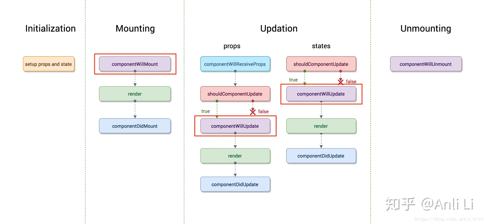
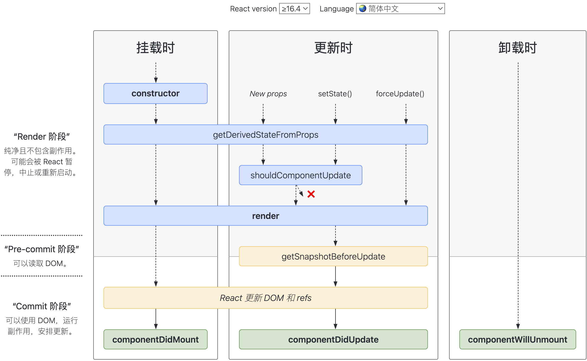

## 起步
:::: tabs
::: tab label=cdn引用
```html
<!DOCTYPE html>
<html lang="en">
<head>
    <meta charset="UTF-8">
    <script src="https://unpkg.com/react@17/umd/react.development.js" crossorigin></script>
    <script src="https://unpkg.com/react-dom@17/umd/react-dom.development.js" crossorigin></script>
    <script src="https://unpkg.com/babel-standalone@6/babel.min.js"></script>
    <title>Document</title>
</head>

<body>
    <div id="app"></div>

    <script type="text/babel">
        const VDOM = (<h1>Hello, world!</h1>);
        ReactDOM.render(VDOM,document.getElementById('app'));
    </script>
</body>
</html>
```
:::
::: tab label=createElement
* vue中的`h函数`
```html{15}
<!DOCTYPE html>
<html lang="en">
<head>
    <meta charset="UTF-8">
    <script src="https://unpkg.com/react@17/umd/react.development.js" crossorigin></script>
    <script src="https://unpkg.com/react-dom@17/umd/react-dom.development.js" crossorigin></script>
    <script src="https://unpkg.com/babel-standalone@6/babel.min.js"></script>
    <title>Document</title>
</head>

<body>
    <div id="app"></div>

    <script type="text/babel">
        const VDOM = React.createElement('h1', {id: 'haha'}, '你好，react');
        ReactDOM.render(VDOM,document.getElementById('app'));
    </script>
</body>
</html>
```
:::
::: tab label=井字棋案例
```shell
npx create-react-app my-app
```
* 用到知识点：
    * 类组件
    * props传参
    * 组件状态管理
    * 无状态函数式组件
    * 数组状态更改用concat/slice生成新数组再操作，避免使用同一引用的对象/数组
:::
::: tab label=index.js
```js{5-12,15-18,24,48-49,84-87,115-119}
import React from 'react';
import ReactDOM from 'react-dom';
import './index.css';

// 无状态函数式组件
function Square(props) {
    return (
        <button className="square" onClick={() => props.onClick()}>
            { props.value }
        </button>
    );
}

class Board extends React.Component {
    // 子组件调用、传参
    renderSquare(i) {
        return <Square value={this.props.squares[i]} onClick={() => this.props.handleClick(i)}/>;
    }

    render() {
        return (
            <div>
                <div className="board-row">
                    {this.renderSquare(0)}
                    {this.renderSquare(1)}
                    {this.renderSquare(2)}
                </div>
                <div className="board-row">
                    {this.renderSquare(3)}
                    {this.renderSquare(4)}
                    {this.renderSquare(5)}
                </div>
                <div className="board-row">
                    {this.renderSquare(6)}
                    {this.renderSquare(7)}
                    {this.renderSquare(8)}
                </div>
            </div>
        );
    }
}

class Game extends React.Component {
    constructor(props) {
        super(props);
        this.state = {

            // 初始化固定长度数组写法
            history: [ Array(9).fill(null) ],
            xIsNext: true,
        }
    }
    calculateWinner(squares) {
        const lines = [
            [0, 1, 2],
            [3, 4, 5],
            [6, 7, 8],
            [0, 3, 6],
            [1, 4, 7],
            [2, 5, 8],
            [0, 4, 8],
            [2, 4, 6],
        ];
        // 成功返回成功的棋子型号，无则返回null
        const successIdx = lines.findIndex(([a, b, c]) => squares[a] &&  squares[a] === squares[b] &&  squares[a] === squares[c]);
        if (successIdx !== -1) {
            return squares[lines[successIdx][0]];
        }
        return null;
    }
    handleClick(i) {
        const history = this.state.history;
        const squares = history[history.length - 1].slice();
        if (squares[i] || this.calculateWinner(squares)) {
            return;
        }
        squares[i] = this.state.xIsNext ? 'X' : 'O';
        this.setState({
            xIsNext: !this.state.xIsNext,
            history: history.concat([squares]),
        });
    }
    jump(idx) {
        // 引用类型创造新引用赋值，触发更新
        this.setState({
            history: this.state.history.slice(0, idx + 1)
        });
    }
    render() {
        const history = this.state.history;
        const squares = history[history.length - 1];
        const winner = this.calculateWinner(squares);
        let status = winner ? `winner：${winner}` : `Next player: ${this.state.xIsNext ? 'X' : 'O'}`;
        return (
            <div className="game">
                <div className="game-board">
                    <Board handleClick={(i) => this.handleClick(i)} squares={squares}/>
                </div>
                <div className="game-info">
                    <div className="status">{status}</div>
                    <ol>
                        {history.map((item, idx) => (
                            <li key={idx}>
                                <button onClick={() => this.jump(idx)}>{winner && idx === history.length - 1 ? `winner：${winner}` : `next: ${idx % 2 === 0 ? 'X' : 'O'}`}</button>
                            </li>
                        ))}
                    </ol>
                </div>
            </div>
        );
    }
}

// ========================================
// react组件上树
ReactDOM.render(
    <Game />,
    document.getElementById('root')
);

```
:::
::::
## jsx规则
:::: tabs
::: tab label=基本规则
>jsx(javascript XML)
* 换行html片段加括号
* 混入`js表达式`用花括号
    >一个表达式可以产生一个具体的值
* jsx只能有一个根标签
* 标签必须闭合
    ```jsx
    <hr/>
    ```
* 不要自定义标签
* 组件标签首字母大写

:::
::: tab label=样式
* class换`chassName`
* style写**对象形式**，并且**属性名转小驼峰**：
    ```js
    const VDOM = (<h1 style={{backgroundColor: 'red'}}>Hello React!</h1>);
    ```
:::
::: tab label=注释
* 注释写法
    ```jsx
    const VDOM = (
        <h1 style={{backgroundColor: 'red'}}>
            {/* <hr/> */}
            Hello React!
        </h1>
    );
    ```
:::
::::
## 条件渲染
:::: tabs
::: tab label=条件渲染
* jsx语句返回`false`会被忽略
* 所以可以用 **&& 表达式做条件渲染**
>`false`不是`falsy`，`falsy`会返回`<div>0</div>`
```js{12,14-15}
const { useState, useEffect } = React;
function MyApp() {
    const [time, setTime] = useState(new Date());
    useEffect(() => {
        const timer = setInterval(() => setTime(new Date()), 1000);
        return () => {
            clearInterval(timer);
        };
    }, []);
    return (
        <div>
            {time.getSeconds() % 2 === 0 && time.toLocaleTimeString()}

            {/* 以下的falsy会显示 0 */}
            {/* time.getSeconds() % 2 && time.toLocaleTimeString() */}
        </div>
    )
}
```
:::
::: tab label=阻止渲染
* 组件render方法直接返回null会不渲染此组件
```jsx{2}
const { useState, useEffect } = React;
const Child = props => props.show ? (<div>子组件</div>) : null;
function MyApp() {
    const [show, setShow] = useState(true);
    return (
        <div>
            <button onClick={() => setShow(!show)}>toggle</button>
            <Child show={show} />
        </div>
    )
}
```
:::
::::
## 循环渲染
:::: tabs
::: tab label=循环渲染
* 列表用map等将数据转化成jsx模板语法
* 列表需要加一个唯一的key值，帮助diff算法优化速率
```jsx{4}
const arr = ['张莎', '李四', '王五'];
const VDOM = (
    <h1>
        { arr.map(item => <div key={item}>{ item }</div>) }
    </h1>
);
ReactDOM.render(VDOM, document.getElementById('app'));
```
:::
::: tab label=增删改查
* 用setState时应该操作**新的数组**，不能修改原数组
* 删除传参可以用`箭头函数`和`bind`
* **数组**增删改查不可变数据操作可以用：
    1. val.`concat`(addVal)
    2. [...val, addVal]
    3. val.`filter`((item, idx) => idx !== delIdx)
    4. `Array.from(val)`
    5. `Array.of(...val)`
    6. `entries` / `keys` / `values`
* **对象**增删改查可用：
    1. Object.`assign`({}, info, {age: 18})
    2. {...info, age: 18}
```jsx{10,21-22}
class MyApp extends React.Component {
    state = {
        friends: [
            '小黄',
            '小张',
            '小李',
        ]
    }
    delete = idx => {
        const newFriends = this.state.friends.filter((_, i) => i !== idx);
        this.setState({ friends: newFriends });
    }
    render() {
        return (
            <ul>
                {
                    this.state.friends.map((item, idx) => {
                        return (
                            <li key={item}>
                                <span>姓名：{item}</span>
                                <button onClick={this.delete.bind(this, idx)}>删除</button>
                                {/* <button onClick={() => this.delete(idx)}>删除</button> */}
                            </li>
                        )
                    })
                }
            </ul>
        )
    }
}
```
:::
::::
## 表单控制
:::: tabs
::: tab label=受控组件
* 在处理表单数据时，通过`state`来关联表单数据的方式叫做`受控组件`
* 通过`ref`来获取DOM元素的情况叫做`非受控组件`
:::
::: tab label=select
* select组件的value可以接收数组，作为多个值
```jsx{9-14,17-19}
const { useState, useEffect } = React;
function MyApp() {
    const selection = [
        '北京',
        '上海',
        '广州',
        '深圳',
    ];
    const [val, setVal] = useState([]);
    const changeVal = e => {
        setVal(val.includes(e.target.value) ?
            val.filter(item => item !== e.target.value)
            : [...val, e.target.value]);
    };
    return (
        <div>
            <select value={val} onChange={changeVal} multiple={true}>
                {selection.map(item => <option value={item} key={item}>{item}</option>)}
            </select>
        </div>
    )
}
```
:::
::: tab label=多个input
* 可以用一个name属性来区分，然后用同一个函数来处理数据变化
```jsx{8,13-14}
function MyApp() {
    const [data, setData] = useState({
        account: '',
        pwd: '',
    });
    const changeVal = e => {
        setData(Object.assign({}, data, {
            [e.target.name]: e.target.value
        }))
    }
    return (
        <div>
            <input type="text" value={data.account} onChange={changeVal} name="account" />
            <input type="text" value={data.pwd} onChange={changeVal} name="pwd" />
            <div>账号：{data.account}</div>
            <div>密码：{data.pwd}</div>
        </div>
    )
}
```
:::
::: tab label=文件控制
* 在 React 中，`<input type="file" />` 始终是一个非受控组件，因为它的值只能由用户设置，而不能通过代码控制。
```html
<input type="file" />
```
[js web file API](https://developer.mozilla.org/zh-CN/docs/Web/API/File_API/Using_files_from_web_applications)
:::
::::
## 类式组件
:::: tabs
::: tab label=使用
* 类组件继承`React.Component`构造react组件，实现`render`方法生成dom节点
```html
<script type="text/babel">
    class MyComponent extends React.Component {
        constructor(props) {
            super(props);
            this.state = {
                title: '你好啊大兄弟!'
            };
        }
        render() {
            return (<h1>{this.state.title}</h1>);
        }
    }
    ReactDOM.render(<MyComponent />, document.getElementById('app'));
</script>
```
:::
::: tab label=state
* 类组件控制state要注意：
    * this的控制：事件触发时this是否正确（用箭头函数或bind解决）
    * 修改状态时用`setState`进行赋值，让dom进行触发响应式
* 事件绑定用驼峰，react重写了
```js{5-9,12}
class MyComponent extends React.Component {
    state = {
        isHot: false,
    }
    toggleState = () => {
        this.setState({
            isHot: !this.state.isHot,
        })
    }
    render() {
        const { isHot } = this.state;
        return (<h1 onClick={this.toggleState}>今天天气好{isHot ? '炎热' : '凉爽'}啊！</h1>);
    }
}
ReactDOM.render(<MyComponent />, document.getElementById('root'));
```
:::
::: tab label=科里化
* 利用科里化，减少函数入参，达到一个函数双向绑定多个input输入框的效果
```js{7,12-13}
class Login extends React.Component {
    state = {
        account: '',
        pwd: ''
    }
    login = () => console.log(`用户名：${this.state.account}，密码：${this.state.pwd}`);
    saveState = (key) => (e) => this.setState({[key]: e.target.value});
    render() {
        const {account, pwd} = this.state;
        return (
            <div>
                <input type="text" value={account} onChange={this.saveState('account')} />
                <input type="text" value={pwd} onChange={this.saveState('pwd')} />
                <button onClick={this.login}>登录</button>
            </div>
        )
    }
}
ReactDOM.render(<Login/>, document.getElementById('root'));
```
:::
::: tab label=props
* props使用注意事项：
    * props是只读属性，如果要做操作，先解构出来。
```js{3-4,8}
class People extends React.Component {
    render() {
        let { age } = this.props;
        age = +age + 1;
        return <h1>年龄：{age}</h1>
    }
}
ReactDOM.render(<People age="22"/>, document.getElementById('root'));
```
* 批量传递，解构语法
```js{19}
class People extends React.Component {
    render() {
        let { name, age, sex } = this.props;
        return (
            <h1>
                <div>姓名：{name}</div>
                <div>年龄：{age}</div>
                <div>性别：{sex}</div>
            </h1>
        )
    }
}
const people = {
    name: 'hdy',
    age: 18,
    sex: '男'
};

ReactDOM.render(<People {...people}/>, document.getElementById('root'));
```
* 需要修改部分props，其余原样传下去时：
```jsx{2,4}
const Button = props => {
  const { kind, ...other } = props;
  const className = kind === "primary" ? "PrimaryButton" : "SecondaryButton";
  return <button className={className} {...other} />;
};
```
:::
::: tab label=props限制
* [官网](https://zh-hans.reactjs.org/docs/typechecking-with-proptypes.html#gatsby-focus-wrapper)
* 引入`prop-types`库
* 类`静态属性`设置属性`propTypes`，限制类型
* 类`静态属性`设置属性`defaultProps`，默认参数

```js{1}
import PropTypes from 'prop-types';

class MyComponent extends React.Component {
    render() {}
}

MyComponent.propTypes = {
  optionalArray: PropTypes.array,
  optionalBool: PropTypes.bool,
  optionalFunc: PropTypes.func,
  optionalNumber: PropTypes.number,
  optionalObject: PropTypes.object,
  optionalString: PropTypes.string,
  optionalSymbol: PropTypes.symbol,

  // 任何可被渲染的元素（包括数字、字符串、元素或数组）
  // (或 Fragment) 也包含这些类型。
  optionalNode: PropTypes.node,

  // 一个 React 元素。
  optionalElement: PropTypes.element,

  // 一个 React 元素类型（即，MyComponent）。
  optionalElementType: PropTypes.elementType,

  // 你也可以声明 prop 为类的实例，这里使用
  // JS 的 instanceof 操作符。
  optionalMessage: PropTypes.instanceOf(Message),

  // 你可以让你的 prop 只能是特定的值，指定它为
  // 枚举类型。
  optionalEnum: PropTypes.oneOf(['News', 'Photos']),

  // 一个对象可以是几种类型中的任意一个类型
  optionalUnion: PropTypes.oneOfType([
    PropTypes.string,
    PropTypes.number,
    PropTypes.instanceOf(Message)
  ]),

  // 可以指定一个数组由某一类型的元素组成
  optionalArrayOf: PropTypes.arrayOf(PropTypes.number),

  // 可以指定一个对象由某一类型的值组成
  optionalObjectOf: PropTypes.objectOf(PropTypes.number),

  // 可以指定一个对象由特定的类型值组成
  optionalObjectWithShape: PropTypes.shape({
    color: PropTypes.string,
    fontSize: PropTypes.number
  }),

  // An object with warnings on extra properties
  optionalObjectWithStrictShape: PropTypes.exact({
    name: PropTypes.string,
    quantity: PropTypes.number
  }),

  // 你可以在任何 PropTypes 属性后面加上 `isRequired` ，确保
  // 这个 prop 没有被提供时，会打印警告信息。
  requiredFunc: PropTypes.func.isRequired,

  // 任意类型的必需数据
  requiredAny: PropTypes.any.isRequired,

  // 你可以指定一个自定义验证器。它在验证失败时应返回一个 Error 对象。
  // 请不要使用 `console.warn` 或抛出异常，因为这在 `oneOfType` 中不会起作用。
  customProp: function(props, propName, componentName) {
    if (!/matchme/.test(props[propName])) {
      return new Error(
        'Invalid prop `' + propName + '` supplied to' +
        ' `' + componentName + '`. Validation failed.'
      );
    }
  },

  // 你也可以提供一个自定义的 `arrayOf` 或 `objectOf` 验证器。
  // 它应该在验证失败时返回一个 Error 对象。
  // 验证器将验证数组或对象中的每个值。验证器的前两个参数
  // 第一个是数组或对象本身
  // 第二个是他们当前的键。
  customArrayProp: PropTypes.arrayOf(function(propValue, key, componentName, location, propFullName) {
    if (!/matchme/.test(propValue[key])) {
      return new Error(
        'Invalid prop `' + propFullName + '` supplied to' +
        ' `' + componentName + '`. Validation failed.'
      );
    }
  })
};

```
:::
::: tab label=props例子
```html{8,17-21,23-25}
<!DOCTYPE html>
<html lang="en">
<head>
    <meta charset="UTF-8">
    <script src="./react/packages/react.development.js" crossorigin></script>
    <script src="./react/packages/react-dom.development.js" crossorigin></script>
    <script src="./react/packages/babel.min.js"></script>
    <script src="https://unpkg.com/prop-types@15.6/prop-types.js"></script>
    <title>Document</title>
</head>

<body>
    <div id="root"></div>

<script type="text/babel">
    class People extends React.Component {
        static propTypes = {
            name: PropTypes.string.isRequired,
            age: PropTypes.number,
            sex: PropTypes.string,
        }

        static defaultProps = {
            sex: '男'
        }

        render() {
            let { name, age, sex } = this.props;
            return (
                <h1>
                    <div>姓名：{name}</div>
                    <div>年龄：{age}</div>
                    <div>性别：{sex}</div>
                </h1>
            )
        }
    }

    const people = {
        name: 'hdy',
        age: '18',   // 类型错误
        // sex: '男' // 使用默认
    };

    ReactDOM.render(<People {...people}/>, document.getElementById('root'));
</script>
</body>

</html>
```
:::
::: tab label=refs
>官方建议少用ref，能提升效率
* 类式组件三种定义方式
    * 字符串（官方说效率低）
    * 回调形式
    * createRef(官方推荐)
    >createRef是用`.current`获取DOM
```js{2-5,9-11}
class MyInput extends React.Component {
    input3 = React.createRef();
    show1 = () => console.log(this.refs.input1.value);
    show2 = () => console.log(this.input2.value);
    show3 = () => console.log(this.input3.current.value);
    render() {
        return (
            <h1>
                <input ref="input1" onBlur={this.show1} placeholder="失去焦点提示"/>
                <input ref={el => this.input2 = el} onBlur={this.show2} placeholder="失去焦点提示"/>
                <input ref={this.input3} onBlur={this.show3} placeholder="失去焦点提示"/>
            </h1>
        )
    }
}
ReactDOM.render(<MyInput/>, document.getElementById('root'));
```
:::
::: tab label=event
>React的自定义事件能做出更好的兼容性（IE9）
* React组件上声明的事件最终绑定到了`document`这个DOM节点上，而不是React组件对应的DOM节点。故只有document这个节点上面才绑定了DOM原生事件，其他节点没有绑定事件。这样简化了DOM原生事件，减少了内存开销
* React以队列的方式，从触发事件的组件向父组件回溯，调用它们在JSX中声明的callback。也就是**React自身实现了一套事件冒泡机制**。event.stopPropagation()停止事件传播
* React有一套自己的`合成事件SyntheticEvent`，不同类型的事件会构造不同的SyntheticEvent
* React使用对象池来管理合成事件对象的创建和销毁，这样减少了垃圾的生成和新对象内存的分配，大大提高了性能
>例：document内有100个onClick事件，但是统一收集在document上，事件冒泡机制，event.target又能拿到对应的元素，绑定的一个对应的方法，进行触发。完成事件代理。
:::
::: tab label=context
* `createContext`得到一个声明上下文的对象，祖先组件`Provider`进行向下**穿透传递**
* 后代组件中需要使用的时候添加静态属性`contextType`进行接收
>开发一般不用，一般用来封装库
```jsx{3-4,7,15-18,27-28}
import React, { createContext } from 'react'

//声明context
const InfoCtx = createContext();

export default function Test() {
    const { Provider } = InfoCtx;
    const state = {
        name: '爷爷给孙子',
        age: 18
    };
    return (
        <>
            爷爷:{state.name}
            <Provider value={state}>
                <B />
            </Provider>
        </>
    )
}

class B extends React.Component {
    render() { return (<C />) }
}

class C extends React.Component {
    static contextType = InfoCtx;
    render() { return (<div>孙子：{this.context.name} - {this.context.age}</div>) }
}
```
* 函数式组件：从ctx对象拿出`Consumer`，里面可以写函数，获得父组件传递的value
```jsx{3-4,9-11}
import React, { createContext } from 'react'

const InfoCtx = createContext();
const { Provider, Consumer } = InfoCtx;
// ...

function C() {
    return (
        <Consumer>
            {val => <div>孙子：{val.name} - {val.age}</div>}
        </Consumer>
    )
}
```
:::
::: tab label=children
* 标签体内容，类似vue的`slot`
```jsx
import React from 'react'
import { NavLink } from 'react-router-dom'

export default function MyNavLink(props) {
    const { children } = props;
    return (
        <NavLink activeClassName='haha' className="nav-class" {...props}>{children}</NavLink>
    )
}
```
* 使用
```jsx
<MyNavLink to="/about">关于页面</MyNavLink>
<MyNavLink to="/test" children="测试页面" />
```
* 多个slot可以自定义名称，但只能以属性的方式传
```jsx
<MyNavLink to="/test" left={<Back />} center={<Title />} right={<Selector />}/>
```
:::
::::
## 生命周期
:::: tabs
::: tab label=概览
>挂载
* `constructor`：(props) => void
* static getDerivedStateFromProps：(props, state) => overwriteState
* render
* `componentDidMount`
>更新
* static getDerivedStateFromProps：(props, state) => overwriteState
* `shouldComponentUpdate`: (nextProps, nextState) => boolean
* render
* `getSnapshotBeforeUpdate`
* `componentDidUpdate`
>卸载
* `componentWillUnmount`
>错误处理
* static getDerivedStateFromError
* `componentDidCatch`

:::
::: tab label=旧钩子
* componentWillReceiveProps:在父组件更新props的时候调用

:::
::: tab label=新钩子
* [官网图](https://projects.wojtekmaj.pl/react-lifecycle-methods-diagram/)
* 删除：
    1. ~~componentWillMount~~
    2. ~~componentWillUpdate~~
    3. ~~componentWillReceiveProps~~
* 新增(很少用)：
    1. static getDerivedStateFromProps
    2. getSnapshotBeforeUpdate



>主要`8个`钩子:5个常用的（粗体），三个不常用的
:::
::: tab label=更新
* 触发更新：`setState`、`props`更新
* 强制更新：`forceUpdate`
>注：强制更新不触发`shouldComponentUpdate`
* `shouldComponentUpdate`: (nextProps, nextState) => boolean
* `getSnapshotBeforeUpdate`: (props, state) => payload
* `componentDidUpdate`: (props, state, payload) => void
>`getSnapshotBeforeUpdate`能够拿到改变前的状态快照，必须有返回值，传给`componentDidUpdate`的第三个参数。  
>要用`getSnapshotBeforeUpdate`必须要用`componentDidUpdate`。
```js{12-13,15-20}
class Login extends React.Component {
    state = { num: 0 }
    render() {
        return (
            <div>
                <button onClick={this.addOne}>+1</button>
                {this.state.num}
            </div>
        )
    }

    // 每次点击依次触发：shouldComponentUpdate -> componentDidUpdate
    addOne = () => this.setState({num: this.state.num + 1});

    componentDidMount() {
        // 只触发 componentDidUpdate
        setInterval(() => {
            this.forceUpdate();
        }, 2000)
    }

    shouldComponentUpdate() {
        console.log('shouldComponentUpdate');
        return true;
    }
    componentDidUpdate() {
        console.log('componentDidUpdate');
    }
}
ReactDOM.render(<Login/>, document.getElementById('root'));
```
:::
::: tab label=更新阀门
* `shouldComponentUpdate`:(nextProps, nextState) => boolean
* 返回boolean来确定是否更新
* forceUpdate可以绕过这个阀门强制更新
```js
class Login extends React.Component {
    state = { num: 0 }
    render() {
        return (
            <div>
                <button onClick={this.addOne}>+1</button>
                <button onClick={this.updateView}>更新视图</button>
                {this.state.num}
            </div>
        )
    }

    // 点击状态+1了，但阀门阻止了视图更新
    addOne = () => this.setState({num: this.state.num + 1});
    shouldComponentUpdate(nextProps, nextState) {
        return false;
    }

    // 绕过阀门强制更新
    updateView = () => this.forceUpdate()
}
ReactDOM.render(<Login/>, document.getElementById('root'));
```
:::
::: tab label=卸载
```js{11,14}
class Login extends React.Component {
    render() {
        return (
            <div>
                拜拜您嘞！
            </div>
        )
    }
    componentDidMount() {
        setTimeout(() => {
            ReactDOM.unmountComponentAtNode(document.getElementById('root'));
        }, 2000)
    }
    componentWillUnmount() {
        console.log('unmount');
    }
}
ReactDOM.render(<Login/>, document.getElementById('root'));
```
:::
::: tab label=getDerivedStateFromProps
* Derived：衍生
* 本组件某个state完全依赖于外部props
```html{32-34}
<!DOCTYPE html>
<html lang="en">

<head>
    <meta charset="UTF-8">
    <script src="./react/packages/react.development.js" crossorigin></script>
    <script src="./react/packages/react-dom.development.js" crossorigin></script>
    <script src="./react/packages/babel.min.js"></script>
    <title>Document</title>
</head>

<body>
    <div id="root"></div>

<script type="text/babel">
class Father extends React.Component {
    state = {
        num: 0
    }
    addOne = () => this.setState({num: this.state.num + 1});
    render() {
        const { num } = this.state;
        return (
            <div>
                爹: <button onClick={this.addOne}>+1</button>
                <Child num={num}/>
            </div>
        )
    }
}
class Child extends React.Component {
    static getDerivedStateFromProps(props, state) {
        return {money: props.num};
    }
    state = {
        money: 0
    }
    render() {
        return (
            <div>
                钱：{this.state.money}
            </div>
        )
    }
}

ReactDOM.render(<Father/>, document.getElementById('root'));
</script>
</body>

</html>
```
:::
::: tab label=getSnapshotBeforeUpdate
>案例：不断地从上往下出新闻，同时保持当前阅读位置不变，就要在`getSnapshotBeforeUpdate`拿到当前看的位置距离底部的距离，传给`componentDidMount`，让更新后这个数字保持不变
```html{48-51,56-65}
<!DOCTYPE html>
<html lang="en">

<head>
    <meta charset="UTF-8">
    <script src="./react/packages/react.development.js" crossorigin></script>
    <script src="./react/packages/react-dom.development.js" crossorigin></script>
    <script src="./react/packages/babel.min.js"></script>
    <title>Document</title>
</head>
<style>
    .container {
        width: 100px;
        height: 150px;
        background-color: rgb(250, 180, 134);
        overflow: auto;
    }
    .news {
        width: 100px;
        height: 30px;
        background-color: rgb(134, 204, 250);
        margin-bottom: 3px;
    }
</style>
<body>
    <div id="root"></div>

<script type="text/babel">
class News extends React.Component {
    state = {
        newsArr: [],
    }
    render() {
        const { newsArr } = this.state;
        return (
            <div className="container" ref="container">
                {newsArr.map(item => <div className="news" key={item}>{item}</div>)}
            </div>
        )
    }
    addNews = () => {
        const { newsArr } = this.state;
        const news = `新闻${newsArr.length + 1}`;
        this.setState({
            newsArr: [news, ...newsArr]
        })
    }
    componentDidMount() {
        // 不断地从上向下出新闻
        this.timer = setInterval(this.addNews, 1000);
    }
    componentWillUnmount() {
        clearInterval(this.timer);
    }

    getSnapshotBeforeUpdate() {
        const container = this.refs.container;
        const scrollBottom = container.scrollHeight - container.scrollTop;
        return scrollBottom;
    }
    componentDidUpdate(_, __, oldscrollBottom) {
        // 更新后保持距离底部距离不变
        const { container } = this.refs;
        container.scrollTop = container.scrollHeight - oldscrollBottom;
    }
}
ReactDOM.render(<News/>, document.getElementById('root'));
</script>
</body>

</html>
```
:::
::::
## HOC
:::: tabs
::: tab label=高阶组件
* HOC：函数入参是一个组件，返回一个新的组件
* 可以做出mixin的效果，将原有组件进行扩展
```jsx{5-7,17,20-22,27}
import React, { useEffect } from 'react';

// 原生组件
function NavBar(props) {
    useEffect(() => {
        console.log('NavBar componentWillMount');
    }, []);
    return (
        <div>
            <span>{props.left}</span>
            <span>{props.center}</span>
            <span>{props.right}</span>
        </div>
    )
}

// HOC：包装旧组件，生成新组件。可以附加很多功能，组件的mixin效果
function TypingTool(Comp, type) {
    return function TypedTool(props) {
        useEffect(() => {
            console.log('wrapped componentWillMount');
        }, []);
        return (<Comp {...type} {...props} />)
    }
}

const BackBar = TypingTool(NavBar, { left: "<" });

export default function App() {
    return (
        <div>
            {<BackBar center="热销商品" right="···" />}
        </div>
    )
}
```
:::
::: tab label=render-props
* 利用`HOC思想`，将**render函数作为参数传入子组件内部**，让组件自行决定渲染
```jsx{5,46-48}
const { useState, useEffect, useRef } = React;
function MyApp() {
    return (
        <>
            <Mouse render={pst => <MovableCpm {...pst} />}
            />
        </>
    )
}

function MovableCpm(props) {
    return (
        <div style={{ position: 'absolute', left: props.x, top: props.y }}>
            <div>当前位置是：{props.x}</div>
            <div>当前位置是：{props.y}</div>
        </div>
    )
}

function Mouse(props) {
    const [{ x, y }, setPosition] = useState({ x: 0, y: 0 });
    useEffect(() => {
        let timer;
        const listener = e => {
            if (timer) return;
            timer = setTimeout(() => {
                clearTimeout(timer);
                timer = null;
            }, 40);
            setPosition({
                x: e.pageX,
                y: e.pageY,
            })
        };
        window.addEventListener('mousemove', listener);
        return () => {
            window.removeEventListener('mousemove', listener)
        };
    }, []);
    return (
        <>
            <div>
                <span>x:{x}</span>
                <span>y:{y}</span>
            </div>
            {
                props.render ? props.render({ x, y }) : false
            }
        </>
    )
}

const container = document.getElementById('root');
const root = ReactDOM.createRoot(container);
root.render(React.createElement(MyApp, null));
```
:::
::::
## Portals
:::: tabs
::: tab label=portals
* 可以实现挂载到React父组件以外的组件上去
```jsx{6-8}
const { useRef } = React;
function MyApp() {
    return (
        <div>
            <span>儿子你好~</span>
            {
                ReactDOM.createPortal(<span>你好，我不是你儿子</span>, document.querySelector('#port'))
            }
        </div>
    )
}

const container = document.getElementById('root');
const root = ReactDOM.createRoot(container);
root.render(React.createElement(MyApp, null));
```
:::
::: tab label=事件管理
* 合成事件会传播给React的父元素
* 浏览器事件会传播到DOM节点的父元素
```jsx{6-7,16-17}
const { useState, useRef } = React;
function MyApp() {
    const [num, setNum] = useState(0);
    const add = () => setNum(num + 1);
    return (
        // SyntheticBaseEvent
        <div onClick={e => console.log(e)}>
            <span>num: {num}</span>
            {
                ReactDOM.createPortal(<button onClick={add}>加一</button>, document.querySelector('#port'))
            }
        </div>
    )
}

// pointerEvent
document.querySelector('#port').addEventListener('click', e => console.log(e));

const container = document.getElementById('root');
const root = ReactDOM.createRoot(container);
root.render(React.createElement(MyApp, null));
```
:::
::::
## 使用规则
::: tip
1. props不可变
2. `React.StrictMode`下初始化会让组件执行两次，以此来更明显的发现副作用BUG
:::