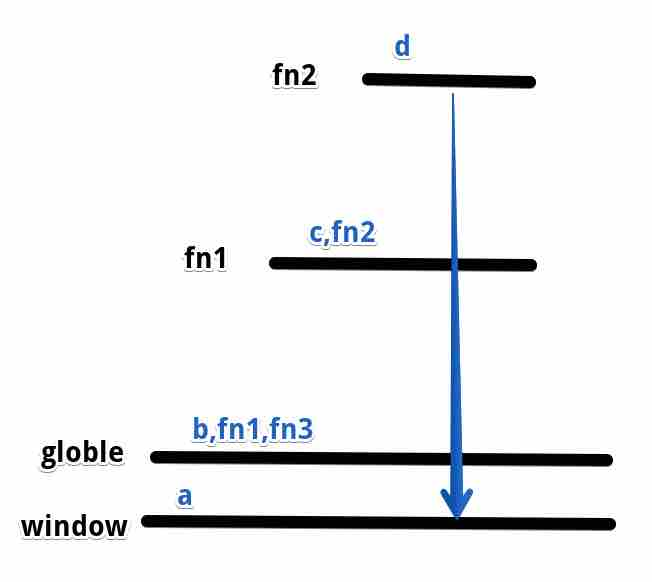
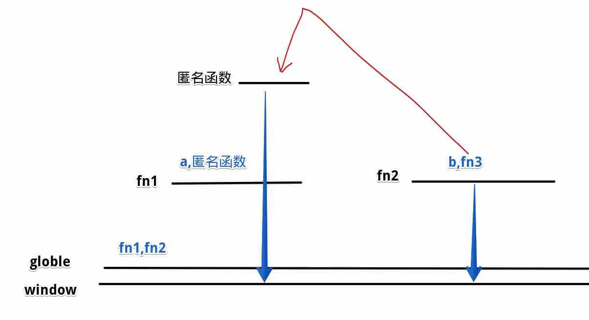
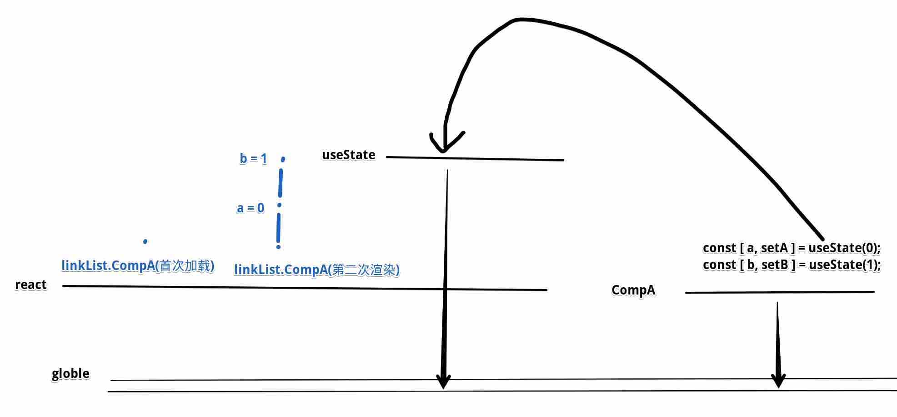
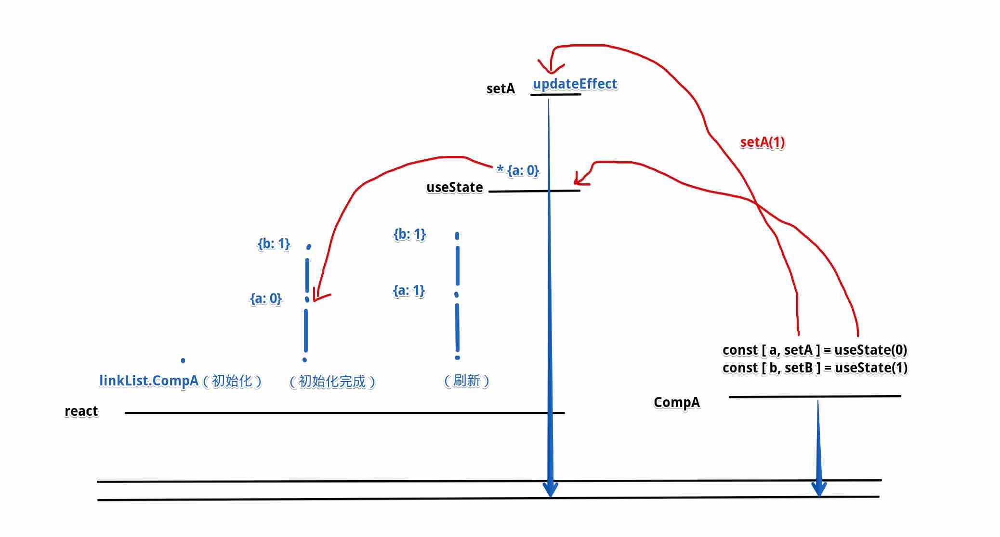

## 关键概念
* 作用域：**变量生效的范围**。ES6以前只有`全局作用域`和`函数作用域`，ES6以后出现`块级作用域`（let/const）。
* 活动对象：函数执行会创造`活动对象`，指定该函数可以访问的变量
* 作用域链：活动对象上找不到变量，就会向`函数的定义位置`外层查找
    >词法作用域、动态作用域概念
* 闭包（重要）：作用域链 + 垃圾回收机制 = 闭包。
    >闭包可以`打破js作用域链查找规则`，是实现很多高级功能的重要手段 ( 模块化、react hook )
## 作用域
* ES6以前没块级作用域
    ```js{3-5,14-17}
    var arr = [{}, {}, {}, {}];

    for (var i = 0; i < arr.length; i++) {
        arr[i].fn = function() { console.log(i) };
    }

    for (var j = 0; j < arr.length; j++) {
        arr[j].fn();
    }

    /******************  相当于 ***********************/
    var arr = [{}, {}, {}, {}];

    var i = 0;
    for (; i < arr.length; i++) {
        arr[i].fn = function() { console.log(i) };
    }
    // i === 4;

    for (var j = 0; j < arr.length; j++) {
        arr[j].fn();
    }
    ```
* ES6有块级作用域
    ```js
    const arr = [{}, {}, {}, {}];

    for (let i = 0; i < arr.length; i++) {
        arr[i].fn = function() { console.log(i) };
    }

    for (let j = 0; j < arr.length; j++) {
        arr[j].fn();
    }
    ```
## 作用域链
* 活动对象：函数执行会创造`活动对象`，指定该函数可以访问的变量
    ```js
    /** 
     * {
     *      a: ,
     *      b: ,
     * }
    */
    function fn1() {
        console.log(a); // 看报错

        const a = 1;
        const b = a + 1;
    }

    fn1();
    ```
* 作用域链：活动对象上找不到变量，就会向`函数的定义位置`外层查找
    >词法作用域、动态作用域概念
    ```js
    var a = 0;
    const b = 1;

    const fn1 = () => {
        const c = 2;

        const fn2 = () => {
            const d = 3;
            console.log(a + b + c + d);
        }

        return fn2;
    }

    const fn3 = fn1();
    console.dir(fn3);
    ```
    
## 动态作用域 vs 词法作用域
```js
const a = 1;
const fn1 = () => console.log(a);

const fn2 = () => {
    const a = 2;
    fn1();
}
fn2();
```
## 闭包（重要）
* 垃圾回收机制（标记清除法）
    >js每过一段时间会清除标记为0的变量，全局变量、window不会被清除。
```js
var a = 0;
const b = 1;

const fn1 = () => {
    const c = 2;
    const cc = 200;

    const fn2 = () => {
        const d = 3;
        console.log(a + b + c + d); // a b c d 标记 + 1
    }

    return fn2;
}

const fn3 = fn1(); // fn2标记 + 1
console.dir(fn3);
```
* **闭包 = 垃圾回收机制 + 作用域链**
>闭包可以`打破js作用域链查找规则`，是实现很多高级功能的重要手段 ( 模块化、react hook )
```js
const fn1 = () => {
    let a = 1;
    return () => a++;
};
const fn2 = () => {
    const b = 100;
    const fn3 = fn1();
    console.log(fn3() + b);
    console.log(fn3() + b);
    console.log(fn3() + b);
};
fn2();
```



## 模块化
* require原理：模块包装成函数 + 闭包
    ```js
    const path = require("path");
    const path = require("fs");

    const _require = (src) => {
        const _module = {
            exports: {}
        };
        _exports = _module.exports;
        const code = fs.readFileSync(path.join(__dirname, src));
        eval(code);
        return _module.exports;
    }
    ```
* 使用测试
    ```js
    // a.js
    let a = { val: 1 };
    const add = () => a.val++;
    const show = () => console.log(a.val);

    // module.exports = { show, add }
    _module.exports = { show, add }
    ```
    ```js
    // b.js
    const path = require("path");
    const fs = require("fs");

    const _require = (src) => {
        const _module = {
            exports: {}
        };
        _exports = _module.exports;
        const code = fs.readFileSync(path.join(__dirname, src)).toString();
        eval(code);
        return _module.exports;
    }

    /* --------------------------------------------------------------------- */
    // const { show, add } = require("./a.js");
    const { show, add } = _require("./a.js");
    add();
    add();
    add();
    show();
    ```
## 其他相关算法、知识点
1. 防抖
    ```html 
    <body>
        <input type="text" id="ipt1">
        <input type="text" id="ipt2">

        <script>
            const debounce = (fn, sleep = 1000) => {
                let timer;
                return (...args) => {
                    if (timer) clearTimeout(timer);
                    timer = setTimeout(() => {
                        fn(...args);
                        timer = null;
                    }, sleep)
                }
            }
            const request1 = e => console.log(`发送网络请求: ${e.target.value}`);
            const request2 = debounce(request1, 500);
            ipt1.addEventListener("input", request1);
            ipt2.addEventListener("input", request2);
        </script>
    </body>
    ```
2. 节流
    ```HTML
    <body>
        <button id="btn1">抢</button>
        <button id="btn2">抢</button>

        <script>
            const throttle = (fn, sleep = 1000) => {
                let disabled = false;
                let timer;
                return (...args) => {
                    if (!disabled) {
                        disabled = true;
                        return fn(...args);
                    }
                    if (timer) return;
                    timer = setTimeout(() => {
                        disabled = false;
                        timer = null;
                    }, sleep);
                }
            }
            const request1 = e => console.log(`抢红包`);
            const request2 = throttle(request1, 2000);
            btn1.addEventListener("click", request1);
            btn2.addEventListener("click", request2);
        </script>
    </body>
    ```
3. 无限累加器
    ```JS
    const f1 = sum(1, 2, 3);
    console.log(f1.getValue()); // 6

    const f2 = sum(1)(2, 3);
    console.log(f2.getValue()); // 6

    const f3 = sum(1)(2)(3)(4);
    console.log(f3.getValue()); // 10
    ```
4. 科里化转换器
    ```JS
    // 科里化转换器
    const fn1 = (a, b, c, d) => {
        return a + b + c + d;
    }

    const fn2 = curry(fn1);
    console.log(fn2(1)(2, 3)(4)); // 10
    console.log(fn2(1, 2)(3)(4)); // 10
    console.log(fn2(1)(2)(3, 4)); // 10
    console.log(fn2(1, 2, 3, 4)); // 10
    ```
5. 调度器
    ```js
    // 两种解决方案：同步执行和异步执行
    const runner = scheduler();

    const fn1 = () => console.log("fn1");
    const fn2 = () => console.log("fn2");
    const fn3 = () => console.log("fn3");

    // 执行fn1，等待1s，执行fn2，等待1s，执行fn3
    runner
    .run(fn1)
    .wait(1000)
    .run(fn2)
    .wait(1000)
    .run(fn3)

    console.log("同步代码");
    ```
## react hook
>* react执行过程：  
    1. jsx  
    2. webpack编译成js  
    3. 执行js生成虚拟DOM  
    4. 编译虚拟DOM生成HTML节点  
    5. 替换掉根节点  
* class组件转换成function组件的难点：`状态保存`
    ```jsx
    class Comp extends React.Component {
        state = { a: 1 };
        add = () => this.setState({a: this.state.a + 1});
        render() {
            return (
                <div>
                    <span>{ this.state.a }</span>
                    <button onClick={this.add}>+1</button>
                </div>
            )
        }
    }
    ```
    ```jsx
    // error
    const Comp = () => {
        let a = 1;
        const add = () => a++;
        return (
            <div>
                <span>{ a }</span>
                <button onClick={add}>+1</button>
            </div>
        )
    }
    ```
* 所以出现了hook
    ```jsx
    // ok
    const Comp = () => {
        const [ a, setA ] = useState(0);
        return (
            <div>
                <span>{ a }</span>
                <button onClick={() => setA(a + 1)}>+1</button>
            </div>
        )
    }
    ```
* **hook原理：闭包 + 链表**
  * 初始化  
    
  * 更新
    
## 注意点
1. react状态链表和hook顺序一一对应，所以不能在判断条件里面定义hook，会打乱hook读取状态的顺序。
    ```jsx
    if (a > 0) {
      useEffect(() => {xxx});
    }
    ```
2. react函数式组件是完全刷新重新执行，所以手动addEventListener需要在useEffect里面控制执行次数并且清除EventListener
    ```js
    import React, { useEffect, useState } from 'react';

    const App = () => {
      const [ p, setP ] = useState({x: 0, y: 0});
      const getMouseP = e => {
        console.log('---');
        const {x, y} = e;
        setP({x, y});
      }
      // window.addEventListener("click", getMouseP);

      useEffect(() => {
        window.addEventListener("click", getMouseP);    
        return () => window.removeEventListener("click", getMouseP);
      }, []);
      return (
        <>
          <div>x: {p.x}</div>
          <div>y: {p.y}</div>
        </>
      );
    }

    export default App;
    ```
3. React hook setA更新的并不是变量a，而是这一个hook的状态对象，所以在set以后直接拿是拿不到最新的值的
    ```jsx
    import React, { useState } from 'react';

    const App = () => {
      const [ a, setA ] = useState(0);
      const getA = () => {
        setA(a + 1);
        console.log(a);
      }
      return (
        <>
          <div>{a}</div>
          <button onClick={getA}>getA</button>
        </>
      );
    }

    export default App;
    ```
4. 为保证性能，React是异步更新的
    ```jsx
    import React, { useState } from 'react';

    const App = () => {
      const [ a, setA ] = useState(2);
      const [ b, setB ] = useState(2);
      const [ c, setC ] = useState(2);
      const change = () => {
        setA(a + 1);
        setB(b * 2);
        setC(c * c);
      }
      return (
        <>
          <div>{a}</div>
          <div>{b}</div>
          <div>{c}</div>
          <button onClick={change}>change</button>
        </>
      );
    }

    export default App;
    ```
## hook原理实现
* 书写JSX
```jsx
const Comp = () => {
    const [ a, setA ] = useState(0);
    const [ b, setB ] = useState(0);
    return (
        <div>
            <div>
                <span>{ a }</span>
                <button onClick={() => setA(a + 1)}>+1</button>
            </div>
            <div>
                <span>{ b }</span>
                <button onClick={() => setB(a * a)}>a的平方</button>
            </div>
        </div>
    )
}

const App = () => (
    <div>
        <Comp />
        <hr />
        <Comp />
    </div>
)
ReactDOM.render(<App />, document.querySelector('#root'));
```
* 编译成JS
```js
const Comp = () => {
    const { useState } = React;
    const [a, setA] = useState(0);
    const [b, setB] = useState(0);
    return (
        {
            tag: "div",
            attrs: {},
            children: [
                {
                    tag: "div",
                    attrs: [],
                    children: [{
                        tag: "span",
                        attrs: {},
                        children: a,
                    },
                    {
                        tag: "button",
                        attrs: { "onClick": () => setA(a + 1) },
                        children: "+1"
                    }]
                },
                {
                    tag: "div",
                    attrs: {},
                    children: [
                        {
                            tag: "span",
                            attrs: {},
                            children: b,
                        },
                        {
                            tag: "button",
                            attrs: { "onClick": () => setB(a * a) },
                            children: "a的平方"
                        },
                    ]
                }
            ]
        }
    )
}
const App = () => (
    {
        tag: "div",
        attrs: [],
        children: [
            {
                tag: Comp,
                attrs: [],
                children: ""
            },
            {
                tag: "hr",
                attrs: [],
                children: ""
            },
            {
                tag: Comp,
                attrs: [],
                children: ""
            },
        ]
    }
)
ReactDOM.render(App, '#root');
```
* React
```js
const React = {
  linkLists: {}, // {compA: {next: {val: "", next: xxx}}, compB: {next: {val: "", next: xxx}} }
  preNode: null,
  compIdx: 0,
  compNameStack: [],
  initNameStack() {
    this.compIdx = 0;
    compNameStack = [];
    this.preNode = null;
  },
  get compName() {
    return this.compNameStack.join(".");
  },
  get useState() {
    return (val) => {
      if (!this.linkLists[this.compName]) {
        // 初始化组件
        this.preNode = { next: null };
        this.linkLists[this.compName] = this.preNode;
      } else if (!this.preNode) {
        // 再刷新时进入组件
        this.preNode = this.linkLists[this.compName];
      }
      if (this.linkLists[this.compName] && this.preNode.next === null) {
        // 初始化这个hook状态
        this.preNode.next = { val, next: null };
      } else {
        // hook有上一个状态值，直接用
        val = this.preNode.next.val;
      }
      const current = this.preNode.next;
      const setState = (val) => {
        current.val = val;
        Promise.resolve().then(ReactDOM.reRender);
      }
      this.preNode = current;
      return [current.val, setState]
    }
  },
  createRoot(comp) {
    this.compNameStack = [comp.name];
    const root = this.createElement(comp());
    this.initNameStack(); // 初始化等待下次刷新
    return root;
  },
  createElement(comp) {
    this.compIdx++;
    if (typeof comp !== "object") return comp;
    const { tag, attrs, children } = comp;
    if (typeof tag === "function") {
      this.compNameStack.push(`${tag.name}${this.compIdx}`);
      const ans = this.createElement(tag(...attrs)); // 子组件
      this.compNameStack.pop();
      return ans;
    } else {
      const el = document.createElement(tag);
      Object.entries(attrs).forEach(([key, val]) => this.setAttr(el, key, val), React);
      if (Array.isArray(children)) { el.prepend(...children.map(item => this.createElement(item))); }
      else { el.innerText = children; }
      return el;
    }
  },
  setAttr(el, key, val) {
    if (key.startsWith("on")) {
      el.addEventListener(key.slice(2).toLowerCase(), val);
    } else {
      el.setAttribute(key, val);
    }
  },
}
```
* 编译器
    ```js
    const ReactDOM = {
      el: null,
      Component: null,
      get reRender() {
        return () => this.render(this.Component, this.el);
      },
      render(comp, selector) {
        const rootEl = typeof selector === "string" ? document.querySelector(selector) : selector;
        const dom = React.createRoot(comp);
        rootEl.innerHTML = "";
        rootEl.appendChild(dom);
        this.el = rootEl;
        this.Component = comp;
      },
    }
    ```

## 完整代码
```js
const React = {
  linkLists: {}, // {compA: {next: {val: "", next: xxx}}, compB: {next: {val: "", next: xxx}} }
  preNode: null,
  compIdx: 0,
  compNameStack: [],
  initNameStack() {
    this.compIdx = 0;
    compNameStack = [];
    this.preNode = null;
  },
  get compName() {
    return this.compNameStack.join(".");
  },
  get useState() {
    return (val) => {
      if (!this.linkLists[this.compName]) {
        // 初始化组件
        this.preNode = { next: null };
        this.linkLists[this.compName] = this.preNode;
      } else if (!this.preNode) {
        // 再刷新时进入组件
        this.preNode = this.linkLists[this.compName];
      }
      if (this.linkLists[this.compName] && this.preNode.next === null) {
        // 初始化这个hook状态
        this.preNode.next = { val, next: null };
      } else {
        // hook有上一个状态值，直接用
        val = this.preNode.next.val;
      }
      const current = this.preNode.next;
      const setState = (val) => {
        current.val = val;
        Promise.resolve().then(ReactDOM.reRender);
      }
      this.preNode = current;
      return [current.val, setState]
    }
  },
  createRoot(comp) {
    this.compNameStack = [comp.name];
    const root = this.createElement(comp());
    this.initNameStack(); // 初始化等待下次刷新
    return root;
  },
  createElement(comp) {
    this.compIdx++;
    if (typeof comp !== "object") return comp;
    const { tag, attrs, children } = comp;
    if (typeof tag === "function") {
      this.compNameStack.push(`${tag.name}${this.compIdx}`);
      const ans = this.createElement(tag(...attrs)); // 子组件
      this.compNameStack.pop();
      return ans;
    } else {
      const el = document.createElement(tag);
      Object.entries(attrs).forEach(([key, val]) => this.setAttr(el, key, val), React);
      if (Array.isArray(children)) { el.prepend(...children.map(item => this.createElement(item))); }
      else { el.innerText = children; }
      return el;
    }
  },
  setAttr(el, key, val) {
    if (key.startsWith("on")) {
      el.addEventListener(key.slice(2).toLowerCase(), val);
    } else {
      el.setAttribute(key, val);
    }
  },
}
const ReactDOM = {
  el: null,
  Component: null,
  get reRender() {
    return () => this.render(this.Component, this.el);
  },
  render(comp, selector) {
    const rootEl = typeof selector === "string" ? document.querySelector(selector) : selector;
    const dom = React.createRoot(comp);
    rootEl.innerHTML = "";
    rootEl.appendChild(dom);
    this.el = rootEl;
    this.Component = comp;
  },
}

const Comp = () => {
  const { useState } = React;
  const [a, setA] = useState(0);
  const [b, setB] = useState(0);
  return (
    {
      tag: "div",
      attrs: {},
      children: [

        {
          tag: "div",
          attrs: [],
          children: [{
            tag: "span",
            attrs: {},
            children: a,
          },
          {
            tag: "button",
            attrs: { "onClick": () => setA(a + 1) },
            children: "+1"
          }]
        },
        {
          tag: "div",
          attrs: {},
          children: [
            {
              tag: "span",
              attrs: {},
              children: b,
            },
            {
              tag: "button",
              attrs: { "onClick": () => setB(a * a) },
              children: "a的平方"
            },
          ]
        }
      ]
    }
  )
}
const App = () => (
  {
    tag: "div",
    attrs: [],
    children: [
      {
        tag: Comp,
        attrs: [],
        children: ""
      },
      {
        tag: "hr",
        attrs: [],
        children: ""
      },
      {
        tag: Comp,
        attrs: [],
        children: ""
      },
    ]
  }
)

ReactDOM.render(App, 'body');
```