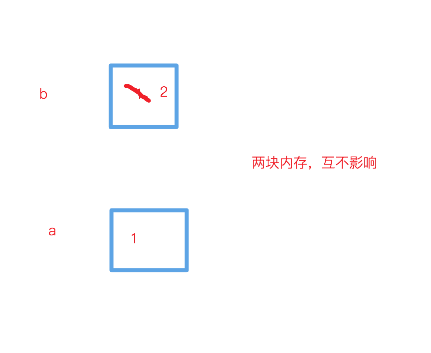
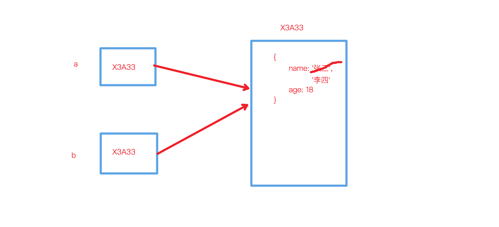

## 深浅拷贝
:::: tabs
::: tab label=值类型
* js不同类型的变量存储方式是不一样的，分别为 **值类型** 和 **引用类型**
* 所以在赋值的时候，let a = b;根据b的不同值类型，会有不同的拷贝效果。
* 值类型有:
    1. String
    2. Number
    3. Boolean
    4. undefined
* 变量存的就是值，拷贝完就互不影响了
```js
let b = 1;
let a = b;

// b 的改变是不会影响到 a 的
b = 2;
console.log(a); // 1
```

:::

::: tab label=引用类型
* 引用类型有：
    1. Object
    2. Function
    3. Array
    4. null
* 变量存的实际上是一个堆内存的内存地址，就算赋值也会互相影响的

```js
let a = {
    name: '张三',
    age: 18
};
let b = a;

// a 和 b 改的是同一块内存，所以会互相影响
a. name = '李四';
console.log(b.name) // 李四
```
:::
::: tab label=目标
```js
let a = {
    name: '张三',
    age: 18,
    books: [
        'js红宝书',
        'js蝴蝶书'
    ]
}
let b = deepClone(a);

// 深拷贝后不互相影响
a.name = '李四';
a.books[1] = '你不知道的js';
console.log(b.name); // 张三
console.log(b.books[1]) // js蝴蝶书
```
:::
::: tab label=思路一
* 所以要让对象也能实现赋值以后互不影响，就需要**深拷贝函数**
* 主要思路：
    1. typeof 判断赋值类型，是是值类型就直接赋值，不是值类型就进一步判断再赋值
    2. typeof 判断是引用类型的有 function、object，function是函数可以不处理，所以只要处理object
    2. typeof 判断 object 可能是[Function, Array, null],需要区别处理
    3. 可能会有对象嵌套或嵌套数组，所以需要递归处理

```js
function deepClone(obj) {
    if (typeof obj === 'object' && obj !== null) {

        // 判断处理typeof不能区别object和array的问题
        let newObj = Array.isArray(obj) ? [] : {};

        for(let key in obj) {

            // 处理可能是原型链上面的属性
            if (obj.hasOwnProperty(key)){

                // 递归实现
                newObj[key] = deepClone(obj[key]);
            }
        }
        return newObj;
    }

    // 本身就是值拷贝
    return obj;
}
```
:::
::: tab label=思路二
* 利用JSON.的两个语法，直接深层的取出值，将其完全转化成字符串，再转化回来
```js
function deepClone(obj) {
    return JSON.parse(JSON.stringify(obj));
}
```
:::
::::


## 模板字符串
:::: tabs 
::: tab label=介绍
* [模板字符串](../base/string.html#模板字符串)是ES6的新特性，增加了String类型的灵活性，减少了很多以字符串拼接的方式来实现的多样化字符串的书写难度。
* 主要特性有：
    1. 可换行
    2. 可拼接表达式
* 手写模板字符串主要是要实现它的拼接能力
```js
const obj = {
    name: '西瓜皮儿',
    age: 18,
    books: [
        'js红宝书',
        'js蝴蝶书'
    ],
    parents: {
        father: '西瓜',
        mather: '农民伯伯'
    }
}
console.log(`我叫${obj.name},我喜欢看${obj.books[1]},我爸是${obj.parents['father']}`);
// 我叫西瓜皮儿,我喜欢看js蝴蝶书,我爸是西瓜
```
::: tab label=思路
1. 需要以变量的形式传入obj对象，否则无法找到对象
2. 解析需要以 . 和 [] 分出各级变量名
3. 最后统一以[]的形式找子属性，否则无法找到数组 books.1 ，数组 books['1'] 也能完美找到 books[1]
:::
::: tab label=实现
* 期望结果
```js
let str = '我叫${name},我喜欢看${books[1]},我爸是${parents.father}'
template(obj, str);
// 我叫西瓜皮儿,我喜欢看js蝴蝶书,我爸是西瓜
```
```js
function template(obj, str) {
    const reg1 = /\$\{(.+?)\}/g; // 解析模板字符串
    const reg2 = /\[(.+?)\]/g;  // 解析 books[1] 的写法

    // 用正则取出模板字符串
    return str.replace(reg1, (_, match) => {

        // 将 book[1] 的写法全部换成 book.1 的链式写法
        return match.replace(reg2, (_, match2) => {
            return '.' + match2;
        })

        // 用 . 分成属性数组链
        .split('.')

        // 用 reduce 从 obj 上获取最终要展现的值
        .reduce((cObj, item) => {
            return cObj[item];
        }, obj)
    })
}
```
:::
::::

> 解析过程
:::: steps
::: step 
* 取出模板字符串
```js
'我叫${name},我喜欢看${books[1]},我爸是${parents.father}'
->
'name'
'books[1]'
'parents.father'
```
:::

::: step
* 全部换成 . 式写法
```js
'name'
'books[1]'
'parents.father'
-> 
'name'
'books.1'
'parents.father'
```
:::

::: step
* split变成属性的链式数组
```js
'name'
'books.1'
'parents.father'
->
['name']
['books', '1']
['parents', 'father']
```
:::

::: step
* 用reduce拿到obj身上最终要展示的属性
```js
obj['name']
obj['books']['1']
obj['parents']['father']
->
'西瓜皮儿'
'蝴蝶书'
'西瓜'
```
:::
::: step
* replace替换掉字符串
```js
'我叫${name},我喜欢看${books[1]},我爸是${parents.father}'
->
'我叫西瓜皮儿,我喜欢看js蝴蝶书,我爸是西瓜'
```
:::
::::
## 手写promise
::: tip promise规范
[完整规范](https://promisesaplus.com/)
1. 构造函数接受一个函数，函数两个入参都是方法，resolve和reject
2. 三种状态，不可逆
3. 状态改变触发将回调函数推进微任务队列（用process.nextTick）
4. 抛出错误触发回调函数2
5. 回调函数的入参来自resolve、reject的值
6. 可链式调用，then或catch应该返回promise，如果参数返回Promise就用参数返回值代替
:::
:::: tabs
::: tab label= 初版
>实现规范1、2、3、5
* 期望：
```js
console.log(1)
new MyPromise((resolve, reject) => {
    setTimeout(() => resolve(2));
}).then(res => console.log(res))

console.log(3);
setTimeout(() => console.log(4))
/**
 * 1
 * 3
 * 2
 * 4
 */
```
```js
class MyPromise {
    // 规范2，三种状态是固定的值，存常量，初始值是pending
    static PENDING = 'pending';
    static FULFILLING = 'fulfilling';
    static REJECTED = 'rejected';
    status = MyPromise.PENDING;

    // 规范5，因为触发和调用并不是同时（微任务队列），所以将值保存起来
    value = undefined;
    result = undefined;

    // 规范3，成功和失败的回调函数，占位符，按规范应该要返回promise
    fulfilled = function(value) {}
    rejected = function(reason) {}

    // 规范5，回调函数要用他们的入参，所以调用时先将入参存起来
    resolve(value) {
        this.value = value;
        this.changeStatus(MyPromise.FULFILLING);
    }
    reject(reason) {
        this.reason = reason;
        this.changeStatus(MyPromise.REJECTED);
    }
    
    // 核心，状态控制
    changeStatus(status) {

        // 规范2，状态只能从pending流转出去
        if (this.status !== MyPromise.PENDING || status === MyPromise.PENDING) {
            return;
        }

        // 规范3，状态流转后推对应的回调进微任务队列
        if (status === MyPromise.FULFILLING) {
            process.nextTick(() => this.fulfilled.call(this, this.value));
            this.status = MyPromise.FULFILLING;
            return;
        }
        if (status === MyPromise.REJECTED) {
            process.nextTick(() => this.rejected.call(this, this.reason));
            this.status = MyPromise.REJECTED;
            return;
        }
    }

    // then 和 catch因为是同步执行，所以只做存回调函数
    then(fulfilled) {
        this.fulfilled = fulfilled;
    }
    catch(rejected) {
        this.rejected = rejected;
    }

    constructor(callback) {

        // 规范2，resolve和reject被当做入参，那么调用时this就是undefined，所以要绑定他们的this,才能正确的执行
        this.resolve = this.resolve.bind(this);
        this.reject = this.reject.bind(this);
        callback.call(this, this.resolve, this.reject);
    }
}
```
:::
::::