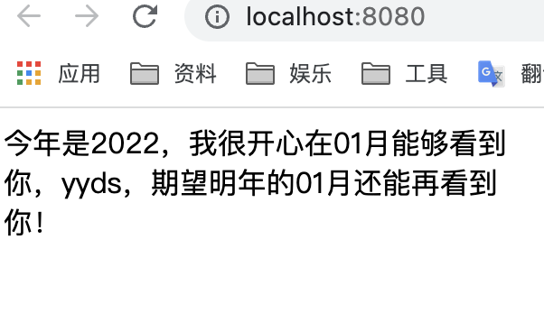

## EventListener
```js
import { onMounted, onUnmounted } from "vue";
export default function useEventListener(target, event, callback) {
    onMounted(() => target.addEventListener(event, callback));
    onUnmounted(() => target.removeEventListener(event, callback));
}
```
## 鼠标位置监测
```js
import { ref } from 'vue';
import useEventListener from './useEventListener'
export default function useMouse() {
    const x = ref(0);
    const y = ref(0);
    function update(e) {
        x.value = e.x;
        y.value = e.y;
    }
    useEventListener(window, 'mousemove', update);
    return { x, y }
}
```
## 时间格式化
:::: tabs
::: tab label=useTimeFmt
```js
export default function useTimeFmt(timeStamp, fmt) {
    fmt = fmt ? fmt : 'yyyy-MM-dd hh:mm:ss';

    const fnMap = new Map([
        ['y', { fnName: 'getFullYear', reg: /\b[y]{2,4}\b/g }],
        ['M', { fnName: 'getMonth', reg: /\b[M]{2}\b/g }],
        ['d', { fnName: 'getDate', reg: /\b[d]{2}\b/g }],
        ['h', { fnName: 'getHours', reg: /\b[h]{2}\b/g }],
        ['m', { fnName: 'getMinutes', reg: /\b[m]{2}\b/g }],
        ['s', { fnName: 'getSeconds', reg: /\b[s]{2}\b/g }]
    ])
    const date = new Date(+timeStamp);
    if (Number.isNaN(date.getTime())) {
        return Error('传入的非时间戳');
    }

    let isTrans = false;
    fnMap.forEach(({fnName, reg}, key) => {
        fmt = fmt.replace(reg, (match) => {
            isTrans = true;
            let len = match.length;
            let time = key === 'M' ? date[fnName]() + 1 : date[fnName]();
            let timeStr = time.toString();
            return timeStr.slice(0 - len).padStart(len, '0');
        })
    })
    if (!isTrans) {
        console.error('格式化参数有误！');
    }

    return fmt;
}
```
:::
::: tab label=自定义指令注册
```js
// utils/directives.js
import useTimeFmt from '../hooks/useTimeFmt';
const fmtTimeDir = {
    mounted(el, binding) {
        const timeStamp = +binding.value;
        const fmt = el.innerText;
        el.innerText =  useTimeFmt(timeStamp, fmt);
    }
}

export { fmtTimeDir }
```

```js
// main.js
import { createApp } from 'vue'
import App from './App.vue'
import { fmtTimeDir } from './utils/directives';

const app = createApp(App)
app.directive('time',fmtTimeDir);
app.mount('#app')
```

:::
::: tab label=使用
```vue
<script>
import { ref } from '@vue/reactivity';
export default {
  setup() {
    const msg = ref('今年是yyyy，我很开心在MM月能够看到你，yyds，期望明年的MM月还能再看到你！');
    const stamp = +new Date();
    return {
      msg,
      stamp
    }
  }
}
</script>

<template>
    <div v-time="stamp">{{ msg }}</div>
</template>
```


:::
::::

