## 入门网址
::: tip
* [Vue官网](https://cn.vuejs.org/)
* [VueX官网](https://vuex.vuejs.org/zh/#%E4%BB%80%E4%B9%88%E6%98%AF-%E7%8A%B6%E6%80%81%E7%AE%A1%E7%90%86%E6%A8%A1%E5%BC%8F)
* [Vue-Router](https://router.vuejs.org/zh/installation.html)
:::
## 基础指令
:::: tabs
::: tab label=model/on
* v-model：表单输入和应用状态之间的双向绑定
    * .number
    * .lazy
    * .trim
* v-on：绑定事件，简写【@】
    * .stop
    * .prevent
    * .capture
    * .self
    * .once
    * .passive
---

<video src="./assets/qibudemo.mp4" style="width:400px;" controls />

```html{3-4}
<body>
    <div id="app">
        <input type="text" v-model="message">
        <button @click="getData">按钮</button>
    </div>

    <script src="https://cdn.jsdelivr.net/npm/vue@2/dist/vue.js"></script>
    <script>
        const app = new Vue({
            el: '#app',
            data() {
                return {
                    message: '消息',
                }
            },
            methods: {
                getData(e) {
                    console.log(this.message);
                }
            }
        })
    </script>
</body>
```
:::
::: tab label=if/show
* v-if：为判断是否渲染
* v-show为判断是否展示，只是修改了css属性，实际上是渲染了这个节点的

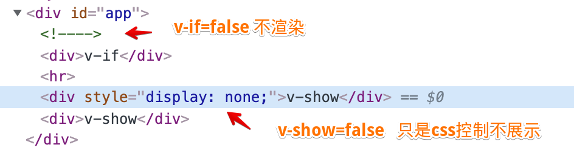

```html{3,6}
<body>
    <div id="app">
        <div v-if="isLogin">v-if</div>
        <div v-if="!isLogin">v-if</div>
        <hr>
        <div v-show="isLogin">v-show</div>
        <div v-show="!isLogin">v-show</div>
    </div>

    <script src="https://cdn.jsdelivr.net/npm/vue@2/dist/vue.js"></script>
    <script>
        const app = new Vue({
            el: '#app',
            data() {
                return {
                    isLogin: false,
                }
            },
        })
    </script>
</body>
```
:::
::: tab label=for
* v-for：列表渲染【v-for="(s, index) in students"】
* 【for...in...】和【for...of...】效果一样
* 可以用【v-for="n in 10"】来直接重复渲染10次
* 需要唯一的key值，优化diff算法的。**不要用index值作为key，因为从头添加，index整体都会改变，diff算法就更耗时。**

<video src="./assets/v-for.mp4" style="width:400px;" controls />

```html{4}
<body>
    <div id="app">
        <ol>
            <li v-for="student in students" :key="student.id">{{student.name}}</li>
        </ol>
        <button @click="addMe">加上我</button>
    </div>

    <script src="https://cdn.jsdelivr.net/npm/vue@2/dist/vue.js"></script>
    <script>
        const app = new Vue({
            el: '#app',
            data() {
                return {
                    students: [
                        {
                            id: 0,
                            name: '小张',
                        },
                        {
                            id: 1,
                            name: '小李',
                        },
                        {
                            id: 2,
                            name: '小黄',
                        },
                        {
                            id: 3,
                            name: '小赵',
                        },
                    ]
                }
            },
            methods: {
                addMe() {
                    this.students.unshift({
                        id: 4,
                        name: 'hdy',
                    });
                }
            }
        })
    </script>
</body>
```
:::
::: tab label=bind
* v-bind：绑定值，简写【:】
* 动态参数：【v-bind:[attr]="XXX"】【v-on:[attr]="XXX"】
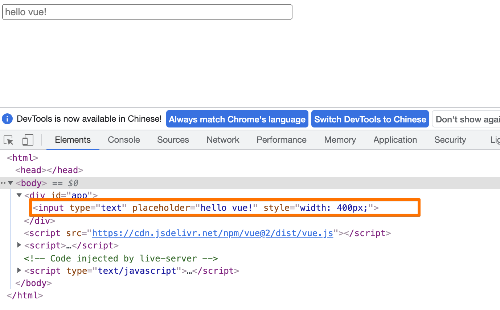

```html{3}
<body>
    <div id="app">
        <input type="text" v-bind:placeholder="message" :style="`width:${width};`"/>
    </div>

    <script src="https://cdn.jsdelivr.net/npm/vue@2/dist/vue.js"></script>
    <script>
        const app = new Vue({
            el: '#app',
            data() {
                return {
                    message: 'hello vue!',
                    width: '400px',
                }
            },
        })
    </script>
</body>
```
:::
::: tab label=html
* v-html：解析html语法

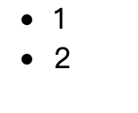

```html{3,12}
<body>
    <div id="app">
        <div v-html="inner"></div>
    </div>

    <script src="https://cdn.jsdelivr.net/npm/vue@2/dist/vue.js"></script>
    <script>
        const app = new Vue({
            el: '#app',
            data() {
                return {
                    inner: '<ul><li>1</li><li>2</li></ul>'
                }
            },
        })
    </script>
</body>
```
:::
::: tab label=text
* v-text：原样渲染字段，相当于【{{}}】语法
>不解析HTML语法，能够有效避免`xss`攻击

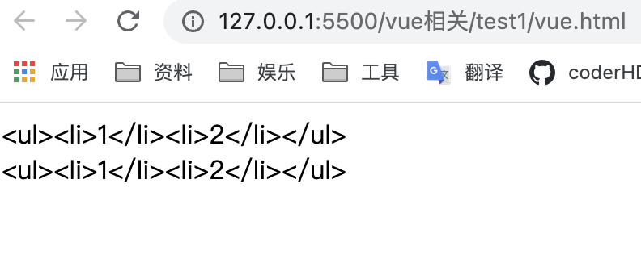

```html
<body>
    <div id="app">
        <div v-text="inner"></div>
        <div>{{inner}}</div>
    </div>

    <script src="https://cdn.jsdelivr.net/npm/vue@2/dist/vue.js"></script>
    <script>
        const app = new Vue({
            el: '#app',
            data() {
                return {
                    inner: '<ul><li>1</li><li>2</li></ul>'
                }
            },
        })
    </script>
</body>
```
:::
::: tab label=pre
* v-pre：跳过这个元素和它的子元素的编译过程。可以用来**显示原始 Mustache 标签**。跳过大量没有指令的节点会加快编译。

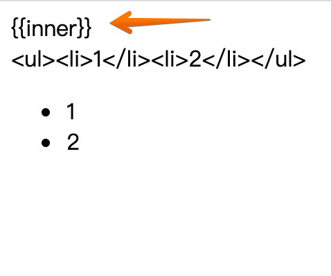

```html{3}
<body>
    <div id="app">
        <div v-pre>{{inner}}</div>
        <div>{{inner}}</div>
        <div v-html="inner"></div>
    </div>

    <script src="https://cdn.jsdelivr.net/npm/vue@2/dist/vue.js"></script>
    <script>
        const app = new Vue({
            el: '#app',
            data() {
                return {
                    inner: '<ul><li>1</li><li>2</li></ul>'
                }
            },
        })
    </script>
</body>
```
:::
::: tab label=slot
* v-slot：使用具名插槽时指定插槽名字，【template标签中使用】
* 或直接在元素上写【slot="name"】

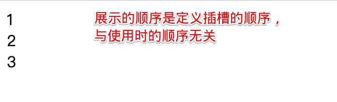

```html{4-6,15-17}
<body>
    <div id="app">
        <bar>
            <template v-slot:bottom>3</template>
            <template v-slot:top>1</template>
            <div slot="center">2</div>
        </bar>
    </div>

    <script src="https://cdn.jsdelivr.net/npm/vue@2/dist/vue.js"></script>
    <script>
        Vue.component('bar', {
            template: `
            <div>
                <div class="box1"><slot name="top"/></div>
                <div class="box2"><slot name="center"/></div>
                <div class="box3"><slot name="bottom"/></div>
            </div>
            `
        })

        const app = new Vue({
            el: '#app',
        })
    </script>
</body>
```
:::
::: tab label=cloak
* 翻译：cloak【斗篷】
* v-cloak：在编译完成前都会有此属性，编译结束后会自动消失，可以结合属性选择器做一些事情。**例如不展示编译前语法**
>问题展示

<video src="./assets/v-cloakduibi.mp4" style="width:300px" controls/>

```html{10-16}
<body>
    <div id="app">
        {{message}}
    </div>

    <script src="https://cdn.jsdelivr.net/npm/vue@2/dist/vue.js"></script>
    <script>
        const app = new Vue({
            el: '#app',
            computed: {
                message() {
                    const end = Date.now() + 2000;
                    while(Date.now() < end) {}
                    return '编译了两秒钟的消息'
                }
            }
        })
    </script>
</body>
```
>解决

<video src="./assets/v-cloak.mp4" style="width:300px" controls/>

```html{3-5,8}
<body>
    <style>
        [v-cloak] {
            display: none;
        }
    </style>

    <div id="app" v-cloak>
        {{message}}
    </div>

    <script src="https://cdn.jsdelivr.net/npm/vue@2/dist/vue.js"></script>
    <script>
        const app = new Vue({
            el: '#app',
            computed: {
                message() {
                    const end = Date.now() + 2000;
                    while(Date.now() < end) {}
                    return '编译了两秒钟的消息'
                }
            }
        })
    </script>
</body>
```
:::
::: tab label=once
* v-once：只渲染组件一次，后续会被视为静态内容跳过，不参与数据动态更新
>例：挂载时count是0，monted更新count，组件不重新渲染

<video src="./assets/v-once.mp4" style="width:300px;" controls/>

```html{2,12,15-17}
<body>
    <div id="app" v-once>
        {{count}}
    </div>

    <script src="https://cdn.jsdelivr.net/npm/vue@2/dist/vue.js"></script>
    <script>
        const app = new Vue({
            el: '#app',
            data() {
                return {
                    count: 0
                }
            },
            mounted() {
                this.count++
            }
        })
    </script>
</body>
```
:::
::::

## 组件化
:::: tabs
::: tab label=全局组件
* 注册组件分为`全局组件`和`局部组件`，Vue.component是注册的全局组件
* **每个组件必须只有一个根元素** (vue3没有这个限制)

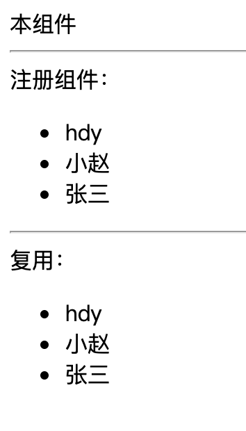

```html{5-9,14-27}
<body>
    <div id="app">
        本组件
        <hr>
        注册组件：
        <list></list>
        <hr>
        复用：
        <list></list>
    </div>

    <script src="https://cdn.jsdelivr.net/npm/vue@2/dist/vue.js"></script>
    <script>
        Vue.component('list', {
            template: `
            <div id="child">
                <ul>
                    <li v-for="name in students" :key="name">{{name}}</li>
                </ul>
            </div>
            `,
            data() {
                return {
                    students: ['hdy', '小赵', '张三'],
                }
            }
        })

        const app = new Vue({
            el: '#app',
        })
    </script>
</body>
```
:::
::: tab label=局部组件
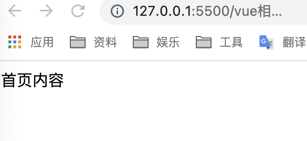

```html{8,11-13}
<body>
    <div id="app">
        <home />
    </div>

    <script src="https://cdn.jsdelivr.net/npm/vue@2/dist/vue.js"></script>
    <script>
        const home = {template: '<div>首页内容</div>'};
        const app = new Vue({
            el: '#app',
            components: {
                home
            }
        })
    </script>
</body>
```
:::
::: tab label=组件传参1
* props是单向的【父 -> 子】，如果需要双向绑定，可以加 [.sync](./props.html#父-子) 修饰符

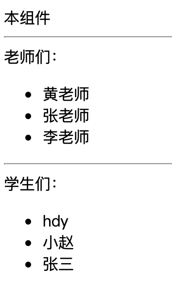

```html{6,9,22-27,34-35}
<body>
    <div id="app">
        本组件
        <hr>
        老师们：
        <list :list="teachers"></list>
        <hr>
        学生们：
        <list :list="students"></list>
    </div>

    <script src="https://cdn.jsdelivr.net/npm/vue@2/dist/vue.js"></script>
    <script>
        Vue.component('list', {
            template: `
            <div id="child">
                <ul>
                    <li v-for="name in list" :key="name">{{name}}</li>
                </ul>
            </div>
            `,
            props: {
                list: {
                    type: Array,
                    default: []
                }
            }
        })
        
        const app = new Vue({
            el: '#app',
            data() {
                return {
                    students: ['hdy', '小赵', '张三'],
                    teachers: ['黄老师', '张老师', '李老师'],
                }
            }
        })
    </script>
</body>
```
:::
::: tab label=组件传参2
* 如果要传递一个对象的所有参数作为props，直接使用【v-bind="obj"】

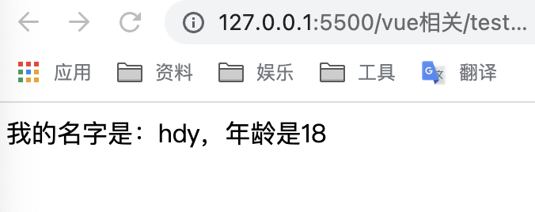

```html{3,10,19-22}
<body>
    <div id="app">
        <home v-bind="me"/>
    </div>

    <script src="https://cdn.jsdelivr.net/npm/vue@2/dist/vue.js"></script>
    <script>
        const home = {
            template: '<div>我的名字是：{{name}}，年龄是{{age}}</div>',
            props: ['name', 'age']
        };
        const app = new Vue({
            el: '#app',
            components: {
                home
            },
            data() {
                return {
                    me: {
                        name: 'hdy',
                        age: 18
                    }
                }
            }
        })
    </script>
</body>
```
:::
::: tab label=事件发射
* 使用组件的时候可以用@监听组件内的事件，可以是自定义事件
* 组件内部可以用`$emit`发射事件
>注：emit事件**不能用驼峰**
```html{3,15-17,24-27}
<body>
    <div id="app">
        <comp @btn-clk="fatherSay"/>
    </div>

    <script src="https://cdn.jsdelivr.net/npm/vue@2/dist/vue.js"></script>
    <script>
        Vue.component('comp', {
            template: `
            <div>
                <button @click="say">组件按钮</button>
            </div>
            `,
            methods: {
                say(e) {
                    this.$emit('btn-clk', '100', e)
                }
            }
        })

        const app = new Vue({
            el: '#app',
            methods: {
                fatherSay(msg, e) {
                    console.log(msg);
                    console.log(e);
                }
            }
        })
    </script>
</body>
```

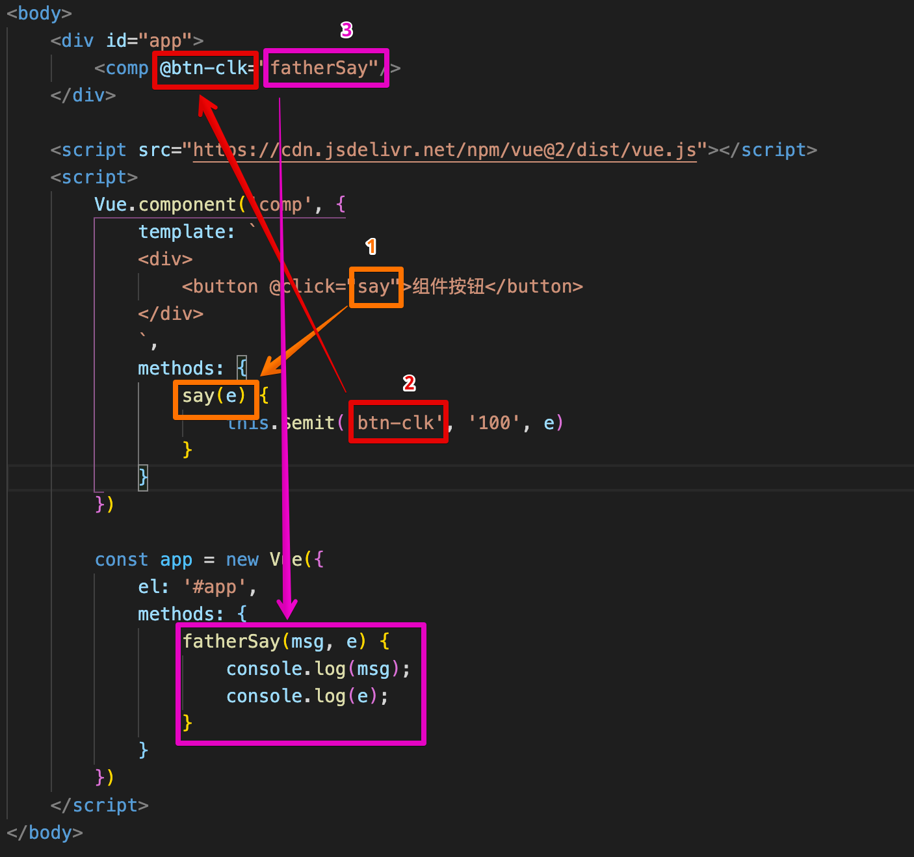

:::
::: tab label=组件用model
* v-model本质就是v-bind和v-on的结合语法糖

<video src="./assets/v-modelzizujian.mp4" style="width:400px;" controls />

```html{3,18-28}
<body>
    <div id="app">
        <comp v-model="myMsg"/>
    </div>

    <script src="https://cdn.jsdelivr.net/npm/vue@2/dist/vue.js"></script>
    <script>
        Vue.component('comp', {
            template: `
            <div>
                <input
                    type="text"
                    :value="value"
                    @input="input"
                >
            </div>
            `,
            props: {
                value: {
                    type: String,
                    default: ''
                }
            },
            methods: {
                input(e) {
                    this.$emit('input', e.target.value);
                }
            }
        })

        const app = new Vue({
            el: '#app',
            data() {
                return {
                    myMsg: '消息'
                }
            }
        })
    </script>
</body>
```
:::
::: tab label=动态组件
* 可以使用`component`标签，添加属性【**v-bind:is="compName"**】来动态定义组件

<video src="./assets/dynamiccomp.mp4" style="width:400px;" controls />

```html{13,44-46,61-63}
<body>
    <div id="app">
        <div class="tabs-box">
            <div
                v-for="(tab, index) in tabs"
                class="tab"
                :class="{select: selected === index}"
                @click="changeTab(index)"
            >{{tab}}</div>
        </div>

        <div class="content">
            <component :is="componentName"></component>
        </div>
    </div>


    <style>
        .tabs-box {
            height: 30px;
            background-color: rgb(192, 234, 245);
            display: flex;
            user-select: none;
        }
        .tab {
            width: auto;
            padding: 5 10px;
            height: 100%;
            box-sizing: border-box;
        }
        .tab.select {
            background-color: rgb(247, 136, 136);
            border: 2px;
        }
        .content {
            background-color: rgb(247, 255, 199);
            width: 100%;
            min-height: 100vh;
        }
    </style>

    <script src="https://cdn.jsdelivr.net/npm/vue@2/dist/vue.js"></script>
    <script>
        Vue.component('home', {template: '<div>首页内容</div>'})
        Vue.component('about', {template: '<div>相关内容</div>'})
        Vue.component('me', {template: '<div>我的空间</div>'})
        const app = new Vue({
            el: '#app',
            data() {
                return {
                    tabs: ['home', 'about', 'me'],
                    selected: 0
                }
            },
            methods: {
                changeTab(index) {
                    this.selected = index;
                }
            },
            computed: {
                componentName() {
                    return this.tabs[this.selected];
                }
            }
        })
    </script>
</body>
```
:::
::::
## 生命周期
:::: tabs
::: tab label=概览


:::
::: tab label=before/created
* beforeCreated还没有创建Vue实例，基本不做事情
* created已经创建了Vue实例，可以拿到实例里面的data，但还没有挂载到DOM上。可以请求数据，因为接收data已经准备好了。

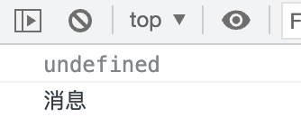

```html{15,18}
<body>
    <div id="app">
    </div>

    <script src="https://cdn.jsdelivr.net/npm/vue@2/dist/vue.js"></script>
    <script>
        const app = new Vue({
            el: '#app',
            data() {
                return {
                    message: '消息',
                }
            },
            beforeCreate() {
                console.log(this.message);
            },
            created() {
                console.log(this.message);
            }
        })
    </script>
</body>
```
:::
::: tab label=before/mounted
* beforeMount：挂载到DOM树上前
* mounted：已经上树，一般操作DOM的方法可以写这里。需要注意的是图片一类的数据，mounted以后，并没有渲染出高度，只是上了DOM树。请求图片也要时间，所以这里拿的宽高并不准确。

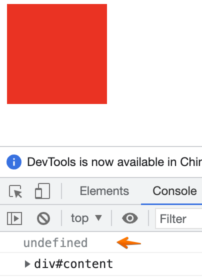

```html{16,19}
<body>
    <div id="app">
        <div id="content" ref="content"></div>
    </div>

    <script src="https://cdn.jsdelivr.net/npm/vue@2/dist/vue.js"></script>
    <script>
        const app = new Vue({
            el: '#app',
            data() {
                return {
                    message: '消息',
                }
            },
            beforeMount() {
                console.log(this.$refs.content);
            },
            mounted() {
                console.log(this.$refs.content);
            },
        })
    </script>
    <style>
        #content {
            height: 100px;
            width: 100px;
            background-color: red;
        }
    </style>
</body>
```
:::
::: tab label=before/updated
* beforeUpdate：修改数据，即将进行DOM树更新的时候调用
* updated：DOM刷新完毕调用
:::
::: tab label=before/destroyed
* beforeDestory：VUE实例销毁前调用，可以用啦销毁事件监听器、setTimeout/setTimeInterval
* destroyed：Vue实例已销毁，拿不到数据了
:::
::: tab label=activated/deactivated
* activated: `keep-alive`包含组件激活时触发
* deactivated: `keep-alive`包含组件离开时触发

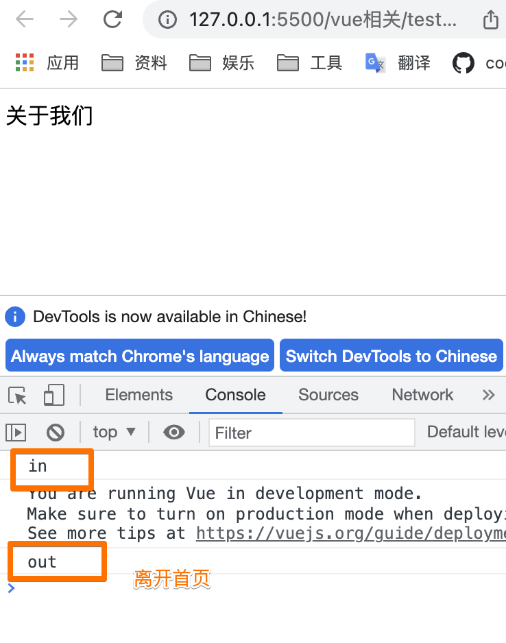

```html
<body>
    <div id="app">
        <keep-alive>
            <component :is="path"/>
        </keep-alive> 
    </div>

    <script src="https://cdn.jsdelivr.net/npm/vue@2/dist/vue.js"></script>
    <script>
        Vue.component('home', {
            template:`
            <div>这是主页</div>
            `,
            activated() {
                console.log('in');
            },
            deactivated(e) {
                console.log('out');
            },
        });

        Vue.component('about', {
            template:`
            <div>关于我们</div>
            `,
        })
        const app = new Vue({
            el: '#app',
            data() {
                return {
                    path: 'home'
                }
            },
            mounted() {
                setTimeout(() => this.path = 'about', 2000);
            }
        })
    </script>
</body>
```
:::
::: tab label=nextTick
* Vue的响应式原理有一个性能优化：在每次数据更新后会并不会立即执行响应式依赖，而是在将依赖函数更新放入一个更新队列里面去，并且保证每个数据的依赖只会被推入一次，**从而保证最终的DOM只会被更新一次**。
* 本轮事件循环执行完毕后，响应式系统才会被执行，也就是说**真正的数据改变触发的响应是在本轮事件轮询结束以后**。需要更新的组件的render被推入微任务队列执行。
>证明：
```html{15-19}
<body>
    <div id="app">
        <div>{{ counter }}</div>
        <button @click="change">添加</button>
    </div>

    <script src="https://unpkg.com/vue@next"></script>
    <script>
        const { ref, createApp, nextTick, watchEffect } = Vue;
        const app = createApp({
            setup(props, ctx) {
                let counter = ref(0);
                watchEffect(() => console.log(counter.value));

                /**
                 * counter是响应式数据，有对应的watchEffect。
                 * 一次事件循环修改了counter100次，
                 * 但是watchEffect只被执行了一次
                 */
                const change = () => {
                    for (let i = 0; i < 100; i++) {
                        counter.value++;
                    }
                };

                return {
                    counter,
                    change,
                }
            }
        });
        app.mount('#app');
    </script>
</body>
```
* 以组件为粒度重新执行对应的render方法，render调h函数，生成组件粒度的虚拟DOM，新旧虚拟DOM进行比较，diff算法发现更新的虚拟节点调用patch函数渲染出真实DOM。
* 所以在更新完变量的时候，立即去操作DOM拿到的并不是更新以后的结果，需要等待到DOM更新队列更新完以后拿到的才是更新完以后的效果。所以又有一个新的回调钩子`nextTick`就是本轮DOM更新完成后的`Promise回调`
```html{26-34}
<body>
    <div id="app">
        <div class='container'>
            <span ref="span">{{msg}}</span>
        </div>
        <button @click="change">添加</button>
    </div>

    <style>
        .container {
            border: 20px #333 solid;
            padding: 10px;
            width: 100px;
            height: 100px;
            overflow-y:scroll;
        }
    </style>

    <script src="https://unpkg.com/vue@next"></script>
    <script>
        const { ref, createApp, nextTick } = Vue;
        const app = createApp({
            setup(props, ctx) {
                const span = ref(null);
                const msg = ref('');
                const change = () => {
                    msg.value += `
                    我会滚动，我会滚动，我会滚动，我会滚动，我会滚动，我会滚动，我会滚动，
                    我会滚动，我会滚动，我会滚动，`
                    console.log(span.value.offsetHeight); // 0
                    nextTick(() => {
                        console.log(span.value.offsetHeight); // 220
                    })
                };
                return {
                    span,
                    msg,
                    change,
                }
            }
        });
        app.mount('#app');
    </script>
</body>
```
:::
::::
## data/computed/watch
:::: tabs
::: tab label=data
* 为什么不直接用对象，而用函数返回对象？
>由于VUE组件是可以复用的，那么多个组件复用的时候，需要肯定不能用相同的数据。就利用function返回新的对象，让相同组件之间都拥有自己的data

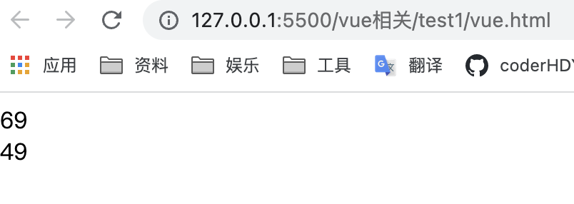

```html{3-4,13-17}
<body>
    <div id="app" v-once>
        <comp></comp>
        <comp></comp>
    </div>

    <script src="https://cdn.jsdelivr.net/npm/vue@2/dist/vue.js"></script>
    <script>
        Vue.component('comp', {
            template: `
            <div>{{message}}</div>
            `,
            data() {
                return {
                    message: Math.floor(Math.random() * 100),
                }
            }
        })

        const app = new Vue({
            el: '#app',
        })
    </script>
</body>
```
:::
::: tab label=watch
* watch是一个属性随着另一个属性变化而变化，通常情况下都能被computed替代
* watch一般用于监控路由、input输入框的值特殊处理等等，它比较适合的场景是一个数据影响多个数据
* 当需要在数据变化时执行异步或开销较大的操作时，这个方式是最有用的。
* 深度监听，可监听一个对象内部的改变。

<video src="./assets/watch.mp4" style="width:400px;" controls />

```html{19-24}
<body>
    <div id="app">
        <input type="text" v-model="me.name">
    </div>

    <script src="https://cdn.jsdelivr.net/npm/vue@2/dist/vue.js"></script>
    <script>
        const app = new Vue({
            el: '#app',
            data() {
                return {
                    me: {
                        name: 'hdy',
                        age: 18
                    }
                }
            },
            watch: {
                me: {
                    handler(newName, oldName) {
                        console.log('watch');
                    },
                    deep: true
                }
            }

        })
    </script>
</body>
```
:::
::: tab label=computed
* computed：computed内部可以进行复杂的计算，用函数名作为数据的变量名。并且在值没有改变的情况下，不会重复计算。computed有`缓存机制`
* 相比于data：一样的调用方法
* 相比于methods：除非值改变，否则不会重复计算

>都能生效

<video src="./assets/computed1.mp4" style="width:300px;" controls />

```html{3-5,14,18-20,23-25,28}
<body>
    <div id="app">
        <div>{{money + '元'}}</div>
        <div>{{dollor}}</div>
        <div>{{getMoney()}}</div>
    </div>

    <script src="https://cdn.jsdelivr.net/npm/vue@2/dist/vue.js"></script>
    <script>
        const app = new Vue({
            el: '#app',
            data() {
                return {
                    money: 10,
                }
            },
            computed: {
                dollor() {
                    return this.money + '美元';
                }
            },
            methods: {
                getMoney() {
                    return this.money + '欧元';
                }
            },
            mounted() {
                setInterval(() => this.money++, 1000);
            }

        })
    </script>
</body>
```
:::
::: tab label=缓存机制
* computed有一个缓存机制，只有当依赖的响应式数据发生变化时才会进行清空缓存重新计算结果，否则就会直接调用缓存。是否变更有一个dirty属性控制，dirty===true，重新计算。

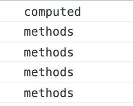

```html{3-13}
<body>
    <div id="app">
        <div>{{dollor}}</div>
        <div>{{getMoney()}}</div>

        <div>{{dollor}}</div>
        <div>{{getMoney()}}</div>

        <div>{{dollor}}</div>
        <div>{{getMoney()}}</div>

        <div>{{dollor}}</div>
        <div>{{getMoney()}}</div>
    </div>

    <script src="https://cdn.jsdelivr.net/npm/vue@2/dist/vue.js"></script>
    <script>
        const app = new Vue({
            el: '#app',
            data() {
                return {
                    money: 10,
                }
            },
            computed: {
                dollor() {
                    console.log('computed');
                    return this.money + '美元';
                }
            },
            methods: {
                getMoney() {
                    console.log('methods');
                    return this.money + '欧元';
                }
            }

        })
    </script>
</body>
```
:::
:::tab label=原理实现
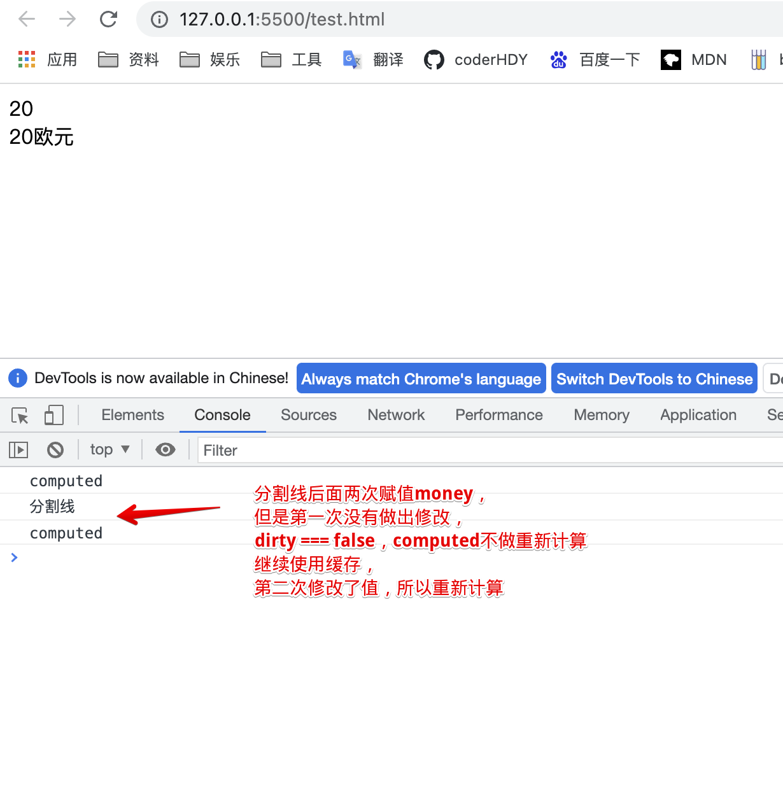

```html{17,23,29,40,62-65}
<body>
    <div id="app">
        <div class='money'></div>
        <div class='dollor'></div>
    </div>

    <script>
        const money = new Proxy(
            {
                val: 0,
                dirty: false,
                useArr: []
            },
            {
                set(target, key, val) {
                    if (key === 'val') {
                        target.dirty = (val !== target[key]);
                        target.val = val;

                        const moneyDOM = document.querySelector('.money');
                        moneyDOM.innerText = val;

                        target.useArr.forEach(item => notify(item));
                    }
                }
            }
        )
        function notify(item) {
            item.refresh();
        }

        const getMoney = new Proxy(
            {
                val: null,
                refresh: function() {
                    if (!money.useArr.includes(this)) {
                        money.useArr.push(this);
                    }

                    if (money.dirty === true || this.val == null) {
                        this.val = this.computed();
                    }
                },
                computed() {
                    console.log('computed');
                    return money.val + '欧元';
                }
            },
            {
                set(target, key, val) {
                    if (key === 'val') {
                        this.val = val;
                        const dollorDOM = document.querySelector('.dollor');
                        dollorDOM.innerText = val;
                        Reflect.set(target, key, val);
                    }
                }
            }
        )
        money.val = 10;
        getMoney.refresh();
        console.log('分割线');

        setTimeout(() => money.val = 10, 1000);
        setTimeout(() => money.val = 20, 3000);
    </script>
</body>
```
:::
::::
## class/style
:::: tabs
::: tab label=class
* 动态绑定方法：
```html
<div v-bind:class="{ active: isActive }"></div>

<div v-bind:class="{ active: isActive, 'text-danger': hasError }"></div>

<div v-bind:class="[activeClass, errorClass]"></div>

<div v-bind:class="[{ active: isActive }, errorClass]"></div>
```
---
* 可以用计算属性返回对象的形式计算动态class

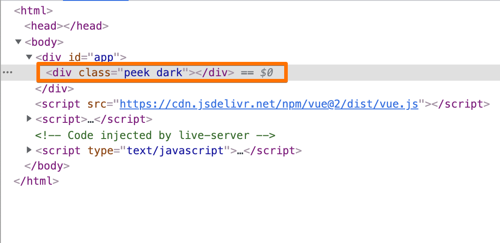

```html{3,11-16}
<body>
    <div id="app">
        <div :class="box"></div>
    </div>

    <script src="https://cdn.jsdelivr.net/npm/vue@2/dist/vue.js"></script>
    <script>
        const app = new Vue({
            el: '#app',
            computed: {
                box() {
                    return {
                        peek: true,
                        dark: +new Date().getHours() > 18 || +new Date().getHours() < 5
                    }
                }
            }
        })
    </script>
</body>
```
:::
::: tab label=组件class
* 组件根元素的class会被渲染上，调用组件时传入的class也会被渲染上
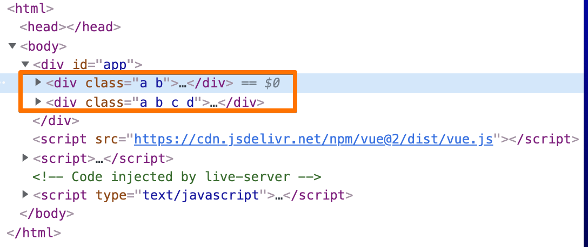

```html{3-4}
<body>
    <div id="app">
        <comp></comp>
        <comp :class="'c d'"></comp>
    </div>

    <script src="https://cdn.jsdelivr.net/npm/vue@2/dist/vue.js"></script>
    <script>
        Vue.component('comp', {
            template: `
            <div class="a b">
                <p>组件</p>
            </div>
            `
        })
        
        const app = new Vue({
            el: '#app',
        })
    </script>
</body>
```
:::
::: tab label=内联样式
* 动态语法
```html
<!-- 动态传值 -->
<div v-bind:style="{ color: activeColor, fontSize: fontSize + 'px' }"></div>

<!-- 绑定对象 -->
<div v-bind:style="styleObject"></div>

<!-- 多个对象 -->
<div v-bind:style="[baseStyles, overridingStyles]"></div>
```
:::
::::
## 数组
:::: tabs
::: tab label=注意事项
* 要使用唯一的key值
* **不能使用下标更改**，数组监听只是重写了下面的方法
    * push()
    * pop()
    * shift()
    * unshift()
    * splice()
    * sort()
    * reverse()
:::
::: tab label=下标修改测试
<video src="./assets/splice.mp4" style="width:400px;" controls />

```html{6-7,21,24}
<body>
    <div id="app">
        <ul>
            <li v-for="s of stu" key="s">{{s}}</li>
        </ul>
        <button @click="indexMod">下标修改</button>
        <button @click="splice">splice修改</button>
    </div>

    <script src="https://cdn.jsdelivr.net/npm/vue@2/dist/vue.js"></script>
    <script>
        const app = new Vue({
            el: '#app',
            data() {
                return {
                    stu: ['张三', '李四', '王五'],
                }
            },
            methods: {
                indexMod() {
                    this.stu[0] = 'hdy'
                },
                splice() {
                    this.stu.splice(0, 1, 'hdy');
                }
            }
        })
    </script>
</body>
```
:::
::::
## Event
:::: tabs
::: tab label=方法总览
* 可以用 v-on / @ 指令监听 DOM 事件，并在触发时**运行一些 JavaScript 代码或函数**
* 当一个 ViewModel 被销毁时，**所有的事件处理器都会自动被删除**。你无须担心如何清理它们。
```html
<!-- 执行JS代码 -->
<button v-on:click="counter += 1">Add 1</button>

<!-- 函数默认接收event参数 -->
<button v-on:click="greet">Greet</button>

<!-- 函数传值 -->
<button @click="getMoney(10)">转换美元</button>

<!-- 又想传值又想传事件 -->
<button @click="getMoney(10, $event)">转换美元</button>
```
:::
::: tab label=事件修饰符
* 已支持修饰符
    * .stop
    * .prevent
    * .capture
    * .self
    * .once
    * .passive
    * .native : 在一个组件的根元素上直接监听一个原生事件。

```html
<!-- 阻止单击事件继续传播 -->
<a v-on:click.stop="doThis"></a>

<!-- 提交事件不再重载页面 -->
<form v-on:submit.prevent="onSubmit"></form>

<!-- 修饰符可以串联 -->
<a v-on:click.stop.prevent="doThat"></a>
```
* 支持的键盘触发事件
```html
<!-- 只有在 `key` 是 `Enter` 时调用 `vm.submit()` -->
<input v-on:keyup.enter="submit">
```
* 提供的别名
    * .enter
    * .tab
    * .delete (捕获“删除”和“退格”键)
    * .esc
    * .space
    * .up
    * .down
    * .left
    * .right
:::
::: tab label=表单内事件
* v-model 在内部为不同的输入元素使用不同的 property 并抛出不同的事件：
    * text 和 textarea 元素使用 value property 和 `input` 事件；
    * checkbox 和 radio 使用 checked property 和 `change` 事件；
    * select 字段将 value 作为 prop 并将 `change` 作为事件。
* 修饰符
    * lazy：将表单change时同步【鼠标离开时】
    * number：内部用parseFloat解析
    * trim：内部调用String.prototype.trim()
>lazy和非lazy对比

<video src="./assets/lazy.mp4" style="width:400px;" controls />

```html{3,4}
<body>
    <div id="app">
        <input type="text" v-model="msg">
        <input type="text" v-model.lazy="msg">
    </div>

    <script src="https://cdn.jsdelivr.net/npm/vue@2/dist/vue.js"></script>
    <script>
        const app = new Vue({
            el: '#app',
            data() {
                return {
                    msg: '消息'
                }
            },
        })
    </script>
</body>
```
:::
::::
## 插槽
:::: tabs
::: tab label=规则
* 父级模板里的所有内容都是在父级作用域中编译的；子模板里的所有内容都是在子作用域中编译的。
>**父模板能向子模板的slot传值，但编译过程是在父模板走的**，子模板拿到的只是编译后的值替换掉对应的slot标签。

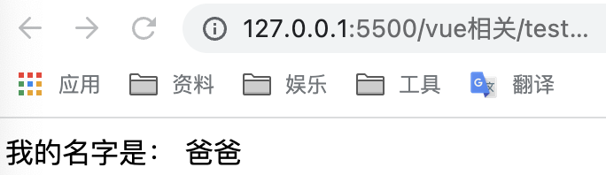

```html{3,10-12,16,27}
<body>
    <div id="app">
        <home>{{name}}</home>
    </div>

    <script src="https://cdn.jsdelivr.net/npm/vue@2/dist/vue.js"></script>
    <script>
        const home = {
            template: `
            <div>我的名字是：
                <slot />
            </div>
            `,
            data() {
                return {
                    name: '儿子',
                }
            }
        };
        const app = new Vue({
            el: '#app',
            components: {
                home
            },
            data() {
                return {
                    name: '爸爸',
                }
            }
        })
    </script>
</body>
```
:::
::: tab label=作用域插槽
* **使用插槽时也想使用子组件的变量**，就可以用`作用域插槽`。
* 子组件定义插槽时向插槽bind参数
* 父组件使用插槽时【v-slot="propsObj"】能够拿到所有子组件传来的参数

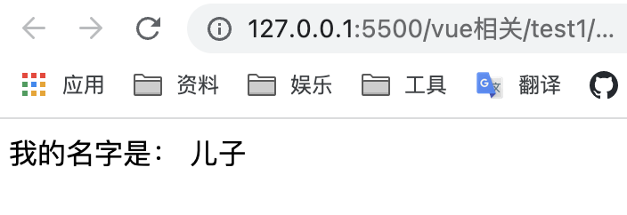

```html{4-6,15}
<body>
    <div id="app">
        <home>
            <template v-slot='slotData'>
                {{slotData.myName}}
            </template>
        </home>
    </div>

    <script src="https://cdn.jsdelivr.net/npm/vue@2/dist/vue.js"></script>
    <script>
        const home = {
            template: `
            <div>我的名字是：
                <slot :myName="name"></slot>
            </div>
            `,
            data() {
                return {
                    name: '儿子',
                }
            }
        };
        const app = new Vue({
            el: '#app',
            components: {
                home
            },
            data() {
                return {
                    name: '爸爸',
                }
            }
        })
    </script>
</body>
```
* `独占默认插槽`：可以不用template，直接把插槽名传到子组件标签上
```html
<home v-slot='slotData'>
    {{slotData.myName}}
</home>
```
:::
::: tab label=其他规则
* 具名插槽
```html
<slot name="header"></slot>
```
```html
<template v-slot:header>
    <h1>Here might be a page title</h1>
</template>

<!-- 缩写 -->
<template #header>
    <h1>Here might be a page title</h1>
</template>

<!-- 或 -->
<h1 slot="header">Here might be a page title</h1>
```
* 不带名字的被视为`默认插槽`，双标签内部的内容就被默认传进来
* 解构插槽props
```html
<home v-slot="{ name }">
  {{ user }}
</home>
```
* 动态插槽名
```html
<template v-slot:[dynamicSlotName]>
    啦啦啦
</template>
```
:::
::::
## 混入
:::: tabs
::: tab label=minxins
* 定义一些可直接复用的方法、生命周期事情。
* 混入对象的钩子将在组件自身钩子之前调用。
* methods和data重名以组件本地的为准。

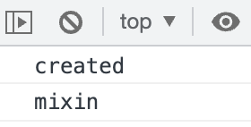

```html{8-10,12-14,20-23}
<body>
    <div id="app">
    </div>

    <script src="https://cdn.jsdelivr.net/npm/vue@2/dist/vue.js"></script>
    <script>
        const mixin = {
            created() {
                console.log('created');
            },
            methods: {
                say() {
                    console.log('mixin');
                }
            }
        }

        const app = new Vue({
            el: '#app',
            mixins: [mixin],
            mounted() {
                this.say();
            }
        })
    </script>
</body>
```
:::
::: tab label=全局混入
* 使用后所有组件都会被影响
```html{21}
<body>
    <div id="app">
    </div>

    <script src="https://cdn.jsdelivr.net/npm/vue@2/dist/vue.js"></script>
    <script>
        const mixin = {
            created() {
                console.log('所有组件created都要执行');
            },
            methods: {
                say() {
                    console.log('全局混入');
                }
            },
            mounted() {
                this.say();
            }
        }

        Vue.mixin(mixin);
        const app = new Vue({
            el: '#app',
        })
    </script>
</body>
```
:::
::::
## 自定义指令
:::: tabs
::: tab label=介绍
* 对普通 DOM 元素进行底层操作
* 可执行钩子：
    * bind：只调用一次，指令**第一次绑定到元素时调用**。在这里可以进行一次性的初始化设置。
    * `inserted`：被绑定元素**插入父节点时调用** (仅保证父节点存在，但不一定已被插入文档中)。
    * update：**所在组件的 VNode 更新时调用**
    * componentUpdated：指令**所在组件的 VNode 及其子 VNode 全部更新后调用**。
    * unbind：只调用一次，指令**与元素解绑时调用**。
* 入参：
    * el
    * binding = { name, value, expression, oldValue, arg, modifiers }
    * vnode
    * oldVnode
:::
::: tab label=局部指令
* 组件内接收`directives`对象，每个属性是一个指令
>有两个输入框，一进入页面光标就聚焦在第二个上
```html{4,21}
<body>
    <div id="app">
        <input type="text"/>
        <input type="text" v-focus />
    </div>

    <script src="https://cdn.jsdelivr.net/npm/vue@2/dist/vue.js"></script>
    <script>
        const directives = {
            focus: {
                // 指令的定义
                inserted: function (el) {
                    console.log(el.focus);
                    el.focus();
                }
            }
        }

        const app = new Vue({
            el: '#app',
            directives,
        })
    </script>
</body>
```
:::
::: tab label=全局指令
* 自定义鉴权按钮

<video src="./assets/directives.mp4" style="width:300px;" controls />

```html{3,11-16,18}
<body>
    <div id="app">
        <div v-admin="'admin'">只有管理员可见的盒子</div>
        <button @click="login">添加管理员权限</button>
        <button @click="logout">移除管理员权限</button>
    </div>

    <script src="https://cdn.jsdelivr.net/npm/vue@2/dist/vue.js"></script>
    <script>
        const directives = {
            inserted: function (el, bind) {
                const val = bind.value;
                if (!localStorage.getItem('power')?.includes(val)) {
                    el.parentElement.removeChild(el);
                }
            }
        }
        Vue.directive('admin', directives);

        const app = new Vue({
            el: '#app',
            methods: {
                login() {
                    localStorage.setItem('power', 'admin');
                    location.reload();
                },
                logout() {
                    localStorage.removeItem('power');
                    location.reload();
                }
            }
        })
    </script>
</body>
```
:::
::::