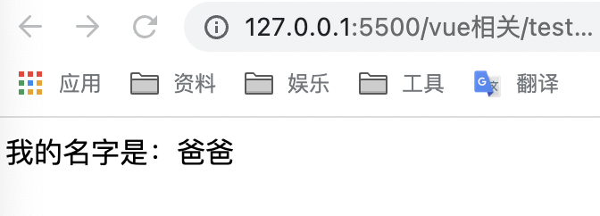
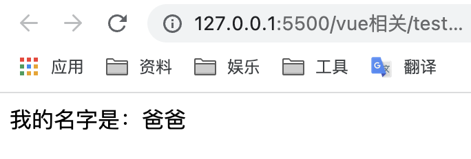
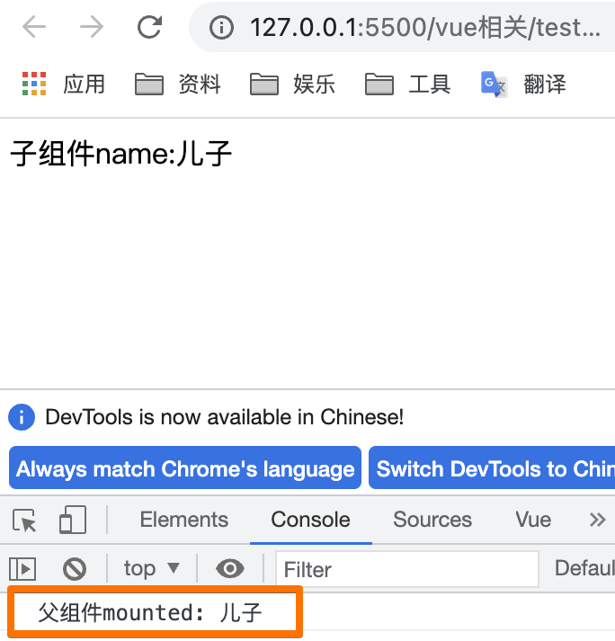
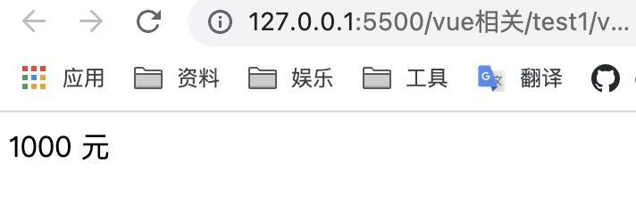
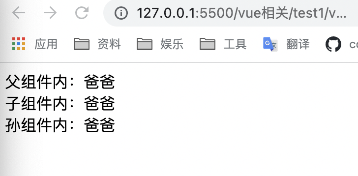

## 父->子
:::: tabs
::: tab label=props
>单向数据流，子组件不能修改父组件参数



```html{3,9-10,20}
<body>
    <div id="app">
        <child :name="name"></child>
    </div>

    <script src="https://cdn.jsdelivr.net/npm/vue@2/dist/vue.js"></script>
    <script>
        const child = {
            template: `<div>我的名字是：{{ name }}</div>`,
            props: [ "name" ]
        };

        const app = new Vue({
            el: '#app',
            components: {
                child
            },
            data() {
                return {
                    name: '爸爸',
                }
            }
        })
    </script>
</body>
```
:::
::: tab label=$parent
* 官方**不建议**子直接调用、修改父数据
---


```html{12,24}
<body>
    <div id="app">
        <child></child>
    </div>

    <script src="https://cdn.jsdelivr.net/npm/vue@2/dist/vue.js"></script>
    <script>
        const child = {
            template: `<div>我的名字是：{{ name }}</div>`,
            data() {
                return {
                    name: this.$parent.name,
                }
            }
        };

        const app = new Vue({
            el: '#app',
            components: {
                child
            },
            data() {
                return {
                    name: '爸爸',
                }
            }
        })
    </script>
</body>
```
:::
::: tab label=.sync
* props的修饰符：子组件可以修改props参数
* 子组件要修改时emit一个update事件，父组件就同步修改了
* **tip：非特殊情况下不要直接改父组件数据**

<video src="./assets/props5.mp4" style="width:300px;" controls />

```html{4,15,19-28}
<body>
    <div id="app">
        父组件内：{{name}}
        <child :name.sync="name"></child>
    </div>

    <script src="https://cdn.jsdelivr.net/npm/vue@2/dist/vue.js"></script>
    <script>
        const child = {
            template: `
            <div>
                子组件内：{{ myName }}
            </div>
            `,
            props: [ 'name' ],
            mounted() {
                setTimeout(() => this.myName = '儿子', 2000)
            },
            computed: {
                myName: {
                    get() {
                        return this.name;
                    },
                    set(newVal) {
                        this.$emit('update:name', newVal);
                    }
                }
            }
        };

        const app = new Vue({
            el: '#app',
            components: {
                child
            },
            data() {
                return {
                    name: '爸爸'
                }
            }
        })
    </script>
</body>
```
:::
::: tab label=v-model
* v-model子组件拿的props一定是`value`
* 发射的事件名默认是`input`，可以通过【model:{event: 'eName'}】来修改

<video src="./assets/props6.mp4" style="width:300px;" controls />

```html{4,15-16,26}
<body>
    <div id="app">
        父组件内：{{name}}
        <child v-model="name"></child>
    </div>

    <script src="https://cdn.jsdelivr.net/npm/vue@2/dist/vue.js"></script>
    <script>
        const child = {
            template: `
            <div>
                子组件内：{{ myName }}
            </div>
            `,
            props: [ 'value' ],
            model: { event: 'inputVal' },
            mounted() {
                setTimeout(() => this.myName = '儿子', 2000)
            },
            computed: {
                myName: {
                    get() {
                        return this.value;
                    },
                    set(newVal) {
                        this.$emit('inputVal', newVal);
                    }
                }
            }
        };

        const app = new Vue({
            el: '#app',
            components: {
                child
            },
            data() {
                return {
                    name: '爸爸'
                }
            }
        })
    </script>
</body>
```
:::
::::
## 子->父
:::: tabs
::: tab label=$emit
<video src="./assets/props3.mp4" style="width:400px;" controls />

```html{3-4,22,38-40}
<body>
    <div id="app">
        父组件内的name:{{name}}
        <child @btn-clk="change"></child>
    </div>

    <script src="https://cdn.jsdelivr.net/npm/vue@2/dist/vue.js"></script>
    <script>
        const child = {
            template: `
            <div>
                <button @click='clk'>按钮</button>
            </div>
            `,
            data() {
                return {
                    name: '儿子',
                }
            },
            methods: {
                clk() {
                    this.$emit('btn-clk', this.name);
                }
            }
        };

        const app = new Vue({
            el: '#app',
            components: {
                child
            },
            data() {
                return {
                    name: '爸爸',
                }
            },
            methods: {
                change(newName) {
                    this.name = newName;
                }
            }
        })
    </script>
</body>
```
:::
::: tab label=$refs
* 通过ref收集子组件实例，**通过实例获取子组件上的属性或调用方法**
* $refs 只会在**组件渲染完成之后生效**，并且它们不是响应式的。这仅作为一个用于直接操作子组件的“逃生舱”——你**应该避免在模板或计算属性中访问 $refs**。
---


```html{26-28}
<body>
    <div id="app">
        <child ref="child"></child>
    </div>

    <script src="https://cdn.jsdelivr.net/npm/vue@2/dist/vue.js"></script>
    <script>
        const child = {
            template: `
            <div>
                子组件name:{{name}}
            </div>
            `,
            data() {
                return {
                    name: '儿子',
                }
            }
        };

        const app = new Vue({
            el: '#app',
            components: {
                child
            },
            mounted() {
                console.log('父组件mounted:', this.$refs.child.name)
            }
        })
    </script>
</body>
```
:::
::: tab label=$children
* 可以拿到所有子组件的数组
* 一般不这么用，一般都是【$refs】拿。除非某个父组件的子组件都是同一个子组件的复用，这个方法比较适合

<video src="./assets/props9.mp4" style="width:300px;" controls />

```html{21-23,38}
<body>
    <div id="app">
        父组件内：{{name}}
        <child></child>
    </div>

    <script src="https://cdn.jsdelivr.net/npm/vue@2/dist/vue.js"></script>
    <script>
        const child = {
            template: `
            <div>
                子组件：{{ name }}
            </div>
            `,
            data() {
                return {
                    name: '儿子',
                }
            },
            methods: {
                changeName() {
                    this.name = "张三"
                }
            }
        };

        const app = new Vue({
            el: '#app',
            components: {
                child
            },
            data() {
                return {
                    name: '爸爸'
                }
            },
            mounted() {
                setTimeout(() => this.$children[0].changeName(), 2000)
            }
        })
    </script>
</body>
```
:::
::: tab label=作用域slot
* 父组件使用子组件slot的时候，可以使用作用域slot，子组件可以传递



```html{3-5,13}
<body>
    <div id="app">
        <child v-slot="data">
            {{data.money}} 元
        </child>
    </div>

    <script src="https://cdn.jsdelivr.net/npm/vue@2/dist/vue.js"></script>
    <script>
        const child = {
            template: `
            <div>
                <slot :money="money"/>
            </div>
            `,
            data() {
                return {
                    money: 1000
                }
            }
        };

        const app = new Vue({
            el: '#app',
            components: {
                child
            }
        })
    </script>
</body>
```
:::
::::
## 跨级共享
:::: tabs
::: tab label=$root
* 获取根组件，无论多少级都可以获取

<video src="./assets/props11.mp4" style="width:300px;" controls />

```html{17,33-35}
<body>
    <div id="app">
        根组件内：{{name}}
        <child></child>
    </div>

    <script src="https://cdn.jsdelivr.net/npm/vue@2/dist/vue.js"></script>
    <script>
        const child = {
            template: `
            <div>
                <button @click="change">子组件按钮</button>
            </div>
            `,
            methods: {
                change() {
                    this.$root.changeName("张三")
                }
            }
        };

        const app = new Vue({
            el: '#app',
            components: {
                child
            },
            data() {
                return {
                    name: '爸爸'
                }
            },
            methods: {
                changeName(newName) {
                    this.name = newName;
                }
            }
        })
    </script>
</body>
```
:::
::: tab label=$attrs
* 跨级传参，子组件对下级【v-bind="$attrs"】
* **子组件内不能对数据有任何处理，也不能用props接收**，要使用可以用`$attrs`来获取值。
* 如果子组件要接受props的话，传给孙组件的时候可以用【v-bind="$props"】替代



```html{4,12,20-21}
<body>
    <div id="app">
        父组件内：{{name}}
        <child :name="name"></child>
    </div>

    <script src="https://cdn.jsdelivr.net/npm/vue@2/dist/vue.js"></script>
    <script>
        const grandchild = {
            template: `
            <div>
                孙组件内：{{ $attrs.name }}
            </div>
            `, 
        };

        const child = {
            template: `
            <div>
                子组件内：{{ $attrs.name }}
                <grandchild v-bind="$attrs" />
            </div>
            `,
            components: {
                grandchild
            }
        };

        const app = new Vue({
            el: '#app',
            components: {
                child
            },
            data() {
                return {
                    name: '爸爸'
                }
            }
        })
    </script>
</body>
```
:::
::: tab label=$listeners
* 父组件对子组件的所有事件监听器
* 可以直接把父组件的所有监听器传给孙组件【v-on="$listeners"】

<video src="./assets/props8.mp4" style="width:300px" controls />

```html{4,12,17,25}
<body>
    <div id="app">
        父组件内：{{name}}
        <child @change-name="change"></child>
    </div>

    <script src="https://cdn.jsdelivr.net/npm/vue@2/dist/vue.js"></script>
    <script>
        const grandchild = {
            template: `
            <div>
                <button @click="btnClk">孙组件按钮</button>
            </div>
            `,
            methods: {
                btnClk() {
                    this.$emit('change-name', '张三')
                }
            }
        };

        const child = {
            template: `
            <div>
                <grandchild v-on="$listeners" />
            </div>
            `,
            components: {
                grandchild
            },
        };

        const app = new Vue({
            el: '#app',
            components: {
                child
            },
            data() {
                return {
                    name: '爸爸'
                }
            },
            methods: {
                change(newVal) {
                    this.name = newVal;
                }
            }
        })
    </script>
</body>
```
* 也可以只传某一个
```html
<grandchild @change-name="$listeners['change-name']" />
```
:::
::: tab label=provide
* 提供给后代组件公用的数据或方法。**不是响应式的，所以尽量传递常量或者方法**
* 后代需要使用的位置用inject来注入方法。
* 注：【provide:{}】不能拿到this，可以传递函数或常量，【provide()】可以拿到this

<video src="./assets/props12.mp4" style="width:300px;" controls />

```html{13,16,29-34}
<body>
    <div id="app">
        根组件内：{{name}}
        <child></child>
    </div>

    <script src="https://cdn.jsdelivr.net/npm/vue@2/dist/vue.js"></script>
    <script>
        const child = {
            template: `
            <div>
                子组件内：{{ name }}
                <button @click="changeName('张三')">子组件按钮</button>
            </div>
            `,
            inject: [ 'changeName', 'name' ]
        };

        const app = new Vue({
            el: '#app',
            components: {
                child
            },
            data() {
                return {
                    name: '爸爸'
                }
            },
            provide() {
                return {
                    changeName: this.changeName,
                    name: this.name
                }
            },
            methods: {
                changeName(newName) {
                    this.name = newName;
                }
            }
        })
    </script>
</body>
```
:::
::: tab label=$bus
* 通过原型链上共享一个VUE实例来共享事件监听
* 三种定义方式
```js
// Bus.js
import Vue from "vue"
export default new Vue()

// 方法二 直接挂载到全局
// main.js
import Vue from "vue"
Vue.prototype.$bus = new Vue()

// 方法三 注入到 Vue 根对象上
// main.js
import Vue from "vue"
new Vue({
    el:"#app",
    data:{
        $bus: new Vue()
    }
})
```
* 例：

<video src="./assets/props13.mp4" style="width:300px;" controls />

```html{9,18-20,35-37,39-41}
<body>
    <div id="app">
        根组件内：{{ count }}
        <child></child>
    </div>

    <script src="https://cdn.jsdelivr.net/npm/vue@2/dist/vue.js"></script>
    <script>
        Vue.prototype.$bus = new Vue();

        const child = {
            template: `
            <div>
                <button @click="btnClk">子组件按钮</button>
            </div>
            `,
            methods: {
                btnClk() {
                    this.$bus.$emit('addCount');
                }
            }
        };

        const app = new Vue({
            el: '#app',
            components: {
                child
            },
            data() {
                return {
                    count: 0,
                }
            },
            mounted() {
                this.$bus.$on('addCount', () => {
                    this.count++;
                })
            },
            destroyed() {
                this.$bus.$off('addCount');
            },
        })
    </script>
</body>
```
:::
::::
## VueX
::: tip
* [VueX官网](https://vuex.vuejs.org/zh/#%E4%BB%80%E4%B9%88%E6%98%AF-%E7%8A%B6%E6%80%81%E7%AE%A1%E7%90%86%E6%A8%A1%E5%BC%8F)
* 状态管理模式。它采用集中式存储管理应用的所有组件的状态，并以相应的规则保证状态以一种可预测的方式发生变化。
* 配合浏览器退出的vue-devtools，可以生成状态快照，方便调试
:::
:::: tabs
::: tab label=概念

:::
::: tab label=getters
:::
::::