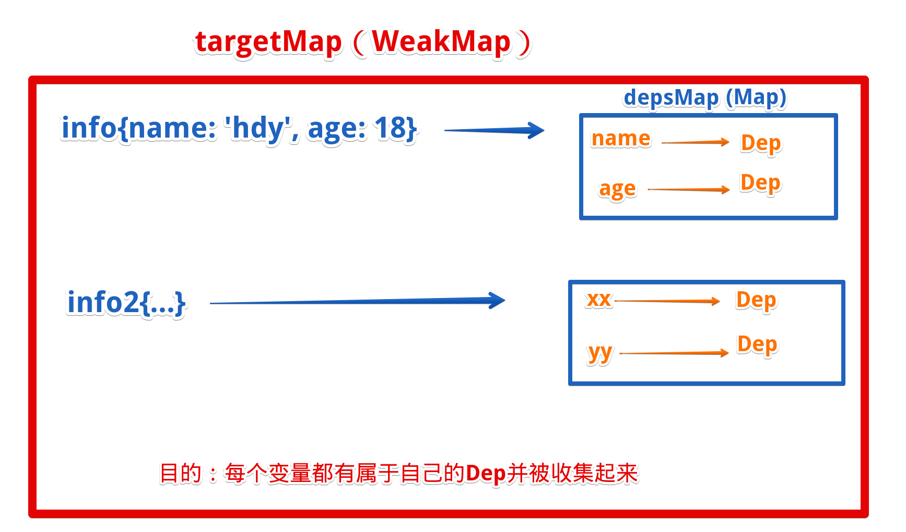

## 手写响应式原理
:::: tabs
::: tab label=理论
* 一个`Dep`类的实例可以收集依赖和触发依赖，每个数据有一个对应的dep对象
    * `subspcribers`收集依赖器，用Set保证不重复收集
    * `depend`为本数据添加依赖
    * `notify`触发所有依赖，数据做响应式操作或DOM更新
* `watchEffect`执行一遍函数，访问一遍所有的依赖数据
    * 全局存放`activeEffect`存放当前执行的副作用（依赖）
    * 存放完毕初始化null
* `targetMap`存放所有数据的dep。用WeakMap来存放响应式对象与depMap的键值对
    * getDep(target, key)获取到某个具体的属性的dep对象
* `Proxy`或`defineProperty`制作数据劫持



:::
::: tab label=Dep
* 依赖收集触发器
```js
class Dep {
    subscribers = new Set();
    depend() {
        if (activeEffect) {
            this.subscribers.add(activeEffect);
        }
    }
    notify() {
        this.subscribers.forEach(effect => effect());
    }
}
```
* 收集依赖函数
```js
let activeEffect = null;
function watchEffect(effect) {
    activeEffect = effect;
    effect();
    activeEffect = null;
}
```
:::
::: tab label=targetMap
* 收集所有Dep对象
```js
const targetMap = new WeakMap();
function getDep(target, key) {
    let depMaps = targetMap.get(target);
    if (!depMaps) {
        depMaps = new Map();
        targetMap.set(target, depMaps);
    }
    let dep = depMaps.get(key);
    if (!dep) {
        dep = new Dep();
        depMaps.set(key, dep);
    }
    return dep;
}
```
:::
::: tab label=reactive
* 劫持对象数据get、set。get触发收集依赖，set触发通知依赖
```js{15-17,21-23}
function reactive(raw) {

    // 深度监听，防止重复绑定
    if (raw._isReactive) {
        return raw;
    }
    const proxy = new Proxy(raw, {
        get(target, key) {

            // 深度监听
            if (typeof target[key] === 'object' && target[key] != null) {
                target[key] = reactive(target[key]);
            }

            const dep = getDep(target, key);
            dep.depend();
            return target[key];
        },
        set(target, key, val) {
            if (target[key] !== val) {
                target[key] = val;
                const dep = getDep(target, key);
                dep.notify()
            }
            return true;
        }
    });
    raw._isReactive = true;
    return proxy;
}
```
:::
::: tab label=合并测试
```js
class Dep {
    subscribers = new Set();
    depend() {
        if (activeEffect) {
            this.subscribers.add(activeEffect);
        }
    }
    notify() {
        this.subscribers.forEach(effect => effect());
    }
}

let activeEffect = null;
function watchEffect(effect) {
    activeEffect = effect;
    effect();
    activeEffect = null;
}

const targetMap = new WeakMap();
function getDep(target, key) {
    let depMaps = targetMap.get(target);
    if (!depMaps) {
        depMaps = new Map();
        targetMap.set(target, depMaps);
    }
    let dep = depMaps.get(key);
    if (!dep) {
        dep = new Dep();
        depMaps.set(key, dep);
    }
    return dep;
}

function reactive(raw) {

    // 深度监听，防止重复绑定
    if (raw._isReactive) {
        return raw;
    }
    const proxy = new Proxy(raw, {
        get(target, key) {

            // 深度监听
            if (typeof target[key] === 'object' && target[key] != null) {
                target[key] = reactive(target[key]);
            }

            const dep = getDep(target, key);
            dep.depend();
            return target[key];
        },
        set(target, key, val) {
            if (target[key] !== val) {
                target[key] = val;
                const dep = getDep(target, key);
                dep.notify()
            }
            return true;
        }
    });
    raw._isReactive = true;
    return proxy;
}


// 设置响应式数据
let data = reactive({
    name: 'hdy',
    age: 18,
    friends: [
        'James',
        'Tom'
    ]
});

// 请求订阅数据
watchEffect(() => console.log(data.name + '变化啦，重新render'));
watchEffect(() => console.log(data.friends[1] + '变化啦，重新render'));

// 改变触发响应式
data.name = '张三';
setTimeout(() => data.friends[1] = '李四', 1000);
```
:::
::::