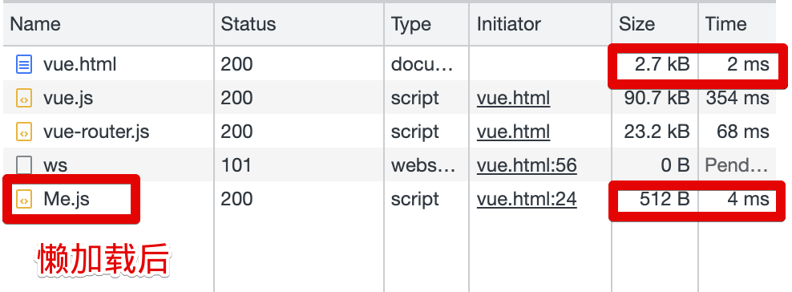

## Vue-Router
:::: tabs
::: tab label=前端路由
* `后端渲染`：
    1. 浏览器向服务器发送URL请求
    2. 服务器从数据库拿到数据
    3. 渲染好网页HTML，返回完整网页。
    4. 浏览器拿到网页数据，执行，再点击其他跳转链接，再重新渲染
* `后端路由`：后端根据url返回对应页面的HTML文件
* `前端渲染`：
    1. 浏览器向服务器发送url请求
    2. 服务器返回html框架
    3. 浏览器执行html内的js文件，发送异步请求
    4. 服务器响应对应的数据
    5. 浏览器把数据动态的填到dom树上
* `前端路由`：浏览器根据URL向后端发送请求，拿到数据后只更新页面改变的部分。
---
* 优势：用户体验好，局部刷新，无白屏，响应实时，还可通过骨架屏等提升体验
* 劣势：首屏响应慢，SEO不友好
    * ssr/图片懒加载/路由懒加载等解决方式。
:::
::: tab label=起步
* `router-link`：跳转标签，相当于`a`标签
* `router-view`：相当于页面视图组件容器
* `route`：路由，url与视图组件的一个**对应关系**
* `router`：路由器，管理所有的路由，**根据url分配对应的路由规则**
* `$route`：拿到当前的路由对象及参数


```html{5-6,9,16-21,25,27}
<body>
    <div id="app">
        <h1>你好，前端路由!</h1>
        <p>
          <router-link to="/home">首页</router-link>
          <router-link to="/me">我的</router-link>
        </p>
        <hr>
        <router-view></router-view>
    </div>
    <script src="https://cdn.jsdelivr.net/npm/vue@2/dist/vue.js"></script>
    <script src="https://unpkg.com/vue-router@3.5.3/dist/vue-router.js"></script>
    <script>
        const Home = { template: '<div>这是首页内容</div>' };
        const Me = { template: '<div>我的空间</div>' };
        const routes = [
            { path: '/', component: Home },
            { path: '/home', component: Home },
            { path: '/me', component: Me },
        ];
        const router = new VueRouter({routes});
        
        const app = new Vue({
            el: '#app',
            router,
            mounted() {
                console.log(this.$route);
            }
        })
    </script>
</body>
```
:::
::: tab label=嵌套路由
* 每个路由可以设置children来配置子路径路由
* 动态类名：`router-link-active`会在所有匹配的元素上面加(父级路由和子级路由)，`router-link-exact-active`会在路径绝对一致的情况下加(子级路由，精准匹配)
```html{6-7,18,23-38}
<body>
    <div id="app">
        <h1>你好，前端路由!</h1>
        <p>
          <router-link to="/home/">首页</router-link>
          <router-link to="/home/haha">home哈哈</router-link>
          <router-link to="/home/hehe">home呵呵</router-link>
        </p>
        <hr>
        <router-view></router-view>
    </div>
    <script src="https://cdn.jsdelivr.net/npm/vue@2/dist/vue.js"></script>
    <script src="https://unpkg.com/vue-router@3.5.3/dist/vue-router.js"></script>
    <script>
        const Home = {
            template: `
            <div>这是首页内容
                <router-view></router-view>
            </div>`
        };
        const Haha = { template: '<div>哈哈</div>' };
        const Hehe = { template: '<div>呵呵</div>' };
        const routes = [
            {
                path: '/home/',
                component: Home,
                children: [
                    {
                        path: 'haha',
                        component: Haha
                    },
                    {
                        path: 'hehe',
                        component: Hehe
                    },
                ]
            },
        ];
        const router = new VueRouter({ routes });

        const app = new Vue({
            el: '#app',
            router,
        })
    </script>
</body>
```
:::
::: tab label=路由跳转
* 两种方式：
    * < router-link to="{ name: 'user', params: { userId: 123 }}" >
    * router.`push`/`replace`/`go`
>注意name和path不要混，用path时params会失效
```js{8}
// 字符串
router.push('home')

// 对象
router.push({ path: 'home' })

// 命名的路由
router.push({ name: 'user', params: { userId: '123' }})

// 带查询参数，变成 /register?plan=private
router.push({ path: 'register', query: { plan: 'private' }})
```
```html{14,19-20,29}
<body>
    <div id="app">
        <h1>你好，前端路由!</h1>
        <hr>
        <router-view></router-view>
    </div>
    <script src="https://cdn.jsdelivr.net/npm/vue@2/dist/vue.js"></script>
    <script src="https://unpkg.com/vue-router@3.5.3/dist/vue-router.js"></script>
    <script>
        const Home = {
            template: `
            <div>
                这是首页
                <button @click="$router.push({name: 'me', query: { age: 18 }})">跳转</button>
            </div>`
        };
        const Me = { template: `
            <div>
                我的空间，年龄{{ $route.query.age }}
                <button @click="$router.go(-1)">跳转</button>
            </div>`,
        };
        const routes = [
            {
                path: '/home/',
                component: Home,
            },
            {
                name: 'me',
                path: '/me/',
                component: Me,
            },
        ];
        const router = new VueRouter({ routes });

        const app = new Vue({
            el: '#app',
            router,
        })
    </script>
</body>
```
:::
::: tab label=命名视图
* 可以给router-view加上name属性，每个路由内可以放多个视图
```html{3-5,27-34}
<body>
    <div id="app">
        <router-view class="top" name="top"></router-view>
        <router-view class="main"></router-view>
        <router-view class="bottom" name="bottom"></router-view>
    </div>
    <script src="https://cdn.jsdelivr.net/npm/vue@2/dist/vue.js"></script>
    <script src="https://unpkg.com/vue-router@3.5.3/dist/vue-router.js"></script>
    <script>
        const Top = {
        template: `
            <div>
                这是顶部导航栏
            </div>`
        };
        const Bottom = { template: `
            <div>
                底部导航栏
            </div>`,
        };
        const Home = { template: `
            <div>
                我是主页内容
            </div>`,
        };
        const routes = [
            {
                path: '/',
                components: {
                    default: Home,
                    top: Top,
                    bottom: Bottom
                }
            },
        ];
        const router = new VueRouter({ routes });

        const app = new Vue({
            el: '#app',
            router,
        })
    </script>
</body>
```
:::
::: tab label=路由懒加载
* 分包，让首页数据包能变小




```js
// Me.js
export default {
    template: `
        <div>
            这是我的空间
        </div>
    `
};
```
```html{22-25}
<body>
    <div id="app">
        <p>
            <router-link to="/">首页</router-link>
            <router-link to="/me">我的</router-link>
        </p>
        <router-view></router-view>
    </div>
    <script src="https://cdn.jsdelivr.net/npm/vue@2/dist/vue.js"></script>
    <script src="https://unpkg.com/vue-router@3.5.3/dist/vue-router.js"></script>
    <script module>
        const Home = { template: `
            <div>
                我是主页内容
            </div>`,
        };
        const routes = [
            {
                path: '/',
                component: Home
            },
            {
                path: '/me',
                component: () => import('./Me.js')
            },
        ];
        const router = new VueRouter({ routes });

        const app = new Vue({
            el: '#app',
            router,
        })
    </script>
</body>
```
:::
::: tab label=默认路由
* 根据router匹配原则，匹配到了就不再往下匹配了，所以在最下面设置一个兜底路由作为错误页面
```html{15,25-28}
<body>
    <div id="app">
        <p>
            <router-link to="/">首页</router-link>
            <router-link to="/me">我的</router-link>
            <router-link to="/hehe">错误的路由</router-link>
        </p>
        <router-view></router-view>
    </div>
    <script src="https://cdn.jsdelivr.net/npm/vue@2/dist/vue.js"></script>
    <script src="https://unpkg.com/vue-router@3.5.3/dist/vue-router.js"></script>
    <script>
        const Home = { template: `<div>我是主页内容</div>` };
        const Me = { template: `<div>这是我的空间</div>` };
        const Err = { template: `<div>抱歉，你要的页面不见了</div>` };
        const routes = [
            {
                path: '/',
                component: Home
            },
            {
                path: '/me',
                component: Me
            },
            {
                path: '*',
                component: Err
            }
        ];
        const router = new VueRouter({ routes });

        const app = new Vue({
            el: '#app',
            router,
        })
    </script>
</body>
```
:::
::::
## Vue3中CLI使用4
:::: tabs
::: tab label=配置
```js
npm i vue-router@4
```
* vue3中根目录要创建运行时声明，不然`router-view`占位符无效
```js
// vue.config.js
module.exports = { runtimeCompiler: true }
```
:::
::: tab label=路由创建
```js
// router/index.ts
import {createRouter, createWebHashHistory} from 'vue-router';
const Home = { template: '<div>Home</div>' }
const About = { template: '<div>About</div>' }

const routes = [
  { path: '/home', component: Home },
  { path: '/about', component: About },
]

const router = createRouter({
  history: createWebHashHistory(),
  routes,
})
export default router;
```
:::
::: tab label=路由引入
```js{3,5}
import { createApp } from 'vue'
import App from './App.vue'
import router from './router';
const app = createApp(App)
app.use(router);
app.mount('#app')
```
:::
::: tab label=路由使用
```vue
<template>
  <div>
    <div>
      <router-link to="/home">主页</router-link>
      <router-link to="/about">关于</router-link>
    </div>
    <router-view></router-view>
  </div>
</template>

<script lang="ts" setup>
import {useRouter} from 'vue-router'
</script>
```
:::
::::
## 路由传参
:::: tabs
::: tab label=params
* `定义占位符` + `url拼接` + `$route.params接收`
    * 定义占位符
    ```js
    const routes = [
        { path: '/home', component: Home },
        { path: '/about/:id/:name', component: About },
    ]
    ```
    * url拼接
    ```js
    <router-link to="/about/11/hdy">关于</router-link>
    ```
    * 接收
    ```vue{9-10}
    <template>
        <div>
            <div>about</div>
            <div>id:{{id}}</div>
            <div>name:{{name}}</div>
        </div>
    </template>
    <script lang="ts" setup>
    import {useRoute} from 'vue-router';
    const {id, name} = useRoute().params;
    </script>

    <style scoped></style>
    ```
:::
::: tab label=props
* params模式 + props为true
    * params配置
    ```js{6}
    const routes = [
        { path: "/home", component: Home },
        {
            path: "/about/:id/:name",
            component: About,
            props: true,
        },
    ];
    ```
    * url拼接
    ```js
    <router-link to="/about/11/hdy">关于</router-link>
    ```
    * 接收
    ```vue{9-13}
    <template>
        <div>
            <div>about</div>
            <div>id:{{ id }}</div>
            <div>name:{{ name }}</div>
        </div>
    </template>
    <script lang="ts" setup>
    import { defineProps } from "vue";
    const { id, name } = defineProps({
        id: String,
        name: String,
    });
    </script>

    <style scoped></style>
    ```
:::
::: tab label=query
* `query拼接` + `route.query接收`
    * query拼接(两种方式)
    ```JS
    <router-link to="/about?id=22&name=hdy">关于</router-link>

    <router-link :to="{ path: '/about', query: { id: 1, name: 'hdy' } }">关于</router-link>
    ```
    * 接收
    ```js
    import { useRoute } from "vue-router";
    const { id, name } = useRoute().query;
    ```
:::
::::
## 路由守卫
:::: tabs
::: tab label=局部守卫
* `beforeRouteEnter`：进入前钩子
* `beforeRouteLeave`：离开前钩子
* `beforeRouterUpdate`：动态路由修改前钩子，例：/home/haha -> /home/hehe
* 参数：`to`和`from`都是跳转的路由对象，`next`是继续路由跳转的触发函数
>注：需要调用`next`继续路由跳转
```html{16-23}
<body>
    <div id="app">
        <h1>你好，前端路由!</h1>
        <p>
          <router-link to="/home">首页</router-link>
          <router-link to="/me">我的</router-link>
        </p>
        <hr>
        <router-view></router-view>
    </div>
    <script src="https://cdn.jsdelivr.net/npm/vue@2/dist/vue.js"></script>
    <script src="https://unpkg.com/vue-router@3.5.3/dist/vue-router.js"></script>
    <script>
        const Home = {
            template: '<div>这是首页内容</div>',
            beforeRouteEnter(to, from, next) {
                console.log('beforeEnter');
                next();
            },
            beforeRouteLeave(to, from, next) {
                console.log('beforeLeave');
                next();
            }
        };
        const Me = { template: '<div>我的空间</div>' };
        const routes = [
            { path: '/', component: Home },
            { path: '/home', component: Home },
            { path: '/me', component: Me },
        ];
        const router = new VueRouter({ routes });
        
        const app = new Vue({
            el: '#app',
            router,
        })
    </script>
</body>
```
:::
::: tab label=全局守卫
* `beforeEnter`：所有路由跳转前的钩子
* `beforeLeave`：所有路由跳转后触发的钩子
```html{25-31}
<body>
    <div id="app">
        <h1>你好，前端路由!</h1>
        <p>
          <router-link to="/home">首页</router-link>
          <router-link to="/me">我的</router-link>
        </p>
        <hr>
        <router-view></router-view>
    </div>
    <script src="https://cdn.jsdelivr.net/npm/vue@2/dist/vue.js"></script>
    <script src="https://unpkg.com/vue-router@3.5.3/dist/vue-router.js"></script>
    <script>
        const Home = {
            template: '<div>这是首页内容</div>',
        };
        const Me = { template: '<div>我的空间</div>' };
        const routes = [
            { path: '/', component: Home },
            { path: '/home', component: Home },
            { path: '/me', component: Me },
        ];
        const router = new VueRouter({ routes });
        
        router.beforeEach((to, from, next) => {
            console.log('全局前置守卫');
            next();
        })
        router.afterEach((to, from) => {
            console.log('全局后置守卫');
        })

        const app = new Vue({
            el: '#app',
            router,
        })
    </script>
</body>
```
:::
::: tab label=路由独享守卫
* 与局部守卫功能相同
* 使用场景：多个路由映射到一个组件上，但只有这个路由想触发的事情。
```html{20-27}
<body>
    <div id="app">
        <h1>你好，前端路由!</h1>
        <p>
          <router-link to="/home">首页</router-link>
          <router-link to="/me">我的</router-link>
        </p>
        <hr>
        <router-view></router-view>
    </div>
    <script src="https://cdn.jsdelivr.net/npm/vue@2/dist/vue.js"></script>
    <script src="https://unpkg.com/vue-router@3.5.3/dist/vue-router.js"></script>
    <script>
        const Home = {
            template: '<div>这是首页内容</div>',
        };
        const Me = { template: '<div>我的空间</div>' };
        const routes = [
            { path: '/', component: Home },
            {
                path: '/home',
                component: Home,
                beforeEnter(to, from, next) {
                    console.log('路由独享守卫');
                    next();
                }
            },
            { path: '/me', component: Me },
        ];
        const router = new VueRouter({ routes });

        const app = new Vue({
            el: '#app',
            router,
        })
    </script>
</body>
```
:::
::: tab label=vue-router4
* 4中导航的next参数没有了，改成了返回值
    * return false; 取消当前导航
    * return 一个路由;跳转路由
    * return undefined 或返回 true，则导航是有效的
:::
::::
## 手写history路由
:::: tabs
::: tab label=原理介绍
* 如果要开启history路由，需要在router配置`mode`
```js
const router = new VueRouter({
  mode: 'history',
  routes: [...]
})
```
* 原理是利用了html5的history的api
    * history.pushState
    * history.replaceState
    * history.go
    * history.back
    * history.forward
* 以及事件监听：
    * window.onpopstate：**go/back/forward会调用**
:::
::: tab label=实现
* 存储【path:route】键值对
* 监听`router-link`对应的`a`标签点击，将对应模板内容渲染到`router-view`上
* 同时利用`history.pushState`存储历史
* 浏览器点击回退/前进按钮时触发`window.onpopstate`事件
* 监听`window.onpopstate`事件，也做跳转操作。
```js{6,31-36,41-42,44-47}
class VueRouter {
    router = new Map();
    routerView = null;
    constructor(options) {
        const { routes }= options;
        routes.forEach(({path, ...args}) => this.router.set(path, {path, ...args}));
        this.init();
    }
    init() {
        this.replaceElement();
        this.addOnpopstate();
    }
    replaceElement() {
        const routerLinks = document.querySelectorAll('router-link');
        const routerView = document.querySelector('router-view');
        const div = document.createElement('div');
        routerView.parentElement.replaceChild(div, routerView);
        this.routerView = div;
        routerLinks.forEach(item => {
            const link = item.getAttribute('to');
            const a = document.createElement('A');
            a.setAttribute('href', link);
            a.innerHTML = item.innerHTML;
            a.addEventListener('click', (e) => {
                this.push(link);
                e.preventDefault();
            })
            item.parentElement.replaceChild(a, item);
        })
    }
    addOnpopstate() {
        window.onpopstate = (e) => {
           const path = location.pathname;
           this.jump(path);
        }
    }
    jump(path) {
        if (!this.router.has(path) && !this.router.has('*')) {
            return;
        }
        const route = this.router.get(path) || this.router.get('*');
        this.routerView.innerHTML = route.component.template;
    }
    push(path) {
        history.pushState(null, null, path);
        this.jump(path);
    }
}
```
:::
::: tab label=测试
<video src="./assets/historyshouxie.mp4" style="width:400px;" controls />

```html
<body>
    <div id="app">
        <P>
            <router-link to="/">首页</router-link>
            <router-link to="/me">我的</router-link>
            <router-link to="/hehe">错误的路由</router-link>
        </P>
        <router-view></router-view>
    </div>
    <script src="./router.js"></script>
    <script>
        const Home = { template: `<div>我是主页内容</div>` };
        const Me = { template: `<div>这是我的空间</div>` };
        const Err = { template: `<div>抱歉，你要的页面不见了</div>` };
        const routes = [
            {
                path: '/',
                component: Home
            },
            {
                path: '/me',
                component: Me
            },
            {
                path: '*',
                component: Err
            }
        ];
        const router = new VueRouter({ routes });
    </script>
</body>
```
:::
::::
## 手写hash路由
:::: tabs
::: tab label=原理介绍
* 事件：
    * onhashchange：哈希值改变时触发
* 方法：
    * location.hash：能拿到当前的哈希值
:::
::: tab label=实现
* 将第一个`/`替换成`#`，存入路由器键值对
* 监听`window.onhashchange`，在`router-view`内写入对应的component
* 同时利用`history.pushState`存入历史记录，**让浏览器点击也能实现前进后退**。
```js{6-9,40-41,44-47,50-51}
class VueRouter {
    router = new Map();
    routerView = null;
    constructor(options) {
        const { routes } = options;
        routes.forEach(({ path, ...args}) => {
            path = path.replace('/', '#');
            this.router.set(path, { path, ...args });
        });
        this.init();
    }
    init() {
        this.replaceElement();
        this.addOnhashchange();
    }
    replaceElement() {
        const routerView = document.querySelector('router-view');
        const routerLinks = document.querySelectorAll('router-link');
        const div = document.createElement('div');
        routerView.parentElement.replaceChild(div, routerView);
        this.routerView = div;
        routerLinks.forEach(item => {
            const path = item.getAttribute('to').replace('/', '#');
            const a = document.createElement('a');
            const inner = item.innerHTML;
            a.setAttribute('href', path);
            a.innerHTML = inner;
            item.parentElement.replaceChild(a, item);
            a.addEventListener('click', e => {
                e.preventDefault();
                this.push(path);
            })
        })
    }
    jump(path) {
        path = path.length === 0 ? '#' : path;
        if (!this.router.has(path) && !this.router.has('*')) {
            return;
        }
        const route = this.router.get(path) || this.router.get('*');
        this.routerView.innerHTML = route.component.template;
    }
    addOnhashchange() {
        window.onhashchange = e => {
            const path = location.hash;
            this.jump(path);
        }
    }
    push(path) {
        history.pushState(null, null, path);
        this.jump(path);
    }
}
```
:::
::: tab label=测试
<video src="./assets/hashrouter.mp4" style="width:400px;" controls />

```html
<body>
    <div id="app">
        <P>
            <router-link to="/">首页</router-link>
            <router-link to="/me">我的</router-link>
            <router-link to="/hehe">错误的路由</router-link>
        </P>
        <router-view></router-view>
    </div>
    <script src="./router.js"></script>
    <script>
        const Home = { template: `<div>我是主页内容</div>` };
        const Me = { template: `<div>这是我的空间</div>` };
        const Err = { template: `<div>抱歉，你要的页面不见了</div>` };
        const routes = [
            {
                path: '/',
                component: Home
            },
            {
                path: '/me',
                component: Me
            },
            {
                path: '*',
                component: Err
            }
        ];
        const router = new VueRouter({ routes });
    </script>
</body>
```
:::
::::
## 补充知识点
:::: tabs
::: tab label=404
* vue-router3:
```js
// 放在最下边，表示匹配所有
path: '*'
```
* vuerouter4:
```js
const routes = [
  { path: '/:pathMatch(.*)', name: 'NotFound', component: NotFound },
  // 加*会把params解析成一个数组
  { path: '/:pathMatch(.*)*', name: 'NotFound', component: NotFound },
]
```
:::
::: tab label=slot
* vue-router4:删除了router-link里面的tag属性，用slot重写，可以自定义跳转组件
* 用`v-slot`传过来了router-link原生能力的一些数据和方法
```html
<router-link
  to="/about"
  custom
  v-slot="{ href, route, navigate, isActive, isExactActive }"
>
  <NavLink :active="isActive" :href="href" @click="navigate">
    {{ route.fullPath }}
  </NavLink>
</router-link>
```
:::
::: tab label=跳转动画
* vue-router3
```vue
<transition>
  <router-view></router-view>
</transition>
```
* vue-router4:也是用slot重写了，将当前展示的组件用v-slot的形式回传，再用transition包裹
```vue
<router-view v-slot="{ Component }">
  <transition name="hdy">
    <keep-alive>
      <component :is="Component" />
    </keep-alive>
  </transition>
</router-view>

<style>
.hdy-enter-from,
.hdy-leave-to {
    opacity: 0;
}

.hdy-enter-to,
.hdy-leave-from {
    opacity: 1;
}

.hdy-enter-active,
.hdy-leave-active {
    transition: all 1s ease;
}
</style>
```
:::
::: tab label=动态修改路由
* 例如：鉴权类操作，是管理员才能有某按钮，点击按钮才能进入管理员界面，那么管理员界面的路由最开始也不应该被注册。因为如果非管理员用户手动修改了路由，进入的也是管理员界面。
```js
router.addRoute({ path: '/about', component: About })
```
* 二级路由
```js
router.addRoute({ name: 'admin', path: '/admin', component: Admin })
router.addRoute('admin', { path: 'settings', component: AdminSettings })
```
* 删除
```js
const removeRoute = router.addRoute(routeRecord)
removeRoute() // 删除路由如果存在的话
```
```js
router.addRoute({ path: '/about', name: 'about', component: About })
// 删除路由
router.removeRoute('about')
```
:::
::::