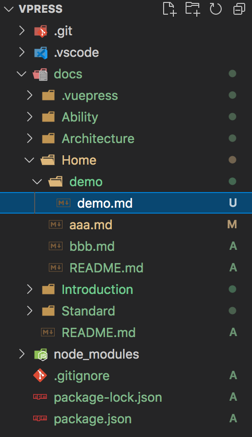
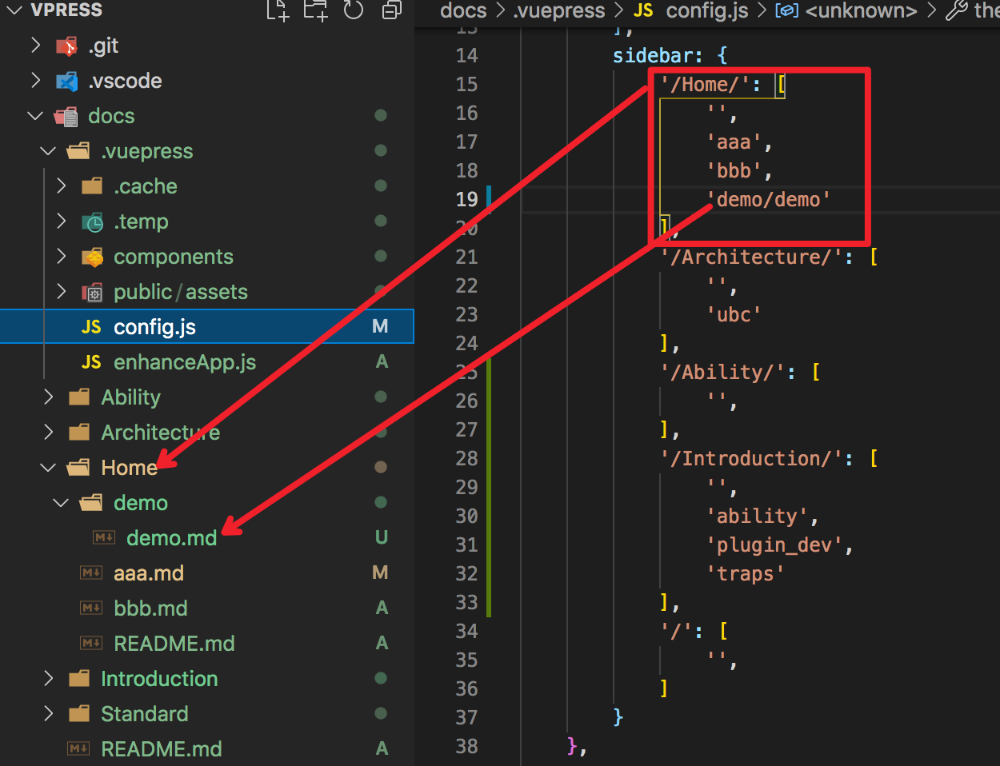

# 文档编写

## markdown语法

首先文档支持所有的markdown语法，包括各级标题、音视频解析、段落、列表、区块、代码、连接、表格，以及一些高级的编写技巧。

:::: el-tabs type=border-card

::: el-tab-pane label=标题
``` md
# 一级标题

###### 六级标题
```
# 一级标题

###### 六级标题
:::

::: el-tab-pane label=多媒体

```md
视频：
<video controls width="700px">
    <source type="video/mp4" src="./assets/storybook.mp4">
</video>

图片：


音频：
<audio id="audio" controls>
    <source id="mp3" src="http://xxxx.mp3">
</audio>
```

> tip: 多媒体上下最好多加一个空行，否则容易导致语法错误

视频：
<video controls width="700px">
    <source type="video/mp4" src="./assets/storybook.mp4">
</video>

图片：


音频：
<audio id="audio" controls>
    <source id="mp3" src="http://xxxx.mp3">
</audio>
:::

::: el-tab-pane label=段落
``` md
末尾无空格回车不换行
不换行

末尾有两个空格+回车代表换行  
换行了

***
*斜体文本*
_斜体文本_
**粗体文本**
__粗体文本__
***粗斜体文本***
___粗斜体文本___
~~删除线~~
<u>下划线</u>
```

末尾无空格回车不换行
不换行

末尾有两个空格+回车代表换行  
换行了

*** 
*斜体文本*
_斜体文本_
**粗体文本**
__粗体文本__
***粗斜体文本***
___粗斜体文本___
~~删除线~~
<u>下划线</u>
:::

::: el-tab-pane label=列表
``` md
* 第一项
* 第二项
* 第三项
***
1. 第一项
2. 第二项
3. 第三项
***
1. 第一项：
    - 第一项嵌套的第一个元素
    - 第一项嵌套的第二个元素
2. 第二项：
    - 第二项嵌套的第一个元素
    - 第二项嵌套的第二个元素
```

* 第一项
* 第二项
* 第三项
***
1. 第一项
2. 第二项
3. 第三项
***
1. 第一项：
    - 第一项嵌套的第一个元素
    - 第一项嵌套的第二个元素
2. 第二项：
    - 第二项嵌套的第一个元素
    - 第二项嵌套的第二个元素
:::

::: el-tab-pane label=区块
``` md
> 最外层
> > 第一层嵌套
> > > 第二层嵌套
```
> 最外层
> > 第一层嵌套
> > > 第二层嵌套
:::

::: el-tab-pane label=代码
``` md
$``` js
  防止编译，去掉$符号
  code
$```
```

```js
code
```
:::

::: el-tab-pane label=链接
``` md
[百度一下](https://www.baidu.com)
```
[百度一下](https://www.baidu.com)
:::

::: el-tab-pane label=表格
``` md
|  表头   | 表头  |
|  ----  | ----  |
| 单元格  | 单元格 |
| 单元格  | 单元格 |
```
|  表头   | 表头  |
|  ----  | ----  |
| 单元格  | 单元格 |
| 单元格  | 单元格 |
:::

::::

## 插件使用
1. 插件调用使用::: 插件名,且需要有闭合标签
```md
::: tip
:::
```

2. 插件attribute传参放在插件名后
```md
::: el-tab-pane label=组件概览
:::
```
3. 插件内容放在两个token(:::)里面
```md
::: tip
这是一个tip
:::
```

4. 插件调用时，除非插件本身带嵌套语法，**尽量不要嵌套不同插件**，否则容易产生语法错误
```md
自带嵌套语法的插件：

:::: el-tabs type=border-card

::: el-tab-pane label=组件概览
这是tabA 展示的页面
:::

::: el-tab-pane label=详细介绍
这是tabB 展示的页面
:::

::::
```

## 新建页面

:::: steps

::: step id=0
* 在对应功能的文件夹内新建.md 文件


:::

::: step id=1
* 找到 **.vuepress/config.js** 文件下的 **sidebar** 配置
* 目录列表每个项对应根目录一个文件夹，内置的目录配置为对应的.md文件和目录文件夹的**相对路径**
* 配置上新建文件所在路径

:::

::: step id=2
* 编写新建的.md文件
```js
// Home/demo/demo.md
# 新建页面
1. 新建
2. 页面
```
:::

::: step id=3
* 根目录下执行**npm run docs:dev**查看效果

:::

::::

## 已支持插件
### tip
```md
::: tip
这是一个提示
:::

::: warning
这是一个警告
:::

::: danger
这是一个危险警告
:::

::: details
这是一个详情块，在 IE / Edge 中不生效
:::
```
::: tip
这是一个提示
:::

::: warning
这是一个警告
:::

::: danger
这是一个危险警告
:::

::: details
这是一个详情块，在 IE / Edge 中不生效
:::

### el-tabs
```md
:::: el-tabs type=border-card

::: el-tab-pane label=组件概览
这是tabA 展示的页面
:::

::: el-tab-pane label=详细介绍
这是tabB 展示的页面
:::

::::
```

:::: el-tabs type=border-card

::: el-tab-pane label=组件概览
这是tabA 展示的页面
:::

::: el-tab-pane label=详细介绍
这是tabB 展示的页面
:::

::::

::: tip
更多参数请查看[element-ui官网](https://element.eleme.cn/#/zh-CN/component/tabs)
:::

### steps
```md
:::: steps

::: step id=0
第一步  
第一步
:::

::: step id=1
第二步  
第二步
:::

::: step id=2
第三步  
第三步
:::

::: step id=3
第四步  
第四步
:::

::::
```

:::: steps

::: step id=0
第一步  
第一步
:::

::: step id=1
第二个步  
第二个步
:::

::: step id=2
第三步  
第三步
:::

::: step id=3
第四步  
第四步
:::

::::

::: tip 提示:
id为必传项，从0开始
:::
