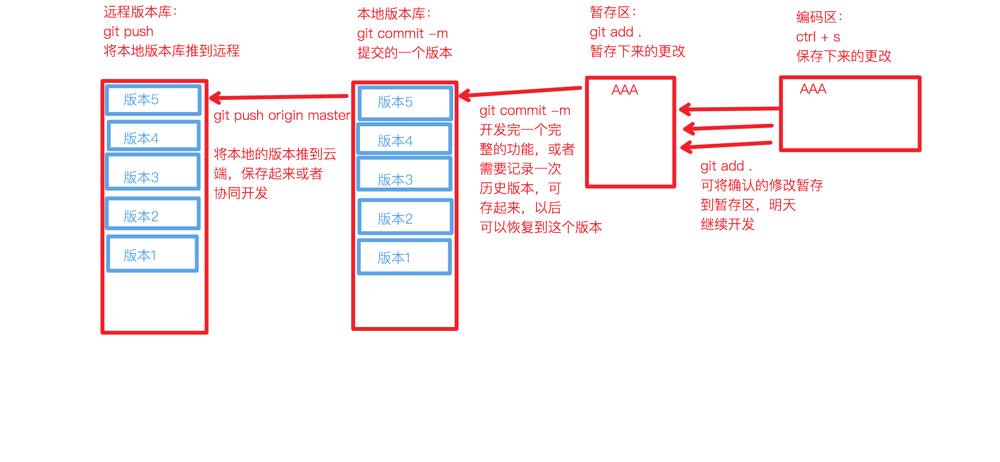
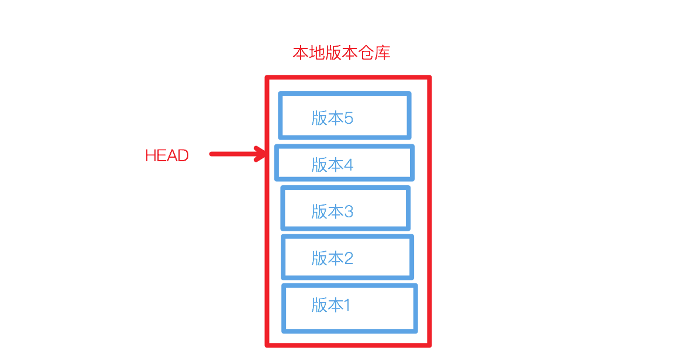

* 最详细的文档请查看[权威英文文档](https://www.git-scm.com/docs)
* [中文文档](https://git-scm.com/book/zh/v2)
* [猴子都能懂的git教程](https://backlog.com/git-tutorial/cn/)
* [github中文文档](https://docs.github.com/cn)
* [开源指北](https://oschina.gitee.io/opensource-guide/)
::: tip 仓库版本

:::
::: tip HEAD指针
* 本地仓库有很多版本
* 而要对比暂存区和当前版本的区别时，就需要指定是**相对于哪一个版本**
* 所以有HEAD指针，指向当前版本

:::

## git init

* 初始化git仓库
```shell
git init
```
## git config
::: tip 配置文件
* 配置文件查找顺序：本地 -> 全局 -> 系统
```shell
# 查看本地配置文件
cat .git/config

# 查看全局配置
cat ~/.gitconfig

# 查看系统配置(需要有root权限，基本不用)
cat /etc/.gitconfig
```
:::

* 配置本地仓库信息
```shell
# 本地仓库配置
git config user.name 'coderWdy'
git config user.email 'huangdeyu2020@163.com'

git config --local user.name 'coderHdy'
git config --local user.email '986005715@qq.com'

# 全局仓库配置
git config --global user.name 'huangdeyu'
git config --global user.email 'huangdeyu2020@163.com'

# 查看配置
git config -l
git config --list
git config --global --list
git config --local --list

# 删除配置
git config --unset user.email
git config --unset-all user.email
```
## ssh-keygen
* 绑定远程仓库需要使用 SSH key
    ```shell
    # 用我的邮箱生成 ssh-key (中间可以配置存放路径)
    ssh-keygen -t rsa -C huangdeyu2020@163.com
    # mac下查看生成的key (自己的路径)
    cat ~/.ssh/id_rsa.pub
    ```
## 一台电脑配置多个git对应仓库
* 生成每个git对应的邮箱 ssh-key 放置到 `不同` 路径下
    ```shell
    # ~/.ssh/id_rsa
    ssh-keygen -t rsa -C huangdeyu2020@163.com

    # ~/.ssh/id_rsa_work
    ssh-keygen -t rsa -C 986005715@qq.com
    ```
* 配置多config
    ```shell
    # 编辑 config 对应配置文件，映射每个主机对应的配置和 ss-key 位置
    vim ~/.ssh/config
    ```
    ```shell
    Host coderHDY
        hostname github.com
        User git
        IdentityFile ~/.ssh/id_rsa

    Host coder-HDY
        hostname github.com
        User git
        IdentityFile ~/.ssh/work_id_rsa

    Host gitee
        hostname gitee.com
        User git
        IdentityFile ~/.ssh/id_rsa
    ```
* **拉取仓库时指定host**，来对应config，如：`github.com`改成`coderHDY`
    ```shell
    git clone git@github.com:coderHDY/myblog.git
    # 改成这样⬇️
    git clone git@coderHDY:coderHDY/myblog.git
    ```
* 同时设置本仓库的git用户信息
    ```shell
    git config --local user.name 'coderHDY'
    git config --local user.email '986005715@qq.com'
    ```
* 此仓库使用操作时自动使用host对应配置
## 将密钥添加到缓存中
* 添加到缓存中就不会读取 ～/ssh/config 里面 的配置，发送git命令自动携带缓存密钥
```shell
ssh-add --apple-use-keychain ~/.ssh/work_id_rsa

# 删除
ssh-add -d ~/.ssh/work_id_rsa 
```
## 22端口连接失败
```shell
vim ~/.ssh/config
```
* 改成443端口并且指定ssh连接
    ```shell{2-3}
    Host coderHDY
        Port 443
        Hostname ssh.github.com
        User git
        IdentityFile ~/.ssh/id_rsa
    ```
## git clone
* 克隆远程仓库到本地
1. 拿到远程仓库的ssh地址
2. 克隆到本地
```shell
git clone git@github.com:coderHDY/myblog.git

# 自定义文件名字
git clone git@github.com:coderHDY/myblog.git blog
```
## git remote
* 设置和查看**和本地绑定的**远程仓库
* **名字是关联的时候取的，可以随意更改**，与远程无关，只是本地关于远程仓库的叫法
```shell
# 查看远程仓库
git remote show
git remote -v

# 设置上游仓库
git remote add origin git@github.com:coderHDY/myblog.git

# 删除上游（远程）仓库绑定
git remote rm origin

# 修改远程仓库在本地的名字
git remote rename origin main
```
## git add
* 将本地更改添加到本地缓存
::: tip 本地缓存
git 通过二进制算法记录了这个文件，放进缓存目录，只是代表将此文件暂存的意思，一个或多个缓存 commit 生成一个版本
:::
```shell
git add index.html
# 缓存全部本地更改
git add .
```
## git commit
* 将本地缓存文件提交，生成一个版本
::: tip 版本
* 在本地仓库有了版本的文件将永远不会丢失，除非电脑损坏或者删除隐藏的 .git 文件
* git通过二进制的算法将这次的更改记录起来，内存消耗很少，形成了一个可回溯的`版本`
:::
```shell
git commit -m 'some change'
```
* 将改动合并到上一个版本中
    ```shell
    git commit --amend

    # 如果已经推送到远程仓库
    git push -f
    ```
## git status
* 查看当前的状态
    1. 有修改未暂存
    2. 有暂存未提交
    3. 有提交未放到远程仓库
```shell
git status
```
## git log
* 打印本地的所有版本信息
* 可以看到当前的HEAD指针指向的哪个版本
::: tip HEAD指针
本地仓库多次commit后会生成多个版本库，HEAD指针指向的是当前正在用的的版本库
:::
```shell
# 详细信息
git log
# 精简版
git reflog
```
## git show
* 显示版本 diff 信息
```shell
# 显示最近一次commit的详细信息
git show
# 显示当前版本与指定版本的diff
git show 4022c4c
# 展示最近十次的commit信息
git show-branch --more=10
```
## git diff
* 比较两个版本之间的差异
> 较新的版本要放到后面
```shell
# 与当前HEAD 版本比较
git diff

# 与上个HEAD版本比较
git diff HEAD^ HEAD
# 与指定版本diff
git diff 4022c4c HEAD
```
## git push
* 当前仓库的**HEAD指针**指向的版本推到远程仓库
```shell
# 精简版
git push
# 完整版
git push origin master:master
# 本地和远程同一分支，省略版
git push origin master

# 本地版本与远程版本有差异，强制推送?
git push --force origin master

# 删除远程分支
git push origin --delete master
```
## git rm
* 版本仓库中删除某个文件
```shell
# 删除某个文件
# rm 代表删除并暂存这个变更，commit提交版本
git rm docs/skill/linux/README.md
# 删除某个文件夹
git rm -r docs/skill/linux/
```
## 合并commit
::: tip 合并commit
* 本地多个commit合并成一个进行提交
:::
* 需求，合并BC版本：ABC -> AD
```shell
# 找到需要变基的版本（A）
git reflog

# 变基成A
git rebase -i HashA

# 进入编辑模式
# 第一个pick是最终提交的版本
# 下面的所有pick全部改成squash，合并到最上面的提交版本
git log
# 合并成功
```
* 合并过程中撤销
```shell
git rebase --abort
```
::: tip 更简单的方法
* 使用git reset --soft版本指向合并前版本（A）
* 再提交一次，即可覆盖所有中途版本
:::
```shell
# 找到合并前版本号
git reflog

# HEAD指针移动
git reset --soft hashA

# 再提交一次
git commit -m '合并所有提交'
```