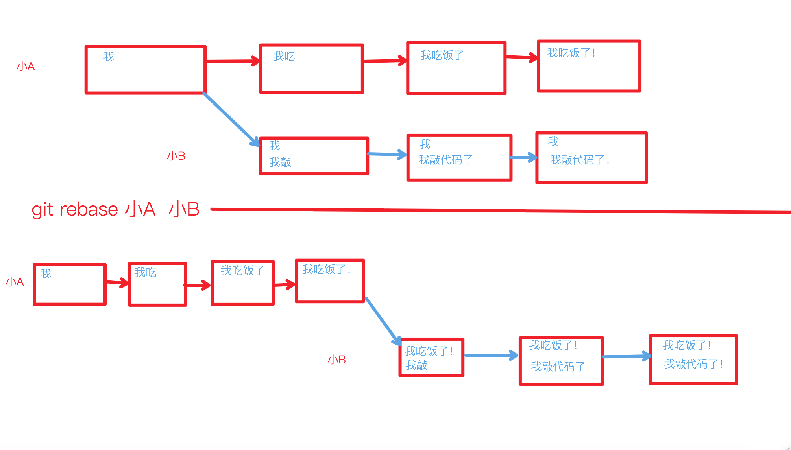

## git branch
* 查看、创建`分支`
::: tip 分支
一个项目开发周期可能很长，那么不可能所有人在一个地方更改代码，所以有了分支这个概念，就是开发大型项目的基础，每个分支可以**同时**处理不同的业务，然后一起合并到 master 分支上去。能够实现同步开发多个功能。
:::
```shell
# 查看本地分支
git branch
# 查看远程分支
git branch -r
# 查看本地分支和远程分支
git branch -a
# 创建新 dev 分支，但HEAD还是留在本分支
git branch dev
# 创建新分支并切换
git checkout -b dev
# 分支重命名
git branch -m oldName newName
# 查看树形分支历史
git show-branch
# 删除分支
git branch -d dev
```
* 如果想要删除的分支有commit未合并到当前分支，那么会报错，因为你尝试删除一个可能有一定贡献的分支，解决方式：
1. merge留存该分支的贡献，再删除
```shell
git merge dev
git branch -d dev
```
2.  如果确定直接删除：
```shell
# 强制删除分支
git branch -D dev
```
## git merge
::: tip 冲突
* a是b拉出来的一个分支，也就是说a是基于b分支在进行开发，a的commit不影响到b。
* b分支自己也在开发，b的commit也不影响到a
* 有一天a分支的任务完成了，需要融入回b分支，就要用到 git merge
* 可是有一个文件的一个位置，a分支也commit了修改，b分支也commit了修改，那么这次合并应该以谁的版本为准呢？
* 这就产生了`冲突`
::: 
```shell
# 把dev分支合并到本分支来
git merge dev
```
## git checkout
* 切换分支
```shell
# 切换
git checkout master
# 创建并切换
git checkout -b master
# 放弃当前所做的更改（未放进缓存区的）
git checkout .
```

## git tag
* 给一个重要的commit版本打上tag标识，更好地认出找出该版本如：V1.0
    ```shell
    # 列出已有tag
    git tag
    git tag -l
    git tag --list

    # 当前版本打标签
    git tag v1.0
    git tag -a v1.1 -m "my version 1.4"

    # 指定版本打标签
    git tag -a v1.2 9fceb02

    # 查看标签
    git show v1.0

    # 删除标签
    git tag -d v1.0
    ```
* 推送：`git push`默认**不会**推送tag信息
    ```shell
    git push origin v1.0
    
    // 推送所有
    git push origin –-tags
    ```
## git stash
* 缓存修改
::: tip 缓存区
* 我在开发A功能，B功能突然出现BUG了
* 我不可能把没有开发完的A功能提交了吧，所以需要一个分支
* 那么问题来了，我去分支了，当前A功能开发到一半的代码怎么办？(编码区和暂存区)
* 如果我直接切，会有这个报错

* 这就需要把他**缓存**起来，等以后再拿出来

:::
* 常用指令
```shell
# 当前暂存区和编码区推入缓存
git stash
# 取出上个缓存
git stash pop
# 查看缓存列表及编号
git stash list
# 清空缓存列表
git stash clear
```
* 一些不常用的高级用法
```shell
# 推入缓存并取个名字
git stash save 'A修改暂存'
# 查看编号1的缓存修改的文件
git stash show stash@{1}
# 查看编号1的缓存的详细修改
git stash show -p stash@{1}
# 回复到指定缓存，(不删除)
git stash apply stash@{0}
# 删除指定缓存
git stash drop stash@{1}
```
## git reset
* git reset 有三个方式
::: tip --soft
* HEAD指针指向指定的版本

:::
::: tip --mixed
* HEAD指针和暂存库指向指定的版本
> 注：暂存库会丢失


:::
::: tip --hard
* HEAD指针和暂存库和编写代码区全部指向指定版本
* 且目标版本之后的版本都不要了
> 注：暂存库和编写库和后面的版本历史会丢失  
> 本例中，AAA版本会丢失


:::
```shell
# 删除编码区修改(所有区指向当前版本库版本)
git reset --hard HEAD
# 回退一个版本
git reset --soft HEAD^
# 回退两个版本
git reset --soft HEAD^^
# 回退三个版本
git reset --soft HEAD~3
# 回退到指定版本
git reset --soft db3e38b
```

* 推送的版本比远程仓库旧，会提示错误
```shell
# 回退到某一个版本且删除放弃后面的版本
git reset --hard db3e38b
# 强制推送到远程仓库
git push -f
```

## git revert 
::: tip 错误的历史版本
情况：某一个历史版本的修改有问题，但是后面的其他提交修改都没有问题
> 解决方法1：把那次提交包括后面的版本都重新写一遍吧 ?___?  
> 解决办法2：把那个版本的错误的地方写对它再提交一个版本（那错误的地方很多呢） -___-  
> 解决办法3：revert掉那一个版本，利用vscode的对比便捷，写出一个正确的版本再提交^___^


:::
* 原理：把那次提交的地方抽取出来，取反，做成一个新的版本，并且已经放入暂存区
> 注：不会删掉错误版本，只是提取错误版本的修改
```shell
git revert -n 150c676
git commit -m 'revert掉了历史的错误提交'
```

## git rebase
::: tip 变基
* 小A开发到一半，派生出了小B分支
* 小B开发的同时，小A也在开发
* 小B总是想基于小A最新的东西开发，就需要`变基`

:::
```shell
# 如果在master分支，将最新的 master 放到 dev 所有 commit 版本的前面，并且切到dev分支
git rebase master dev
# 如果已经在 dev 分支了
git rebase master
# 将远程代码库的放在本地的所有 commit 的前面
git pull --rebase
```
::: tip 冲突
* 小A 和 小B 的历史版本中改了同一个位置
* 那么合并过程中应该以谁的版本为准呢？这就是`冲突`
* 虽然把小A 的最新版本放到了小B的"基准"上，按理来说就是小B基于小A改了，那么以小B的为准？
* 但是小B的历史版本已经记录在案，没有办法更改了，所以你只能重新做一个冲突修复的版本放到最前面。
* 这就是**解决冲突**
:::
```shell
# 发起变基
git rebase master dev
# 发现冲突，显示冲突文件 -> 手动解决冲突，决定留哪个版本
# 决定好了放到暂存区
git add .
# 继续变基
git rebase --continue
### 如果还有冲突版本会继续要求手动修复，直至没有冲突，生成最新变基版本。
```
## 更新fork仓库
:::tip 
* 小A有一个远程仓库，小B很喜欢，fork了过来
* 小B本地仓库关联的自己fork过来的远程仓库
* 过了一段时间，发现小A仓库更新了，小B怎么最快地更新呢?

:::
* 方案1.增加小A远程仓库（如果有权限clone小A的仓库的话）
```shell
git remote add upstream xxx.xiaoA.com

# 取最新的小A代码
git pull upstream master

# 推给自己的仓库
git push origin master
```

* 方案2.暴力更新
```shell
# 删除自己的远程仓库
# 重新fork仓库

# 更新本地仓库
git pull
```
## code review
::: tip code review
* 小A开发了一个软件，所有人都在用
* 小B用的过程中发现了一个BUG
* 小B想让小A修改错误：
* 于是小B把小A的源代码**fork**到自己的仓库，并且自己做了BUG修复
* 小B再给小A发起pull request/merge request 申请合入小A的代码库，让大家都用正确的代码

:::
## 命令设置别名
* 可以给一个很长的命令设置别名
```shell
git config --global alias.show-graph 'log --graph --abbrev-commit --pretty=oneline'
```

## .gitconfig
* 查找当前目录的git环境配置来源
```shell
git config --list --show-origin
```
## .gitignore
* git提交时忽略文件
* 可以识别正则表达式
```shell
# 忽略一整个目录
node_modules/
# 忽略某一类文件
*.sh

# 模式取反(某个子目录这个文件不想被忽略)
!*.sh
```
## 删除git历史文件
* 查出最大的几个文件
```shell
git verify-pack -v .git/objects/pack/*.idx | sort -k 3 -n | tail -3
```
* 查看文件路径
```shell
# hash码
git rev-list --objects --all | grep

# 例
# git rev-list --objects --all | grep b1bf4cf155117e9950aeb2d04168aa890e1cb012
```
```shell
git filter-branch --force --index-filter 'git rm --cached --ignore-unmatch 你要删除的文件名' --prune-empty --tag-name-filter cat -- --all

# 例
# git filter-branch --force --index-filter 'git rm --cached --ignore-unmatch docs/books/javascript/assets/checkbox.mp4' --prune-empty --tag-name-filter cat -- --all
```
* 更新远程仓库
```shell
git push origin --force --all
git push origin --force --tags
git for-each-ref --format='delete %(refname)' refs/original | git update-ref --stdin
git reflog expire --expire=now --all
git gc --prune=now
git count-objects -v
```