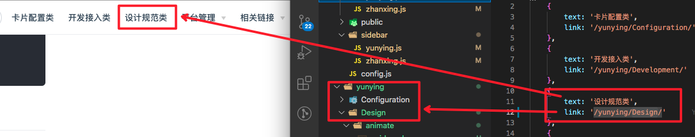

# 避坑指南

## 组件嵌套
* 除非本身是嵌套组件，否则尽量不要使用组件嵌套，容易出现编译错误
* markdown-it-container是通过成对的 ::: 作为token来判断编译语法的，嵌套时容易出现token配对错误

## markdown插槽
* vuepress2.0版本已经在开发中，已经弃用了markdown插槽功能，为了以后升级方便，开发插件时尽量不要使用markdown插槽

## js表达式
* vuepress可以将js表达式计算输出，可以通过moustache语法来写
```js
{{1 + 1}}
```

## 调试变量
* 开发插件时可以将几个内置变量打印到页面上，方便找出问题
```js
{{$page}}
{{$site}}
{{$frontmatter}}
```
更多全局计算属性可以查看[官网](https://vuepress.vuejs.org/zh/guide/global-computed.html#site)

## 行内样式展现错误

例：
```md
::: el-button type=warning
警告按钮
:::
```
::: el-button type=warning
警告按钮
:::

#### 产生原因：整个框架编译流程为：
1. 插件语法编译：产出组件标签、内置内容放入slot
2. vue 解析整个模板，产出html
3. markdown语法编译：内置语法转换成html（**一行文字会被转换成P标签**）
4. 所以行内样式语法不能较好的表示

#### 解决方案：
* 硬编码形式: 由于框架内置html解析器，可以直接写HTML语法，跳过了markdown解析过程
```md
<el-button type="warning">警告提示</el-button>
```
<el-button type="warning">警告提示</el-button>

## 开发插件传参错误
例：
```md
::: el-slider value=30
:::
```
::: el-slider
:::

* 传参value并没有生效，因为md默认传参为String类型
* 解决方案：在插件开发中将传入值parseInt再使用
```js
// vue component
  computed: {
      key() {
          return parseInt(this.id);
      }
  }
```

## 开发插件热更新不生效
* 修改了.vuepress文件夹下的内容最好重启服务
* 如果重启服务还没有更新，那就是走的缓存文件，再随便更新一个markdown文件保存就能热更新

## 新建文件目录问题

### 新建子目录
* 无论嵌套多少层级，子目录md文件都是每一项**父目录的相对路径**
* 每个父目录都是**和navbar项一一映射**的，建子目录时不能修改，只能动子目录的路径


### 新建nav目录

* 每个nav目录**至少有一个**子目录包含一个README.md文件，同时sidebar配置为 '' ，如果没有会路径解析错误。  
>因为点击nav目录时跳转的时nav路径下的README.md文件解析成的index.html文件。


