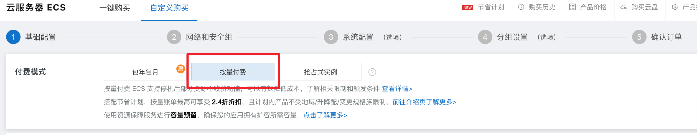
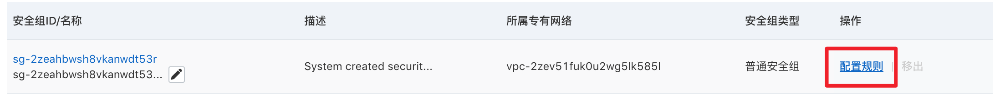
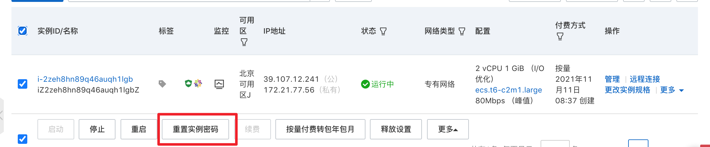
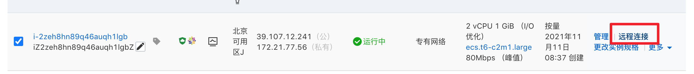

## 阿里云新服务器配置
:::: steps
::: step
* 按量付费云服务器（要先在阿里云充100+余额），普通用法比较便宜

* 选规格，按最便宜的方式选

* 选镜像系统，要linux/centos

* 点击下一步，重要：按量付费

* 剩下就直接购买，进入安全组配置
:::
::: step
* 进入管理控制台，点开安全组配置

* 点击配置规则

* 增加8822端口号（为ssh连接专门配置，也可以设置其他）

* 配置好远程连接密码，重启

:::
::: step
* 进入远程连接

* 选择立即登录

:::
::: step
* 编辑ssh配置，打开port为步骤二设置的port
```shell
vi /etc/ssh/sshd_config
```
```txt {5}
# If you want to change the port on a SELinux system, you have to tell
# SELinux about this change.
# semanage port -a -t ssh_port_t -p tcp #PORTNUMBER
#
Port 8822
#AddressFamily any
#ListenAddress 0.0.0.0
#ListenAddress ::
```
* 重启sshd,查看ssh端口号，应该变成了8822
```shell
sudo systemctl ssh restart

sudo netstat -tunlp | grep "ssh"
```
```shell {2}
# sudo netstat -tunlp | grep "ssh"
tcp        0      0 0.0.0.0:8822            0.0.0.0:*               LISTEN      991/sshd    
```
:::
::: step
* 本机点开shell，连接远程服务器
```shell
# ip换成自己的
ssh root@10.10.10.10 -p 8822
# 首次连接要输入yes
# 输入密码
```
* shell显示路径则连接成功
```shell {1,9}
0 % ssh root@39.107.12.241 -p 8822
root@39.107.12.241's password: 

Welcome to Alibaba Cloud Elastic Compute Service !

Activate the web console with: systemctl enable --now cockpit.socket

Last login: Thu Nov 11 10:19:21 2021 from 111.206.214.28
[root@iZ2zeh8hn89q46auqh1lgbZ ~]# 
```

:::
::::
## linux服务器部署


:::: steps

::: step
* git环境设置
1. 登录远程机器work的根目录
``` shell {1}
pwd

/home/work
```
2. 配置git
```shell
git config --global user.name huangdeyu
git config --global user.email huangdeyu@baidu.com
```
:::

::: step
* 初始化仓库
```shell
git clone ssh://g@gitlab.baidu.com:8022/huangdeyu/yunying-docs.git
```
:::

::: step
* 开启pm2守护的自动化部署进程
```shell
cd yunying-docs
pm2 start bash deploy.sh
```
:::
::: step
* 开启pm2守护的node服务器
```shell
# 别加 --watch，加了会重启服务器
pm2 start app.js
```
:::
::: step
* pm2守护进程检检查及保存
```shell
pm2 list
pm2 save
```
:::
::::

