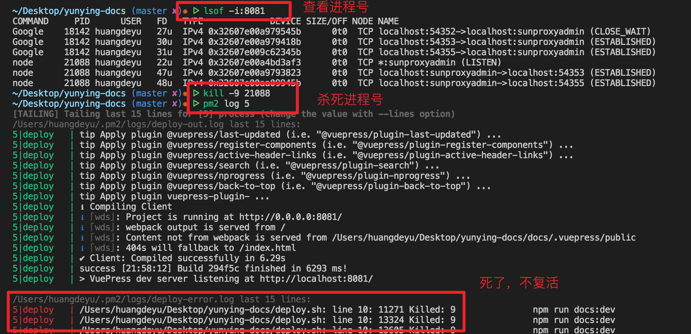
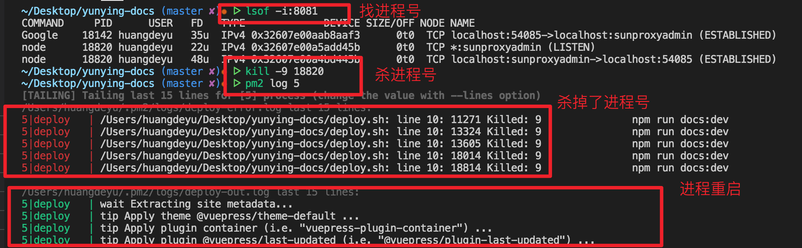

# pm2

## 工具介绍
* 可后台运行进程，类似于nohup，但比nohup好用
* 如果进程意外挂掉，pm2会自己重启它，保证进程的持续性
* 可以设置开机启动，让后台脚本持续运行
* 适合用来保护服务器进程不挂掉
### 安装
```shell
npm install pm2 -g 

# yarn方式
yarn global add pm2

# linux
apt update && apt install sudo curl && curl -sL https://raw.githubusercontent.com/Unitech/pm2/master/packager/setup.deb.sh | sudo -E bash -
```

### 启动服务
```shell
# 再对应目录下执行
pm2 start app.js

# 给进程起名字
pm2 start app.js --name myName 

# 后台运行脚本
pm2 start deploy.sh

# 开静态资源服务器
pm2 serve ./dist 80

# dev模式持续后台开启，且监听
pm2 start npm --watch  -- run dev
```
### 保护进程
* 进程有可能中途挂掉，或者直接 kill -9 22222 直接强制关掉
* 这种情况，普通的方式启动服务就挂掉了
:::: tabs
::: tab label=普通方式
```shell
# 启动服务
# deploy.sh里面有 npm run dev
pm2 start deploy.sh

# 寻找8080端口的进程号：2222
lsof -i:8080

# 关闭进程号
kill-9 2222

# 查看日志，发现无法恢复
pm2 logs
```

:::
::: tab label=监听方式
```shell
# 监听方式启动
# deploy.sh里面有 npm run dev
pm2 start deploy.sh --watch

# 寻找8080端口号对应的进程：2222
lsof -i:8080

# 杀死进程
kill -9 2222

# 查看进程日志
pm2 logs
# 发现进程挂了还重启了
```

:::
::: tab label=总结对比
* --watch方式
    1. 进程意外挂掉可以复活
    2. vuepress启动热更新会监听页面的增删
    3. 缺点：任何改动都会重启热更新，更新速度较慢，10s左右
    4. 缺点：页面有改动需要手动刷新页面，不会热更新
* 普通方式
    1. 进程挂掉不会复活
    2. vuepress启动热更新，页面增删不会监听到
    3. 优点：直接改动页面可以实时更新
:::
::::
### 管理进程
```shell
# 查看进程产生的日志
pm2 logs
pm2 log 0

# 查看所有的服务
pm2 list

# 查看程序占用情况
pm2 monit

# 进程改名
pm2 restart 0 --name blog
```
### 关闭服务
```shell
pm2 stop all

pm2 stop id

pm2 stop name
```

### 删除服务
``` shell
pm2 delete all

pm2 delete id

pm2 delete name
```
### 开机自动启动
* windows系统
```shell
# 使用pm2启动node
pm2 start /home/wwwroot/web.js --watch

# 确认执行的任务列表
pm2 list

# 保存这些进程列表
pm2 save

# 生成自启动脚本
pm2 startup 

# 复制生成的脚本，再执行一次
```
* linux(如果上面没有达到效果的话)
```shell
# 接着上面的命令
# 开机服务
systemctl enable pm2-root

# 重启
reboot
```
### 其他命令
* 重启服务：[启动服务](./pm2.html#启动服务) 的 start 改为 restart
* 重新加载：[启动服务](./pm2.html#启动服务) 的 start 改为 reload
* 监听模式
```shell
pm2 start app.js --watch
```
* 更新pm2
```shell
pm2 update
```
* 显示进程的所有信息
```shell
pm2 show id

pm2 show name
```


## 附录
### nohup
* 后台执行程序，不关机就不会停，适合再linux上运行重复脚本
> 缺点：少部分情况会挂掉，且不好监控运行情况，pm2更优

```shell
# & 代表后台持续运行
nohup bash deploy.sh &
```
