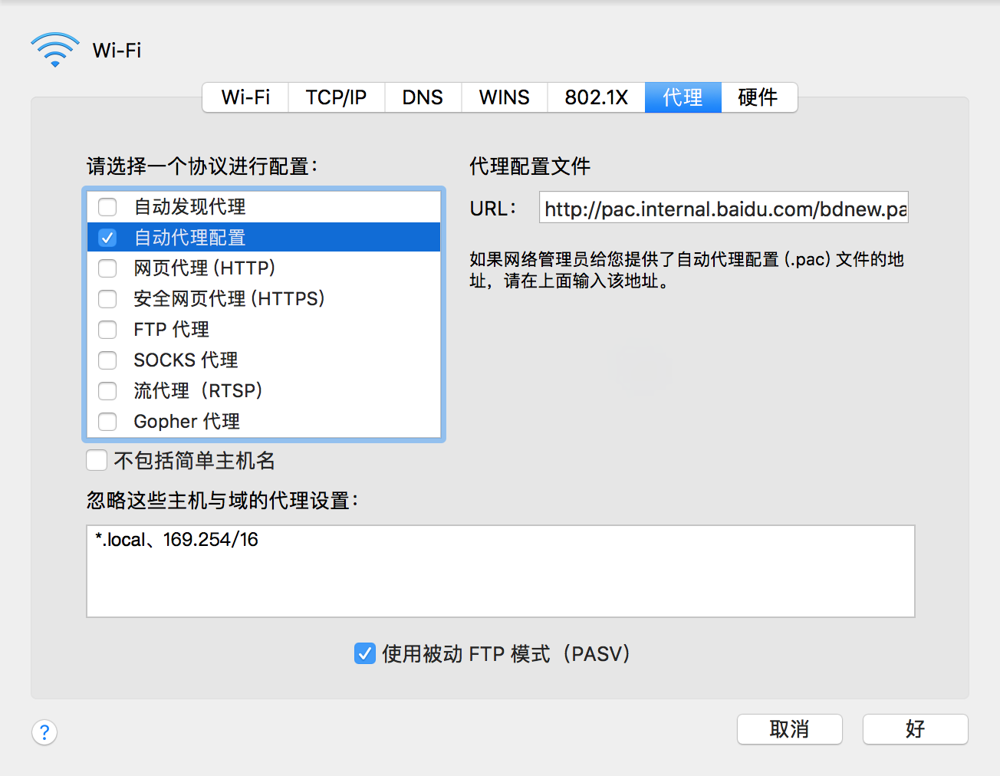

# 工作小技巧


## 新机软件
### curl下载失败
* [改DNS](https://blog.csdn.net/bryong/article/details/108374261)
::: tip 
* 就是把DNS改成其一，然后重启shell
>8.8.8.8  
>114.114.114.114
::: 
### 安装zsh
```shell
sh -c "$(wget https://raw.github.com/robbyrussell/oh-my-zsh/master/tools/install.sh -O -)"
```
* [开启zsh自动提示](https://blog.csdn.net/sunyv1/article/details/108049209)
```shell
git clone https://github.com/zsh-users/zsh-autosuggestions.git

open ~/.zshrc
```
* 更改
```shell
# plugins=(git)

plugins=(git zsh-autosuggestions)
```
* 生效配置文件
```shell
source ~/.zshrc
```
### 安装nvm
* 安装：[官网](https://github.com/nvm-sh/nvm)
```shell
curl -o- https://raw.githubusercontent.com/nvm-sh/nvm/v0.39.0/install.sh | bash
```
* 更新nvm命令：
```shell
open ~/.zshrc
```
* 打开文件的最下面加上：
```shell
export NVM_DIR="$HOME/.nvm"
[ -s "$NVM_DIR/nvm.sh" ] && \. "$NVM_DIR/nvm.sh"  # This loads nvm
```
* 生效配置文件
```shell
source ~/.zshrc
```
### 配置代理
* 访问github更快  
代理地址：http://pac.internal.baidu.com/bdnew.pac
