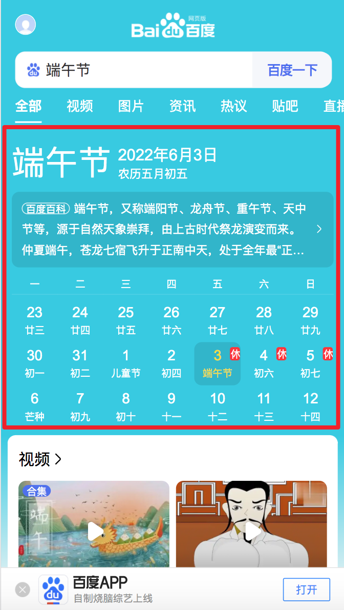
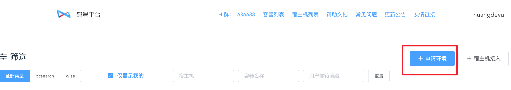
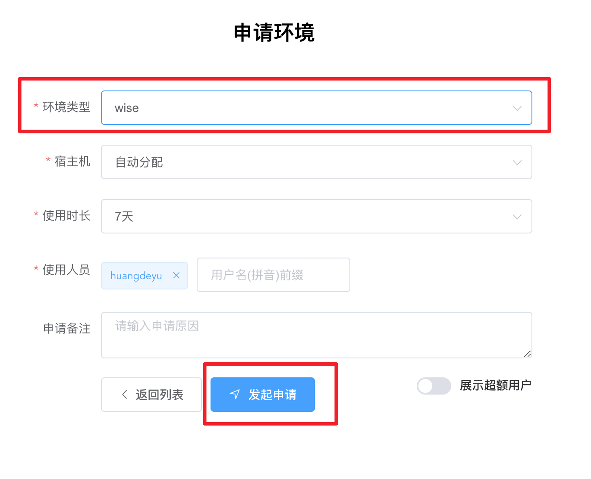
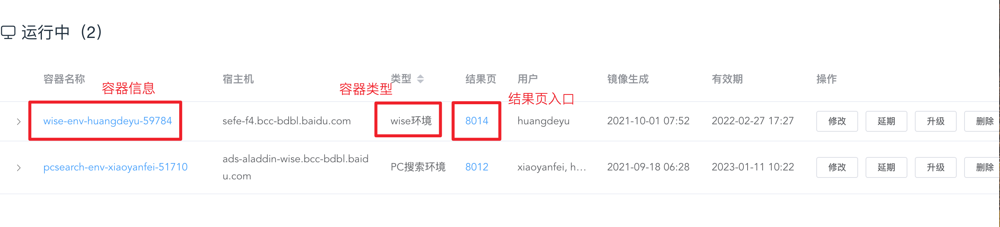
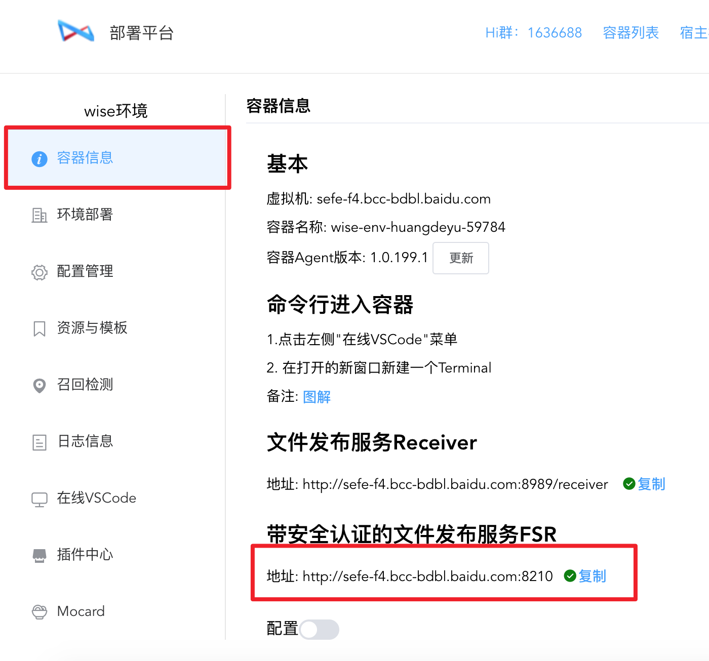
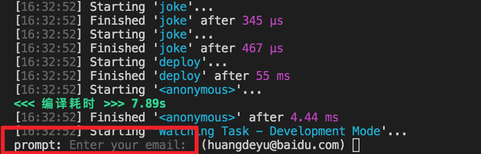
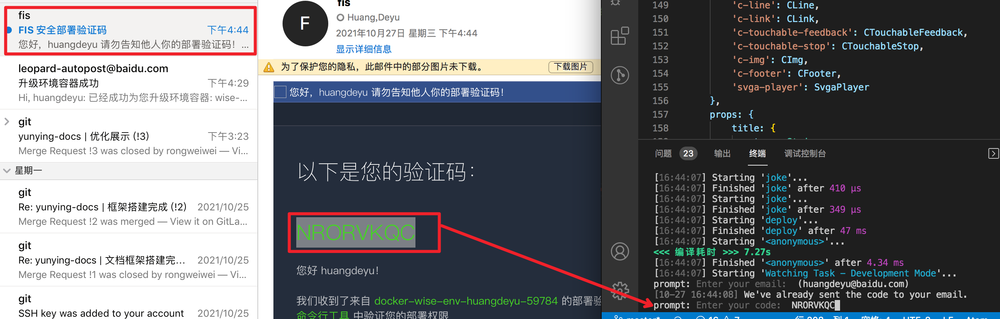

# atom
## 框架介绍
[atom](http://atom.baidu-int.com/atom-web)是百度搜索业务的框架，拥有类vue语法，提供更好的性能。  
手百app的
[搜索结果页卡片](https://console.cloud.baidu-int.com/devops/icode/repos/baidu/ps-se-fe-tpl/aladdin-atom/tree/master)就是用该框架编写

:::: tabs
::: tab label=端午节
* 展现方式：  
手百搜索：端午节  
对应召回卡片：[atom组件库](https://console.cloud.baidu-int.com/devops/icode/repos/baidu/ps-se-fe-tpl/aladdin-atom/tree/master)的src/app/mkt_canlendar  
  
:::

::: tab label=宝藏江西 
* 展现方式：  
手百搜索：宝藏江西  
对应召回卡片：[atom组件库](https://console.cloud.baidu-int.com/devops/icode/repos/baidu/ps-se-fe-tpl/aladdin-atom/tree/master)的src/app/mkt_multi_box  
  
:::
::::


## 开发环境配置
* atom可以在本地开发新卡，但一般情况下我们会在**远程开发机**上维护卡片  
开发机配置：  
:::: steps
::: step id=0
-  [申请远程开发机](http://leopard.baidu-int.com/deploy/#/)  

:::
::: step id=1
-  环境选择wise，点击申请  

:::

::: step id=2
申请成功后，可以看到自己的容器信息：
* 点击容器名称可以查看详细信息
* 容器类型wise环境型代表进入的是手机版的环境
* 点击端口号访问环境的搜索结果页

:::
::: step id=3
* clone [atom组件库](https://console.cloud.baidu-int.com/devops/icode/repos/baidu/ps-se-fe-tpl/aladdin-atom/tree/master)到本地
* 安装依赖：
``` shell
# 安装依赖
npm i
# 切换node环境
cd node
# 安装node依赖
npm i
```
:::

::: step id=4
**容器关联**
* 在部署平台中找到fsr地址  
  
* 在代码库关联容器环境：
> 根目录下创建.env文件  

  

* 复制下面代码到.env文件
``` shell
FSR_HOST=http://sefe-f4.bcc-bdbl.baidu.com:8210 # 换上自己的fsr地址
PUBLIC_PATH=/se/
SERVER_ROOT=/home/work/search/nodeserver
```
:::

::: step id=5
* 本地代码推送到开发机
```shell
#根目录下执行命令
npm run sync mkt_multi_box
```
* **首次部署**需要填写邮箱，获取验证码  
  

* 填写部署码，回车，上传完成  
  
:::

::: step id=6
* 测试代码部署情况
* 将下面高亮代码插入mkt_multi_box/index.atom文件
```js {3-5}
// src/app/mkt_multi_box/index.atom
export default Atom.extend({
    mounted() {
        console.dir('---');
    },
}
```
* 保存，热更新自动部署，开发机搜索
:::
::::

## 开发流程

## 开发新卡流程

## 相关文档