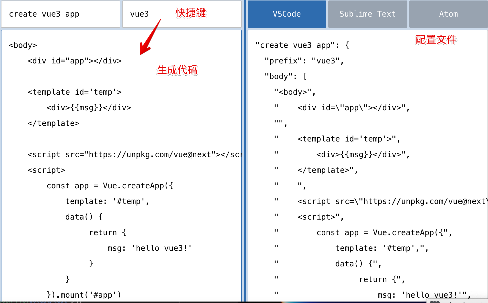
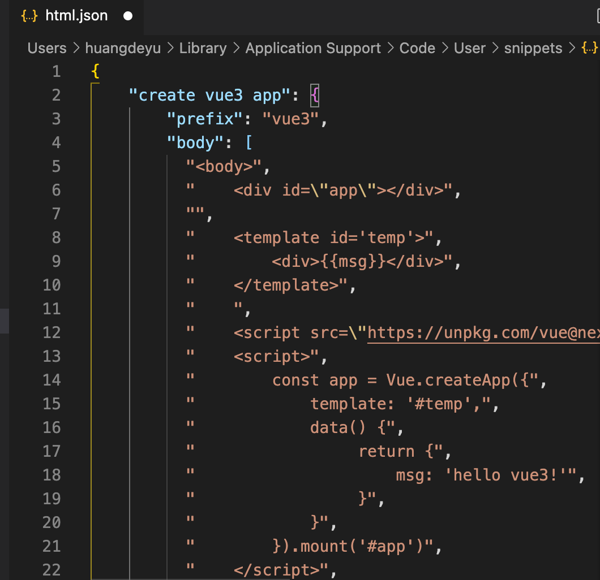

## 自定义代码片段
:::: tabs
::: tab label=生成
* vscode自定义代码片段
* [生成网址](https://snippet-generator.app/)，填入名称、片段、快捷键。生成代码  

:::
::: tab label=使用
* vscode->首选项->用户片段->html，填入代码  

* html文件内输入快捷键即可拿到片段
:::
::::